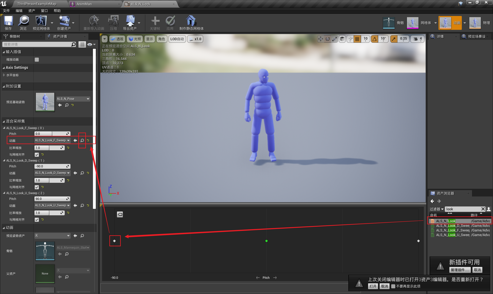
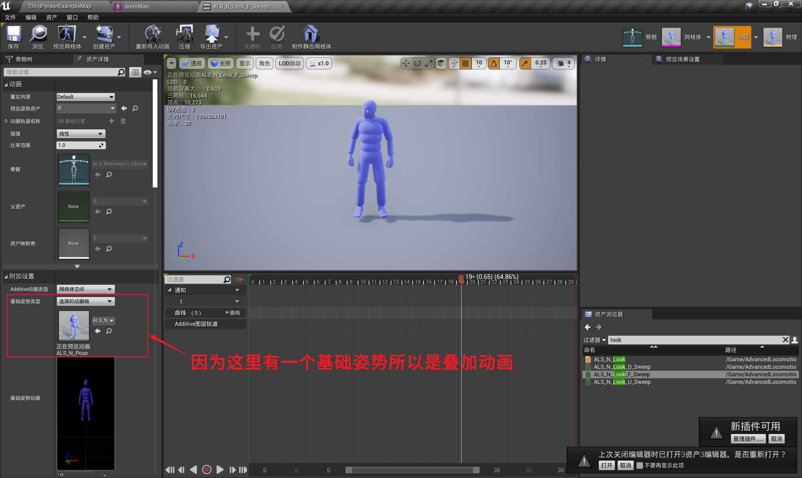
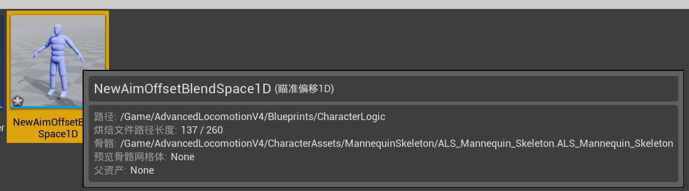
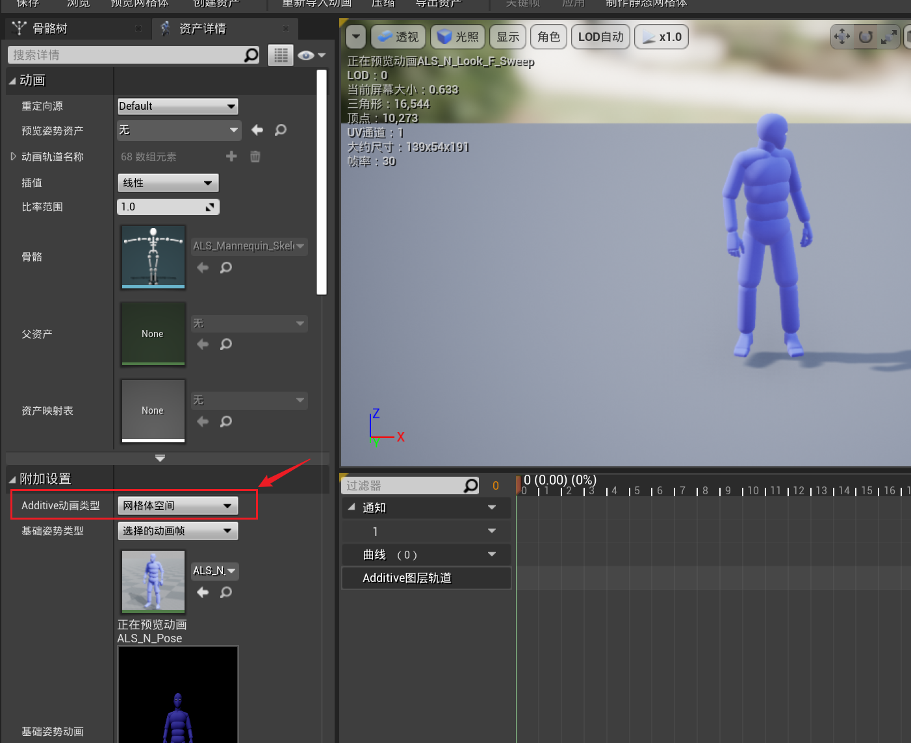
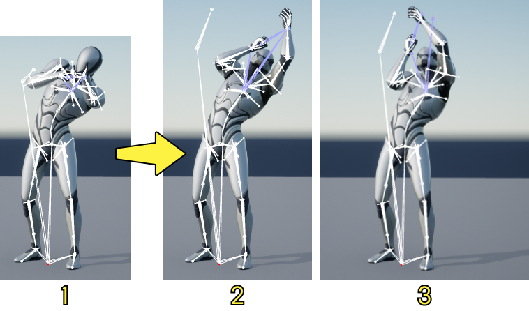
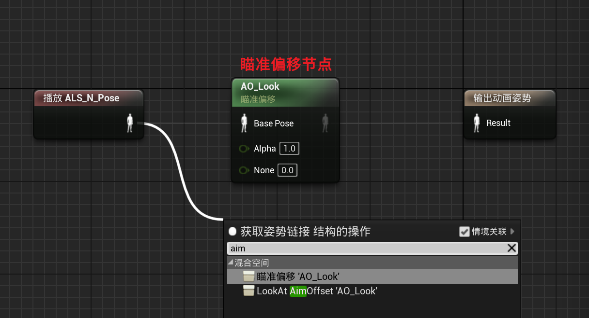
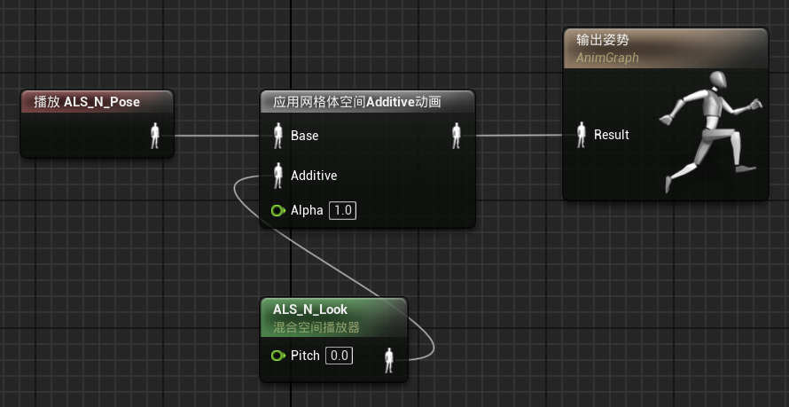
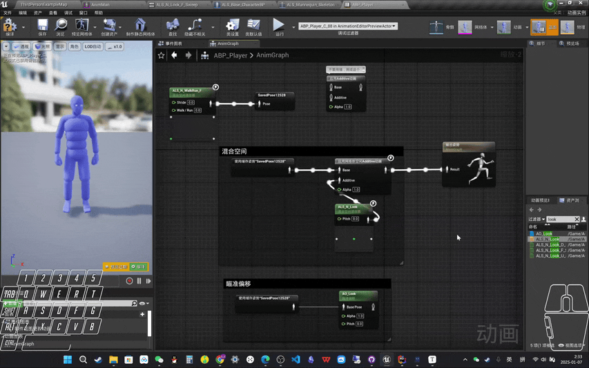

------

###### [返回菜单](../ALS_Menu.md)

------

# ALSv005 瞄准偏移（AimOffset）

------

## 目录

- [ALSv005 瞄准偏移（AimOffset）](#alsv005-瞄准偏移aimoffset)
  - [目录](#目录)
    - [找到项目里的瞄准偏移](#找到项目里的瞄准偏移)
    - [瞄准偏移继承自混合空间 源码](#瞄准偏移继承自混合空间-源码)
    - [局部空间（Local Space）与网格体空间（Mesh Space）的区别](#局部空间local-space与网格体空间mesh-space的区别)
    - [同一种效果，使用瞄准偏移和混合空间的区别](#同一种效果使用瞄准偏移和混合空间的区别)
    - [参考文档：](#参考文档)

------

<details>
<summary>视频链接</summary>

> [05瞄准偏移_哔哩哔哩_bilibili](https://www.bilibili.com/video/BV12f4y1r71N?spm_id_from=333.788.videopod.episodes&vd_source=9e1e64122d802b4f7ab37bd325a89e6c&p=6)

------

</details>

------

> - **瞄准偏移 **是 **混合空间** 的 **子类**
>   - 也可以理解为：瞄准偏移 实际上是一种特殊的 混合空间
> - 瞄准偏移使用的资源，**全部都是叠加动画**
>   - 相当于一个**必须使用叠加动画的混合空间**

------

### 找到项目里的瞄准偏移

> 
>
> 

------

### 瞄准偏移继承自混合空间 源码

> 
>
> ```cpp
> //	AimOffsetBlendSpace.h
> 
> /**
>  * Blend Space 1D. Contains 1 axis blend 'space'
>  *
>  */
> 
> #pragma once 
> 
> #include "CoreMinimal.h"
> #include "UObject/ObjectMacros.h"
> #include "Animation/BlendSpace1D.h"
> #include "AimOffsetBlendSpace1D.generated.h"
> 
>  /**
>   * An Aim Offset is an asset that stores a blendable series of poses to help a character aim a weapon.
>   */
> UCLASS(config=Engine, hidecategories=Object, MinimalAPI, BlueprintType)
> class UAimOffsetBlendSpace1D : public UBlendSpace1D
> {
> 	GENERATED_UCLASS_BODY()
> 
> 	virtual bool IsValidAdditiveType(EAdditiveAnimationType AdditiveType) const override;
> 	virtual bool IsValidAdditive() const override;
> };
> 
> 
> //	AimOffsetBlendSpace.cpp
> 
> #include "Animation/AimOffsetBlendSpace1D.h"
> #include UE_INLINE_GENERATED_CPP_BY_NAME(AimOffsetBlendSpace1D)
> 
> UAimOffsetBlendSpace1D::UAimOffsetBlendSpace1D(const FObjectInitializer& ObjectInitializer)
> 	: Super(ObjectInitializer)
> {
> }
> 
> bool UAimOffsetBlendSpace1D::IsValidAdditiveType(EAdditiveAnimationType AdditiveType) const
> {
> 	return (AdditiveType == AAT_RotationOffsetMeshSpace);
> }
> 
> bool UAimOffsetBlendSpace1D::IsValidAdditive() const
> {
>     // ContainsMatchingSamples用于判断输入的BlendSpace的动画类型, 与实际的Sample的动画数据是否匹配
> 	return ContainsMatchingSamples(AAT_RotationOffsetMeshSpace);
> }
> 
> //	AimTypes.h
> 
> /** 
>  * Indicates whether an animation is additive, and what kind.
>  */
> UENUM()
> enum EAdditiveAnimationType : int
> {
> 	/** No additive. */
> 	AAT_None  UMETA(DisplayName="No additive"),
> 	/* Create Additive from LocalSpace Base. */
>     // 这里对应着蓝图中的Additive动画类型
> 	AAT_LocalSpaceBase UMETA(DisplayName="Local Space"),
> 	/* Create Additive from MeshSpace Rotation Only, Translation still will be LocalSpace. */
> 	AAT_RotationOffsetMeshSpace UMETA(DisplayName="Mesh Space"),
> 	AAT_MAX,
> };
> ```
>
> #### 在枚举中 `DisplayName == “MeshSpace”`，也就是蓝图中的这里：
> 

------

### 局部空间（Local Space）与网格体空间（Mesh Space）的区别

> 这里举一个例子：他此时倾斜着身子，如下 **图1** 所示：
>
> 那么此时如果让他向上瞄准，那么他枪应该指向Model坐标系的上方 **图3** ，而不是他当前位置的头部朝向代表的上方 **图2** 。但如果我用 `Local Space` 类型的Additive Animation，则会在其对应Pose的基础上，朝上瞄准 **也就是图2 所示** 
>
> 如果采用的是 `Mesh Space`，那么它相对于Model(其实是SkeletalMeshComponent)的旋转是不变的，则无论其他关节怎么样，这里的胸和两手的Rotation对应的朝向都是固定不变的 **也就是图3** 所示 
>
> 
>
> 1. **倾斜后的基础姿势。**
> 2. **倾斜和向上瞄准姿势（局部空间叠加）。**
> 3. **倾斜和向上瞄准姿势（网格体空间叠加）。**

------

### 同一种效果，使用瞄准偏移和混合空间的区别

> | -        | 节点数量 | 使用节点                            |                                                              |
> | -------- | -------- | ----------------------------------- | ------------------------------------------------------------ |
> | 瞄准偏移 | 1        | `AimOffset` 节点                    |  |
> | 混合空间 | 2        | 混合空间节点 + `ApplyAdditive` 节点 |  |
>
> 本质上结果一样
>
> ### 测试一下效果gif：
> 

------

### 参考文档：

- 介绍：

  [虚幻引擎中的瞄准偏移 | 虚幻引擎 5.5 官方文档 | Epic Developer Community](https://dev.epicgames.com/documentation/zh-cn/unreal-engine/aim-offset-in-unreal-engine#创建和设置)

- 使用：

  [学习UE4动画蓝图：使用AimOffset（瞄准偏移）_ue 瞄准偏移-CSDN博客](https://blog.csdn.net/u013412391/article/details/106976556)

- 原理解析：

  [UE的 AimOffset_ue aimoffset-CSDN博客](https://blog.csdn.net/alexhu2010q/article/details/125059899?ops_request_misc=%7B%22request%5Fid%22%3A%2286f81808e69f6cd0f48389224fc88b19%22%2C%22scm%22%3A%2220140713.130102334..%22%7D&request_id=86f81808e69f6cd0f48389224fc88b19&biz_id=0&utm_medium=distribute.pc_search_result.none-task-blog-2~all~sobaiduend~default-1-125059899-null-null.142^v101^pc_search_result_base9&utm_term=AimOffset&spm=1018.2226.3001.4187)
  
  [浅谈MeshSpace和LocalSpace - 知乎](https://zhuanlan.zhihu.com/p/33234659?utm_medium=social&utm_psn=1859792229582909440&utm_source=wechat_session)

___________________________________________________________________________________________

[返回最上面](#返回菜单)
___________________________________________________________________________________________
