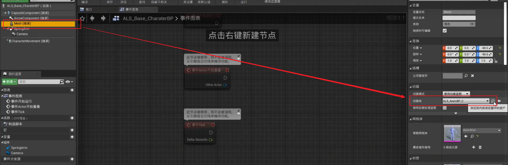
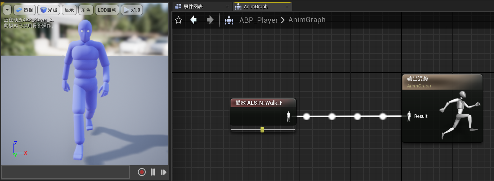
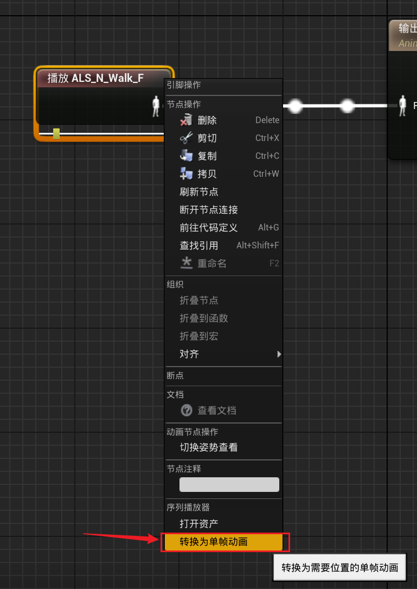
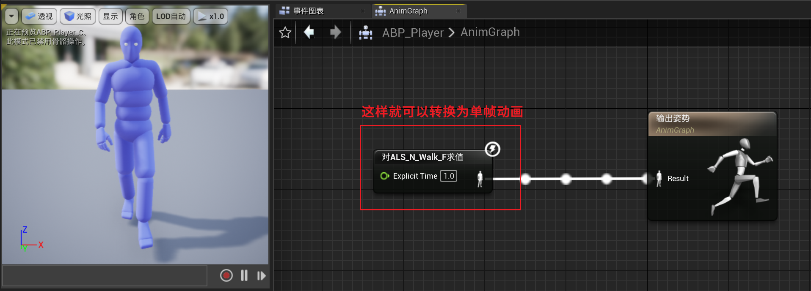
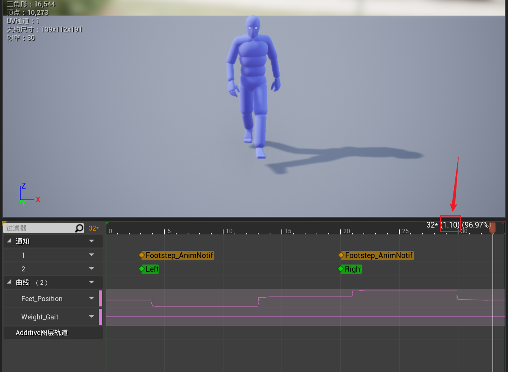

------

###### [返回菜单](../ALS_Menu.md)

------

# ALSv006 动画蓝图

------

## 目录

- [ALSv006 动画蓝图](#alsv006-动画蓝图)
  - [目录](#目录)
    - [动画蓝图的作用](#动画蓝图的作用)
    - [动画序列转换为单帧动画](#动画序列转换为单帧动画)

------

视频链接

> [06动画蓝图_哔哩哔哩_bilibili](https://www.bilibili.com/video/BV12f4y1r71N?spm_id_from=333.788.videopod.episodes&vd_source=9e1e64122d802b4f7ab37bd325a89e6c&p=7)

------

------

### 动画蓝图的作用

> - 从角色（Character）上获取数据，根据数据处理状态变更
>
> - 输出：的是角色播放动画之后产生的姿势
>
> 

------

### 动画序列转换为单帧动画

> 
>
> - #### 上图的 `float` 对应的是这里的值：
>
>   

___________________________________________________________________________________________

[返回最上面](#返回菜单)
___________________________________________________________________________________________
