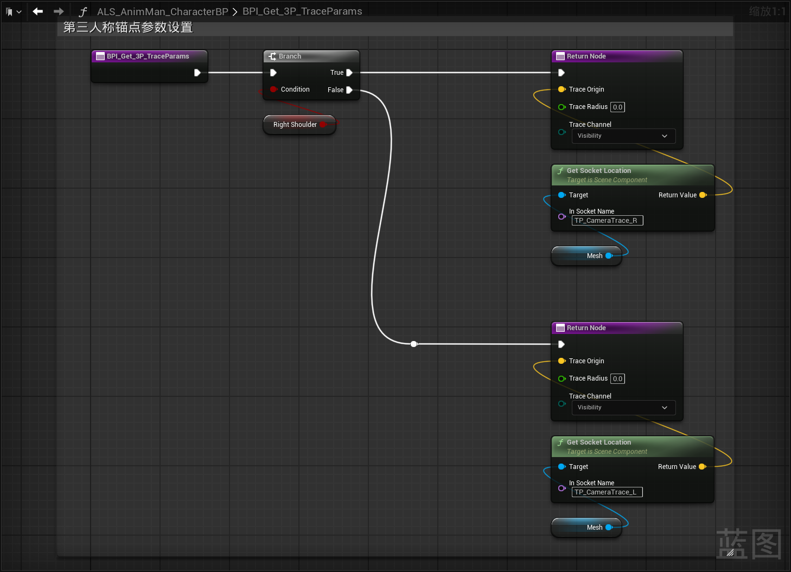

------

###### [返回菜单](../ALS_Menu.md)

------

# ALSv4复刻v002 新建`GM`/`PC`/`Character`/`PlayerCameraManager`/`接口`

------

## 目录

[TOC]

------

<details>
<summary>视频链接</summary>

> [关于高级运动系统复刻与解耦](https://www.bilibili.com/video/BV1ja41197XQ/?p=3&share_source=copy_web&vd_source=ccfefcf8d65f5d070c57cddf34c94047)

------

</details>

------

## 一、新建`GM`/`PC`/`Character`

#### 新建一个GM，配置到世界场景设置`

路径：

```
/Blueprints/GameModes/
```

1. 命名为：`ALS_Gamemode_SP`
2. 配置到世界场景设置


### 新建`PC`

路径：

```
/Blueprints/CharacterLogic/
```

1. 命名为：`ALS_Player_Controller`
2. 配置到`ALS_Gamemode_SP`


### 新建`Character`

路径：

```
/Blueprints/CharacterLogic/
```

命名为：`ALS_Base_CharacterBP`


### 新建子类继承自`ALS_Base_CharacterBP`

路径：

```
/Blueprints/CharacterLogic/
```

1. 命名为：`ALS_AnimMan_CharacterBP`

2. 配置到GM

------

## 二、修改人物基类`ALS_Base_CharacterBP`

### 胶囊体

1. 胶囊体高度：`90`
2. 胶囊体半径：`30`
3. **胶囊提碰撞预设改为：`ALS_Character`**(因为相机是自定义的)（这里蓝图版和插件版有区别）

**项目的碰撞预设**：

这里蓝图版和插件版不太一样，我用的是插件版，角色胶囊提是自定义的碰撞预设


### 设置Mesh

1. 使用资产：`Proxy`
2. MeshZ位置：`-92`
3. MeshYaw：`-90`


### 修改移动组件配置

| 移动组件参数：   | 英文 | 修改为： | 作用 |
| ---------------- | ---- | -------- | ---- |
| 最大速度         |      | 1500.f   |      |
| 制动摩擦因子     |      | 0.f      |      |
| 蹲伏胶囊提半高   |      | 60cm     |      |
| 最小模拟行走速度 |      | 25cm/s   |      |
| 蹲伏时可走出平台 |      | true     |      |
| 到达半径阈值     |      | 20cm     |      |
| 到达额外高度     |      | 0cm      |      |
| 平台检查阈值     |      | 0cm      |      |
| 空气控制         |      | 0.15     |      |
| 可蹲伏           |      | true     |      |
| 可飞行           |      | true     |      |


### `ALS_Base_CharacterBP`上添加ActorTag

添加**`ActorTag`**：

- **`ALS_Character`**


### 人物取消勾选 `UseControlRotationYaw` 

因为我们是独立的摄像机系统


------


## 三、新建CameraManager类`

路径：

```
/Blueprints/CameraSystem/
```

1. 命名为：`ALS_PlayerCameraManager`

2. 添加**骨骼网格体组件**`SkeletalMeshComponent`
   - 使用骨骼网格体资产**Camera**

3. 配置到`ALS_Player_Controller`

------

## 摄像机系统概述

利用组件空间计算出某一个位置，然后转换成世界坐标

比如需要胶囊体的一半的位置，就需要用：`(根骨骼的世界位置 - 胶囊体顶部的位置) / 2`

------

## 创建蓝图接口`ALS_Camera_BPI`

路径：

```
/Blueprints/Interfaces/
```

1. 命名为`ALS_Camera_BPI`

2. 新建四个方法

   - `BPI_Get_CameraParameters`(相机参数)
     
     下面是返回值：
     
     - `float` `ThirdPersonFOV`(第三人称视野范围)
     
     - `float` `FirstPersonFOV`(第一人称视野范围)
     
     - `bool` `RightShoulder`(是否为右侧越肩)
     
       
     
   - `BPI_Get_FP_CameraTarget`(第一人称**相机的目标**)
     
     下面是返回值：
     
     - `FVector` `TargetLocation`
     
       
     
   - `BPI_Get_3P_PivotTarget`(第三人称**锚点的目标**)
     
     下面是返回值：
     
     - `FTransform` `TargetTransform`
     
       
     
   - `BPI_Get_3P_TraceParams`(第三人称**锚点参数设置**)
     
     下面是返回值：
     
     - `FVector` `TraceOrigin`(锚点中心)
     
     - `float` `TraceRadius`(锚点半径)
     
     - `ETraceTypeQuery` `TraceChannel`(锚点通道)
     
       

3. 人物基类`ALS_Base_CharacterBP`继承接口`ALS_Camera_BPI`

### `ALS_Base_CharacterBP`中重写接口方法


### `ALS_Base_CharacterBP`中创建相机系统相关变量并配置初始值

| 变量             | 类型    | 默认值  | 分组           |
| ---------------- | ------- | ------- | -------------- |
| `ThirdPersonFOV` | `float` | `90.f`  | `CameraSystem` |
| `FirstPersonFOV` | `float` | `90.f`  | `CameraSystem` |
| `RightShoulder`  | `bool`  | `false` | `CameraSystem` |


------

## 子类重写三个接口方法

### `BPI_Get_3P_PivotTarget`

- 获取第三人称锚点的目标

使用骨骼的世界位置计算：`(头 + root也就是根骨骼位置) / 2`

#### 其中`GetSocketLocation`获取的是世界坐标的位置，这个需要注意下


### `BPI_Get_FP_CameraTarget`

- 返回第一人称相机位置


### `BPI_Get_3P_TraceParams`

- 第三人称锚点参数设置



------

## 涉及到的问题：


### 两种使用曲线的方式

#### 1.直接创建曲线使用

#### 2.在骨骼里面配置


### `插槽`和`网格体`插槽的区别？

# 这个问题需要等有时间请教下！！！！！！！！！！！！！！！！

1. **骨骼插槽（基础形态）**  
   - **创建方式**：在骨架（Skeleton）或骨骼网格体（Skeletal Mesh）的骨骼层级中右键骨骼 → **添加插槽**。  
   - 在**骨架（Skeleton）** 中添加 → **全局生效**（所有使用该骨架的网格体共享）。  
2. **网格体插槽（高级形态）**  
   - **创建方式**：在骨骼网格体编辑器中，右键已存在的骨骼插槽 → **转换为网格体插槽**。  
   - **核心升级**：  
     - 获得**物理模拟**、**特效生成**等扩展功能。  
     - 支持更复杂的**动态附着逻辑**（如武器摆动时的物理碰撞）。  


### 骨骼空间(又叫局部空间)、组件空间、世界空间三者区别？

|             ~              |           ~            |                       ~                        |
| :------------------------: | :--------------------: | :--------------------------------------------: |
| `骨骼空间`(又叫`局部空间`) | 相对于父骨骼的相对坐标 |                                                |
|         `组件空间`         | 相对于根骨骼的相对坐标 | 所有骨骼最终需要转换到此空间才能正确渲染到世界 |
|         `世界空间`         |       顾名思义~        |                                                |


### UE动画系统的核心流程

如下：

1. **动画蓝图（Anim Blueprint）** 在**游戏线程（Game Thread）**中运行，计算骨骼的 **局部空间变换**（如动画混合、状态机逻辑）。 
2. 计算结果会转换为 **`Component Space`**，并提交到**动画线程（Animation Thread）**进行最终处理。 
3. 动画线程负责将 **`Component Space`** 的**骨骼变换数据**传递给**渲染线程**，最终生成渲染所需的**骨骼矩阵**。


### 为什么是 Component Space？

- **渲染和物理依赖**： 
 渲染器和物理引擎需要骨骼在 **世界空间** 中的最终位置，而 Component Space 是骨骼相对于组件根骨骼的坐标系，可直接通过组件的位置/旋转/缩放转换到世界空间。
- **线程安全**： 
 动画线程需要处理与主线程解耦的独立数据，Component Space 的骨骼数据是线程安全的，避免因父骨骼动态变化导致数据不一致。
- **优化性能**： 
 Component Space 的变换可直接用于 GPU 蒙皮计算，无需在动画线程中逐级计算局部到全局的变换。


###  Local Space 的用途
- **动画蓝图内部计算**：  
  动画混合、曲线驱动、状态机等逻辑通常在 Local Space 中进行（例如，两个动画的骨骼位置在局部空间插值）。  
- **骨骼层级操作**：  
  如逆向动力学（IK）或物理动画（Ragdoll）可能需要局部空间数据，但最终结果仍会转换到 Component Space。


### 验证方法

- **调试工具**：  
  使用 UE 的 **动画调试工具**（如 `ShowDebug Animation`）可查看骨骼的 Component Space 坐标。  
- **代码分析**：  
  在源码中，`FAnimInstanceProxy::UpdateAnimation` 最终会将骨骼变换转换为 Component Space（见 `USkeletalMeshComponent::RefreshBoneTransforms`）。
  


### 例外情况

- **某些插件或自定义逻辑**：  
  如使用插件（如 `Control Rig`）或直接操作骨骼变换的代码，可能会在局部空间处理数据，但最终仍需提交到 Component Space。


### 总结

UE 提交到动画线程的数据是 **Component Space**，这是为了满足渲染、物理和多线程安全的要求。Local Space 主要用于动画蓝图内部的中间计算，最终结果会被转换为 Component Space 供后续流程使用。理解这一机制对优化动画性能或调试复杂动画逻辑至关重要。


[返回最上面](#返回菜单)

___________________________________________________________________________________________
