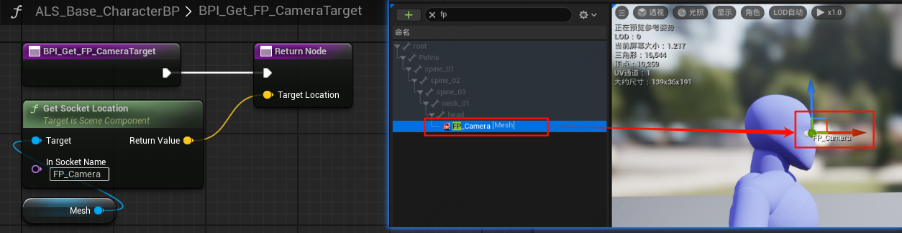

------

###### [返回菜单](../ALS_Menu.md)

------

# ALSv4复刻v002 新建`GM`/`PC`/`Character`/`PlayerCameraManager`/`接口`

------

## 目录

- [ALSv4复刻v002 新建`GM`/`PC`/`Character`/`PlayerCameraManager`/`接口`](#alsv4复刻v002-新建gmpccharacterplayercameramanager接口)
  - [目录](#目录)
  - [一、新建`GM`/`PC`/`Character`](#一新建gmpccharacter)
      - [新建一个GM，配置到世界场景设置\`](#新建一个gm配置到世界场景设置)
    - [新建`PC`](#新建pc)
    - [新建`Character`](#新建character)
    - [新建子类继承自`ALS_Base_CharacterBP`](#新建子类继承自als_base_characterbp)
  - [二、修改人物基类`ALS_Base_CharacterBP`](#二修改人物基类als_base_characterbp)
    - [胶囊体](#胶囊体)
    - [设置Mesh](#设置mesh)
    - [修改移动组件配置](#修改移动组件配置)
    - [`ALS_Base_CharacterBP`上添加ActorTag](#als_base_characterbp上添加actortag)
    - [人物取消勾选 `UseControlRotationYaw`](#人物取消勾选-usecontrolrotationyaw)
  - [三、新建CameraManager类](#三新建cameramanager类)
  - [摄像机系统概述](#摄像机系统概述)
  - [创建蓝图接口`ALS_Camera_BPI`](#创建蓝图接口als_camera_bpi)
    - [`ALS_Base_CharacterBP`中重写接口方法](#als_base_characterbp中重写接口方法)
    - [`ALS_Base_CharacterBP`中创建相机系统相关变量并配置初始值](#als_base_characterbp中创建相机系统相关变量并配置初始值)
  - [子类重写三个接口方法](#子类重写三个接口方法)
    - [`BPI_Get_3P_PivotTarget`](#bpi_get_3p_pivottarget)
      - [其中`GetSocketLocation`获取的是世界坐标的位置，这个需要注意下](#其中getsocketlocation获取的是世界坐标的位置这个需要注意下)
    - [`BPI_Get_FP_CameraTarget`](#bpi_get_fp_cameratarget)
    - [`BPI_Get_3P_TraceParams`](#bpi_get_3p_traceparams)
  - [涉及到的问题：](#涉及到的问题)
    - [两种使用曲线的方式](#两种使用曲线的方式)
      - [1.直接创建曲线使用](#1直接创建曲线使用)
      - [2.在骨骼里面配置](#2在骨骼里面配置)
      - [](#)
    - [`插槽`和`网格体`插槽的区别？](#插槽和网格体插槽的区别)
- [这个问题需要等有时间请教下！！！！！！！！！！！！！！！！](#这个问题需要等有时间请教下)
    - [骨骼空间(又叫局部空间)、组件空间、世界空间三者区别？](#骨骼空间又叫局部空间组件空间世界空间三者区别)
    - [UE动画系统的核心流程](#ue动画系统的核心流程)
    - [为什么是 Component Space？](#为什么是-component-space)
    - [Local Space 的用途](#local-space-的用途)
    - [验证方法](#验证方法)
    - [例外情况](#例外情况)
    - [总结](#总结)


------

<details>
<summary>视频链接</summary>

> [关于高级运动系统复刻与解耦](https://www.bilibili.com/video/BV1ja41197XQ/?p=3&share_source=copy_web&vd_source=ccfefcf8d65f5d070c57cddf34c94047)

------

</details>

------

## 一、新建`GM`/`PC`/`Character`

#### 新建一个GM，配置到世界场景设置`

路径：

```
/Blueprints/GameModes/
```

1. 命名为：`ALS_Gamemode_SP`
2. 配置到世界场景设置


### 新建`PC`

路径：

```
/Blueprints/CharacterLogic/
```

1. 命名为：`ALS_Player_Controller`
2. 配置到`ALS_Gamemode_SP`


### 新建`Character`

路径：

```
/Blueprints/CharacterLogic/
```

命名为：`ALS_Base_CharacterBP`


### 新建子类继承自`ALS_Base_CharacterBP`

路径：

```
/Blueprints/CharacterLogic/
```

1. 命名为：`ALS_AnimMan_CharacterBP`

2. 配置到GM

------

## 二、修改人物基类`ALS_Base_CharacterBP`

### 胶囊体

1. 胶囊体高度：`90`
2. 胶囊体半径：`30`
3. **胶囊提碰撞预设改为：`ALS_Character`**(因为相机是自定义的)（这里蓝图版和插件版有区别）

**项目的碰撞预设**：

这里蓝图版和插件版不太一样，我用的是插件版，角色胶囊提是自定义的碰撞预设


### 设置Mesh

1. 使用资产：`Proxy`
2. MeshZ位置：`-92`
3. MeshYaw：`-90`


### 修改移动组件配置

| 中文名           | 英文字段                             | 默认值     | 修改为：                                   | 含义 / 作用（简明）                                          | 对游戏手感的影响                                             | 常见建议 / 注意事项                                          |
| ---------------- | ------------------------------------ | :--------: | :----------------------------------------: | ------------------------------------------------------------ | ------------------------------------------------------------ | ------------------------------------------------------------ |
| 最大加速度       | `Max Acceleration`                   | `2048.0`   | `1500.f`                                   | 角色在地面上因输入被加速的**加速度值**（引擎单位：cm/s²）。控制从当前速度到目标速度改变的快慢。 | 值越大，角色从静止到达到目标速度越快（更“灵敏 / 瞬移感”）；值低则起步显得缓慢、拖沓。 | 例如 FPS 常用较高值（1000–5000 cm/s²）；平台/慢速游戏用小值。注意：与 `Max Walk Speed`、摩擦等配合决定最终曲线。([Epic Games Developers](https://dev.epicgames.com/documentation/en-us/unreal-engine/setting-up-character-movement?utm_source=chatgpt.com)) |
| 制动摩擦因子     | `Braking Friction Factor`            | `2.0`      | `0.f`                                      | 用于缩放“制动摩擦（BrakingFriction）”的系数。制动摩擦为速度相关的摩擦阻力（当没有加速度输入或超过最大速度时生效）。 | 值越大，松开输入后越快被“摩擦”停下（更快停止、短滑行）；值为 0 时摩擦制动不生效（只依赖常量制动减速度）。 | 如果想更自然的滑行/惯性感可减小；若想瞬停（锐利操控）可增大并配合 `Use Separate Braking Friction`/`BrakingFriction`。实际制动效果是 `BrakingFriction * BrakingFrictionFactor`。([Epic Games Developers](https://dev.epicgames.com/documentation/en-us/unreal-engine/API/Runtime/Engine/GameFramework/UCharacterMovementComponent/BrakingFriction?utm_source=chatgpt.com)) |
| 蹲伏胶囊半高     | `Crouched Half Height`               | `40.0 cm`  | `60cm`                                     | 角色 Capsule 在**蹲伏时**的半高度（单位 cm）。控制蹲下后的碰撞高度。 | 影响能否通过低矮通道、镜头/摄像机位置与模型是否会“下陷”到地面。 | 修改时注意摄像机/网格偏移（可能要调整 Mesh 相对 Capsule 的位置），改动过大会造成角色嵌地或卡住。([Epic Developer Community Forums](https://forums.unrealengine.com/t/where-is-the-set-crouched-half-height/435783?utm_source=chatgpt.com)) |
| 最小模拟行走速度 | `Min Analog Walk Speed`              | `0.0 cm/s` | `25cm/s`                                   | 在使用模拟输入（比如手柄摇杆）时，**最小的地面速度目标值**（单位 cm/s）。当摇杆很小倾斜时仍会被加速到这个速度。 | 防止摇杆轻微倾斜导致非常低速移动（会让动画/移动不同步、出现“抖动”）；设置后轻微输入也能保证最低移动速度。 | 对于需要摇杆“死区”或平滑手感的游戏很有用。把它设为合适的步态同步速度（示例：25cm/s 对应慢走）。([Epic Games Developers](https://dev.epicgames.com/documentation/en-us/unreal-engine/python-api/class/CharacterMovementComponent?application_version=5.0&utm_source=chatgpt.com), [Epic Developer Community Forums](https://forums.unrealengine.com/t/minimum-movement-speed/19759?utm_source=chatgpt.com)) |
| 蹲伏时可走出平台 | `Can Walk Off Ledges When Crouching` | ❌   | ✅                                    | 是否允许在**蹲伏状态下**从平台边缘走下（布尔）。             | `true`：蹲伏时遇到平台边缘会继续向下走/掉下；`false`：会停住或被当作“不可走出”。 | 如果你希望蹲伏更保守（避免误掉落），设为 `false`。否则设 `true` 以保证行为与站立时一致。([Epic Developer Community Forums](https://forums.unrealengine.com/t/why-cant-my-character-walk-off-ledges/287641?utm_source=chatgpt.com)) |
| 到达半径阈值     | `Perch Radius Threshold`             | `0.0 cm` | `20cm`                                     | 判定“能否站在（perch）/小平台上”的最大半径阈值（cm）。用于角色在接近小台阶/凸起时的检测。 | 值较大时，角色更容易“站上”狭窄或小的凸起；值较小会在小凸起处被视为“边缘/掉落”而不能站稳。 | 配合 `Perch Additional Height` 与 `Ledge Check Threshold` 调整，防止角色在微小地形上悬空或卡住。([Epic Developer Community Forums](https://forums.unrealengine.com/t/player-capsule-collision-not-fall-down/74637?utm_source=chatgpt.com)) |
| 到达额外高度     | `Perch Additional Height`            | `40.0 cm` | `0cm`                                      | 在判定能否 perching/站上小台阶时额外加上的高度容差（cm）。   | 增大可以让角色更容易“跨上”稍高的台阶；值为 0 则严格按碰撞高度判断。 | 对于有很多小台阶/不平地形的场景，可以适当给一点余量以避免卡脚。([Epic Developer Community Forums](https://forums.unrealengine.com/t/player-capsule-collision-not-fall-down/74637?utm_source=chatgpt.com)) |
| 平台检查阈值     | `Ledge Check Threshold`              | `4.0 cm` | `0cm`                                      | 用于 ledge 检测的高度/距离阈值（cm），决定何时将表面当作“ledge/边缘”进行特殊处理。 | 阈值影响角色在接触边缘时是否被判定为可走、可 perching 或被卡住。 | 小值会更严格，易停在边缘；大值可能误判导致不想要的跨越。与上面两个参数一并调试。([Epic Developer Community Forums](https://forums.unrealengine.com/t/player-capsule-collision-not-fall-down/74637?utm_source=chatgpt.com)) |
| 空中控制         | `Air Control`                        | `0.05` | `0.15`                                     | 在空中（Falling）时玩家能对水平移动方向/速度进行的控制强度（通常 0～1，单位无量纲）。1 = 等同地面控制，大于 1 会更强。 | 值越大，空中可以更灵活改变方向（更“鼠标/按键敏感”）。值越小，跳跃后轨迹更受惯性/重力支配。 | 平台动作游戏常给较高空中控制（0.5–1.0），写实物理风格可用较低（0–0.3）。`>1` 会让空中移动比地面还快，需谨慎。([Epic Developer Community Forums](https://forums.unrealengine.com/t/does-character-air-control-1-do-anything/386770?utm_source=chatgpt.com)) |
| 可游泳           | `Can Swim`                           | ❌    | 是否允许进入 `Swimming` 移动模式（布尔）。 | 开启后角色可进入游泳状态并使用水中移动逻辑；否则遇水会按落下/阻塞处理。 | 如果场景没有水体可以关闭；有水体时配合 `Water` 体积与游泳速度参数使用。([Epic Games Developers](https://dev.epicgames.com/documentation/en-us/unreal-engine/setting-up-character-movement?utm_source=chatgpt.com)) |
| 可飞行           | `Can Fly`                            | ❌   | ✅                                    | 是否允许进入 `Flying` 移动模式（布尔）。                     | 开启则能切换到飞行/漫游模式，使用飞行移动逻辑；否则无法飞行。 | 常用于 NPC 或有飞行玩法的角色；要注意网络同步与状态切换边界。([Epic Games Developers](https://dev.epicgames.com/documentation/en-us/unreal-engine/setting-up-character-movement?utm_source=chatgpt.com)) |


### `ALS_Base_CharacterBP`上添加ActorTag

添加**`ActorTag`**：

- **`ALS_Character`**


### 人物取消勾选 `UseControlRotationYaw` 

因为我们是**独立的摄像机系统**


------


## 三、新建CameraManager类

路径：

```
/Blueprints/CameraSystem/
```

1. 命名为：`ALS_PlayerCameraManager`

2. 添加**骨骼网格体组件**`SkeletalMeshComponent`
   - 使用骨骼网格体资产**Camera**

3. 配置到`ALS_Player_Controller`

------

## 摄像机系统概述

利用组件空间计算出某一个位置，然后转换成世界坐标

比如需要胶囊体的一半的位置，就需要用：`(根骨骼的世界位置 - 胶囊体顶部的位置) / 2`

------

## 创建蓝图接口`ALS_Camera_BPI`

路径：

```
/Blueprints/Interfaces/
```

1. 命名为`ALS_Camera_BPI`

2. 新建四个方法

   - `BPI_Get_CameraParameters`(相机参数)
     
     下面是返回值：
     
     - `float` `ThirdPersonFOV`(第三人称视野范围)
     
     - `float` `FirstPersonFOV`(第一人称视野范围)
     
     - `bool` `RightShoulder`(是否为右侧越肩)
     
       
     
   - `BPI_Get_FP_CameraTarget`(第一人称**相机的目标**)
     
     下面是返回值：
     
     - `FVector` `TargetLocation`
     
       
     
   - `BPI_Get_3P_PivotTarget`(第三人称**锚点的目标**)
     
     下面是返回值：
     
     - `FTransform` `TargetTransform`
     
       
     
   - `BPI_Get_3P_TraceParams`(第三人称**锚点参数设置**)
     
     下面是返回值：
     
     - `FVector` `TraceOrigin`(锚点中心)
     
     - `float` `TraceRadius`(锚点半径)
     
     - `ETraceTypeQuery` `TraceChannel`(锚点通道)
     
       

3. 人物基类`ALS_Base_CharacterBP`继承接口`ALS_Camera_BPI`

### `ALS_Base_CharacterBP`中重写接口方法




### `ALS_Base_CharacterBP`中创建相机系统相关变量并配置初始值

| 变量             | 类型    | 默认值  | 分组           |
| ---------------- | ------- | ------- | -------------- |
| `ThirdPersonFOV` | `float` | `90.f`  | `CameraSystem` |
| `FirstPersonFOV` | `float` | `90.f`  | `CameraSystem` |
| `RightShoulder`  | `bool`  | `false` | `CameraSystem` |


------

## 子类重写三个接口方法

### `BPI_Get_3P_PivotTarget`

- 获取第三人称锚点的目标

使用骨骼的世界位置计算：`(头 + root也就是根骨骼位置) / 2`

#### 其中`GetSocketLocation`获取的是世界坐标的位置，这个需要注意下


### `BPI_Get_FP_CameraTarget`

- 返回第一人称相机位置


### `BPI_Get_3P_TraceParams`

- 第三人称锚点参数设置


------

## 涉及到的问题：


### 两种使用曲线的方式

#### 1.直接创建曲线使用

#### 2.在骨骼里面配置

#### 


### `插槽`和`网格体`插槽的区别？

# 这个问题需要等有时间请教下！！！！！！！！！！！！！！！！

1. **骨骼插槽（基础形态）**  
   - **创建方式**：在骨架（Skeleton）或骨骼网格体（Skeletal Mesh）的骨骼层级中右键骨骼 → **添加插槽**。  
   - 在**骨架（Skeleton）** 中添加 → **全局生效**（所有使用该骨架的网格体共享）。  
2. **网格体插槽（高级形态）**  
   - **创建方式**：在骨骼网格体编辑器中，右键已存在的骨骼插槽 → **转换为网格体插槽**。  
   - **核心升级**：  
     - 获得**物理模拟**、**特效生成**等扩展功能。  
     - 支持更复杂的**动态附着逻辑**（如武器摆动时的物理碰撞）。  


### 骨骼空间(又叫局部空间)、组件空间、世界空间三者区别？

|             ~              |           ~            |                       ~                        |
| :------------------------: | :--------------------: | :--------------------------------------------: |
| `骨骼空间`(又叫`局部空间`) | 相对于父骨骼的相对坐标 |                                                |
|         `组件空间`         | 相对于根骨骼的相对坐标 | 所有骨骼最终需要转换到此空间才能正确渲染到世界 |
|         `世界空间`         |       顾名思义~        |                                                |


### UE动画系统的核心流程

如下：

1. **动画蓝图（Anim Blueprint）** 在**游戏线程（Game Thread）**中运行，计算骨骼的 **局部空间变换**（如动画混合、状态机逻辑）。 
2. 计算结果会转换为 **`Component Space`**，并提交到**动画线程（Animation Thread）**进行最终处理。 
3. 动画线程负责将 **`Component Space`** 的**骨骼变换数据**传递给**渲染线程**，最终生成渲染所需的**骨骼矩阵**。


### 为什么是 Component Space？

- **渲染和物理依赖**： 
 渲染器和物理引擎需要骨骼在 **世界空间** 中的最终位置，而 Component Space 是骨骼相对于组件根骨骼的坐标系，可直接通过组件的位置/旋转/缩放转换到世界空间。
- **线程安全**： 
 动画线程需要处理与主线程解耦的独立数据，Component Space 的骨骼数据是线程安全的，避免因父骨骼动态变化导致数据不一致。
- **优化性能**： 
 Component Space 的变换可直接用于 GPU 蒙皮计算，无需在动画线程中逐级计算局部到全局的变换。


###  Local Space 的用途
- **动画蓝图内部计算**：  
  动画混合、曲线驱动、状态机等逻辑通常在 Local Space 中进行（例如，两个动画的骨骼位置在局部空间插值）。  
- **骨骼层级操作**：  
  如逆向动力学（IK）或物理动画（Ragdoll）可能需要局部空间数据，但最终结果仍会转换到 Component Space。


### 验证方法

- **调试工具**：  
  使用 UE 的 **动画调试工具**（如 `ShowDebug Animation`）可查看骨骼的 Component Space 坐标。  
- **代码分析**：  
  在源码中，`FAnimInstanceProxy::UpdateAnimation` 最终会将骨骼变换转换为 Component Space（见 `USkeletalMeshComponent::RefreshBoneTransforms`）。
  


### 例外情况

- **某些插件或自定义逻辑**：  
  如使用插件（如 `Control Rig`）或直接操作骨骼变换的代码，可能会在局部空间处理数据，但最终仍需提交到 Component Space。


### 总结

UE 提交到动画线程的数据是 **Component Space**，这是为了满足渲染、物理和多线程安全的要求。Local Space 主要用于动画蓝图内部的中间计算，最终结果会被转换为 Component Space 供后续流程使用。理解这一机制对优化动画性能或调试复杂动画逻辑至关重要。


[返回最上面](#返回菜单)

___________________________________________________________________________________________
