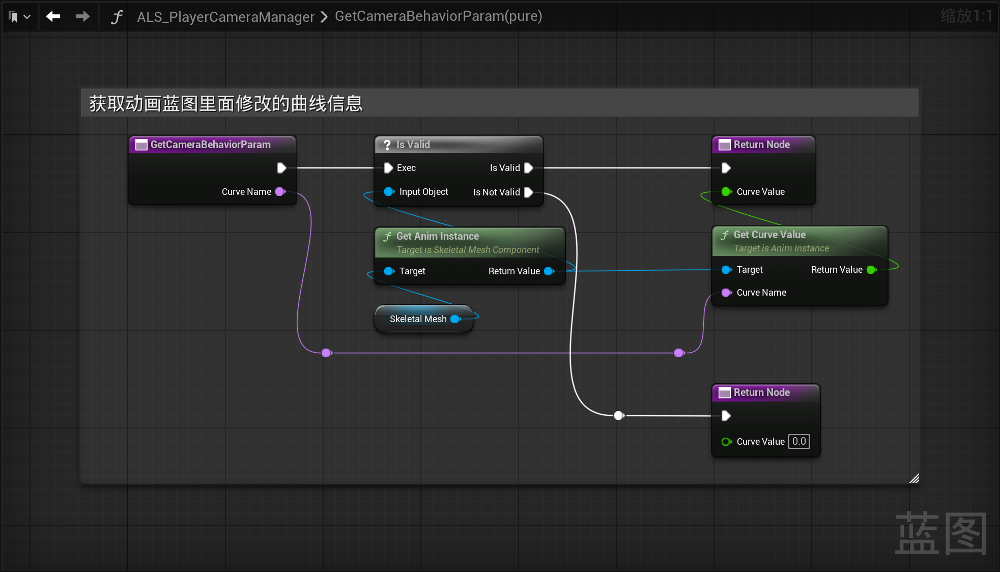

------

#### [返回菜单](../ALS_Menu.md)

------

# ALSv4复刻v003 对3C进行简单耦合;摄像机ABP中添加曲线

------

## 目录

- [ALSv4复刻v003 对3C进行简单耦合;摄像机ABP中添加曲线](#alsv4复刻v003-对3c进行简单耦合摄像机abp中添加曲线)
  - [目录](#目录)
  - [为摄像机创建动画蓝图`ALS_PlayerCameraBehavior`](#为摄像机创建动画蓝图als_playercamerabehavior)
  - [在`ALS_Player_Controller`控制玩家时，为`摄像机ABP`中的变量`PlayerController`和`ControlledPawn`赋值](#在als_player_controller控制玩家时为摄像机abp中的变量playercontroller和controlledpawn赋值)
  - [`ALS_PlayerCameraManager`中重写方法`BlueprintUpdateCamera`](#als_playercameramanager中重写方法blueprintupdatecamera)
    - [`BlueprintUpdateCamera`中的逻辑：](#blueprintupdatecamera中的逻辑)
      - [新建计算相机参数的函数](#新建计算相机参数的函数)
  - [在相机的骨骼网格体中添加曲线](#在相机的骨骼网格体中添加曲线)
  - [`CustomCameraBehavior`方法中使用插值计算当前旋转值](#customcamerabehavior方法中使用插值计算当前旋转值)
  - [`ALS_PlayerCameraManager`中创建纯函数，返回摄像机ABP的曲线参数](#als_playercameramanager中创建纯函数返回摄像机abp的曲线参数)


------

<details>
<summary>视频链接</summary>

> [高级运动系统解耦和复刻第三期_哔哩哔哩_bilibili](https://www.bilibili.com/video/BV1ja41197XQ?share_source=copy_web&vd_source=ccfefcf8d65f5d070c57cddf34c94047&p=4&spm_id_from=333.788.videopod.episodes)

------

</details>

------

> ## 这一期需要对3C进行简单耦合

------

## 为摄像机创建动画蓝图`ALS_PlayerCameraBehavior`

路径

```
/Blueprints/CameraSystem/
```

1. 命名为：`ALS_PlayerCameraBehavior`
2. 创建两个变量(目的是将`摄像机ABP`和`玩家控制器`/`玩家控制角色`/`摄像机`进行耦合)
   - `PlayerController`类型，命名为：`PlayerController`
   - `Pawn`类型，命名为：`ControlledPawn`
3. 别忘了配置给`摄像机的SkeletalMesh`


------

## 在`ALS_Player_Controller`控制玩家时，为`摄像机ABP`中的变量`PlayerController`和`ControlledPawn`赋值

1. 重写`ALS_Player_Controller`中的`OnPossess`方法
2. `ALS_PlayerCameraManager`中创建自定义事件`OnPossess`
3. `ALS_PlayerCameraManager`中创建`Pawn`类型变量，命名为：`ControlledPawn`
4. 当触发`ALS_Player_Controller::OnPossess`时，调用`ALS_PlayerCameraManager`的`OnPossess`事件，为`ALS_PlayerCameraManager`中的`ControlledPawn`和`摄像机ABP`中的`PlayerController`和`ControlledPawn`赋值


------

## `ALS_PlayerCameraManager`中重写方法`BlueprintUpdateCamera`


<details>
<summary>源码中触发位置：</summary>

> 会在`UWorld::Tick`中调用更新
>
> 蓝图挂钩允许蓝图覆盖现有的相机行为或实现自定义摄像机。如果此函数返回true，我们将使用给定的返回值并跳过进一步的计算来确定最终相机POV。
>
> 

------

</details>

### `BlueprintUpdateCamera`中的逻辑：

1. 先判断是否拥有指定`ActorTag`（需要对玩家拥有的标签`ALS_Character`进行过滤）
2. 如果不包含标签直接调用`Super`返回参数


#### 新建计算相机参数的函数

命名为：`CustomCameraBehavior`

1. 通过接口在`ALS_PlayerCameraManager`中获取玩家蓝图`ALS_AnimMan_CharacterBP`中的信息

   除了`BPI_Get_CameraParameters`不用获取，其余都需要在函数`CustomCameraBehavior`中保存临时变量


------

## 在相机的骨骼网格体中添加曲线

| 曲线                 | 用途（需要后面补充）                                   | 使用时机                                                     |
| -------------------- | ------------------------------------------------------ | ------------------------------------------------------------ |
| `CameraOffset_X`     | 相机凝视点 + 这个偏移量X，用来计算最终偏移后的相机位置 | `ALS_PlayerCameraManager::BlueprintUpdateCamera`             |
| `CameraOffset_Y`     | 相机凝视点 + 这个偏移量Y，用来计算最终偏移后的相机位置 | `ALS_PlayerCameraManager::BlueprintUpdateCamera`             |
| `CameraOffset_Z`     | 相机凝视点 + 这个偏移量Z，用来计算最终偏移后的相机位置 | `ALS_PlayerCameraManager::BlueprintUpdateCamera`             |
| `Override_Debug`     | 是否开启Debug模式混合                                  | 需要计算Debug视角混合的场景，一般为相机最终结果计算前最后一步 |
| `PivotLagSpeed_X`    | `相机凝视点`插值的速度X                                |                                                              |
| `PivotLagSpeed_Y`    | `相机凝视点`插值的速度Y                                |                                                              |
| `PivotLagSpeed_Z`    | `相机凝视点`插值的速度Z                                |                                                              |
| `PivotOffset_X`      | `相机凝视点`偏移量X                                    |                                                              |
| `PivotOffset_Y`      | `相机凝视点`偏移量Y                                    |                                                              |
| `PivotOffset_Z`      | `相机凝视点`偏移量Z                                    |                                                              |
| `RotationLagSpeed`   | 从当前相机角度，插值到`ControlRotation`的速度          | 旋转滞后系统（防眩晕设计）RotationLagSpeed由动画曲线控制，不同状态（奔跑/瞄准）采用不同滞后系数 |
| `State_Debug`        | Debug状态                                              |                                                              |
| `State_Default`      | 默认状态                                               |                                                              |
| `State_FirstPerson`  | 第一人称状态                                           |                                                              |
| `State_Ragdoll`      | 布娃娃状态                                             |                                                              |
| `Weight_ADS`         | 第三人称曲线                                           |                                                              |
| `Weight_FirstPerson` | 第一人称曲线                                           | 返回摄像机位置时，用来Lerp，区分第一人称和第三人称           |


------

## `CustomCameraBehavior`方法中使用插值计算当前旋转值

将相机旋转插值旋转到控制器旋转的角度

1. 创建`FRotator`类型变量，命名为：`TargetCameraRotation`


------

## `ALS_PlayerCameraManager`中创建纯函数，返回摄像机ABP的曲线参数

1. 命名为：`GetCameraBehaviorParam`
   用于：获取动画蓝图里面修改的曲线信息
2. 将摄像机中的曲线：`RotationLagSpeed`给到旋转插值使用的`Speed`



[返回最上面](#返回菜单)

___________________________________________________________________________________________
