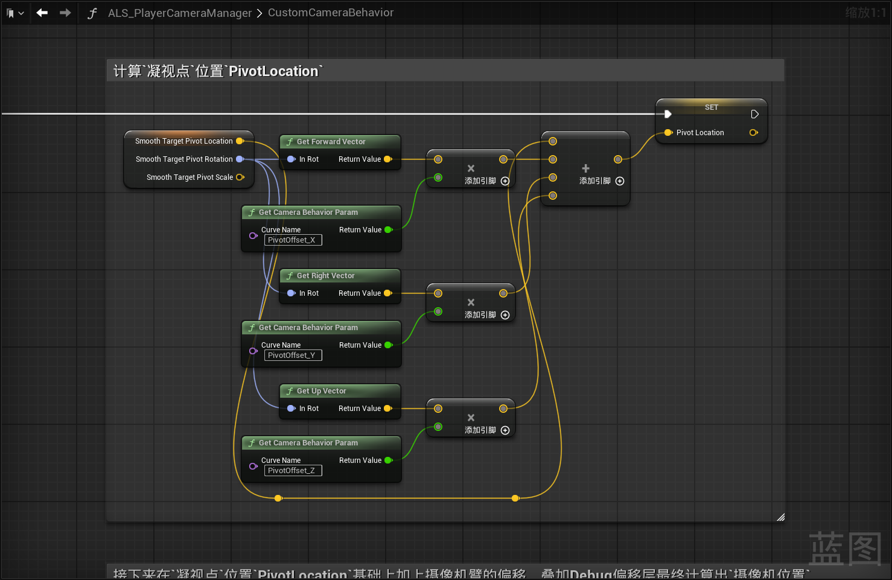
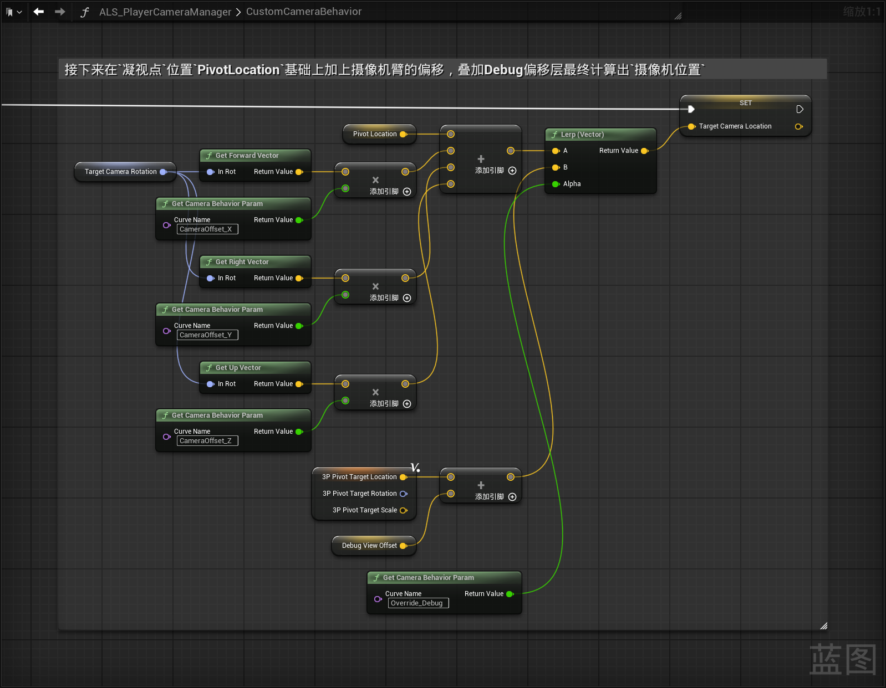

------

#### [返回菜单](../ALS_Menu.md)

------

# ALSv4复刻v004 计算摄像机锚点和偏移并处理Debug层混合

------

## 目录

[TOC]

------

<details>
<summary>视频链接</summary>

> [高级运动系统解耦和复刻第四期（上半）_哔哩哔哩_bilibili](https://www.bilibili.com/video/BV1ja41197XQ?share_source=copy_web&vd_source=ccfefcf8d65f5d070c57cddf34c94047&spm_id_from=333.788.videopod.episodes&p=5)
>
> [高级运动系统解耦和复刻第四期（下半）_哔哩哔哩_bilibili](https://www.bilibili.com/video/BV1ja41197XQ?share_source=copy_web&vd_source=ccfefcf8d65f5d070c57cddf34c94047&spm_id_from=333.788.videopod.episodes&p=6)

------

</details>

------

## Debug视角相关逻辑

1. `ALS_PlayerCameraManager`中新增`FRotator`类型变量，命名为`DebufViewRotation`
   - 默认值设置为：`FRotator`：
     - `Roll：0.f`
     - `Pitch：-5.f`
     - `Yaw：180.f`
2. 使用`Lerp`修改，使`DebufViewRotation`影响`TargetCameraRotation`变量
3. `Lerp`的`Alpha`使用`Override_Debug`曲线，之前在摄像机中添加的[跳转](./ALSv4Reproduce_v003.md#在相机的骨骼网格体中添加曲线)


------

## 从玩家蓝图获取摄像机锚点变换信息`计算过渡信息`储存在`ALS_PlayerCameraManager`中

1. `ALS_PlayerCameraManager`中新增`FTransform`类型变量，命名为`SmoothTargetPivot`
2. 新建纯函数用来实现`Transform`的过渡计算，(计算局部坐标?)，命名为：`CalculateAxisLndependentLag`，需要四个参数：（有点像`TInterpTo`节点[^1]）
   - `FVector`类型，命名为：`CurrentLocation`
   - `FVector`类型，命名为：`TargetLocation`
   - `FRotator`类型，命名为：`CameraRotation`
   - `FVector`类型，命名为：`LagSpeed`
   - 返回值为`FVector`类型
3. `CalculateAxisLndependentLag`中新建`FRotator`类型局部变量储存`CameraRotationYaw`
4. `CalculateAxisLndependentLag`中，分别使用`CurrentLocation`、`TargetLocation`、`CameraRotation`、`LagSpeed`计算插值，再局部变换在转换为世界变换？然后旋转向量，作为返回值
5. `CustomCameraBehavior`中继续使用`SmoothTargetPivot`过渡到`3P_PivotTarget`，`LagSpeed`分别使用三条`摄像机SkeletalMesh`中添加的曲线[跳转](./ALSv4Reproduce_v003.md#在相机的骨骼网格体中添加曲线)：
   - `PivotLagSpeed_X`
   - `PivotLagSpeed_Y`
   - `PivotLagSpeed_Z`
6. 最后更新`SmoothTargetPivot`（其实就是计算出每帧的过渡位置`FTransform`信息）


------

## 计算`凝视点`位置`PivotLocation`

1. `CustomCameraBehavior`中使用`SmoothTargetPivot`的`X`、`Y`、`Z`方向上的单位向量乘以三条`摄像机SkeletalMesh`中的曲线计算出向量，分别为：
   - `PivotOffset_X`
   - `PivotOffset_Y`
   - `PivotOffset_Z`
2. 新建`FVector`类型变量，命名为：`PivotLocation`
3. 还需要加上`SmoothTargetPivot`的基础位置



------

## 接下来在`凝视点`位置`PivotLocation`基础上加上摄像机臂的偏移，叠加Debug偏移层最终计算出`摄像机位置`

1. `CustomCameraBehavior`中使用`TargetCameraRotation`的`X`、`Y`、`Z`方向上的单位向量乘以三条`摄像机SkeletalMesh`中的曲线计算出向量，分别为：
   - `CameraOffset_X`
   - `CameraOffset_Y`
   - `CameraOffset_Z`
2. 还需要加上`PivotLocation`的基础位置
3. 结果需要混合`Debug`模式下的位置
4. 新建`FVector`类型变量，命名为：`TargetCameraLocation`



------

## 接下来要进行射线检测计算当摄像机被墙阻挡时的偏移后位置

要实现这个效果


这里不用`HitResult`的`InitialOverlap`的结果而是用第二次

<details>
<summary>HitResult 中 InitialOverlap 的作用</summary>

>1. **`bInitialOverlap = true`的含义**
>   - 表示碰撞检测开始时射线（或扫描体）**已穿透**几何体
>   - 物理引擎流程：
>     - 引擎在 `PxScene::raycast()`或 `sweep()`阶段发现 **起点已在物体内部**
>     - PhysX 底层直接返回 `初始重叠`标记
>     - 此时 `ImpactPoint`/ `Location`的值不可靠（可能返回起点坐标）
>2. **`bInitialOverlap = false`的含义**
>   - 表示射线是从**外部**碰撞进入几何体
>   - 物理引擎流程：
>     - 射线正常击中物体表面
>     - `ImpactPoint`为精确的碰撞点
>     - `Location`代表光线到达的最远安全位置（恰好未碰撞的点）
>
>|          状态           |        物理含义        |       相机系统处理方式       |
>| :---------------------: | :--------------------: | :--------------------------: |
>| `bInitialOverlap=true`  |   相机起点已在墙体内   | **跳过补偿**（防止错误偏移） |
>| `bInitialOverlap=false` | 相机移动路径中碰到墙面 |       **进行偏移补偿**       |
>
>### 当相机已嵌入墙体时强制补偿反而会导致视点抖动。解决的就是这个问题：`避免强制补偿导致的视点抖动`

------

</details>

1. 通过`BPI_Get_3P_TraceParams`获取**玩家中配置的摄像机信息**
2. 使用上一步的`TargetCameraLocation`作为射线检测的**终点**
3. 使用`HitResult`结果修正**新的摄像机位置**
4. 避免**初始重叠**导致的**视点抖动问题**


------

## 返回摄像机相关参数并用于`BlueprintUpdateCamera`

1. 需要混合第一人称和第三人称结果，使用摄像机中的曲线：`Weight_FirstPerson`
2. 混合Debug层的结果使用摄像机中的曲线：`Override_Debug`
3. 还需要混合并返回，第一人称或者第三人称的`FOV`，使用使用摄像机中的曲线：`Weight_FirstPerson`
4. 返回值共三个，分别为：
   - `FVector`类型：`Location`
   - `FRotator`类型：`Rotation`
   - `float`类型：`FOV`
5. `CustomCameraBehavior`返回值给到`BlueprintUpdateCamera`


------

## 接下来去摄像机ABP`ALS_PlayerCameraBehavior`中修改曲线

1. ABP中新建状态机，命名为：`MainCameraStates`，并把`Pose`缓存
2. `MainCameraStates`中，新建状态：`VelocityDirection`
3. 使用节点`ModifyCurve`修改曲线（[记得先关闭Alpha引脚](#在动画蓝图ABP中使用ModifyCurve修改曲线时，最好隐藏Alpha引脚)），修改如下曲线：（[曲线作用跳转](./ALSv4Reproduce_v003.md#在相机的骨骼网格体中添加曲线)）

| 曲线               | 修改值   |
| ------------------ | -------- |
| `CameraOffset_X`   | `-325.f` |
| `CameraOffset_Y`   | `0.f`    |
| `CameraOffset_Z`   | `20.f`   |
| `PivotLagSpeed_X`  | `5.f`    |
| `PivotLagSpeed_Y`  | `5.f`    |
| `PivotLagSpeed_Z`  | `15.f`   |
| `PivotOffset_Z`    | `50.f`   |
| `RotationLagSpeed` | `20.f`   |


------

## 修改子类SkeletalMesh并配置到GM测试


------

> ### gif这个时候运行应该没问题
>
> 

------

## 这里有一个穿墙相关的可以看下

应该是和碰撞通道相关，我就不整理这部分问题了

[关于为什么摄像机出现了穿墙的情况以及为什么我这里与原版不一样_哔哩哔哩_bilibili](https://www.bilibili.com/video/BV1ja41197XQ?share_source=copy_web&vd_source=ccfefcf8d65f5d070c57cddf34c94047&spm_id_from=333.788.player.switch&p=7)

------

涉及到的问题：
------

### 插值`Lerp`的计算方式

算法为：`A + (B - A) * Alpha = ReturnValue`

比如有如图所示的两个Lerp，计算的结果分别为：

图一：`10.f + (20.f - 10.f) * 0.2f = 12.f`

图二：`20.f + (10.f - 20.f) * 0.2f = 18.f`


### 插值到`InterpTo`的计算方式

算法为：`ReturnValue = Current + (Target - Current) × DeltaTime × InterpSpeed`

比如有如图所示的两个Lerp，计算的结果分别为：

图一：`8.f = 0.f + (50.f - 0.f) × 0.02f × 8.f`

图二：`0.5f = 0.f + (50.f - 0.f) × 0.02f × 0.5f`

参考文档：

- [UE Finterp To 节点讲解 - 哔哩哔哩](https://www.bilibili.com/opus/1079395147775475713)
- [[UE4笔记\] Finterp To计算_ue finlerp to-CSDN博客](https://blog.csdn.net/weixin_44052668/article/details/101699504)


### 关于节点`UnrotateVector`和`Rotate Vector`


<details>
<summary>引擎源码：</summary>

> ####  `KismetMathLibrary.h`中
>
> ```cpp
> /** Returns result of vector A rotated by the inverse of Rotator B */
> UFUNCTION(BlueprintPure, meta=(DisplayName = "Unrotate Vector", ScriptMethod = "Unrotate"), Category="Math|Vector")
> static ENGINE_API FVector LessLess_VectorRotator(FVector A, FRotator B);
> 
> /** Returns result of vector A rotated by Rotator B */
> UFUNCTION(BlueprintPure, meta=(DisplayName = "Rotate Vector", ScriptMethod = "Rotate"), Category="Math|Vector")
> static ENGINE_API FVector GreaterGreater_VectorRotator(FVector A, FRotator B);
> ```
>
> 
>
> #### `KismetMathLibrary.cpp`中
>
> ```cpp
> KISMET_MATH_FORCEINLINE
> FVector UKismetMathLibrary::LessLess_VectorRotator(FVector A, FRotator B)
> {
>     return B.UnrotateVector(A);
> }
> 
> KISMET_MATH_FORCEINLINE
> FVector UKismetMathLibrary::GreaterGreater_VectorRotator(FVector A, FRotator B)
> {
> 	return B.RotateVector(A);
> }
> ```
>
> ##### `UnrealMath.cpp`中
>
> ```CPP
> template<typename T>
> UE::Math::TVector<T> UE::Math::TRotator<T>::UnrotateVector(const UE::Math::TVector<T>& V) const
> {
> 	return UE::Math::TRotationMatrix<T>(*this).GetTransposed().TransformVector( V );
> }	
> 
> template<typename T>
> UE::Math::TVector<T> UE::Math::TRotator<T>::RotateVector(const UE::Math::TVector<T>& V) const
> {
> 	return UE::Math::TRotationMatrix<T>(*this).TransformVector( V );
> }
> ```
>
> 这个`KISMET_MATH_FORCEINLINE`其实就是`FORCEINLINE`

------

</details>

区别就是一个是**顺时针旋转**一个**逆时针旋转**向量

**举例：**

可以参考UP的详细讲解：[关于高级运动系统复刻与解耦 精准空降到 13:37](https://www.bilibili.com/video/BV1ja41197XQ/?p=5&share_source=copy_web&vd_source=ccfefcf8d65f5d070c57cddf34c94047&t=817)


### 在动画蓝图ABP中使用`ModifyCurve`修改曲线时，最好隐藏Alpha引脚

> 
>
> 因为有下面这种情况，会导致曲线的值被修改
>
> 
>
> 这里修改曲线后，会导致这里的值被修改


[返回最上面](#返回菜单)

___________________________________________________________________________________________

[^1]: 关于为什么要创建`CalculateAxisLndependentLag`而不是使用`TInterpTo`节点我的理解是：自定义的`LagSpeed`为`FVector`类型，可以实现三个轴向上不同的速度变化，而不是`float`统一处理
