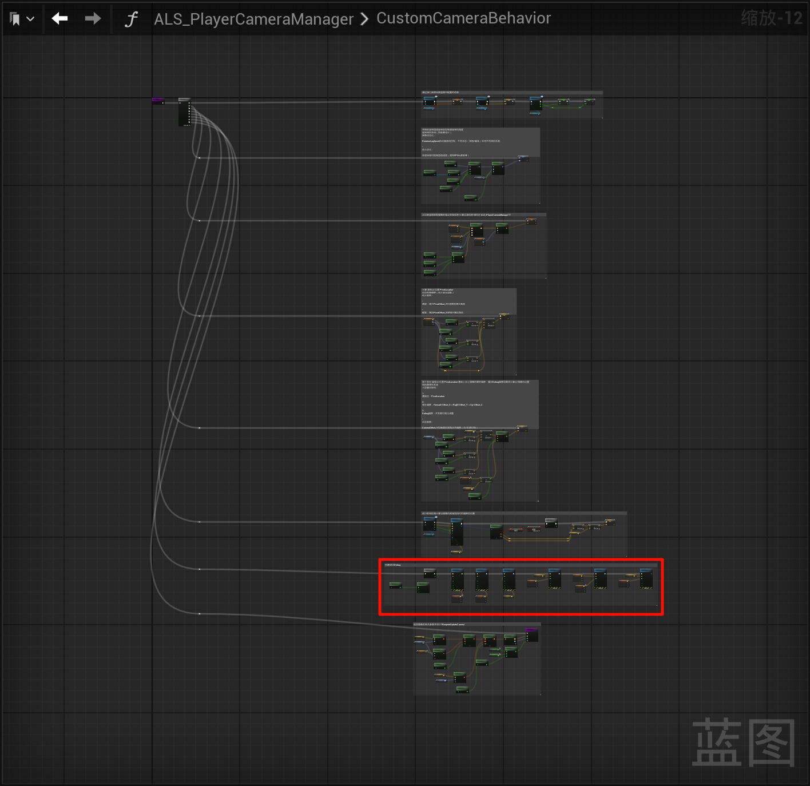
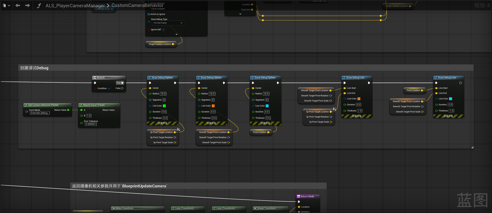
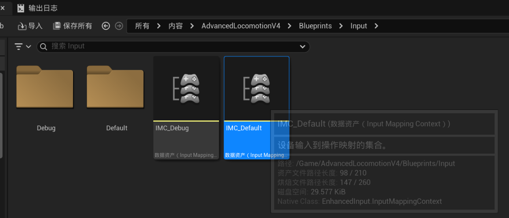
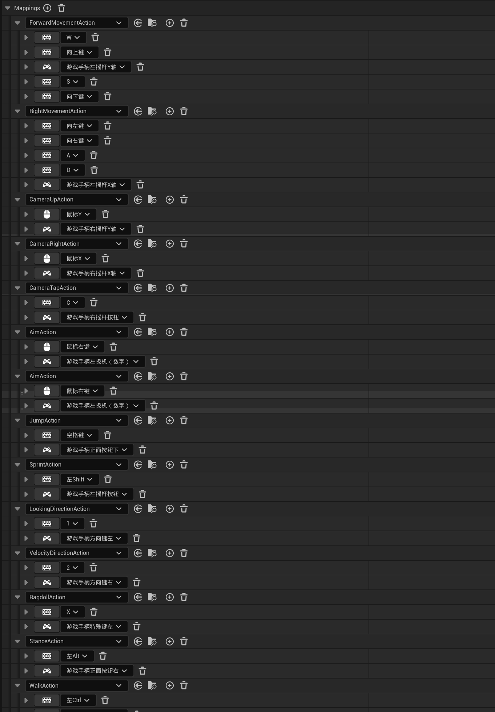
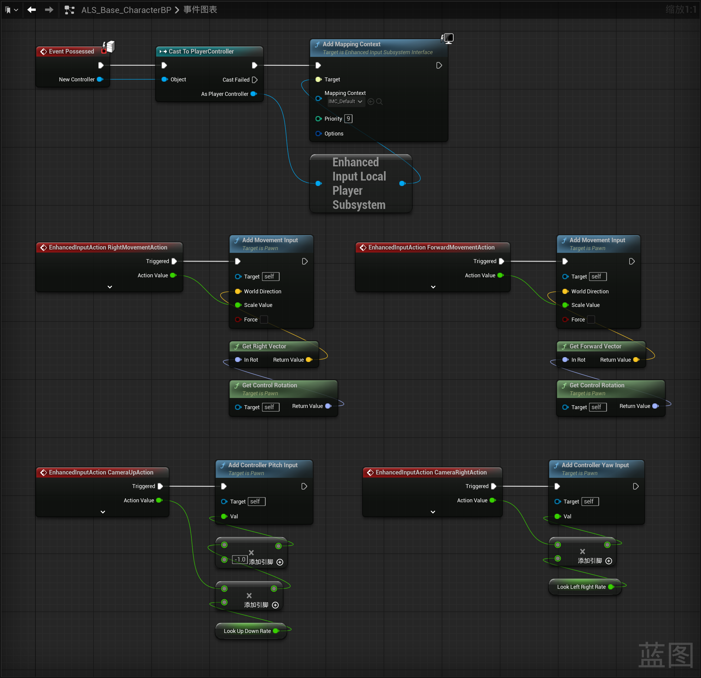

------

#### [返回菜单](../ALS_Menu.md)

------

# ALSv4复刻v005 创建调试Debug、输入映射、目前的摄像机系统分步骤解释

------

## 目录

[TOC]

------

视频链接

> [高级运动系统解耦和复刻第五期_哔哩哔哩_bilibili](https://www.bilibili.com/video/BV1ja41197XQ?spm_id_from=333.788.videopod.episodes&vd_source=9e1e64122d802b4f7ab37bd325a89e6c&p=8)

------

------

## 先创建调试Debug

------

## 接下来创建输入映射

我这里使用**增强输入**做了

插件版是有的

1. ALS_Base_CharacterBP中创建两个变量：
   - `float` 类型变量，命名为：`LookUpDownRate` = `1.25f`
   - `float` 类型变量，命名为：`LookLeftRightRate` = `1.25f`
2. 计算一下输入映射和旋转

------

## 目前效果gif

------

## 接下来我将目前所做的摄像机系统分步骤解释一下

### 1.TODO

------

[返回最上面](#返回菜单)

___________________________________________________________________________________________
