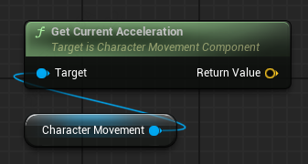
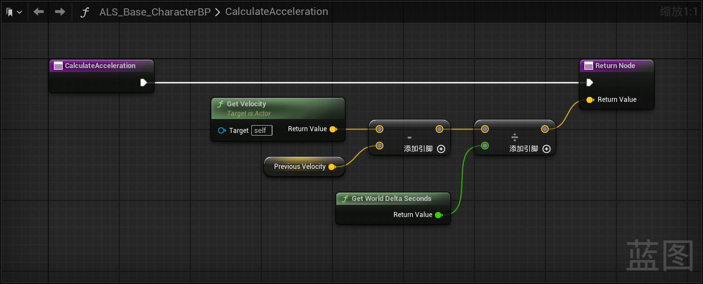
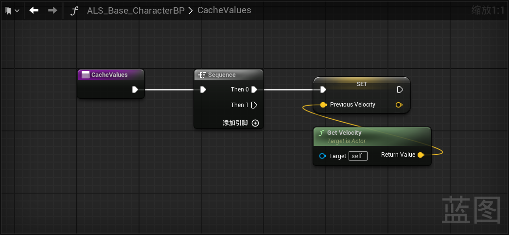
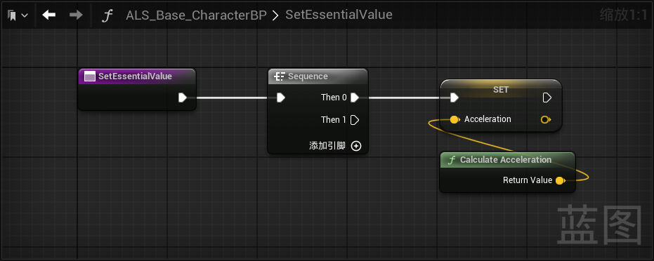
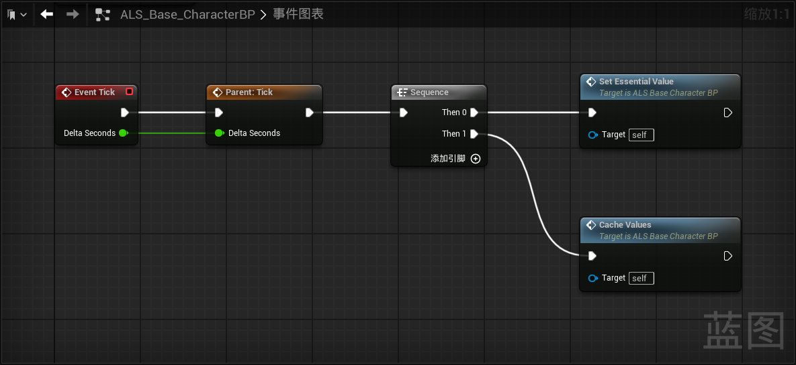
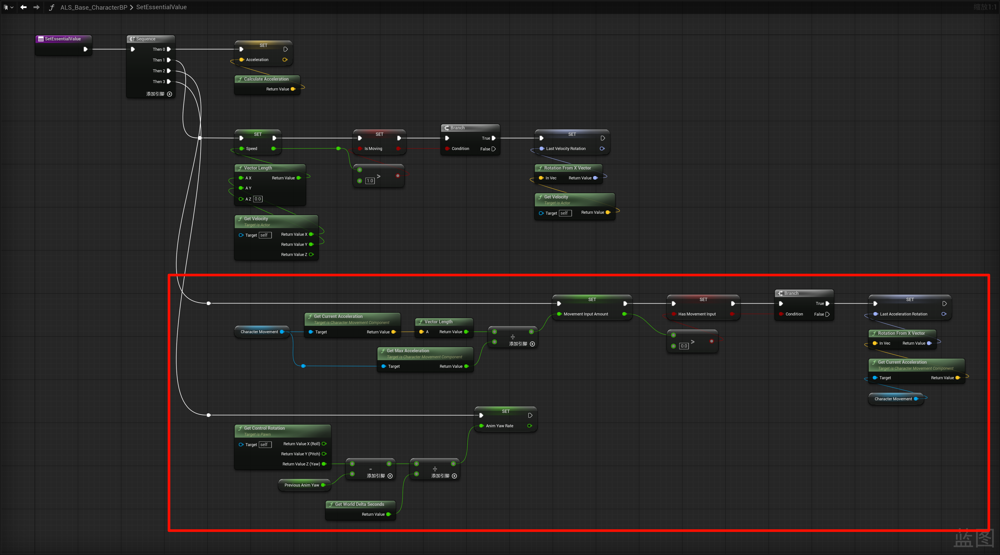
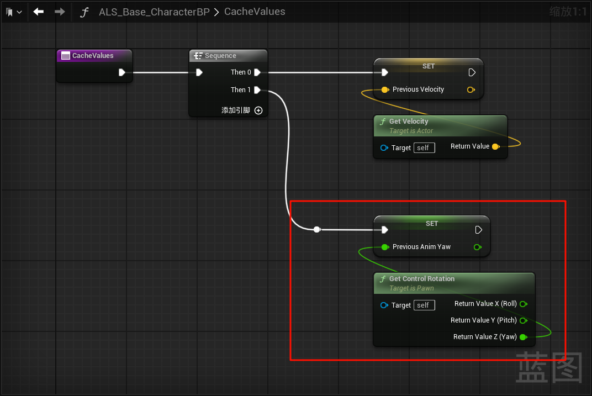

------

#### [返回菜单](../ALS_Menu.md)

------

# ALSv4复刻v006 玩家角色Tick中获取和计算状态信息

------

## 目录

- [ALSv4复刻v006 玩家角色Tick中获取和计算状态信息](#alsv4复刻v006-玩家角色tick中获取和计算状态信息)
	- [目录](#目录)
	- [角色基类`ALS_Base_CharacterBP`的Tick中获取玩家状态信息](#角色基类als_base_characterbp的tick中获取玩家状态信息)
		- [创建并在Tick中调用方法`SetEssentialValue`计算相关的参数](#创建并在tick中调用方法setessentialvalue计算相关的参数)
	- [在SetEssentialValue中计算速度、是否移动的布尔、上一次移动的速度角度](#在setessentialvalue中计算速度是否移动的布尔上一次移动的速度角度)
	- [将函数和变量按分类进行整理](#将函数和变量按分类进行整理)


------

<details>
<summary>视频链接</summary>

> [高级运动系统解耦和复刻第六期_哔哩哔哩_bilibili](https://www.bilibili.com/video/BV1ja41197XQ/?share_source=copy_web&vd_source=ccfefcf8d65f5d070c57cddf34c94047&p=9&spm_id_from=333.788.videopod.episodes)

------

</details>

------

## 角色基类`ALS_Base_CharacterBP`的Tick中获取玩家状态信息

### 创建并在Tick中调用方法`SetEssentialValue`计算相关的参数

`SetEssentialValue`中计算`加速度`

1. 创建Fvector类型变量，命名为：`Acceleration`(加速度)

<details>
<summary>关于为什么要自己计算加速度而不是使用虚幻官方的获取加速度的API：GetCurrentAcceleration</summary>

> 因为这个`API`获取的加速度是**骤变**的，
>
> 
>
> 假设最大加速度为`1500.f`这个在之前，修改过移动组件的默认值[链接](./ALSv4Reproduce_v002.md#修改移动组件配置)
>
> **骤变**的意思是：上一秒有输入状态一段时间下会变为`1500.f`，此时松手，会瞬间变为`0.f`，这是不符合常理的
>
> 感觉这个更像是输入映射的直观反映
>
> 我们来看一下5.5源码中这个API的计算方式`UCharacterMovementComponent::GetCurrentAcceleration`
>
> ```cpp
> // CharacterMovementComponent.cpp中
> 
> FVector UCharacterMovementComponent::GetCurrentAcceleration() const
> {
> 	return Acceleration;
> }
> 
> void UCharacterMovementComponent::ControlledCharacterMove(const FVector& InputVector, float DeltaSeconds)
> {
>  {
>     SCOPE_CYCLE_COUNTER(STAT_CharUpdateAcceleration);
> 
>     // We need to check the jump state before adjusting input acceleration, to minimize latency
>     // and to make sure acceleration respects our potentially new falling state.
>     CharacterOwner->CheckJumpInput(DeltaSeconds);
> 
>     // apply input to acceleration 在这里根据输入的比例计算加速度大小，所以猜得没错
>     Acceleration = ScaleInputAcceleration(ConstrainInputAcceleration(InputVector));
>     AnalogInputModifier = ComputeAnalogInputModifier();
>  }
> 
>  if (CharacterOwner->GetLocalRole() == ROLE_Authority)
>  {
>     PerformMovement(DeltaSeconds);
>  }
>  else if (CharacterOwner->GetLocalRole() == ROLE_AutonomousProxy && IsNetMode(NM_Client))
>  {
>     ReplicateMoveToServer(DeltaSeconds, Acceleration);
>  }
> }
> ```

------

</details>

2. 计算加速度（需要用：`(当前速度 - 上一帧的速度) / 经过的时间` ）
   - 创建方法，命名为`CalculateAcceleration`
   - 创建`FVector`类型变量，命名为：`PreviousVelocity`(上一帧的速度)
3. 新增方法`CacheValues`为`Acceleration`赋值




------

## 在SetEssentialValue中计算速度、是否移动的布尔、上一次移动的速度角度

1. 创建`float`类型变量，命名为：`Speed`(速度)
2. 创建`bool`类型变量，命名为：`IsMoving`(是否在移动)
3. 创建`FRotator`类型变量，命名为：`LastVelocityRotation`(上一个移动时的速度方向)
4. 若在移动，需要记录上一帧的速度方向`FRotator`
5. 创建`float`类型变量，命名为：`MovementInputAmount`(运动输入量)，使用当前加速度除以最大加速度计算
6. 创建`bool`类型变量，命名为：`HasMovementInput`(是否有移动输入)
7. 创建`FRotator`类型变量，命名为：`LastAccelerationRotation`(上一个移动时的加速度方向)
8. 创建`float`类型变量，命名为：`PreviousAnimYaw`(上一帧的Yaw轴旋转)
9. 创建`float`类型变量，命名为：`AnimYawRate`(当前帧的Yaw轴旋转速率)，上一帧的Yaw旋转减去这一帧的旋转再除以时间
10. 然后别忘了去`CacheValues`方法里面，更新`PreviousAnimYaw`(上一帧的Yaw轴旋转)



------

## 将函数和变量按分类进行整理

函数：

```
EssentialInformation
	SetEssentialValue
	CacheValues
	CalculateAcceleration
```


变量：

```cpp
// 基本信息
EssentialInformation
	FVector Acceleration
	bool IsMoving
	float MovementInputAmount
	bool HasMovementInput
	FRotator LastVelocityRotation
	FRotator LastAccelerationRotation
	float Speed
	float AnimYawRate
	
// 主要用于存储上一帧的信息
CachedVariables
	FVector PreviousVelocity
	float PreviousAnimYaw
```

------

[返回最上面](#返回菜单)

___________________________________________________________________________________________
