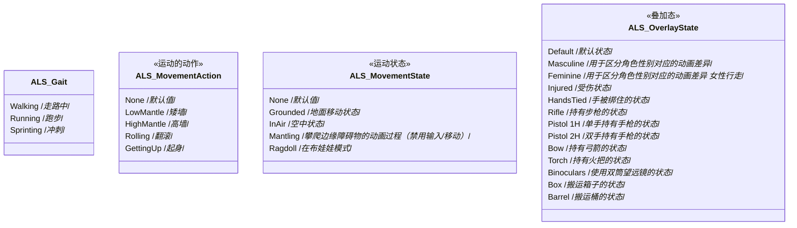
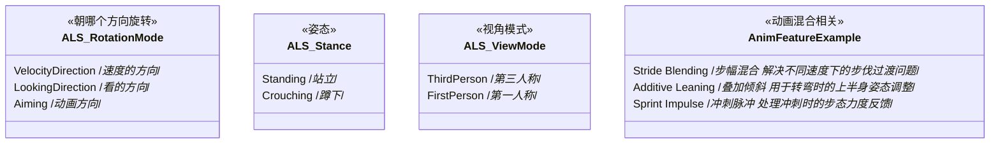
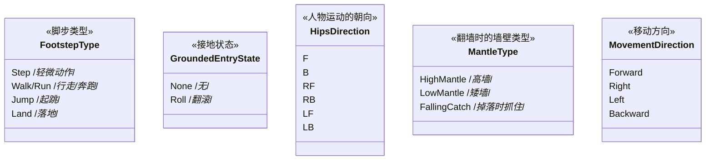

------

#### [返回菜单](../ALS_Menu.md)

------

# ALSv4复刻v007 标题

------

## 目录

[TOC]

------

<details>
<summary>视频链接</summary>

> [高级运动系统解耦和复刻第七期_哔哩哔哩_bilibili](https://www.bilibili.com/video/BV1ja41197XQ?share_source=copy_web&vd_source=ccfefcf8d65f5d070c57cddf34c94047&p=10&spm_id_from=333.788.videopod.episodes)

------

</details>

------

## 介绍一下所有的枚举和作用

```
/Data/Enums
```








------

## XXXXXXXXXXXXX

xxxxxxxxxxxxxxxxxxxxxxxx

------

## XXXXXXXXXXXXX

xxxxxxxxxxxxxxxxxxxxxxxx

------

## XXXXXXXXXXXXX

xxxxxxxxxxxxxxxxxxxxxxxx

------

## XXXXXXXXXXXXX

xxxxxxxxxxxxxxxxxxxxxxxx

------

## XXXXXXXXXXXXX

xxxxxxxxxxxxxxxxxxxxxxxx

------

## XXXXXXXXXXXXX

xxxxxxxxxxxxxxxxxxxxxxxx

------

## XXXXXXXXXXXXX

xxxxxxxxxxxxxxxxxxxxxxxx

------

## XXXXXXXXXXXXX

xxxxxxxxxxxxxxxxxxxxxxxx

------

## XXXXXXXXXXXXX

xxxxxxxxxxxxxxxxxxxxxxxx

------

## XXXXXXXXXXXXX

xxxxxxxxxxxxxxxxxxxxxxxx

------

## XXXXXXXXXXXXX

xxxxxxxxxxxxxxxxxxxxxxxx

------

## XXXXXXXXXXXXX

xxxxxxxxxxxxxxxxxxxxxxxx

------

## XXXXXXXXXXXXX

xxxxxxxxxxxxxxxxxxxxxxxx

------

## XXXXXXXXXXXXX

xxxxxxxxxxxxxxxxxxxxxxxx

------

## XXXXXXXXXXXXX

xxxxxxxxxxxxxxxxxxxxxxxx

------

## XXXXXXXXXXXXX

xxxxxxxxxxxxxxxxxxxxxxxx

------

## XXXXXXXXXXXXX

xxxxxxxxxxxxxxxxxxxxxxxx

------

XXXXXXXXXXXXX
------

[返回最上面](#返回菜单)

___________________________________________________________________________________________
