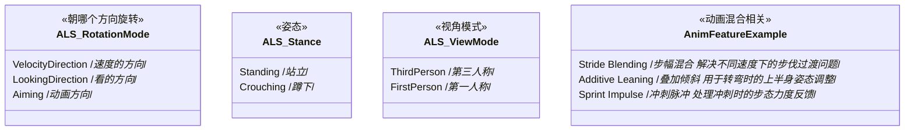
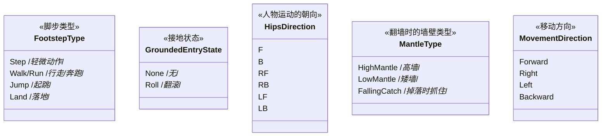
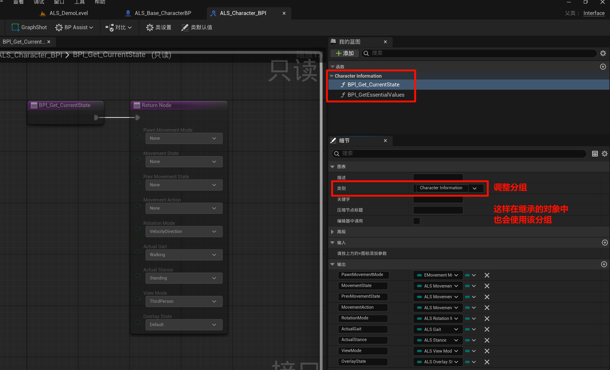
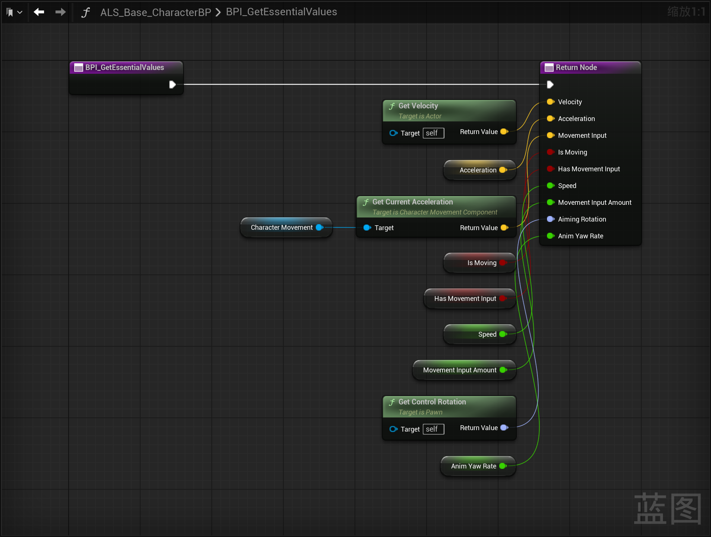
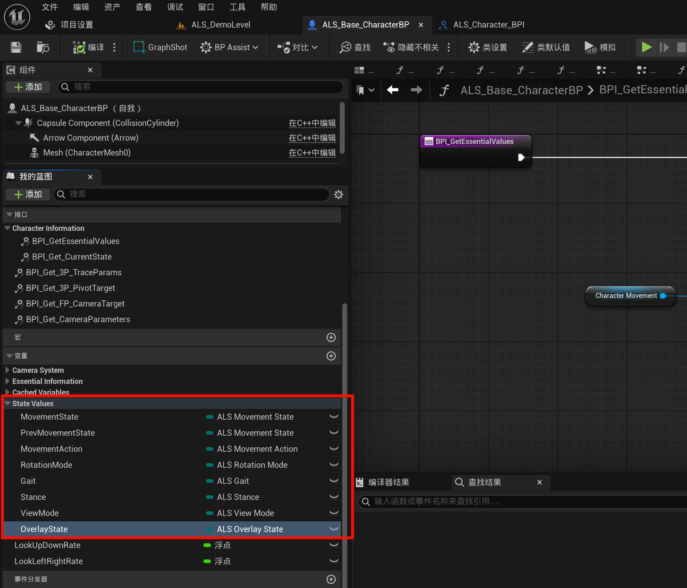
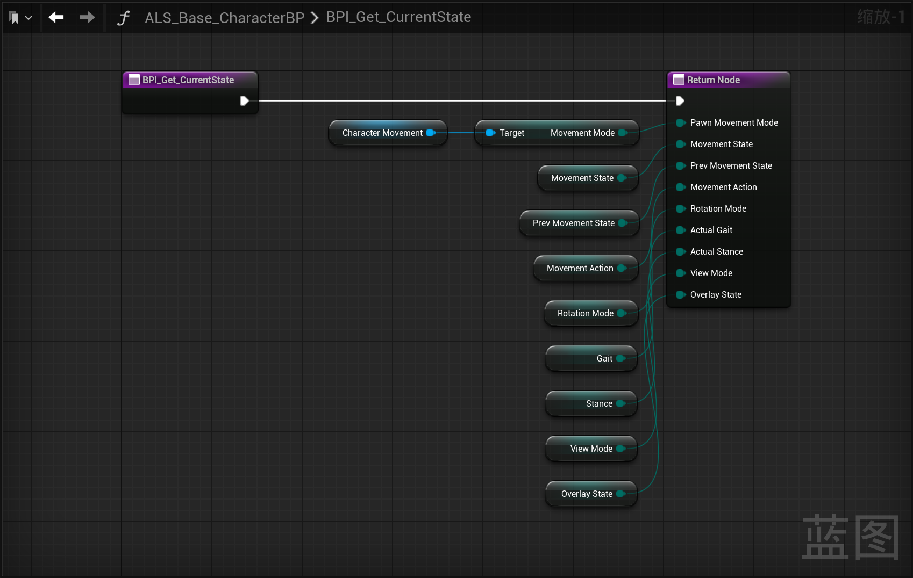
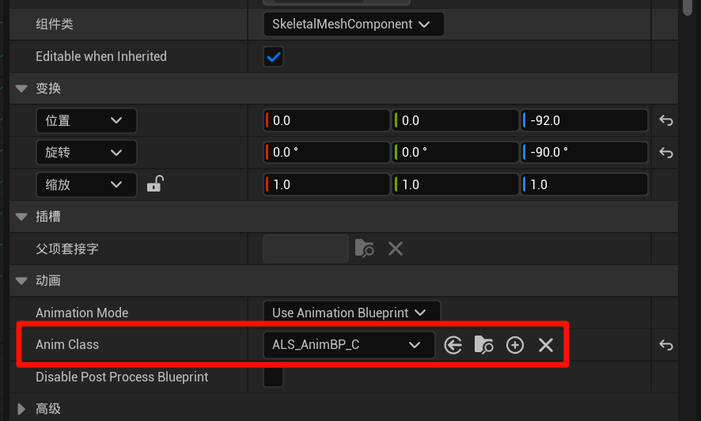
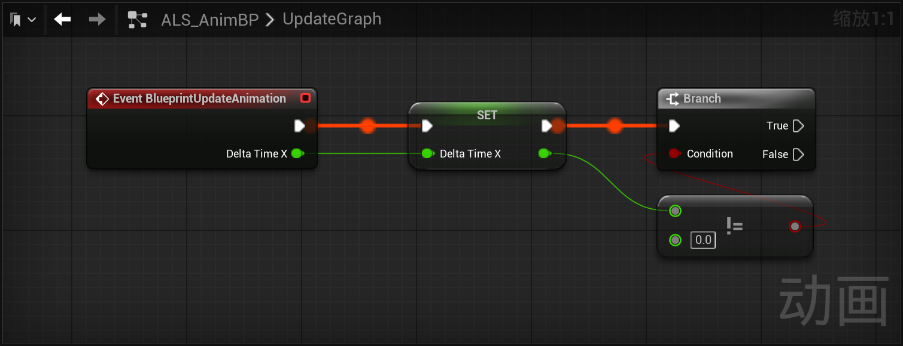
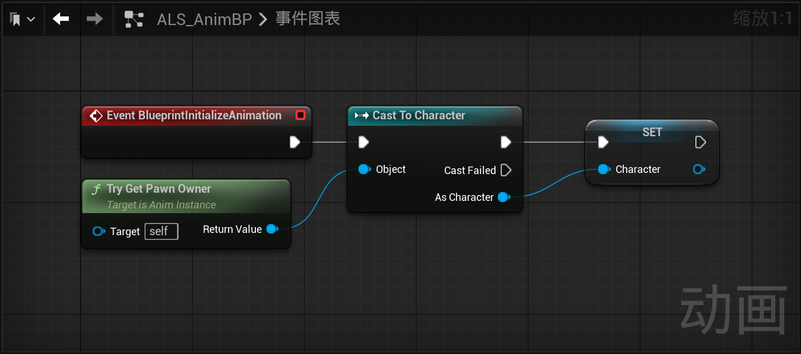
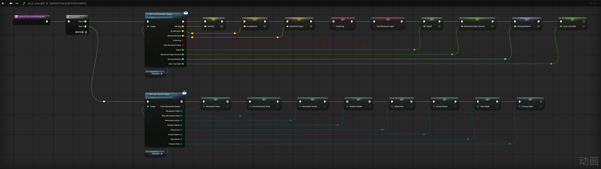

------

#### [返回菜单](../ALS_Menu.md)

------

# ALSv4复刻v007 简述项目枚举的作用；新建接口传递玩家BP数据和状态到玩家ABP

------

## 目录

- [ALSv4复刻v007 标题](#alsv4复刻v007-标题)
  - [目录](#目录)
  - [介绍一下所有的枚举和作用](#介绍一下所有的枚举和作用)
  - [新建接口`ALS_Character_BPI`](#新建接口als_character_bpi)
  - [玩家基类`ALS_Base_CharacterBP`中继承接口`ALS_Character_BPI`重写方法](#玩家基类als_base_characterbp中继承接口als_character_bpi重写方法)
    - [玩家基类`ALS_Base_CharacterBP`中创建枚举值变量](#玩家基类als_base_characterbp中创建枚举值变量)
  - [创建玩家动画蓝图](#创建玩家动画蓝图)
  - [玩家ABP中，创建新的事件图表](#玩家abp中创建新的事件图表)
  - [通过接口`ALS_Character_BPI`的API获取玩家BP数据并缓存为变量](#通过接口als_character_bpi的api获取玩家bp数据并缓存为变量)


------

<details>
<summary>视频链接</summary>

> [高级运动系统解耦和复刻第七期_哔哩哔哩_bilibili](https://www.bilibili.com/video/BV1ja41197XQ?share_source=copy_web&vd_source=ccfefcf8d65f5d070c57cddf34c94047&p=10&spm_id_from=333.788.videopod.episodes)

------

</details>

------

## 介绍一下所有的枚举和作用

```
/Data/Enums
```







------

## 新建接口`ALS_Character_BPI`

为了从`玩家BP`传递数据到`玩家ABP`

新增方法并调整分组为`CharacterInformation`：

1. `BPl_Get_CurrentState`，下面是**返回值**
   - `EMovementMode`类型变量，命名为：`PawnMovementMode`(移动模式)，移动组件中自带的
   - `ALS_MovementState`类型变量，命名为：`MovementState`
   - `ALS_MovementState`类型变量，命名为：`PrevMovementState`
   - `ALS_MovementAction`类型变量，命名为：`MovementAction`
   - `ALS_RotationMode`类型变量，命名为：`RotationMode`
   - `ALS_Gait`类型变量，命名为：`ActualGait`
   - `ALS_Stance`类型变量，命名为：`ActualStance`
   - `ALS_ViewMode`类型变量，命名为：`ViewMode`
   - `ALS_OverlayState`类型变量，命名为：`OverlayState`
2. `BPI_GetEssentialValues`
   - `FVector`类型变量，命名为：`Velocity`
   - `FVector`类型变量，命名为：`Acceleration`
   - `FVector`类型变量，命名为：`MovementInput`
   - `bool`类型变量，命名为：`IsMoving`
   - `bool`类型变量，命名为：`HasMovementInput`
   - `float`类型变量，命名为：`Speed`
   - `float`类型变量，命名为：`MovementInputAmount`
   - `FRotator`类型变量，命名为：`AimingRotation`
   - `float`类型变量，命名为：`AnimYawRate`



------

## 玩家基类`ALS_Base_CharacterBP`中继承接口`ALS_Character_BPI`重写方法



------

### 玩家基类`ALS_Base_CharacterBP`中创建枚举值变量

分组为`StateValues`

1. `ALS_MovementState`类型变量，命名为：`MovementState`
2. `ALS_MovementState`类型变量，命名为：`PrevMovementState`
3. `ALS_MovementAction`类型变量，命名为：`MovementAction`
4. `ALS_RotationMode`类型变量，命名为：`RotationMode`
5. `ALS_Gait`类型变量，命名为：`Gait`
6. `ALS_Stance`类型变量，命名为：`Stance`
7. `ALS_ViewMode`类型变量，命名为：`ViewMode`
8. `ALS_OverlayState`类型变量，命名为：`OverlayState`



------

## 创建玩家动画蓝图

路径：

```
/CharacterAssets/MannequinSkeleton/
```

1. 创建动画蓝图，命名为：`ALS_AnimBP`
2. 别忘了把动画蓝图赋给`ALS_Base_CharacterBP`中的`SkeletalMeshCompoennt`



------

## 玩家ABP中，创建新的事件图表

命名为：`UpdateGraph`

1. 将`BlueprintUpdateAnimation`的参数`DeltaTimeX`存为变量
2. ABP初始化时，缓存角色变量（`Character`类型就可以）
3. 新增方法`UpdateCharacterInformation`，用来获取在玩家BP那边计算的信息



------

## 通过接口`ALS_Character_BPI`的API获取玩家BP数据并缓存为变量



[返回最上面](#返回菜单)

___________________________________________________________________________________________
