------

#### [返回菜单](../ALS_Menu.md)

------

# ALSv4复刻v008 通过监听MovementMode更新玩家状态；新增跳跃状态并在执行后修改`MovementState`

------

## 目录

- [ALSv4复刻v008 通过监听MovementMode更新玩家状态；新增跳跃状态并在执行后修改`MovementState`](#alsv4复刻v008-通过监听movementmode更新玩家状态新增跳跃状态并在执行后修改movementstate)
  - [目录](#目录)
  - [通过`InputAction`触发跳跃](#通过inputaction触发跳跃)
    - [先这样连接](#先这样连接)
  - [重写`OnMovementModeChanged`方法](#重写onmovementmodechanged方法)
  - [`ALS_Character_BPI`中新建方法修改玩家BP中枚举状态](#als_character_bpi中新建方法修改玩家bp中枚举状态)
    - [重写的接口方法中其实是这样的逻辑（但是ALS的作者使用了通配符和宏抽象）](#重写的接口方法中其实是这样的逻辑但是als的作者使用了通配符和宏抽象)
  - [`OnMovementModeChanged`时，根据`MovementMode`状态，修改`MovementState`](#onmovementmodechanged时根据movementmode状态修改movementstate)
  - [在`蓝图宏库`中使用通配符和宏抽象赋值逻辑](#在蓝图宏库中使用通配符和宏抽象赋值逻辑)
    - [`ALS_MacroLibrary`中新建宏，命名为`ML_IsDifferentByte`](#als_macrolibrary中新建宏命名为ml_isdifferentbyte)
      - [上面的方法UE4可以用UE5就不太行了，因为字节好像API被移除了](#上面的方法ue4可以用ue5就不太行了因为字节好像api被移除了)
        - [所以解决方法就是不用通配符，改为使用字节类型Byte](#所以解决方法就是不用通配符改为使用字节类型byte)
    - [`ALS_MacroLibrary`中新建宏，命名为`ML_SetPreviousandNewValues`](#als_macrolibrary中新建宏命名为ml_setpreviousandnewvalues)
      - [使用引用修改`Set By-Ref Var`宏](#使用引用修改set-by-ref-var宏)
  - [使用`ML_SetPreviousandNewValues`修改值](#使用ml_setpreviousandnewvalues修改值)
  - [gif此时添加log运行跳跃测试状态`MovementState`切换](#gif此时添加log运行跳跃测试状态movementstate切换)
  - [状态切换的原因是：](#状态切换的原因是)


------

<details>
<summary>视频链接</summary>

> [高级运动系统解耦和复刻第八期_哔哩哔哩_bilibili](https://www.bilibili.com/video/BV1ja41197XQ/?spm_id_from=333.1391.0.0&p=11&vd_source=9e1e64122d802b4f7ab37bd325a89e6c)

------

</details>

------

## 通过`InputAction`触发跳跃

当然肯定是不能这么简单，需要加限制条件

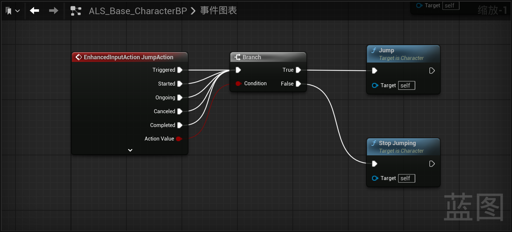

### 先这样连接

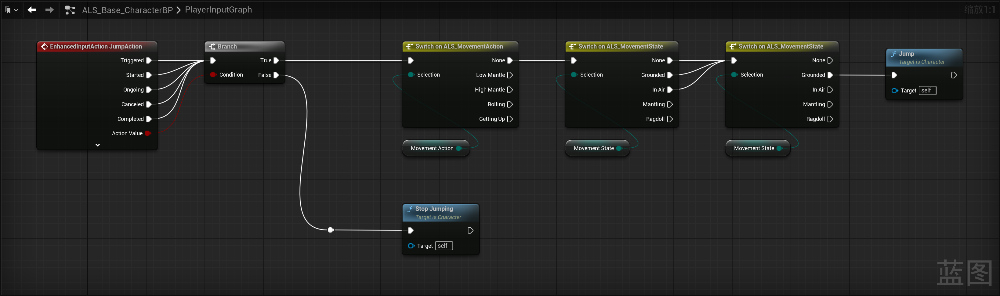

------

## 重写`OnMovementModeChanged`方法

当`NewMovementMode == Walking`状态时，需要修改`MovementState`为`Grounded`，但是ALS是通过接口来设置的，所以需要新增方法

------

## `ALS_Character_BPI`中新建方法修改玩家BP中枚举状态

**下面新增的接口方法，分组为`CharacterState`**

1. 新增接口方法：`BPI_SetMovementState`
   - 传入`ALS_MovementState`类型变量，命名为：`NewMovementState`
2. 新增接口方法：`BPI_SetMovementAction`
   - 传入`ALS_MovementAction`类型变量，命名为：`NewMovementAction`
3. 新增接口方法：`BPI_SetRotationMode`
   - 传入`ALS_RotationMode`类型变量，命名为：`NewRotationMode`
4. 新增接口方法：`BPI_SetGait`
   - 传入`ALS_Gait`类型变量，命名为：`NewGait`
5. 新增接口方法：`BPI_SetViewMode`
   - 传入`ALS_ViewMode`类型变量，命名为：`NewViewMode`
6. 新增接口方法：`BPI_SetOverlayState`
   - 传入`ALS_OverlayState`类型变量，命名为：`NewOverlayState`
7. 角色基类`ALS_Base_CharacterBP`中重写刚创建的接口方法

### 重写的接口方法中其实是这样的逻辑（但是ALS的作者使用了通配符和宏抽象）

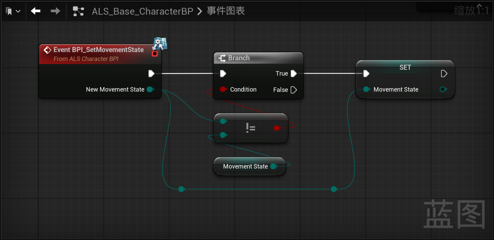

------

## `OnMovementModeChanged`时，根据`MovementMode`状态，修改`MovementState`

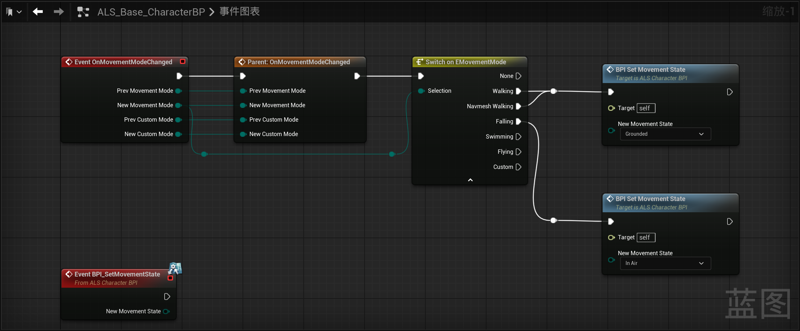

------

## 在`蓝图宏库`中使用通配符和宏抽象赋值逻辑

在这个路径下，创建蓝图宏库，继承自`UObject`，命名为：`ALS_MacroLibrary`

```
/Blueprints/Librarys/
```

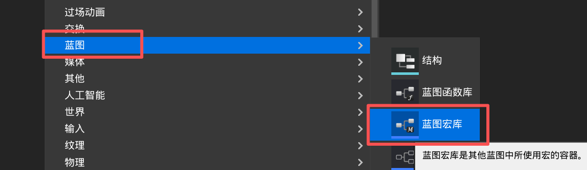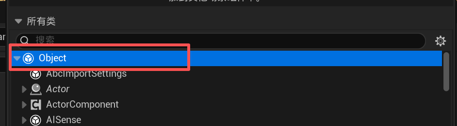


### `ALS_MacroLibrary`中新建宏，命名为`ML_IsDifferentByte`

逻辑为：

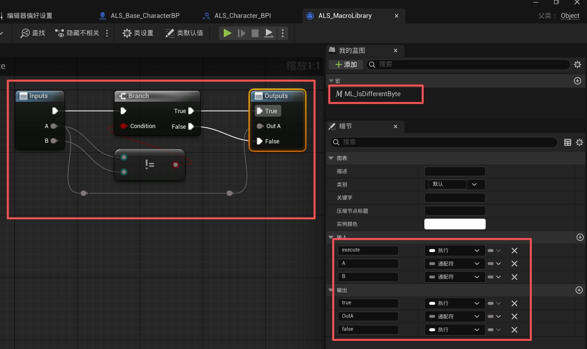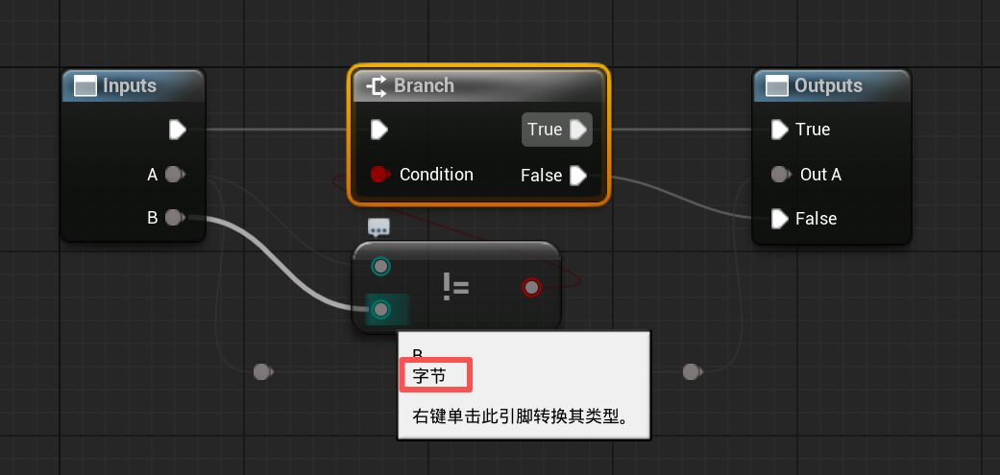


#### 上面的方法UE4可以用UE5就不太行了，因为字节好像API被移除了

##### 所以解决方法就是不用通配符，改为使用字节类型Byte

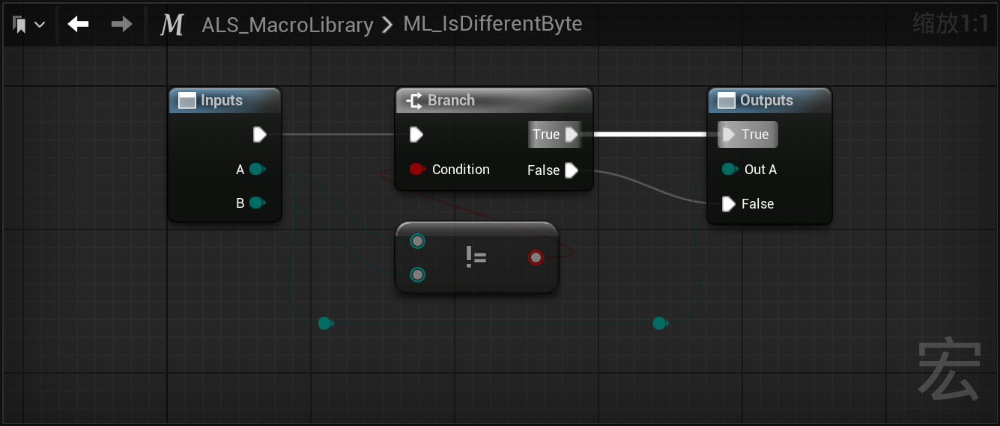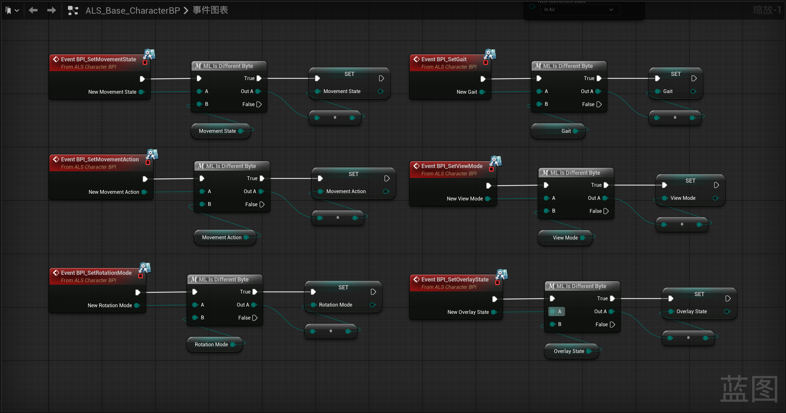

------

### `ALS_MacroLibrary`中新建宏，命名为`ML_SetPreviousandNewValues`

#### 使用引用修改`Set By-Ref Var`宏

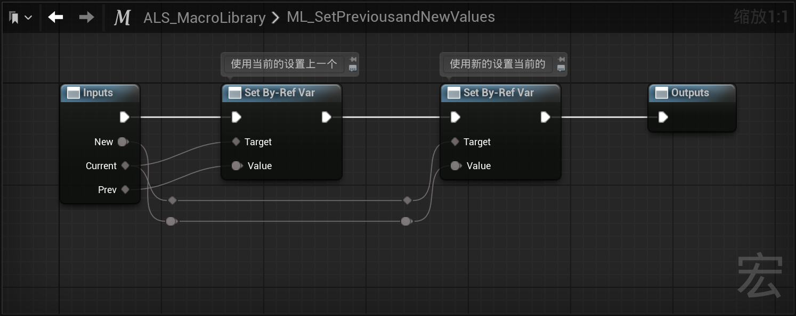

------

## 使用`ML_SetPreviousandNewValues`修改值

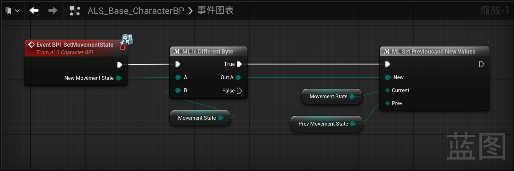

------

## gif此时添加log运行跳跃测试状态`MovementState`切换


------

## 状态切换的原因是：

落地会在`UCharacterMovementComponent::PhysFalling`中触发修改逻辑

->`Processlanded`

->`SetPostLandedPhysics`中调用`SetMovementMode`修改`MovementMode`

[之前在这里监听了CharacterMovementComponent中的MovementMode修改](#onmovementmodechanged时根据movementmode状态修改movementstate)，所以修改`MovementMode`会导致`MovementState`的修改

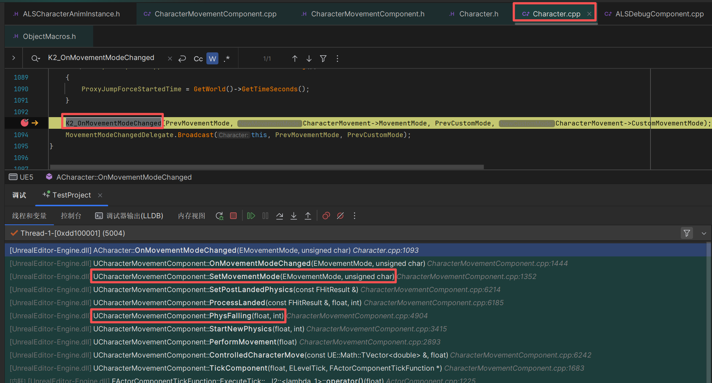

[返回最上面](#返回菜单)

___________________________________________________________________________________________
