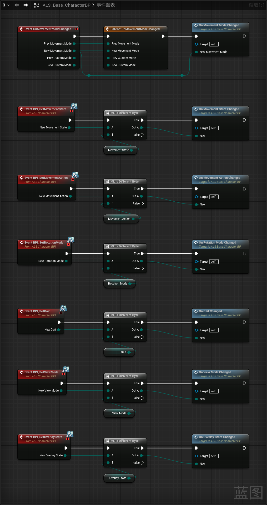
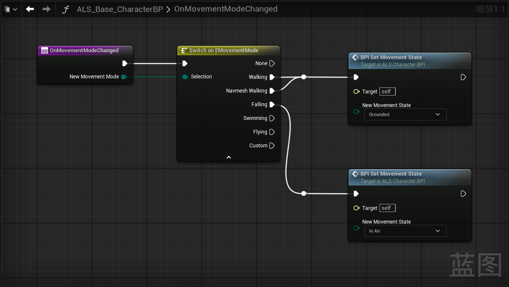
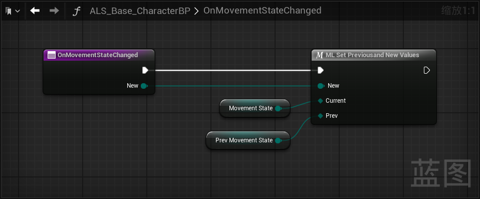
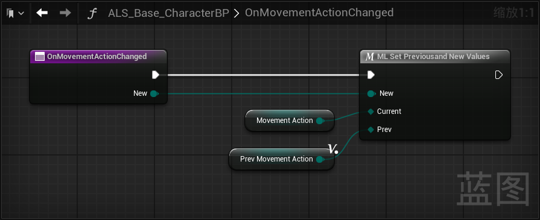
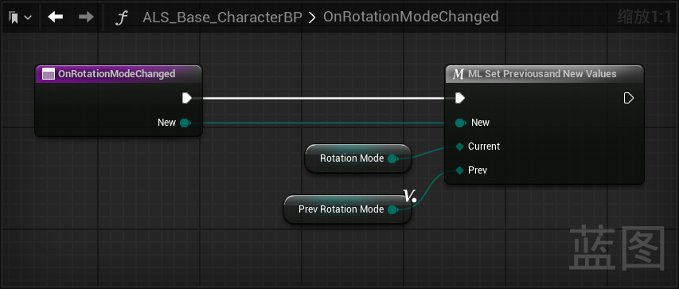
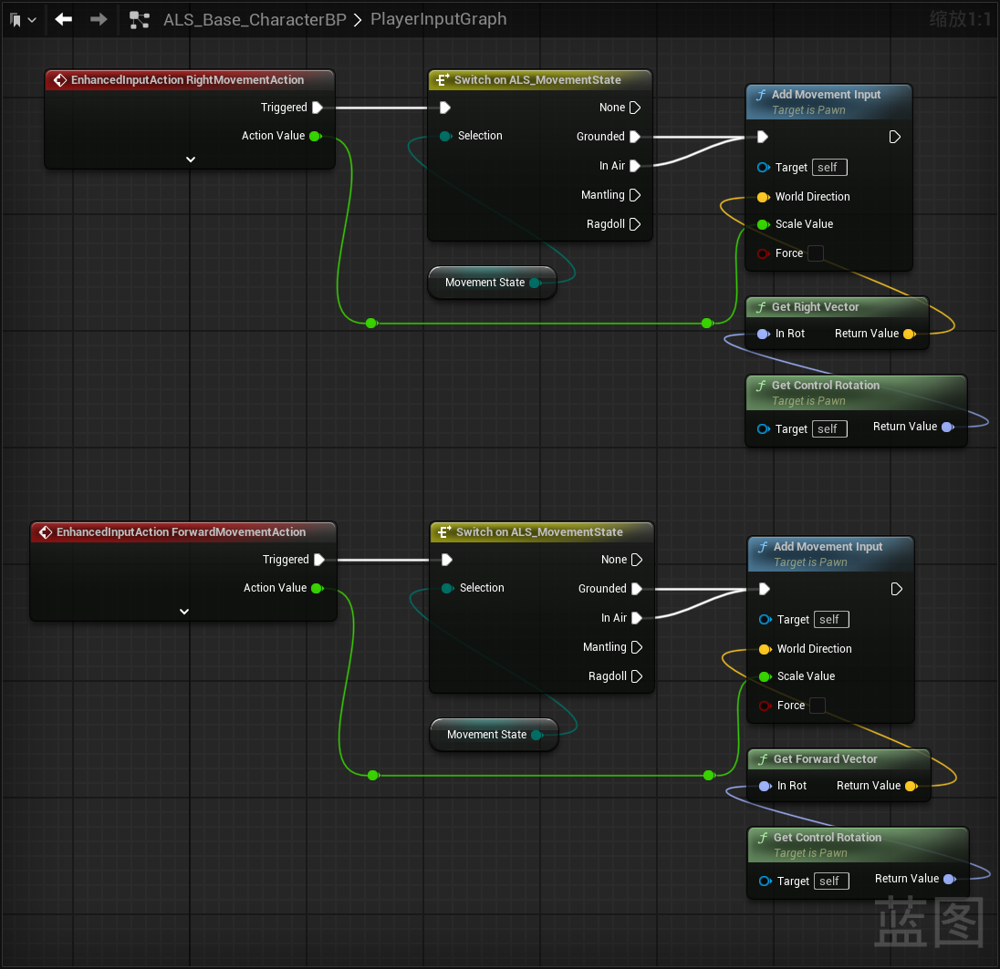

------

#### [返回菜单](../ALS_Menu.md)

------

# ALSv4复刻v009 当状态修改时，更新枚举；使用枚举限制玩家输入

------

## 目录

- [ALSv4复刻v009 当状态修改时，更新枚举；使用枚举限制玩家输入](#alsv4复刻v009-当状态修改时更新枚举使用枚举限制玩家输入)
  - [目录](#目录)
  - [这些方法都需要修改](#这些方法都需要修改)
    - [创建方法：(分组为`StateChanged`)](#创建方法分组为statechanged)
  - [使用枚举限制玩家输入的条件](#使用枚举限制玩家输入的条件)
  - [接下来作为蒙太奇和状态机的初步讲解，已了解的可以跳过](#接下来作为蒙太奇和状态机的初步讲解已了解的可以跳过)

------

视频链接

> [高级运动系统解耦和复刻第九期_哔哩哔哩_bilibili](https://www.bilibili.com/video/BV1ja41197XQ?spm_id_from=333.788.videopod.episodes&vd_source=9e1e64122d802b4f7ab37bd325a89e6c&p=12)

------

------

## 这些方法都需要修改

1. `BPI_SetMovementState`
2. `BPI_SetMovementAction`
3. `BPI_SetRotationMode`
4. `BPI_SetGait`
5. `BPI_SetViewMode`
6. `BPI_SetOverlayState`

### 创建方法：(分组为`StateChanged`)

1. `OnMovementModeChanged`
2. `OnMovementStateChanged`
3. `OnMovementActionChanged`
4. `OnRotationModeChanged`
5. `OnGaitChanged`
6. `OnViewModeChanged`
7. `OnOverlayStateChanged`

后面依此类推我就不放图了，有上一帧数据的，传上一帧数据引用修改，没有就在方法内创建临时变量接一下

------

## 使用枚举限制玩家输入的条件

`MovementState`

------

接下来作为蒙太奇和状态机的初步讲解，已了解的可以跳过
------

[返回最上面](#返回菜单)

___________________________________________________________________________________________
