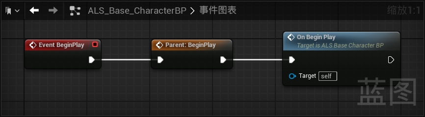

------

#### [返回菜单](../ALS_Menu.md)

------

# ALSv4复刻v010 准备使用表格`MovementModelTable`

------

## 目录

- [ALSv4复刻v010 准备使用表格`MovementModelTable`](#alsv4复刻v010-准备使用表格movementmodeltable)
	- [目录](#目录)
	- [接下来开始复刻6向状态机](#接下来开始复刻6向状态机)
	- [准备使用表格`MovementModelTable`](#准备使用表格movementmodeltable)
	- [角色基类中新增方法`OnBeginPlay`](#角色基类中新增方法onbeginplay)


------

<details>
<summary>视频链接</summary>

> [高级运动系统解耦和复刻第十期_哔哩哔哩_bilibili](https://www.bilibili.com/video/BV1ja41197XQ?share_source=copy_web&vd_source=ccfefcf8d65f5d070c57cddf34c94047&spm_id_from=333.788.videopod.episodes&p=13)

------

</details>

------

## 接下来开始复刻6向状态机

这一期的时间都在创建表格和数据，就是下面这个，我就不创建了，了解就行

------

## 准备使用表格`MovementModelTable`

结构体在这里：`/Data/Structs/MovementSettings_State`

表格在这里：`/Data/DataTables/MovementModelTable`

`MovementSettings_State`中其实是嵌套的结构体，结构如下：

```cpp
MovementSettings_State
	MovementSettings_Stance 类型结构体：VelocityDirection
		MovementSettings 类型结构体：Standing
		MovementSettings 类型结构体：Crouching
	MovementSettings_Stance 类型结构体：LookingDirection
		MovementSettings 类型结构体：Standing
		MovementSettings 类型结构体：Crouching
	MovementSettings_Stance 类型结构体：Aiming
		MovementSettings 类型结构体：Standing
		MovementSettings 类型结构体：Crouching
```

```CPP
MovementSettings中包含了：
	float 类型变量：WalkSpeed
	float 类型变量：RunSpeed
	float 类型变量：SprintSpeed
	UCurveVector 类型变量：MovementCurve
	UCurveVector 类型变量：RotationRateCurve
```

------

## 角色基类中新增方法`OnBeginPlay`

`ALS_Base_CharacterBP`中`BeginPlay`时调用

别忘了调用Super执行Cpp代码



[返回最上面](#返回菜单)

___________________________________________________________________________________________
