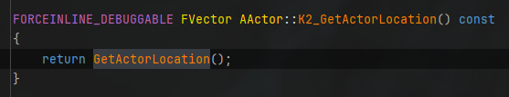
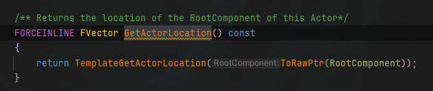
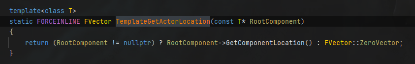
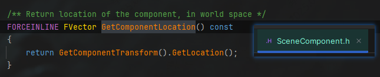
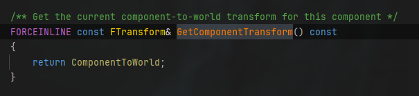
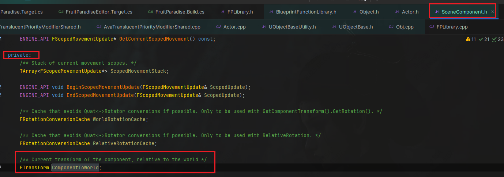

------

###### [返回菜单](../ZhiHu_UE_Core_Menu.md)

------

# 《InsideUE4》GamePlay架构（一）Actor和Component

------

## 目录

[TOC]

------

<details>
<summary>链接</summary>

> [《InsideUE4》GamePlay架构（一）Actor和Component - 知乎](https://zhuanlan.zhihu.com/p/22833151)

------

</details>

------

### **思考：为何Actor不像GameObject一样自带Transform？**

> 我们知道，如果一个对象需要在3D世界中表示，那么它必然要携带一个Transform matrix来表示其位置。关键在于，在UE看来，Actor并不只是3D中的“表示”，一些不在世界里展示的“不可见对象”也可以是Actor，如AInfo(派生类AWorldSetting,AGameMode,AGameSession,APlayerState,AGameState等)，AHUD,APlayerCameraManager等，代表了这个世界的某种信息、状态、规则。你可以把这些看作都是一个个默默工作的灵体Actor。所以，Actor的概念在UE里其实不是某种具象化的3D世界里的对象，而是世界里的种种元素，用更泛化抽象的概念来看，小到一个个地上的石头，大到整个世界的运行规则，都是Actor.
> 当然，你也可以说即使带着Transform，把坐标设置为原点，然后不可见不就行了？这样其实当然也是可以，不过可能因为UE跟贴近C++一些的缘故，所以设计哲学上就更偏向于C++的哲学“不为你不需要的东西付代价”。一个Transform再加上附带的逆矩阵之类的表示，内存占用上其实也是挺可观的。要知道UE可是会抠门到连bool变量都要写成uint bPending:1;位域来节省一个字节的内存的。
> 换一个角度讲，如果把带Transform也当成一个Actor的额外能力可以自由装卸的话，那其实也可以自圆其说。经过了UE的权衡和考虑，把Transform封装进了SceneComponent,当作RootComponent。但在权衡到使用的便利性的时候，大部分Actor其实是有Transform的，我们会经常获取设置它的坐标，如果总是得先获取一下SceneComponent，然后再调用相应接口的话，那也太繁琐了。所以UE也为了我们直接提供了一些便利性的Actor方法，如(Get/Set)ActorLocation等，其实内部都是转发到RootComponent。
>
> 
>
> ```cpp
> // Actor.h
> FORCEINLINE_DEBUGGABLE FVector AActor::K2_GetActorLocation() const
> {
>  return GetActorLocation();
> }
> 
> FORCEINLINE FVector GetActorLocation() const
> {
> 	return TemplateGetActorLocation(ToRawPtr(RootComponent));
> }
> 
> template<class T>
> static FORCEINLINE FVector TemplateGetActorLocation(const T* RootComponent)
> {
> 	return (RootComponent != nullptr) ? RootComponent->GetComponentLocation() : FVector::ZeroVector;
> }
> 
> // SceneComponent.h
> 
> private:
> 	/** Current transform of the component, relative to the world */
> 	FTransform ComponentToWorld;
> 
> /** Return location of the component, in world space */
> FORCEINLINE FVector GetComponentLocation() const
> {
> 	return GetComponentTransform().GetLocation();
> }
> 
> /** Get the current component-to-world transform for this component */
> FORCEINLINE const FTransform& GetComponentTransform() const
> {
> 	return ComponentToWorld;
> }
> ```
>
> ```cpp
> // Actor.h
> 
> protected:
> 	/** The component that defines the transform (location, rotation, scale) of this Actor in the world, all other components must be attached to this one somehow */
> 	UPROPERTY(BlueprintGetter=K2_GetRootComponent, Category="Transformation")
> 	TObjectPtr<USceneComponent> RootComponent;
> 
> UFUNCTION(BlueprintCallable, meta=(DisplayName = "Set Actor Location", ScriptName = "SetActorLocation", Keywords="position"), Category="Transformation")
> ENGINE_API bool K2_SetActorLocation(FVector NewLocation, bool bSweep, FHitResult& SweepHitResult, bool bTeleport);
> 
> bool AActor::K2_SetActorLocation(FVector NewLocation, bool bSweep, FHitResult& SweepHitResult, bool bTeleport)
> {
>  return SetActorLocation(NewLocation, bSweep, (bSweep ? &SweepHitResult : nullptr), TeleportFlagToEnum(bTeleport));
> }
> 
> bool AActor::SetActorLocation(const FVector& NewLocation, bool bSweep, FHitResult* OutSweepHitResult, ETeleportType Teleport)
> {
> 	if (RootComponent)
> 	{
> 		const FVector Delta = NewLocation - GetActorLocation();
> 		return RootComponent->MoveComponent(Delta, GetActorQuat(), bSweep, OutSweepHitResult, MOVECOMP_NoFlags, Teleport);
> 	}
> 	else if (OutSweepHitResult)
> 	{
> 		*OutSweepHitResult = FHitResult();
> 	}
> 
> 	return false;
> }
> 
> ENGINE_API bool MoveComponent( const FVector& Delta, const FQuat& NewRotation,    bool bSweep, FHitResult* Hit=NULL, EMoveComponentFlags MoveFlags = MOVECOMP_NoFlags, ETeleportType Teleport = ETeleportType::None);
> 
> FORCEINLINE_DEBUGGABLE bool USceneComponent::MoveComponent(const FVector& Delta, const FQuat& NewRotation, bool bSweep, FHitResult* Hit, EMoveComponentFlags MoveFlags, ETeleportType Teleport)
> {
> 	return MoveComponentImpl(Delta, NewRotation, bSweep, Hit, MoveFlags, Teleport);
> }
> 
> ENGINE_API bool MoveComponent( const FVector& Delta, const FRotator& NewRotation, bool bSweep, FHitResult* Hit=NULL, EMoveComponentFlags MoveFlags = MOVECOMP_NoFlags, ETeleportType Teleport = ETeleportType::None);
> 
> // FRotator version. This could be a simple wrapper to the FQuat version, but in the case of no significant change in location or rotation (as FRotator),
> // we avoid passing through to the FQuat version because conversion can generate a false negative for the rotation equality comparison done using a strict tolerance.
> bool USceneComponent::MoveComponent(const FVector& Delta, const FRotator& NewRotation, bool bSweep, FHitResult* Hit, EMoveComponentFlags MoveFlags, ETeleportType Teleport)
> {
> 	if (GetAttachParent() == nullptr)
> 	{
> 		if (Delta.IsZero() && NewRotation.Equals(GetRelativeRotation(), SCENECOMPONENT_ROTATOR_TOLERANCE))
> 		{
> 			if (Hit)
> 			{
> 				Hit->Init();
> 			}
> 			return true;
> 		}
> 
> 		return MoveComponentImpl(Delta, RelativeRotationCache.RotatorToQuat_ReadOnly(NewRotation), bSweep, Hit, MoveFlags, Teleport);
> 	}
> 
> 	return MoveComponentImpl(Delta, NewRotation.Quaternion(), bSweep, Hit, MoveFlags, Teleport);
> }
> 
> // 
> /** Comparison tolerance for checking if two FRotators are the same when moving SceneComponents. */
> #define SCENECOMPONENT_ROTATOR_TOLERANCE	(1.e-4f) 
> ```
>
> ```cpp
> bool USceneComponent::MoveComponentImpl(const FVector& Delta, const FQuat& NewRotation, bool bSweep, FHitResult* OutHit, EMoveComponentFlags MoveFlags, ETeleportType Teleport)
> {
>     SCOPE_CYCLE_COUNTER(STAT_MoveComponentSceneComponentTime);
> 
>     // static things can move before they are registered (e.g. immediately after streaming), but not after.
>     if (!IsValid(this) || CheckStaticMobilityAndWarn(SceneComponentStatics::MobilityWarnText))
>     {
>        if (OutHit)
>        {
>           *OutHit = FHitResult();
>        }
>        return false;
>     }
> 
>     // Fill in optional output param. SceneComponent doesn't sweep, so this is just an empty result.
>     if (OutHit)
>     {
>        *OutHit = FHitResult(1.f);
>     }
> 
>     ConditionalUpdateComponentToWorld();
> 
>     // early out for zero case
>     if( Delta.IsZero() )
>     {
>        // Skip if no vector or rotation.
>        if (NewRotation.Equals(GetComponentTransform().GetRotation(), SCENECOMPONENT_QUAT_TOLERANCE))
>        {
>           return true;
>        }
>     }
> 
>     // just teleport, sweep is supported for PrimitiveComponents. This will update child components as well.
>     const bool bMoved = InternalSetWorldLocationAndRotation(GetComponentLocation() + Delta, NewRotation, false, Teleport);
> 
>     // Only update overlaps if not deferring updates within a scope
>     if (bMoved && !IsDeferringMovementUpdates())
>     {
>        // need to update overlap detection in case PrimitiveComponents are attached.
>        UpdateOverlaps();
>     }
> 
>     return true;
> }
> 
> bool USceneComponent::CheckStaticMobilityAndWarn(const FText& ActionText) const
> {
> 	// make sure mobility is movable, otherwise you shouldn't try to move
> 	if (Mobility != EComponentMobility::Movable && IsRegistered())
> 	{
> 		if (UWorld * World = GetWorld())
> 		{
> 			if (World->IsGameWorld() && World->bIsWorldInitialized && !IsOwnerRunningUserConstructionScript())
> 			{
> 				AActor* MyOwner = GetOwner();
> 				if (MyOwner && MyOwner->IsActorInitialized())
> 				{
> #if !(UE_BUILD_SHIPPING || UE_BUILD_TEST)
> 					FMessageLog("PIE").Warning(FText::Format(LOCTEXT("InvalidMustBeMovable", "Mobility of {0} : {1} has to be 'Movable' if you'd like to {2}. "),
> 						FText::FromString(GetPathNameSafe(GetOwner())), FText::FromString(GetName()), ActionText));
> #endif
> 					return true;
> 				}
> 			}
> 		}
> 	}
> 
> 	return false;
> }
> ```
>
> 在虚幻引擎中，组件的注册(Register)是组件生命周期中的一个重要阶段。注册是指组件被添加到游戏世界中的过程，在这个过程中，引擎会为组件分配必要的资源，将其纳入场景管理，并使其开始参与游戏逻辑。

------

### XXXXXXXXXXXXX

> xxxxxxxxxxxxxxxxxxxxxxxx

------

### XXXXXXXXXXXXX

> xxxxxxxxxxxxxxxxxxxxxxxx

------

### XXXXXXXXXXXXX

> xxxxxxxxxxxxxxxxxxxxxxxx

------

### XXXXXXXXXXXXX

> xxxxxxxxxxxxxxxxxxxxxxxx

------

### XXXXXXXXXXXXX

> xxxxxxxxxxxxxxxxxxxxxxxx

------

XXXXXXXXXXXXX
___________________________________________________________________________________________

### 参考文档：

- 介绍：

  xxxxxxxxxxxxxxxxxxx

- 使用：

  xxxxxxxxxxxxxxxxxxx

- 原理解析：

  xxxxxxxxxxxxxxxxxxx

------

[返回最上面](#返回菜单)

___________________________________________________________________________________________
