___________________________________________________________________________________________

### [Go主菜单](../MainMenu.md)
___________________________________________________________________________________________

# GAS 010 AttributeSet中限制HP/MP最大最小值:创建药水的表格
___________________________________________________________________________________________
## 处理关键点
1. `AuraAttributeSet`中重写虚函数`PreAttributeChange`(属性更改前 预处理)限制属性最大最小值
2. 了解属性更改后 **处理虚函数** `PostGameplayEffectExecute`
3. 实参 `Data` ,几乎能拿到所有信息
4. **给GE数值配表**
___________________________________________________________________________________________

# 目录
- [GAS 010 AttributeSet中限制HP/MP最大最小值:创建药水的表格](#gas-010-attributeset中限制hpmp最大最小值创建药水的表格)
  - [处理关键点](#处理关键点)
- [目录](#目录)
    - [修改属性 两种方法](#修改属性-两种方法)
      - [1. 属性更改前 预处理](#1-属性更改前-预处理)
        - [在 UAuraAttributeSet 中重写虚函数 `PreAttributeChange` (属性更改前 预处理) 限制属性最大最小值](#在-uauraattributeset-中重写虚函数-preattributechange-属性更改前-预处理-限制属性最大最小值)
      - [2. 属性更改后触发(这里只做了解用,这一步不写逻辑)](#2-属性更改后触发这里只做了解用这一步不写逻辑)
        - [在 UAuraAttributeSet 中重写虚函数 `PostGameplayEffectExecute` (属性更改后触发) 限制属性最大最小值](#在-uauraattributeset-中重写虚函数-postgameplayeffectexecute-属性更改后触发-限制属性最大最小值)
        - [这个函数的参数Data非常强大,几乎能拿到所有信息](#这个函数的参数data非常强大几乎能拿到所有信息)
    - [新建一个函数和结构体 , 保存 属性更改后,从PostGameplayEffectExecute函数的参数 Data 获得的,有用的 信息](#新建一个函数和结构体--保存-属性更改后从postgameplayeffectexecute函数的参数-data-获得的有用的-信息)
      - [头文件](#头文件)
        - [创建结构体](#创建结构体)
        - [创建函数](#创建函数)
      - [源文件](#源文件)
    - [创建药水的表格](#创建药水的表格)
      - [创建药水的表格](#创建药水的表格-1)
      - [配置表格](#配置表格)
      - [测试一下,此时拾取药水,恢复5HP,说明配置表格成功](#测试一下此时拾取药水恢复5hp说明配置表格成功)
      - [为 AAuraEffectActor 添加 物品等级(影响应用效果)](#为-aauraeffectactor-添加-物品等级影响应用效果)
      - [此物品等级可以为float！！！比如4.75](#此物品等级可以为float比如475)
      - [蓝图中测试修改物品等级](#蓝图中测试修改物品等级)
      - [测试效果](#测试效果)
        - [说明成功了](#说明成功了)
        - [测试完,记得改回来](#测试完记得改回来)
      - [修改曲线表格名字为 CT\_Potion, 打算把所有药水的数据都存在这个表格上](#修改曲线表格名字为-ct_potion-打算把所有药水的数据都存在这个表格上)
      - [增加魔法药水的曲线](#增加魔法药水的曲线)
      - [为魔法药水配置 曲线表格](#为魔法药水配置-曲线表格)
      - [测试一下](#测试一下)


___________________________________________________________________________________________


### 修改属性 两种方法

- 此虚函数在`AuraAttributeSet`中!!!

```cpp
//属性值变化前触发的回调函数
PreAttributeChange
```

```cpp
//属性值变化后触发的回调函数
PostGameplayEffectExecute
```

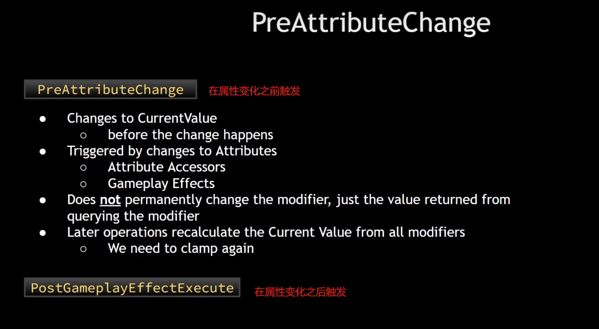

__________________________________________________________________________

#### 1. 属性更改前 预处理`PreAttributeChange`

##### 在 `UAuraAttributeSet` 中重写虚函数 `PreAttributeChange` 限制属性最大最小值


+ `头文件`中：
```cpp
public:
	virtual void PreAttributeChange(const FGameplayAttribute& Attribute, float& NewValue) override;
```


+ `源文件`中：
```cpp
void UAuraAttributeSet::PreAttributeChange(const FGameplayAttribute& Attribute, float& NewValue)
{
	Super::PreAttributeChange(Attribute, NewValue);
	
	if (Attribute == GetHealthAttribute())
	{
		NewValue = FMath::Clamp(NewValue,0.0f,GetMaxHealth());
	}
	
	if (Attribute == GetManaAttribute())
	{
		NewValue = FMath::Clamp(NewValue,0.0f,GetMaxMana());
	}
}
```


___________________________________________________________________________________________


#### 2. 属性更改后触发(这里只做了解用了,暂时不写逻辑,处理属性后其实还需要在这个函数内进行`clamp`)


##### 在 UAuraAttributeSet 中重写虚函数 `PostGameplayEffectExecute` (属性更改后触发) 限制属性最大最小值

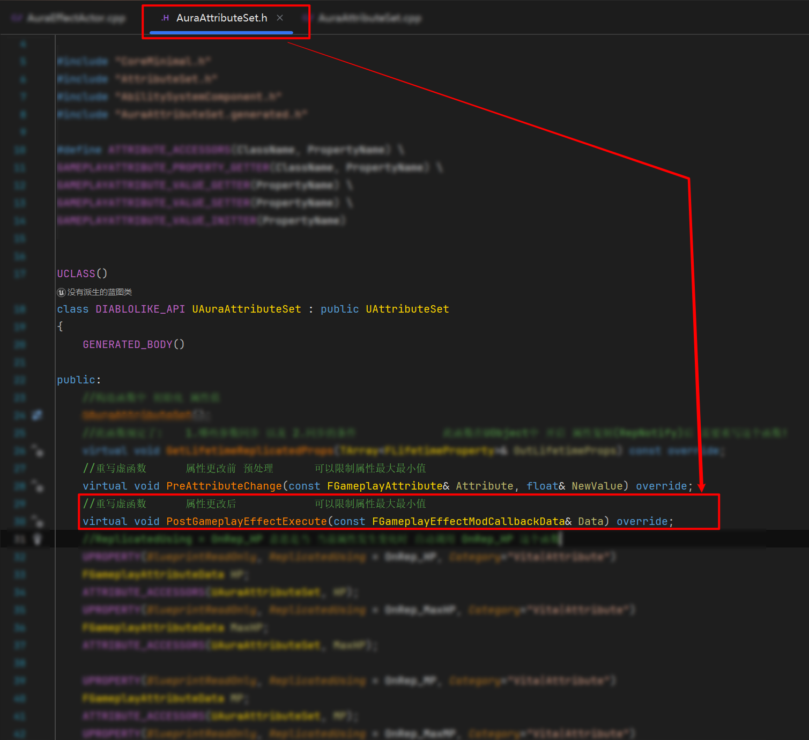

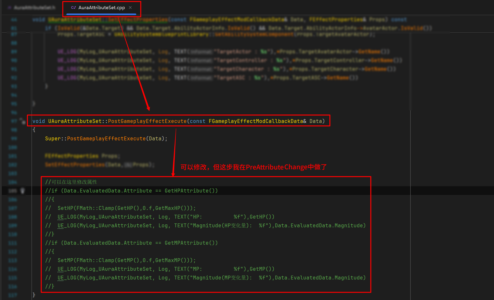


##### 这个函数的参数`Data`非常强大,几乎能拿到所有信息

___________________________________________________________________________________________


### 新建一个函数和结构体 , 保存 属性更改后,从`PostGameplayEffectExecute`函数的参数 `Data`获得的,有用的 信息

___________________________________________________________________________________________


#### `UAuraAttributeSet`头文件

##### 1.创建结构体

1. UAuraAttributeSet `头文件`中：

```cpp
USTRUCT()
struct FEffectProperties
{
	GENERATED_BODY()
	
	FEffectProperties(): SourceASC(nullptr), SourceAvatarActor(nullptr), SourceController(nullptr),
	                     SourceCharacter(nullptr),
	                     TargetASC(nullptr),
	                     TargetAvatarActor(nullptr),
	                     TargetController(nullptr),
	                     TargetCharacter(nullptr)
	{
	}

	UPROPERTY()
	FGameplayEffectContextHandle EffectContextHandle;

	UPROPERTY()
	UAbilitySystemComponent* SourceASC;
	UPROPERTY()
	AActor* SourceAvatarActor;
	UPROPERTY()
	AController* SourceController;
	UPROPERTY()
	ACharacter* SourceCharacter;
	
	UPROPERTY()
	UAbilitySystemComponent* TargetASC;
	UPROPERTY()
	AActor* TargetAvatarActor;
	UPROPERTY()
	AController* TargetController;
	UPROPERTY()
	ACharacter* TargetCharacter;
};
```
##### 2.创建保存数据到结构体的函数
```cpp
	//自建函数 保存数据到结构体
	void SetEffectProperties(const FGameplayEffectModCallbackData& Data,FEffectProperties& Props) const;	
```
___________________________________________________________________________________________

+ `源文件` `SetEffectProperties`和`PostGameplayEffectExecute`函数中：
```cpp
void UAuraAttributeSet::SetEffectProperties(const FGameplayEffectModCallbackData& Data, FEffectProperties& Props) const
{
	//Data.EffectSpec 通过这个拿到 FGameplayEffectSpec
	//Data.EffectSpec.GetContext()通过这个拿到 FGameplayEffectContextHandle(GE上下文句柄)
	Props.EffectContextHandle = Data.EffectSpec.GetContext();
	//通过上下文句柄 使用API:GetOriginalInstigatorAbilitySystemComponent 拿到Instigator的ASC组件
	Props.SourceASC = Props.EffectContextHandle.GetOriginalInstigatorAbilitySystemComponent();
	
	//如果 ASC组件/AbilityActorInfo/AvatarActor不为空
	if (IsValid(Props.SourceASC) && Props.SourceASC->AbilityActorInfo.IsValid() && Props.SourceASC->AbilityActorInfo.Get()->AvatarActor.IsValid())
	{
		//拿到ASC的来源Actor
		Props.SourceAvatarActor = Props.SourceASC->AbilityActorInfo.Get()->AvatarActor.Get();
		//拿到ASC的来源Actor的 Controller
		Props.SourceController = Props.SourceASC->AbilityActorInfo.Get()->PlayerController.Get();
		//如果有 ASC的来源Actor 却没有 Controller
		if (Props.SourceAvatarActor && !Props.SourceController)
		{
			if (const APawn* Pawn = Cast<APawn>(Props.SourceAvatarActor))
			{
				//使用ASC的来源Actor的Controller给变量SourceController赋值
				Props.SourceController = Pawn->GetController();
			}
		}
		if (Props.SourceController)
		{
			//拿到SourceController控制的 角色
			Props.SourceCharacter = Cast<ACharacter>(Props.SourceController->GetPawn());
			UE_LOG(UELOG_UAuraAttributeSet,Log,TEXT("Props.SourceCharacter : %s"),*Props.SourceCharacter->GetName());
		}
		UE_LOG(UELOG_UAuraAttributeSet,Log,TEXT("Props.SourceAvatarActor : %s"),*Props.SourceAvatarActor->GetName());
		UE_LOG(UELOG_UAuraAttributeSet,Log,TEXT("Props.SourceController : %s"),*Props.SourceController->GetName());
		UE_LOG(UELOG_UAuraAttributeSet,Log,TEXT("Props.SourceASC : %s"),*Props.SourceASC->GetName());
	}
	if (IsValid(&Data.Target) && Data.Target.AbilityActorInfo.IsValid() && Data.Target.AbilityActorInfo.Get()->AvatarActor.IsValid())
	{
		//拿到Target的 Actor /Controller/Character /ASC
		Props.TargetAvatarActor = Data.Target.AbilityActorInfo.Get()->AvatarActor.Get();
		Props.TargetController = Data.Target.AbilityActorInfo.Get()->PlayerController.Get();
		Props.TargetCharacter = Cast<ACharacter>(Props.TargetAvatarActor);
		Props.TargetASC = UAbilitySystemBlueprintLibrary::GetAbilitySystemComponent(Props.TargetAvatarActor);
	}
}
void UAuraAttributeSet:.PostGameplayEffectExecute(const FGameplayEffectModcallbackData& Data)
{
    Super::PostGameplayEffectExecute(Data):
	FEffectProperties Props;
	SetEffectProperties(Data,Props)
}
```

&emsp;


#### 源文件

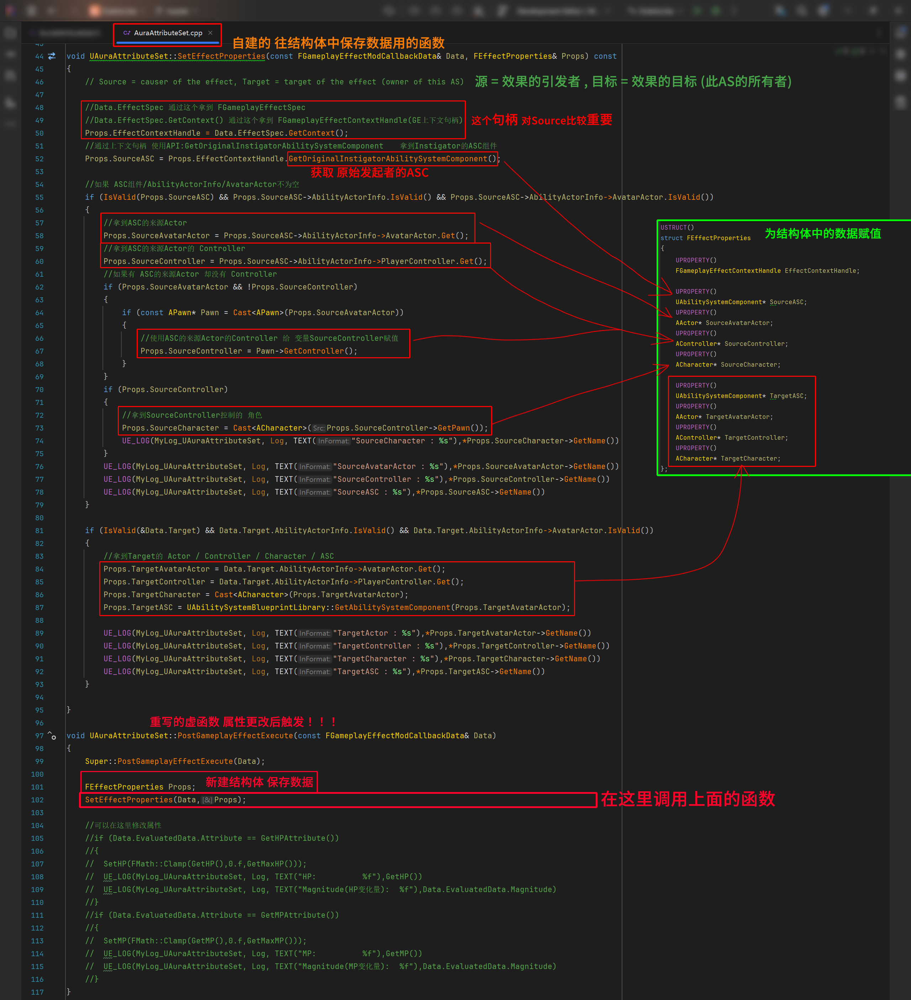

___________________________________________________________________________________________


### 创建药水的表格


#### 创建药水的表格

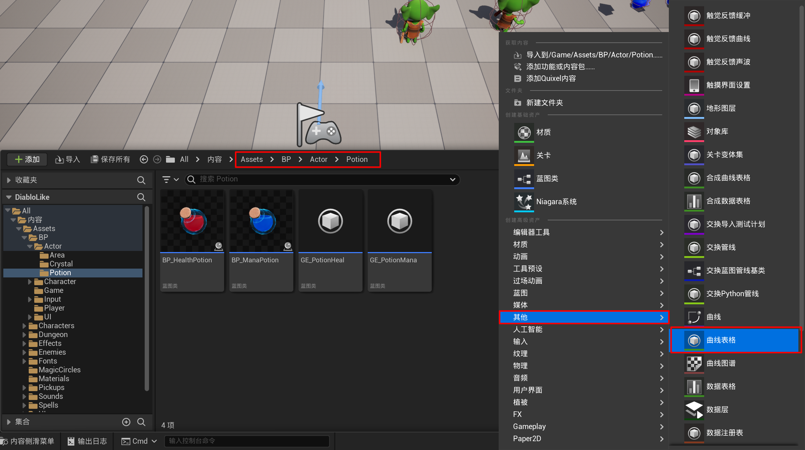

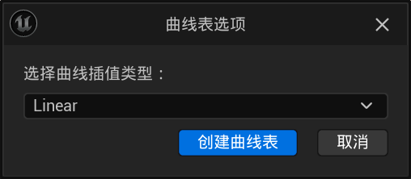

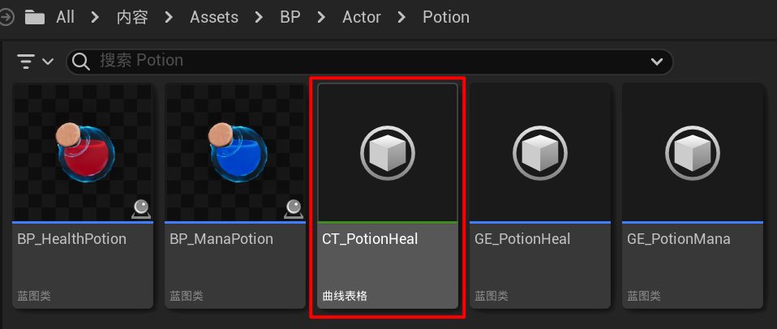

___________________________________________________________________________________________


#### 配置表格

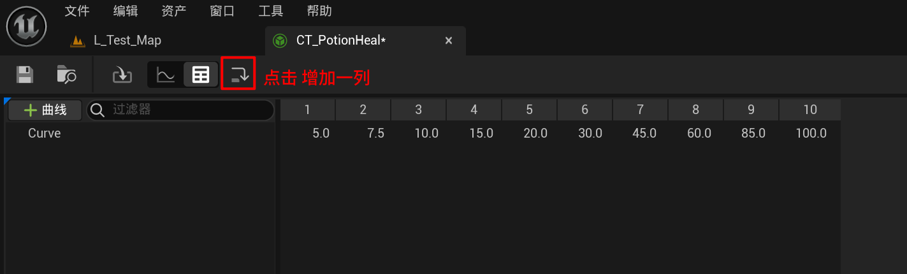

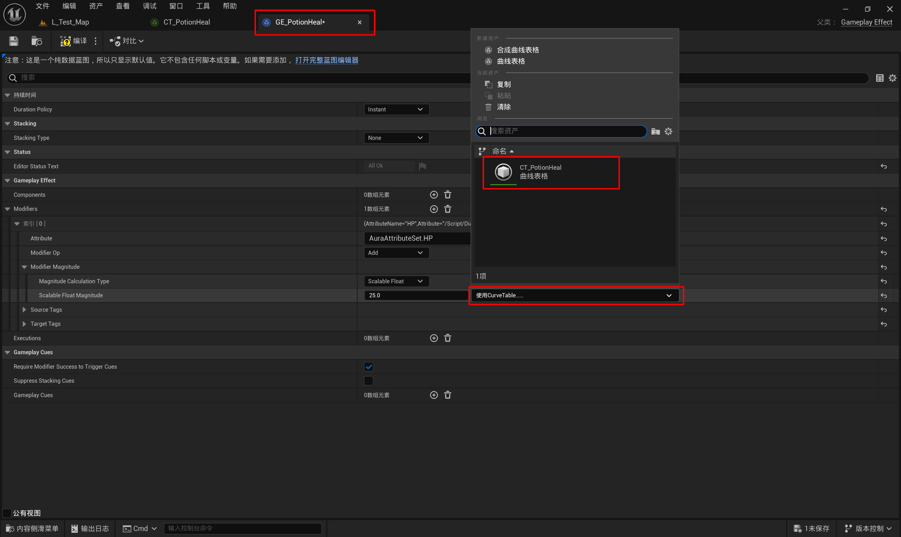

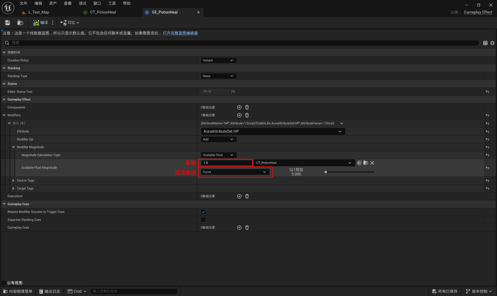

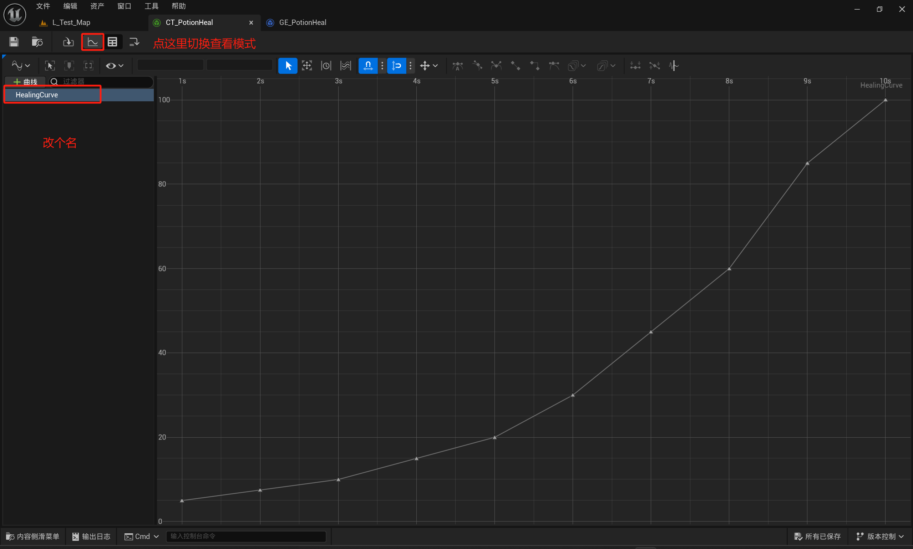

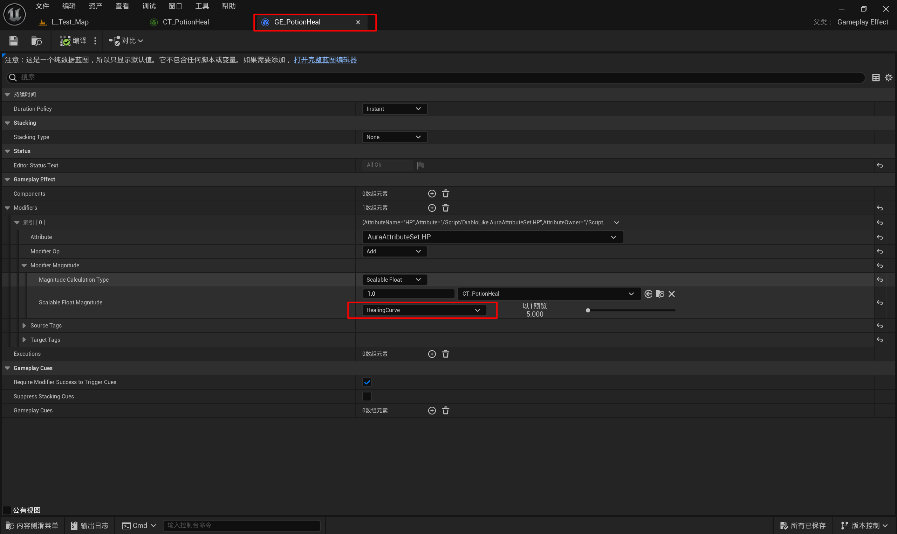

___________________________________________________________________________________________


#### 测试一下,此时拾取药水,恢复5HP,说明配置表格成功

___________________________________________________________________________________________

#### 为 `AAuraEffectActor`添加 物品等级(影响应用效果)

+ `头文件`中：
```cpp
protected:
	//物品的使用等级
	UPROPERTY(EditAnywhere, BlueprintReadOnly, Category="Applied Effects")
	float ActorLevel = 1.f;
```

&emsp;

+ `源文件`中：
```cpp
void AAuraEffectActor::ApplyEffectToTarget(AActor* TargetActor, TSubclassOf<UGameplayEffect> GameplayEffectClass)
{
    //此函数使用 UAbilitySystemBlueprintLibrary 函数库中的API (检查目标是否实现了IAbilitySystemInterface 接口/若未实现 返回nullptr)
	UAbilitySystemComponent* TargetASC = UAbilitySystemBlueprintLibrary::GetAbilitySystemComponent(TargetActor);
	//若目标对象未实现IAbilitySystemInterface接口 就return
	if (!TargetASC) return;
	//首先必须有 GameplayEffectClass
	check(GameplayEffectClass);
	//ASC中的API创建一个 FGameplayEffectContextHandle(游戏效果上下文句柄)并返回
	FGameplayEffectContextHandle GameplayEffectContextHandle = TargetASC->MakeEffectContext();
	//将传进的UObject类型指针 转换成 TWeakObjectPtr弱引用 并添加到句柄中
	GameplayEffectContextHandle.AddSourceObject(this);
	//ASC中的API 制定传出的规范(传入参数)创建一个 FGameplayEffectSpecHandle 类型的数据
	FGameplayEffectSpecHandle EffectSpecHandle = TargetASC->MakeOutgoingSpec(GameplayEffectClass,ActorLevel,GameplayEffectContextHandle);
	// 需要传入一个 const FGameplayEffectSpec& GameplayEffect 类型的变量
	// EffectSpecHandle.Data 是一个TSharedPtr智能指针 .Get() 是其中的API 获取 裸指针	此时参数:EffectSpecHandle.Data.Get()
	// 获取裸指针之后 还需要对指针进行解引用											此时参数:*EffectSpecHandle.Data.Get()
	//先接收一下返回的变量 FActiveGameplayEffectHandle(需要使用这个进行移除该GE效果)!!!
	const FActiveGameplayEffectHandle GameplayEffectHandle = TargetASC->ApplyGameplayEffectSpecToSelf(*EffectSpecHandle.Data.Get());
	//通过FGameplayEffectSpecHandle类型的变量EffectSpecHandle.Data 这一步获取 TSharedPtr<FGameplayEffectSpec>
	//Data.Get() 这一步获取 FGameplayEffectSpec裸指针
	//FGameplayEffectSpec->Def 这一步获取 TObjectPtr<const UGameplayEffect> Def;
	//Def.Get() 这一步获取 GE裸指针
	// ->DurationPolicy 这一步获取 GE文件中的 持续时间类型
	const bool bIsInfinite = EffectSpecHandle.Data.Get()->Def.Get()->DurationPolicy == EGameplayEffectDurationType::Infinite;
	//如果持续时间类型为 永久生效 且需要在EndOverlap时移除	就记录到TMap容器中
	if (bIsInfinite && InfiniteEffectRemovalPolicy == EEffectRemovalPolicy::RemoveOnEndOverlap)
	{
		ActiveEffectHandles.Add(GameplayEffectHandle,TargetASC);
	}
}
```

&emsp;

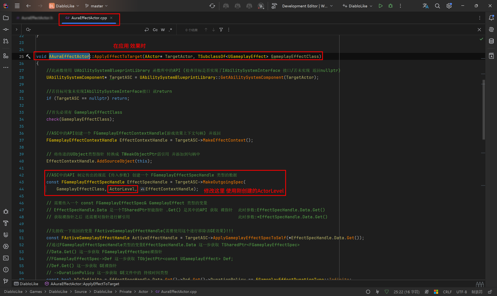

___________________________________________________________________________________________


#### 此物品等级可以为float！！！比如4.75 

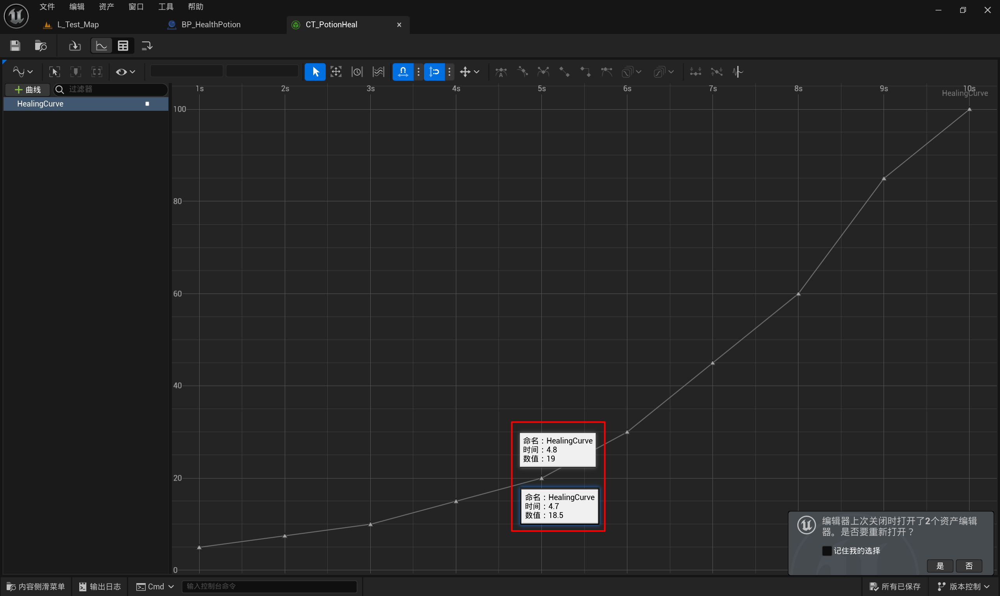

___________________________________________________________________________________________


#### 蓝图中测试修改物品等级

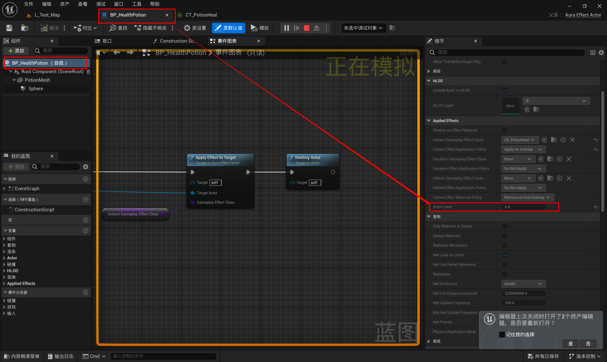

___________________________________________________________________________________________


#### 测试效果

##### 说明成功了

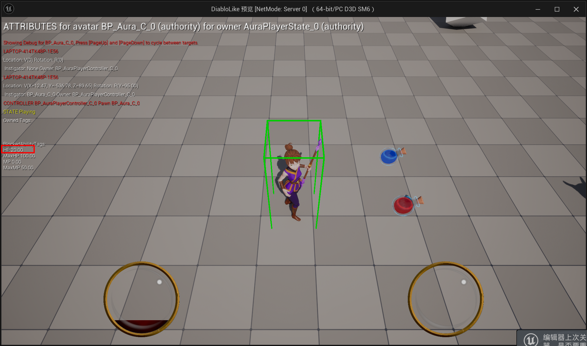 

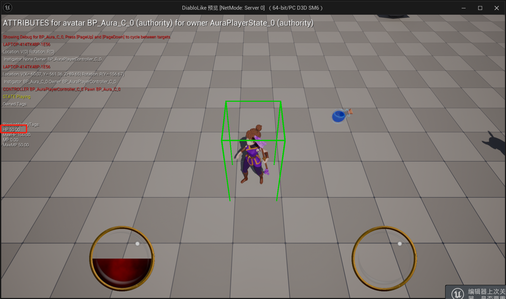 


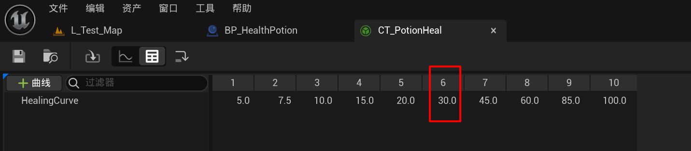

___________________________________________________________________________________________


##### 测试完,记得改回来

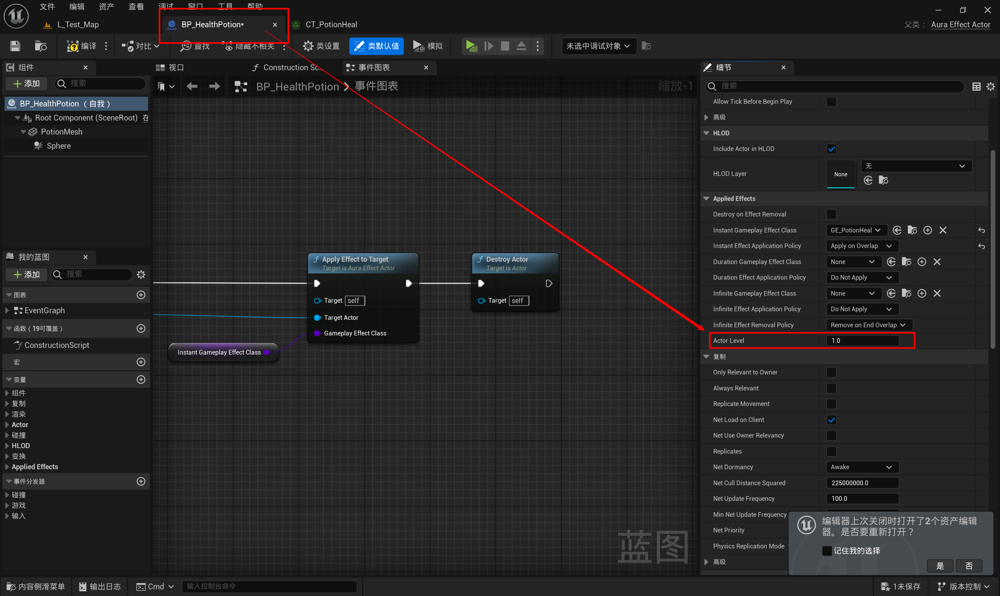

___________________________________________________________________________________________


#### 修改曲线表格名字为 CT_Potion, 打算把所有药水的数据都存在这个表格上

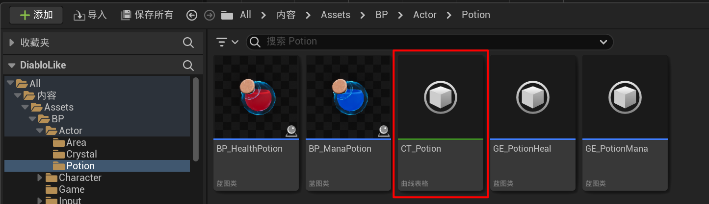

___________________________________________________________________________________________


#### 增加魔法药水的曲线

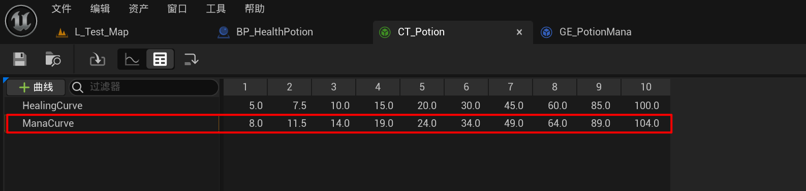

___________________________________________________________________________________________


#### 为魔法药水配置 曲线表格

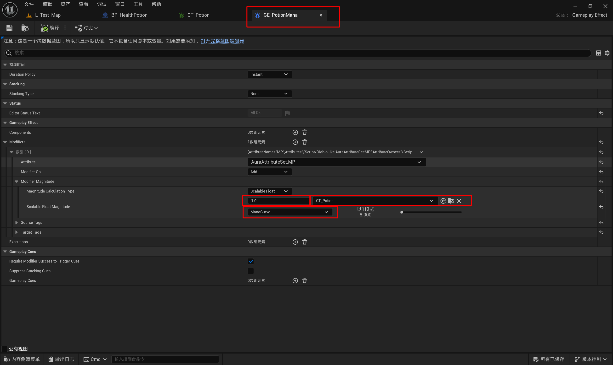

___________________________________________________________________________________________


#### 测试一下

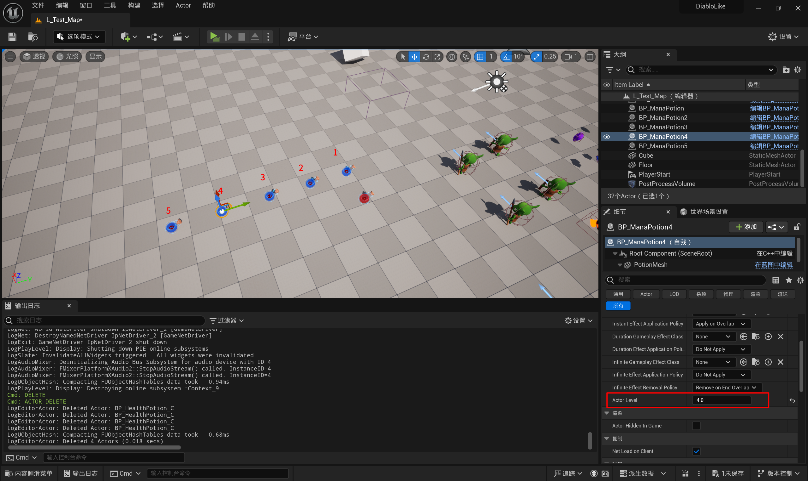

___________________________________________________________________________________________

[返回最上面](#Go主菜单)
___________________________________________________________________________________________