___________________________________________________________________________________________

###### [Go主菜单](../MainMenu.md)
___________________________________________________________________________________________

# GAS 020 创建:1.管理游戏标签结构体;2.自己的资产管理器类;3.创建DataAsset资产:4.制作WidgetController
___________________________________________________________________________________________
## 处理关键点
1. 创建无类型的纯C++类,创建用于管理GameplayTags的结构体FAuraGameplayTags,创建初始化游戏标签函数,私有时声明一个变量,在源文件中定义
2. 单例类的变量使用（static）
3. 创建自己的AssetManager类,提换引擎默认的资产管理器,重写虚函数StartInitialLoading,在加载完毕时,添加自己的逻辑（项目中的Config文件夹下的DefaultEngine.ini文件中查找(找不到就添加)设置自建的类型AuraAssetManager）
___________________________________________________________________________________________

# 目录
- [GAS 020 创建:1.管理游戏标签结构体;2.自己的资产管理器类;3.创建DataAsset资产:4.制作WidgetController](#gas-020-创建1管理游戏标签结构体2自己的资产管理器类3创建dataasset资产4制作widgetcontroller)
	- [处理关键点](#处理关键点)
	- [目录](#目录)
		- [1.创建无类型的纯C++类`AuraGameplayTags.h`](#1创建无类型的纯c类auragameplaytagsh)
			- [当你在头文件中声明一个静态成员变量时](#当你在头文件中声明一个静态成员变量时)
		- [通过 UGameplayTagsManager 使用 `UGameplayTagsManager::Get().AddNativeGameplayTag(FName,FString);` 添加Tag标签](#通过-ugameplaytagsmanager-使用-ugameplaytagsmanagergetaddnativegameplaytagfnamefstring-添加tag标签)
			- [C++中添加Tag标签](#c中添加tag标签)
		- [2.创建 AssetManager 类的C++类 UAuraAssetManager , 重写初始加载游戏资源的函数, 调用初始化GameplayTags的函数](#2创建-assetmanager-类的c类-uauraassetmanager--重写初始加载游戏资源的函数-调用初始化gameplaytags的函数)
		- [项目中的Config文件夹下的`DefaultEngine.ini`文件中查找(找不到就添加)设置资产管理器`AssetManager`为上面,自建的类型 `UAuraAssetManager`](#项目中的config文件夹下的defaultengineini文件中查找找不到就添加设置资产管理器assetmanager为上面自建的类型-uauraassetmanager)
				- [查找 AssetManager 有两种情况](#查找-assetmanager-有两种情况)
					- [找到了](#找到了)
					- [没找到](#没找到)
		- [编译后运行引擎](#编译后运行引擎)
		- [`FAuraGameplayTags` 的 头文件 中创建标签变量, 源文件 初始化函数中给变量赋值](#fauragameplaytags-的-头文件-中创建标签变量-源文件-初始化函数中给变量赋值)
		- [ASC组件 UAuraAbilitySystemComponent 的AbilityActorInfoSet()函数中使用引用来保存单例类的引用](#asc组件-uauraabilitysystemcomponent-的abilityactorinfoset函数中使用引用来保存单例类的引用)
		- [输出调试信息](#输出调试信息)
		- [这是一个小规范,使用静态`static`函数,最好空两格Tab](#这是一个小规范使用静态static函数最好空两格tab)
		- [移除旧标签](#移除旧标签)
		- [小测试:制作标签](#小测试制作标签)
			- [自己尝试一下`AuraGameplayTags.h`中添加Tag](#自己尝试一下auragameplaytagsh中添加tag)
				- [加上备注 这里的备注是在`项目设置->GameplayTag标签`鼠标悬停在Tag上显示的](#加上备注-这里的备注是在项目设置-gameplaytag标签鼠标悬停在tag上显示的)
		- [此时可以测试一下,使用Tag,查看是否存在](#此时可以测试一下使用tag查看是否存在)
			- [在蓝图中](#在蓝图中)
			- [C++中](#c中)
		- [3.创建DataAsset资产的C++类,叫 UAttributeInfo](#3创建dataasset资产的c类叫-uattributeinfo)
		- [`UAttributeInfo` 中](#uattributeinfo-中)
		- [在蓝图中继承,创建并配置数据资产](#在蓝图中继承创建并配置数据资产)
		- [小测试:制作WidgetController](#小测试制作widgetcontroller)
			- [自己尝试一下](#自己尝试一下)


___________________________________________________________________________________________

### 1.创建无类型的纯C++类`AuraGameplayTags.h`

>创建用于管理GameplayTags的结构体 FAuraGameplayTags , 创建初始化游戏标签函数,私有时声明一个变量,在源文件中定义


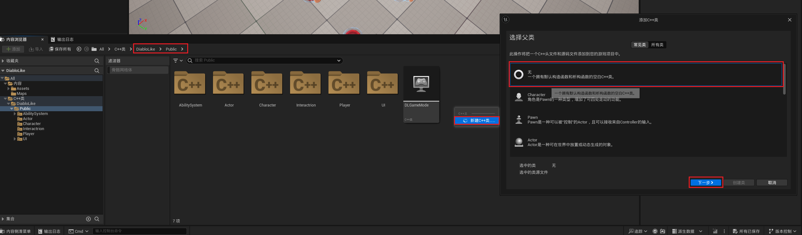

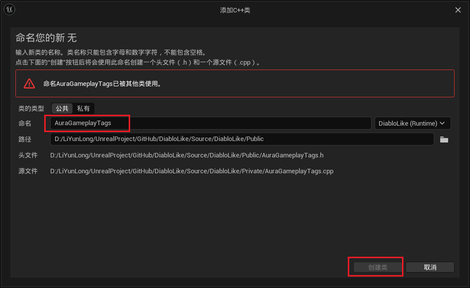

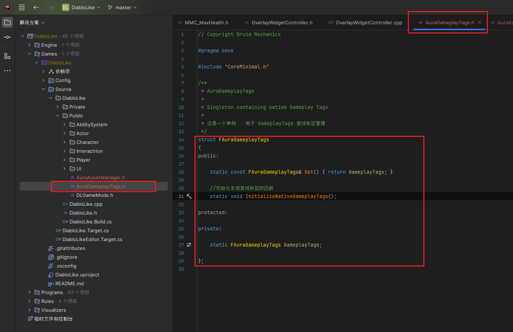

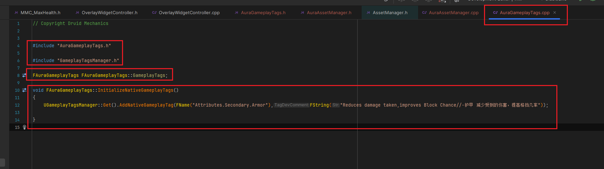

`AuraGameplayTags.h`中

&emsp;

+ `头文件`中：
```cpp
// Copyright Druid Mechanics
#pragma once
#include "CoreMinimal.h"
/**
 * AuraGameplayTags
 *	
 * Singleton containing native Gameplay Tags
 *
 * 这是一个单例	用于 GameplayTags 游戏标签管理
 */
struct FAuraGameplayTags
{
public:
	
	static const FAuraGameplayTags& Get() { return GameplayTags; }

	//初始化本地游戏标签的函数
	static void InitializeNativeGameplayTags();
	
private:
	//头文件中声明一个静态成员变量
	static FAuraGameplayTags GameplayTags;
};
```

&emsp;

+ `源文件`中：
```cpp
// Copyright Druid Mechanics
#include "AuraGameplayTags.h"
#include "GameplayTagsManager.h"

//这里是在全局域中定义这个变量
FAuraGameplayTags FAuraGameplayTags::GameplayTags;

void FAuraGameplayTags::InitializeNativeGameplayTags()
{
	UGameplayTagsManager::Get().AddNativeGameplayTag(FName("Attributes.Secondary.Armor"),FString("Reduces damage taken,improves Block Chance//-护甲	减少受到的伤害，提高格挡几率"));
	
}
```

&emsp;

&emsp;

___________________________________________________________________________________________


#### 当你在头文件中声明一个静态成员变量时
比如 `static FAuraGameplayTags GameplayTags`;你实际上只是在告诉编译器;"在这个类中,我有一个叫做 `GameplayTags` 的静态成员变量
但我暂时不会告诉你它的具体定义和内存分配"然后,在源文件中,通过 `FAuraGameplayTags FAuraGameplayTags::GameplayTags;` 这行代码
告诉了编译器:“现在,我要告诉你 GameplayTags 的具体定义和内存分配,它是 `FAuraGameplayTags` 类型的一个静态成员变量。
**这两行代码的意义在于分离了声明和定义。**
此外,这种做法还可以提高编译速度,这种分离可以防止重复定义的问题,特别是在包含同一个头文件的多个源文件中。因为只有在源文件中,编译器才会实际分配内存给静态成员变量,而在头文件中,只是告诉编译器这个变量的存在,不会实际分配内存。
    

___________________________________________________________________________________________

### 通过 UGameplayTagsManager 使用 `UGameplayTagsManager::Get().AddNativeGameplayTag(FName,FString);` 添加Tag标签

#### C++中添加Tag标签

```cpp
UGameplayTagsManager::Get().AddNativeGameplayTag(FName("Attributes.Secondary.Armor"),FString("Reduces damage taken,improves Block Chance//-护甲	减少受到的伤害，提高格挡几率"));
```


___________________________________________________________________________________________


### 2.创建 AssetManager 类的C++类 UAuraAssetManager , 重写初始加载游戏资源的函数, 调用初始化GameplayTags的函数

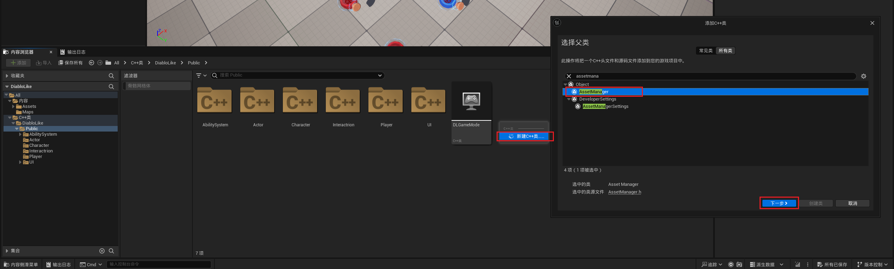

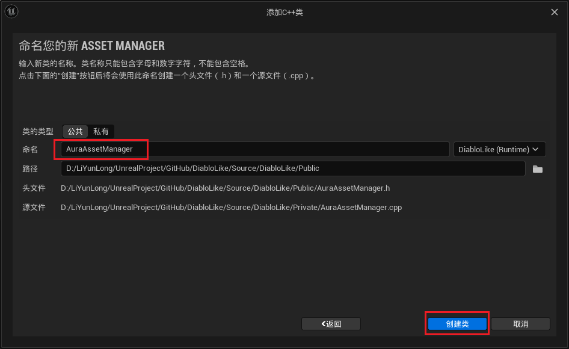

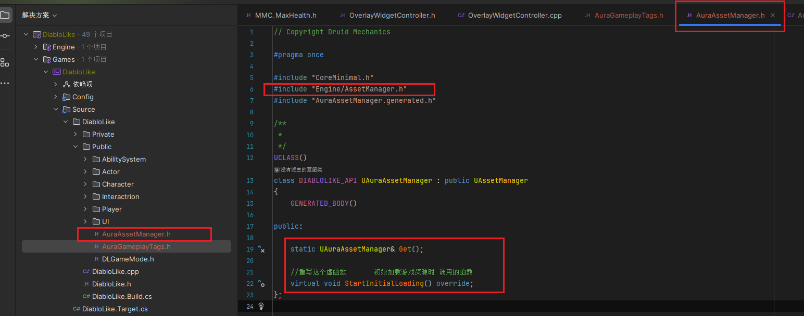

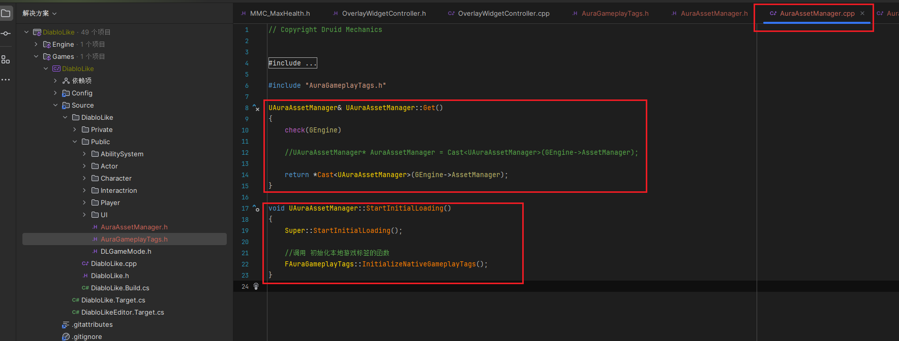


+ `头文件`中：
```cpp
// Copyright Druid Mechanics
#pragma once
#include "CoreMinimal.h"
#include "Engine/AssetManager.h"
#include "AuraAssetManager.generated.h"

UCLASS()
class DIABLOLIKE_API UAuraAssetManager : public UAssetManager
{
	GENERATED_BODY()

public:
	
	static UAuraAssetManager& Get();

	//重写这个虚函数		初始加载游戏资源时 调用的函数
	virtual void StartInitialLoading() override;
};
```

&emsp;

+ `源文件`中：
```cpp
// Copyright Druid Mechanics
#include "AuraAssetManager.h"
#include "AuraGameplayTags.h"

UAuraAssetManager& UAuraAssetManager::Get()
{
	check(GEngine)
	//UAuraAssetManager* AuraAssetManager = Cast<UAuraAssetManager>(GEngine->AssetManager);
	return *Cast<UAuraAssetManager>(GEngine->AssetManager);
}

void UAuraAssetManager::StartInitialLoading()
{
	Super::StartInitialLoading();

	//调用 初始化本地游戏标签的函数
	FAuraGameplayTags::InitializeNativeGameplayTags();
	
}
```

&emsp;

&emsp;

___________________________________________________________________________________________


### 项目中的Config文件夹下的`DefaultEngine.ini`文件中查找(找不到就添加)设置资产管理器`AssetManager`为上面,自建的类型 `UAuraAssetManager`

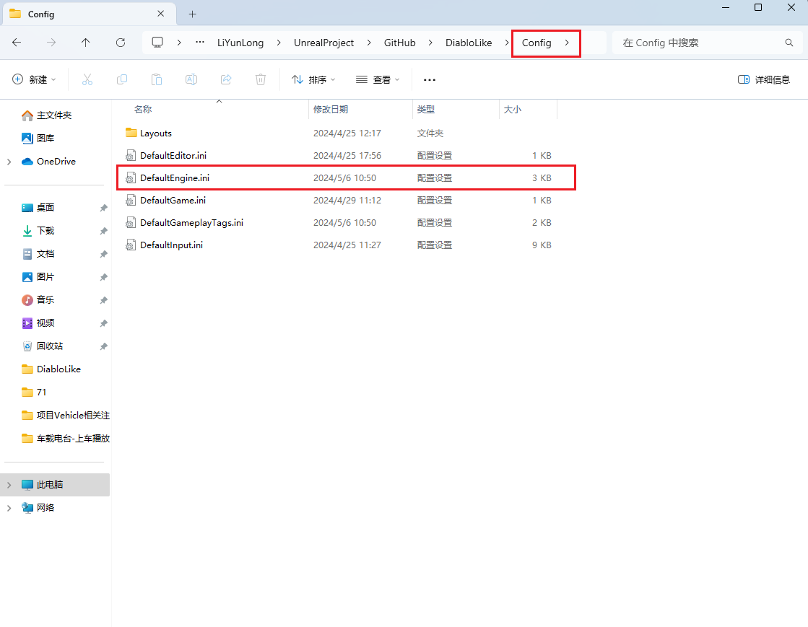
___________________________________________________________________________________________


##### 查找 AssetManager 有两种情况

###### 找到了

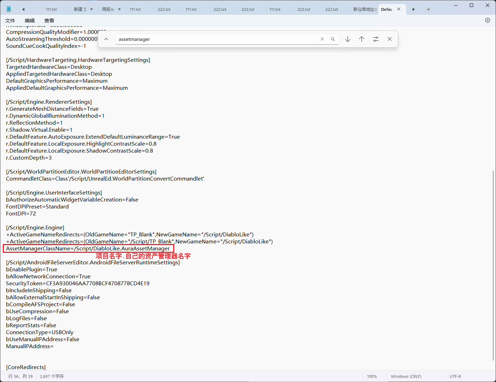
___________________________________________________________________________________________


###### 没找到

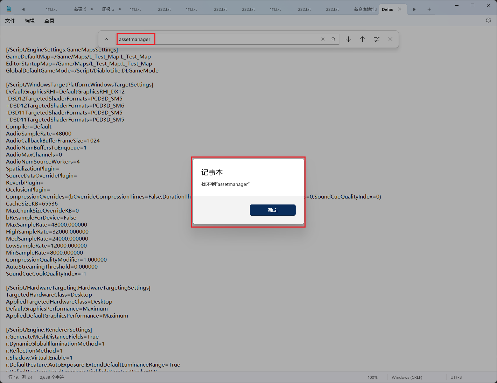

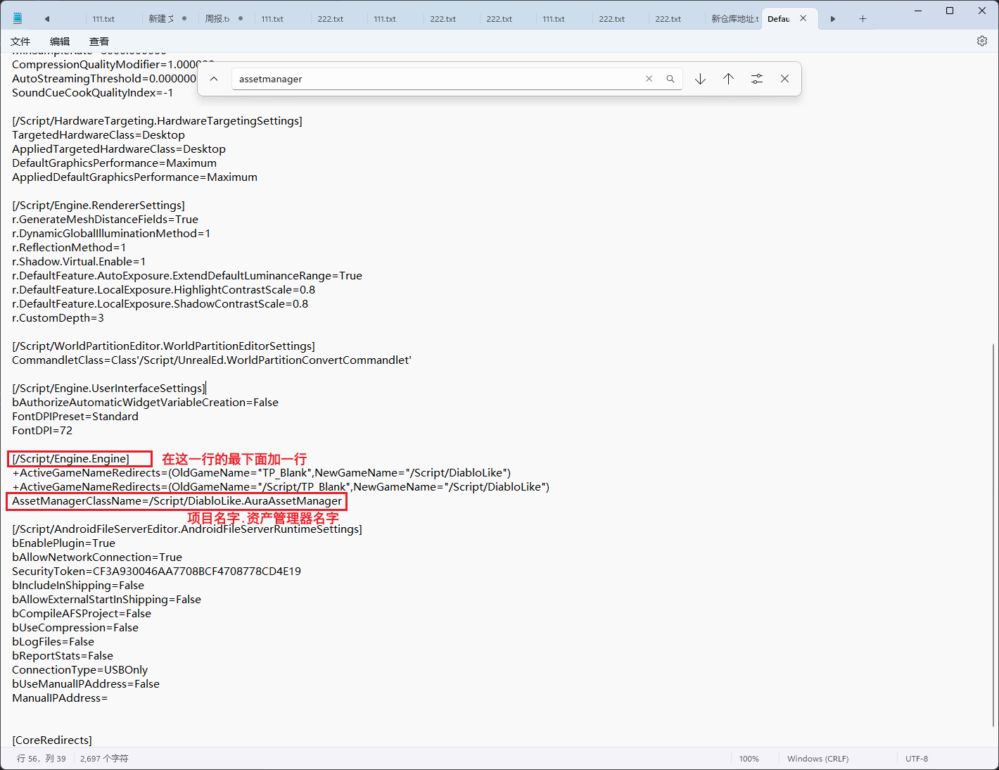
    
___________________________________________________________________________________________


### 编译后运行引擎

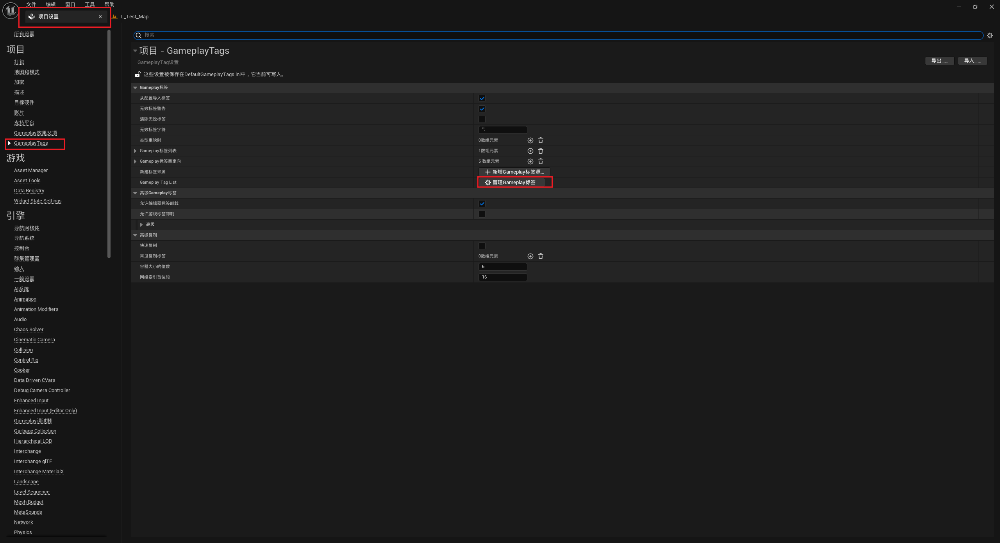

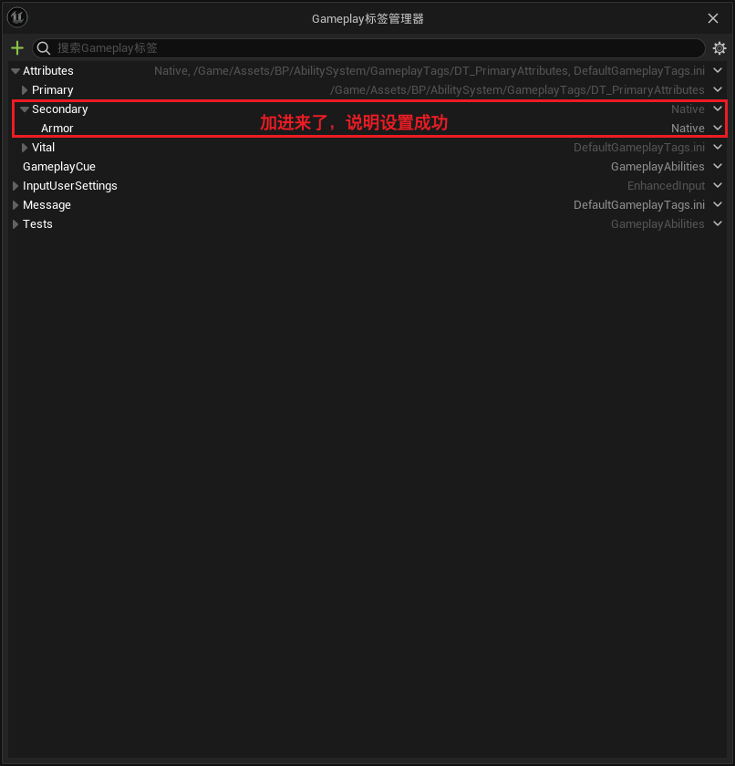
    
___________________________________________________________________________________________

### `FAuraGameplayTags` 的 头文件 中创建标签变量, 源文件 初始化函数中给变量赋值

&emsp;

+ `头文件`中：
```cpp
// Copyright Druid Mechanics

#pragma once

#include "CoreMinimal.h"
#include "GameplayTagContainer.h"

/**
 * AuraGameplayTags
 *	
 * Singleton containing native Gameplay Tags
 *
 * 这是一个单例	用于 GameplayTags 游戏标签管理
 */

struct FAuraGameplayTags
{
public:
		//静态函数 外部调用
		static const FAuraGameplayTags& Get() { return GameplayTags; }

		//初始化本地游戏标签的函数
		static void InitializeNativeGameplayTags();

	//创建FGameplayTag类型变量
	FGameplayTag Attributes_Secondary_Armor;
private:
	
	/*
	 *当你在头文件中声明一个静态成员变量时,比如 static FAuraGameplayTags GameplayTags;
	 *你实际上只是在告诉编译器;"在这个类中，我有一个叫做 GameplayTags 的静态成员变量  但我暂时不会告诉你它的具体定义和内存分配"
	 *
	 *然后，在源文件中，通过 FAuraGameplayTags FAuraGameplayTags::GameplayTags; 这行代码
	 *告诉了编译器：“现在，我要告诉你 GameplayTags 的具体定义和内存分配，
	 *它是 FAuraGameplayTags 类型的一个静态成员变量。”
	 *
	 *这两行代码的意义在于分离了声明和定义。此外，这种做法还可以提高编译速度，
	 *这种分离可以防止重复定义的问题，特别是在包含同一个头文件的多个源文件中。
	 *因为只有在源文件中，编译器才会实际分配内存给静态成员变量，而在头文件中，只是告诉编译器这个变量的存在，不会实际分配内存。
	 */
		static FAuraGameplayTags GameplayTags;
};

```

&emsp;

+ `源文件`中：
```cpp
// Copyright Druid Mechanics
#include "AuraGameplayTags.h"
#include "GameplayTagsManager.h"

//全局域中 创建一个
FAuraGameplayTags FAuraGameplayTags::GameplayTags;

//初始化本地游戏标签的函数
void FAuraGameplayTags::InitializeNativeGameplayTags()
{
	//给这个属性变量赋值
	GameplayTags.Attributes_Secondary_Armor = UGameplayTagsManager::Get().AddNativeGameplayTag(
		FName("Attributes.Secondary.Armor"),
		FString(""));
}

```


___________________________________________________________________________________________


### ASC组件 UAuraAbilitySystemComponent 的AbilityActorInfoSet()函数中使用引用来保存单例类的引用

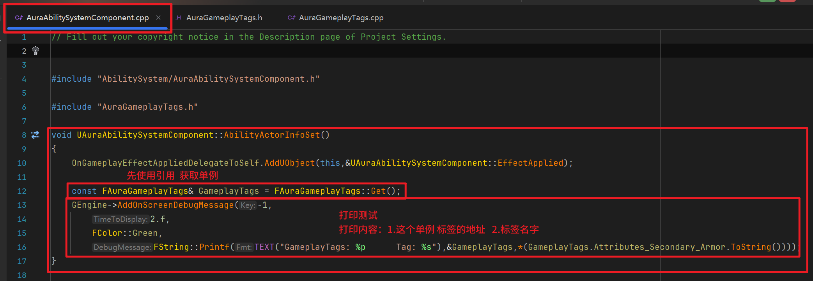
    
___________________________________________________________________________________________


### 输出调试信息 

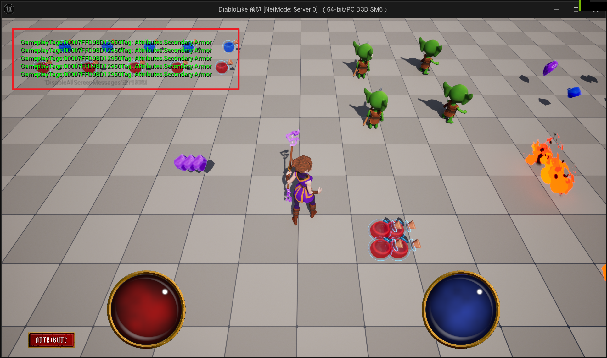

___________________________________________________________________________________________


### 这是一个小规范,使用静态`static`函数,最好空两格Tab 

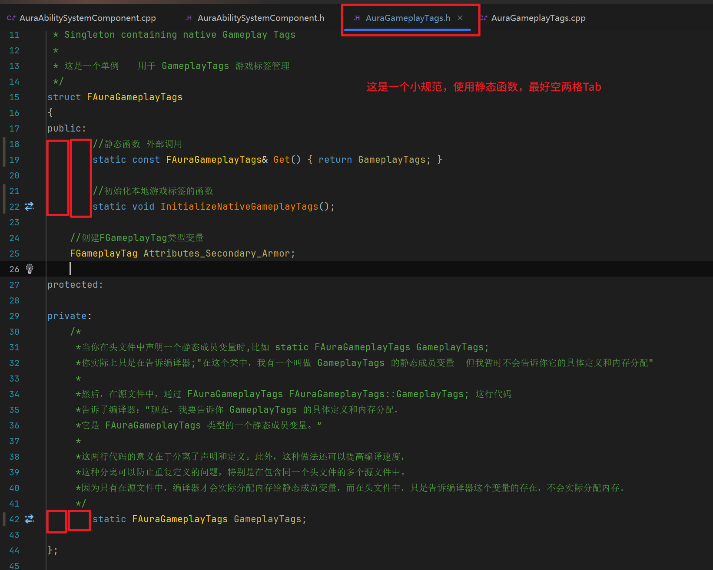

___________________________________________________________________________________________


### 移除旧标签 

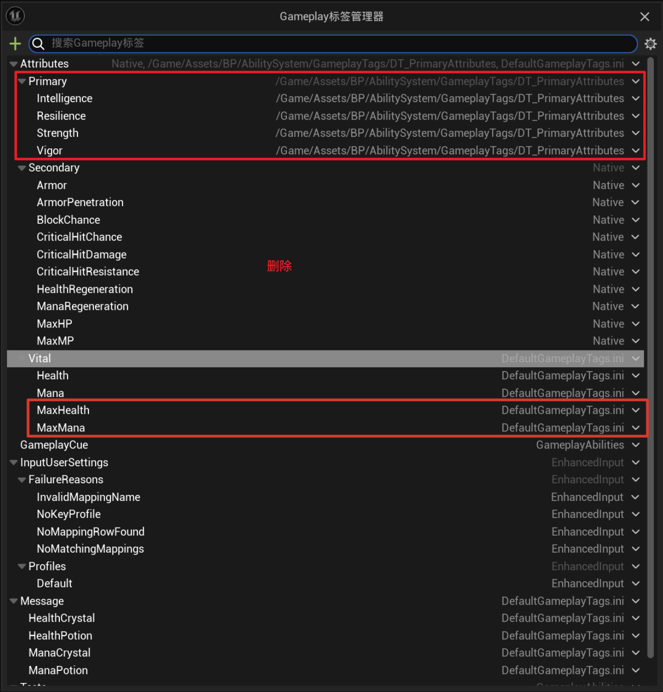 

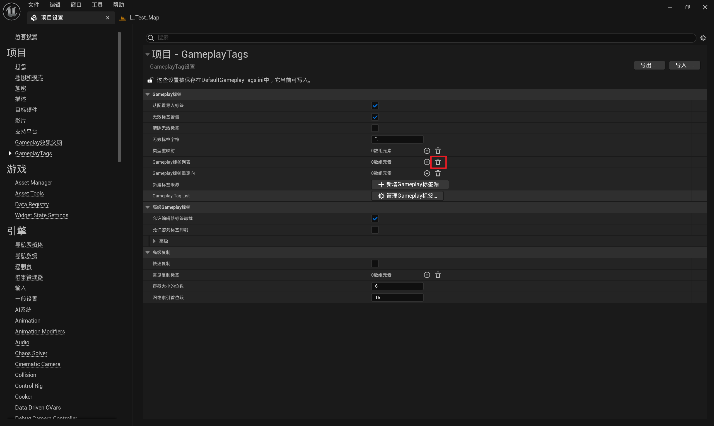

___________________________________________________________________________________________


### 小测试:制作标签 

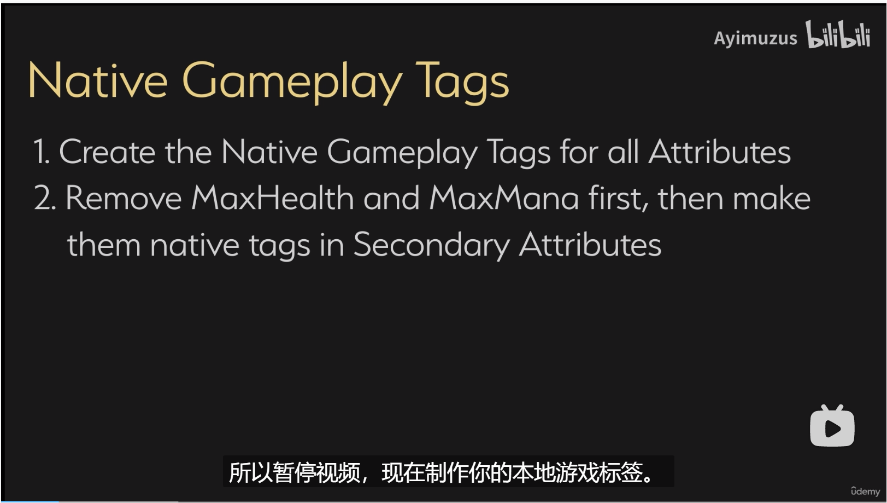
___________________________________________________________________________________________


#### 自己尝试一下`AuraGameplayTags.h`中添加Tag

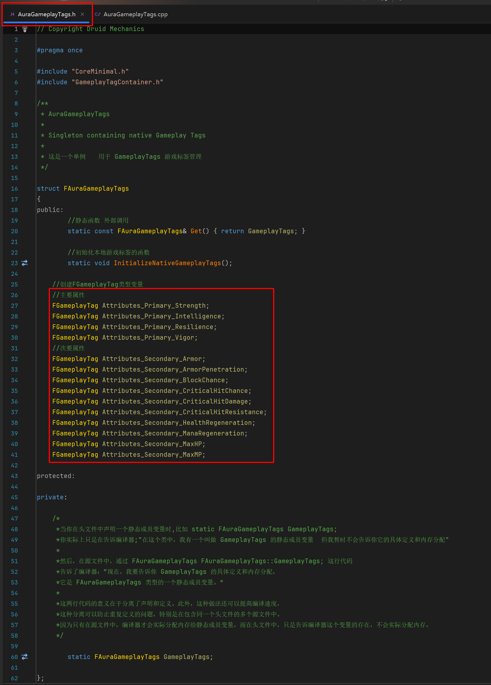


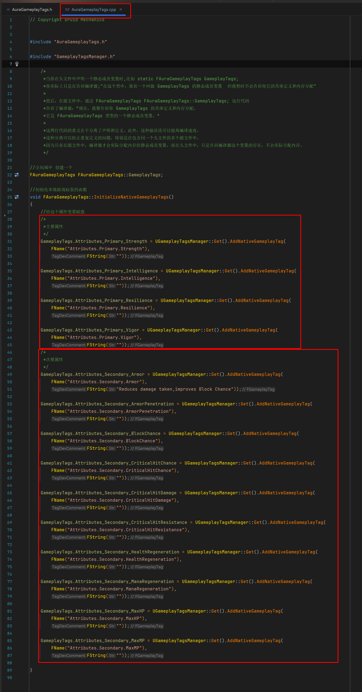

&emsp;

+ `头文件`中：
```cpp
// Copyright Druid Mechanics
#pragma once
#include "CoreMinimal.h"
#include "GameplayTagContainer.h"
/**
 * AuraGameplayTags
 *	
 * Singleton containing native Gameplay Tags
 *
 * 这是一个单例	用于 GameplayTags 游戏标签管理
 */

struct FAuraGameplayTags
{
public:
		//静态函数 外部调用
		static const FAuraGameplayTags& Get() { return GameplayTags; }

		//初始化本地游戏标签的函数
		static void InitializeNativeGameplayTags();

	//创建FGameplayTag类型变量
	//主要属性
	FGameplayTag Attributes_Primary_Strength;
	FGameplayTag Attributes_Primary_Intelligence;
	FGameplayTag Attributes_Primary_Resilience;
	FGameplayTag Attributes_Primary_Vigor;
	//次要属性
	FGameplayTag Attributes_Secondary_Armor;
	FGameplayTag Attributes_Secondary_ArmorPenetration;
	FGameplayTag Attributes_Secondary_BlockChance;
	FGameplayTag Attributes_Secondary_CriticalHitChance;
	FGameplayTag Attributes_Secondary_CriticalHitDamage;
	FGameplayTag Attributes_Secondary_CriticalHitResistance;
	FGameplayTag Attributes_Secondary_HealthRegeneration;
	FGameplayTag Attributes_Secondary_ManaRegeneration;
	FGameplayTag Attributes_Secondary_MaxHP;
	FGameplayTag Attributes_Secondary_MaxMP;

protected:
	
private:
	
	/*
	 *当你在头文件中声明一个静态成员变量时,比如 static FAuraGameplayTags GameplayTags;
	 *你实际上只是在告诉编译器;"在这个类中，我有一个叫做 GameplayTags 的静态成员变量  但我暂时不会告诉你它的具体定义和内存分配"
	 *
	 *然后，在源文件中，通过 FAuraGameplayTags FAuraGameplayTags::GameplayTags; 这行代码
	 *告诉了编译器：“现在，我要告诉你 GameplayTags 的具体定义和内存分配，
	 *它是 FAuraGameplayTags 类型的一个静态成员变量。”
	 *
	 *这两行代码的意义在于分离了声明和定义。此外，这种做法还可以提高编译速度，
	 *这种分离可以防止重复定义的问题，特别是在包含同一个头文件的多个源文件中。
	 *因为只有在源文件中，编译器才会实际分配内存给静态成员变量，而在头文件中，只是告诉编译器这个变量的存在，不会实际分配内存。
	 */
	
		static FAuraGameplayTags GameplayTags;
	
};

```

&emsp;

+ `源文件`中：
```cpp
// Copyright Druid Mechanics
#include "AuraGameplayTags.h"
#include "GameplayTagsManager.h"

	/*
	 *当你在头文件中声明一个静态成员变量时,比如 static FAuraGameplayTags GameplayTags;
	 *你实际上只是在告诉编译器;"在这个类中，我有一个叫做 GameplayTags 的静态成员变量  但我暂时不会告诉你它的具体定义和内存分配"
	 *
	 *然后，在源文件中，通过 FAuraGameplayTags FAuraGameplayTags::GameplayTags; 这行代码
	 *告诉了编译器：“现在，我要告诉你 GameplayTags 的具体定义和内存分配，
	 *它是 FAuraGameplayTags 类型的一个静态成员变量。”
	 *
	 *这两行代码的意义在于分离了声明和定义。此外，这种做法还可以提高编译速度，
	 *这种分离可以防止重复定义的问题，特别是在包含同一个头文件的多个源文件中。
	 *因为只有在源文件中，编译器才会实际分配内存给静态成员变量，而在头文件中，只是告诉编译器这个变量的存在，不会实际分配内存。
	 */

//全局域中 创建一个
FAuraGameplayTags FAuraGameplayTags::GameplayTags;

//初始化本地游戏标签的函数
void FAuraGameplayTags::InitializeNativeGameplayTags()
{
	//给这个属性变量赋值
	/*
	 *主要属性
	 */
	GameplayTags.Attributes_Primary_Strength = UGameplayTagsManager::Get().AddNativeGameplayTag(
		FName("Attributes.Primary.Strength"),
		FString(""));
	
	GameplayTags.Attributes_Primary_Intelligence = UGameplayTagsManager::Get().AddNativeGameplayTag(
		FName("Attributes.Primary.Intelligence"),
		FString(""));

	GameplayTags.Attributes_Primary_Resilience = UGameplayTagsManager::Get().AddNativeGameplayTag(
		FName("Attributes.Primary.Resilience"),
		FString(""));

	GameplayTags.Attributes_Primary_Vigor = UGameplayTagsManager::Get().AddNativeGameplayTag(
		FName("Attributes.Primary.Vigor"),
		FString(""));
	/*
	 *次要属性
	 */
	GameplayTags.Attributes_Secondary_Armor = UGameplayTagsManager::Get().AddNativeGameplayTag(
		FName("Attributes.Secondary.Armor"),
		FString(""));
	
	GameplayTags.Attributes_Secondary_ArmorPenetration = UGameplayTagsManager::Get().AddNativeGameplayTag(
		FName("Attributes.Secondary.ArmorPenetration"),
		FString(""));
	
	GameplayTags.Attributes_Secondary_BlockChance = UGameplayTagsManager::Get().AddNativeGameplayTag(
		FName("Attributes.Secondary.BlockChance"),
		FString(""));
	
	GameplayTags.Attributes_Secondary_CriticalHitChance = UGameplayTagsManager::Get().AddNativeGameplayTag(
		FName("Attributes.Secondary.CriticalHitChance"),
		FString(""));
	
	GameplayTags.Attributes_Secondary_CriticalHitDamage = UGameplayTagsManager::Get().AddNativeGameplayTag(
		FName("Attributes.Secondary.CriticalHitDamage"),
		FString(""));
	
	GameplayTags.Attributes_Secondary_CriticalHitResistance = UGameplayTagsManager::Get().AddNativeGameplayTag(
		FName("Attributes.Secondary.CriticalHitResistance"),
		FString(""));
	
	GameplayTags.Attributes_Secondary_HealthRegeneration = UGameplayTagsManager::Get().AddNativeGameplayTag(
		FName("Attributes.Secondary.HealthRegeneration"),
		FString(""));
	
	GameplayTags.Attributes_Secondary_ManaRegeneration = UGameplayTagsManager::Get().AddNativeGameplayTag(
		FName("Attributes.Secondary.ManaRegeneration"),
		FString(""));
	
	GameplayTags.Attributes_Secondary_MaxHP = UGameplayTagsManager::Get().AddNativeGameplayTag(
		FName("Attributes.Secondary.MaxHP"),
		FString(""));
	
	GameplayTags.Attributes_Secondary_MaxMP = UGameplayTagsManager::Get().AddNativeGameplayTag(
		FName("Attributes.Secondary.MaxMP"),
		FString(""));
}

```

&emsp;

&emsp;

___________________________________________________________________________________________


##### 加上备注 这里的备注是在`项目设置->GameplayTag标签`鼠标悬停在Tag上显示的

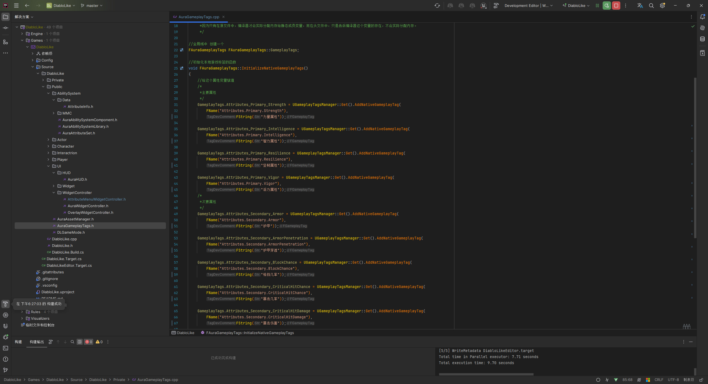 

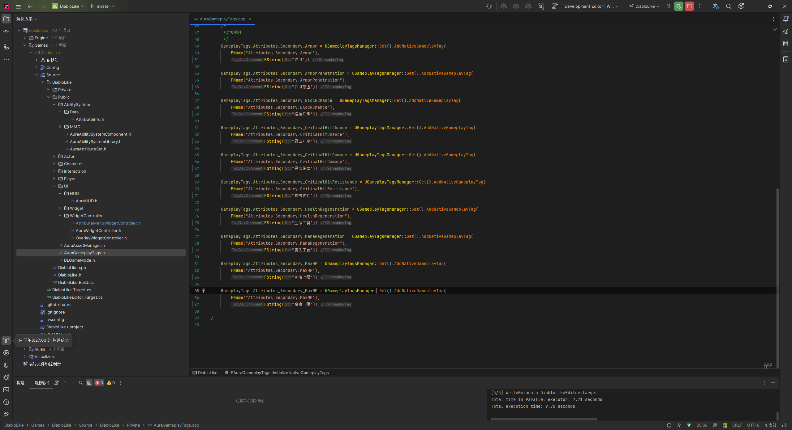

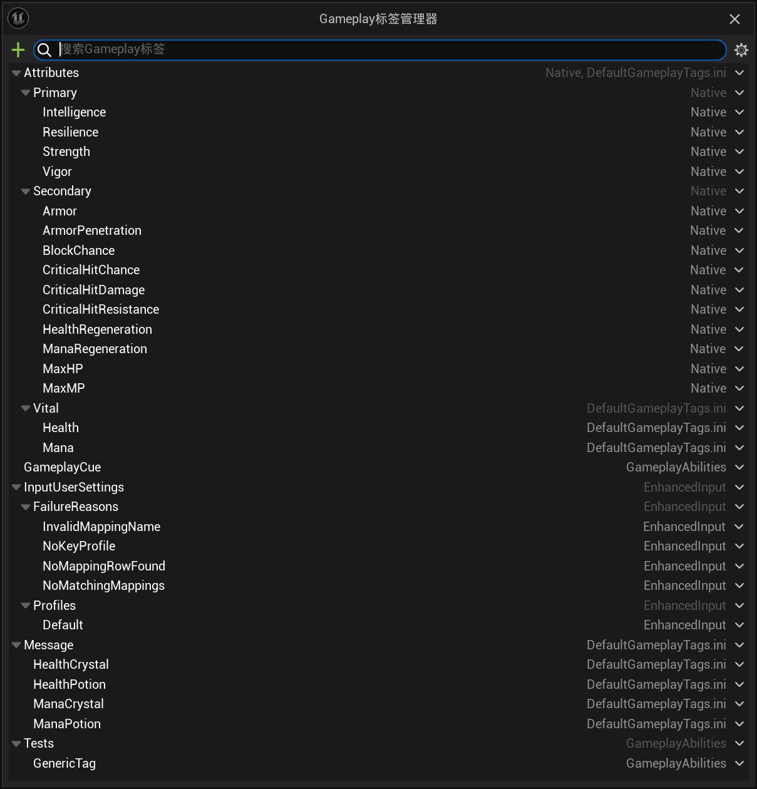
    
___________________________________________________________________________________________


### 此时可以测试一下,使用Tag,查看是否存在
#### 在蓝图中

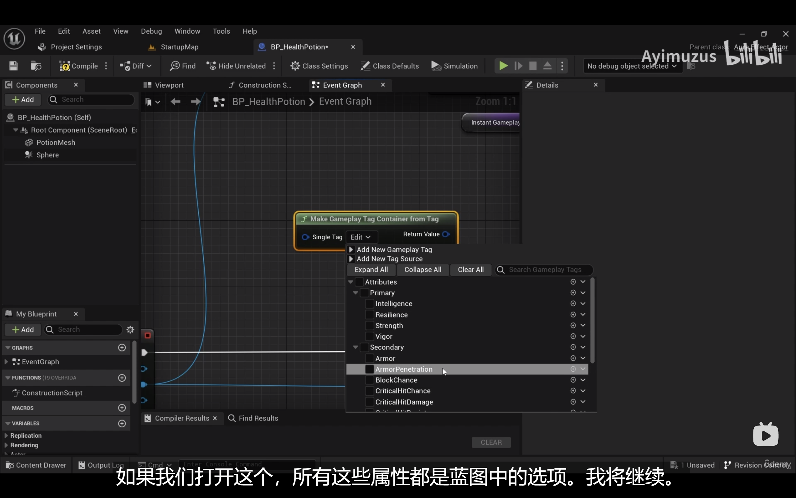
___________________________________________________________________________________________


#### C++中

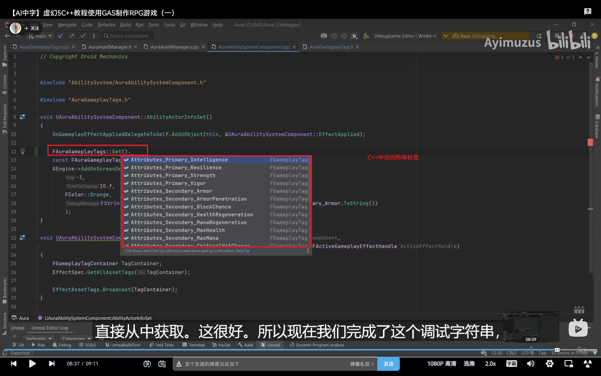
    
___________________________________________________________________________________________


### 3.创建DataAsset资产的C++类,叫 UAttributeInfo

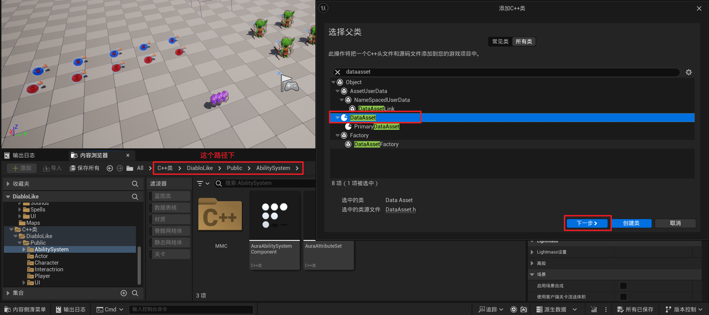

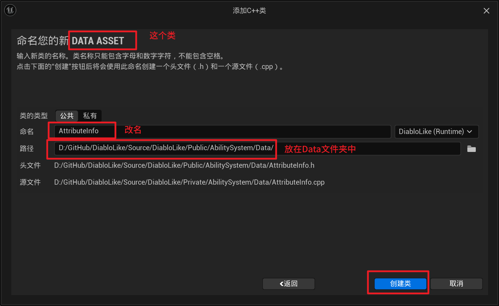
    
___________________________________________________________________________________________

### `UAttributeInfo` 中

1. 创建结构体
2. 创建数组 保存结构体的信息
3. 创建函数 根据传入的Tag标签 在数组中查找 并返回找到的结构体


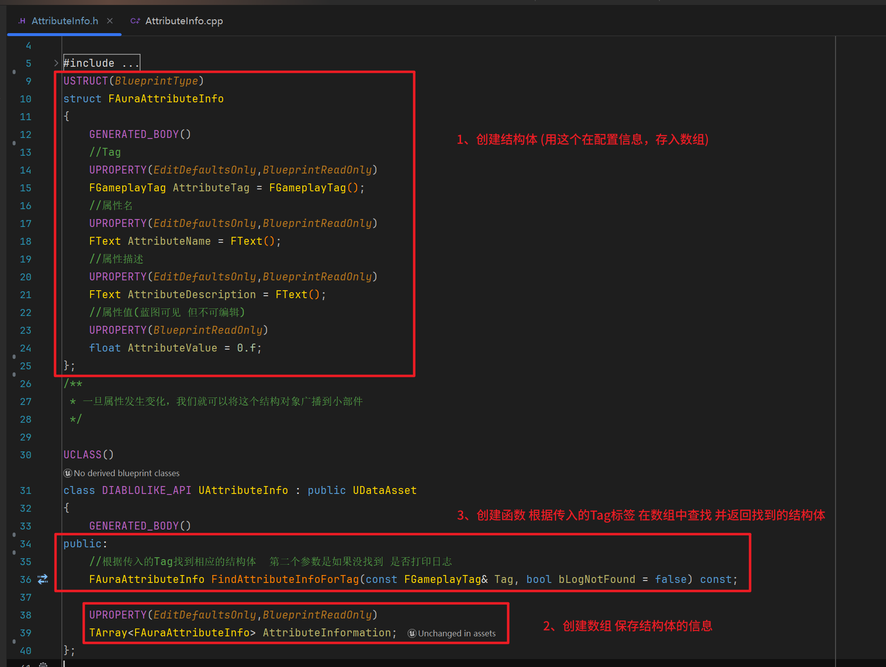

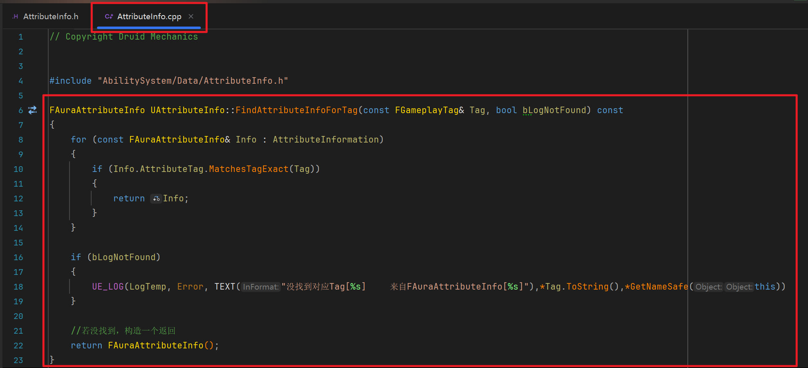


+ `头文件`中：
```cpp
// Copyright Druid Mechanics
#pragma once
#include "CoreMinimal.h"
#include "GameplayTagContainer.h"
#include "Engine/DataAsset.h"
#include "AttributeInfo.generated.h"
USTRUCT(BlueprintType)
struct FAuraAttributeInfo
{
	GENERATED_BODY()
	//Tag
	UPROPERTY(EditDefaultsOnly,BlueprintReadOnly)
	FGameplayTag AttributeTag = FGameplayTag();
	//属性名
	UPROPERTY(EditDefaultsOnly,BlueprintReadOnly)
	FText AttributeName = FText();
	//属性描述
	UPROPERTY(EditDefaultsOnly,BlueprintReadOnly)
	FText AttributeDescription = FText();
	//属性值(蓝图可见 但不可编辑)
	UPROPERTY(BlueprintReadOnly)
	float AttributeValue = 0.f;
};
/**
 * 一旦属性发生变化，我们就可以将这个结构对象广播到小部件
 */

UCLASS()
class DIABLOLIKE_API UAttributeInfo : public UDataAsset
{
	GENERATED_BODY()
public:
	//根据传入的Tag找到相应的结构体	第二个参数是如果没找到 是否打印日志
	FAuraAttributeInfo FindAttributeInfoForTag(const FGameplayTag& Tag, bool bLogNotFound = false) const;
	
	UPROPERTY(EditDefaultsOnly,BlueprintReadOnly)
	TArray<FAuraAttributeInfo> AttributeInformation;
};

```

&emsp;

+ `源文件`中：
```cpp
// Copyright Druid Mechanics
#include "AbilitySystem/Data/AttributeInfo.h"

FAuraAttributeInfo UAttributeInfo::FindAttributeInfoForTag(const FGameplayTag& Tag, bool bLogNotFound) const
{
	for (const FAuraAttributeInfo& Info : AttributeInformation)
	{
		if (Info.AttributeTag.MatchesTagExact(Tag))
		{
			return Info;
		}
	}
	if (bLogNotFound)
	{
		UE_LOG(LogTemp, Error, TEXT("没找到对应Tag[%s]	来自FAuraAttributeInfo[%s]"),*Tag.ToString(),*GetNameSafe(this))
	}
	
	//若没找到，构造一个返回
	return FAuraAttributeInfo();
}

```

&emsp;

&emsp;

___________________________________________________________________________________________


### 在蓝图中继承,创建并配置数据资产

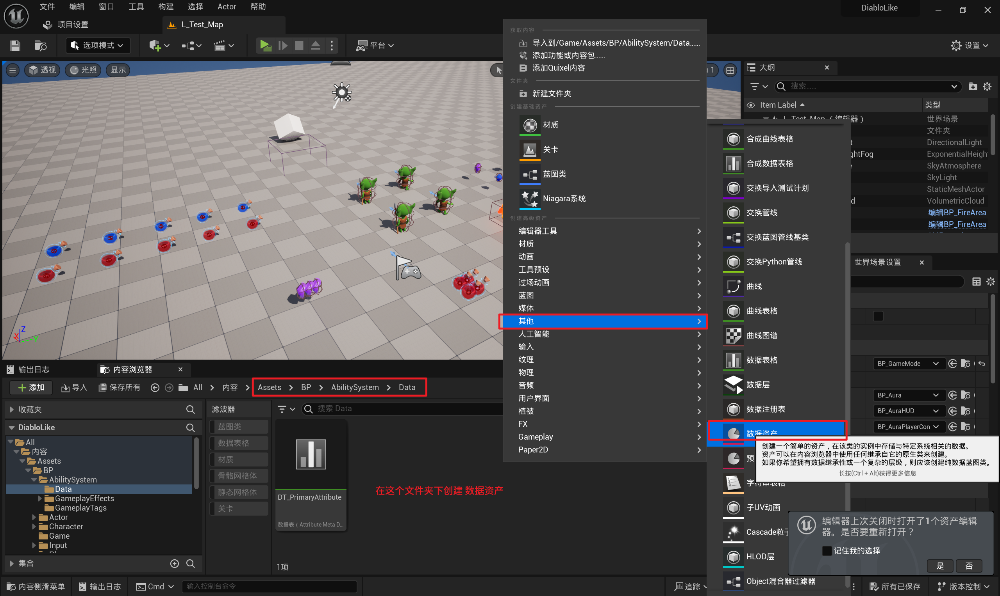
    

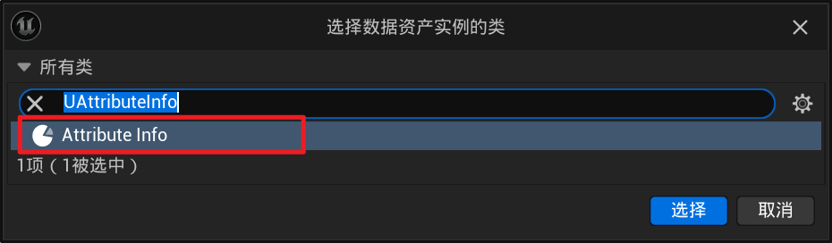
    

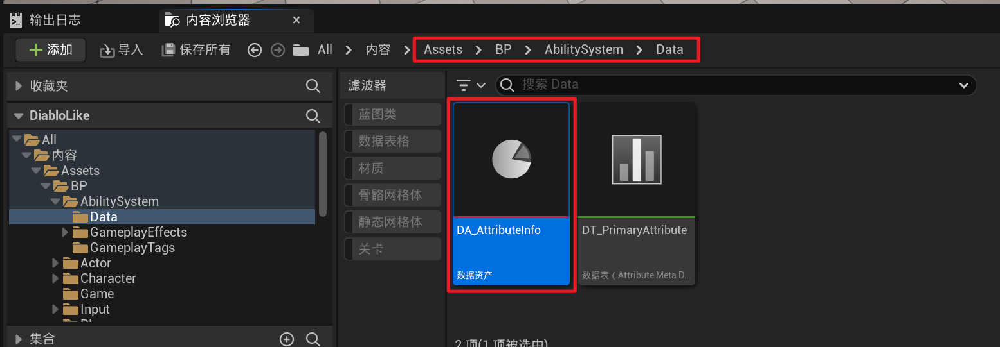
    
      
    

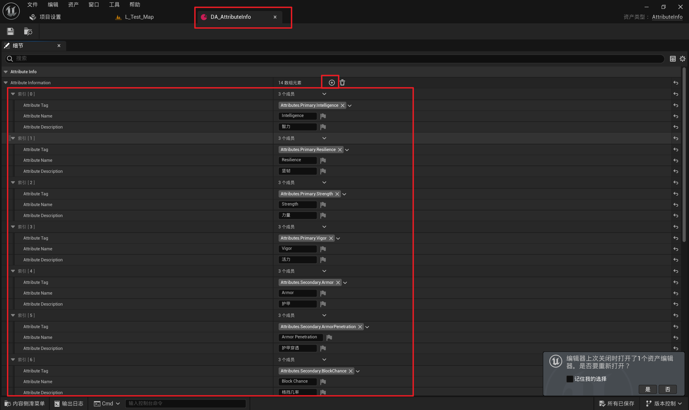
    
___________________________________________________________________________________________


### 小测试:制作WidgetController


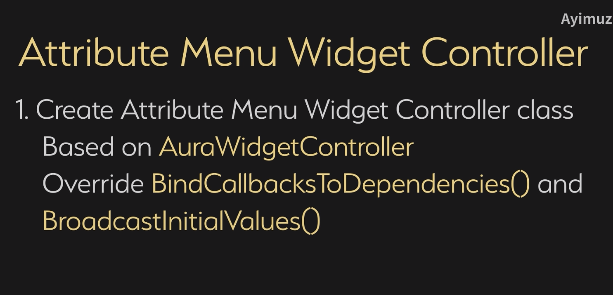

___________________________________________________________________________________________


#### 自己尝试一下

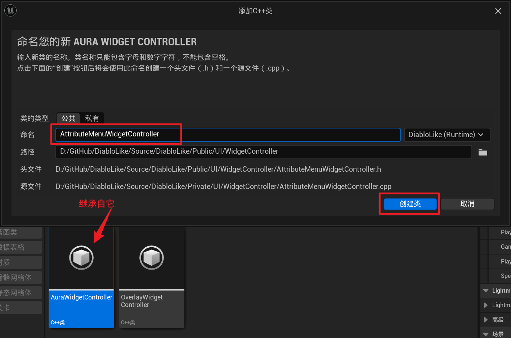

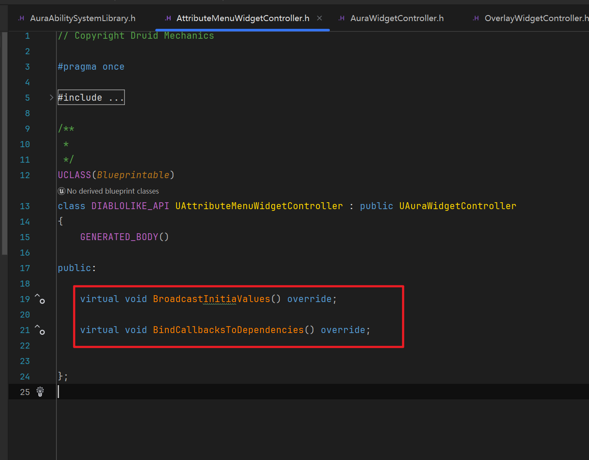

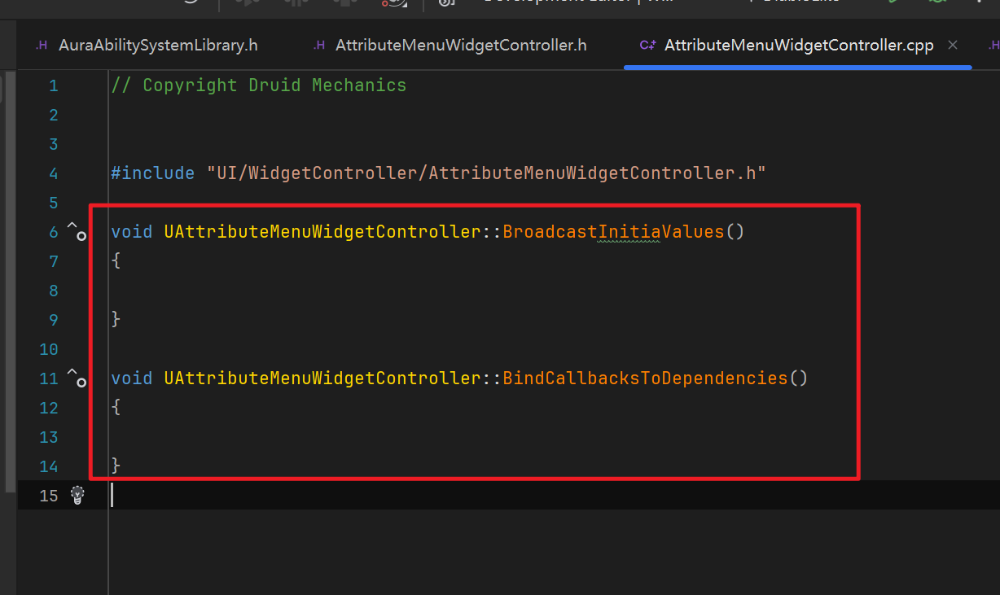


&emsp;

+ `头文件`中：
```cpp
public:
	virtual void BroadcastInitiaValues() override;
	virtual void BindCallbacksToDependencies() override;
```

&emsp;

+ `源文件`中：
```cpp
void UAttributeMenuWidgetController::BroadcastInitiaValues()
{
}
void UAttributeMenuWidgetController::BindCallbacksToDependencies()
{
}
```

&emsp;

&emsp;

___________________________________________________________________________________________

[返回最上面](#Go主菜单)
___________________________________________________________________________________________