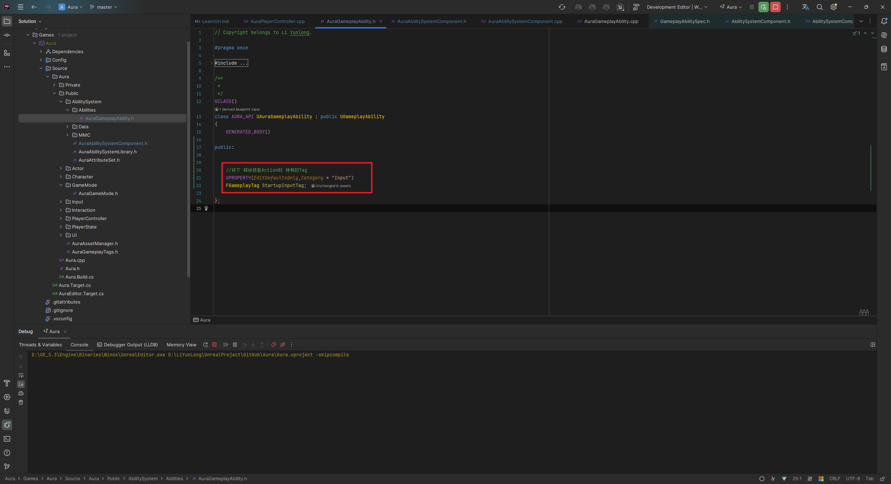
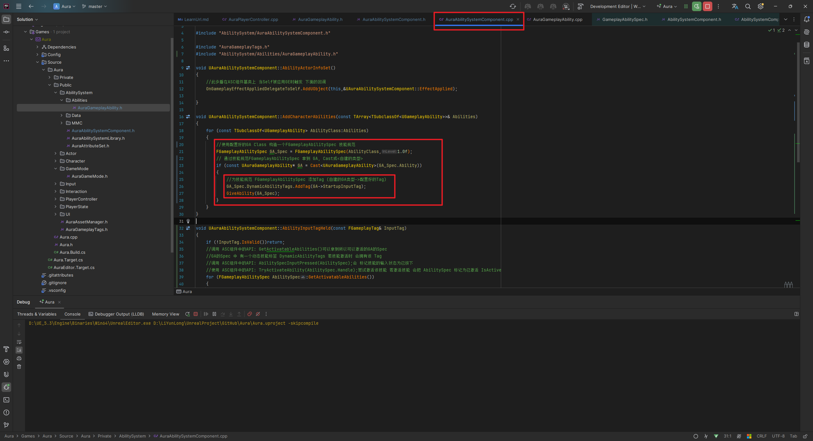
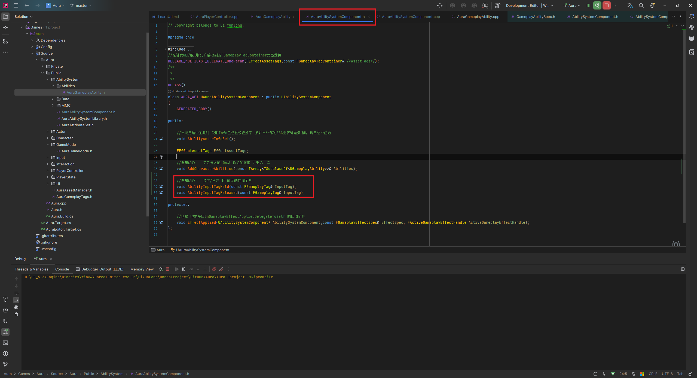
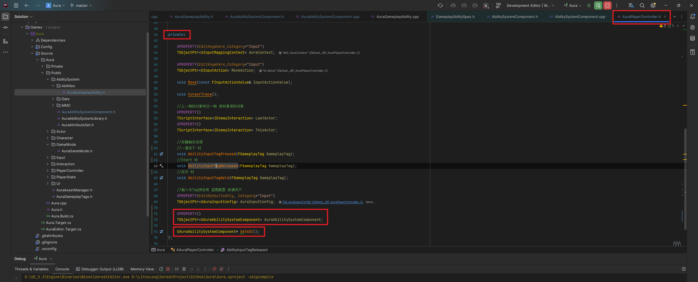
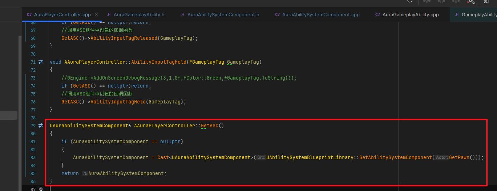
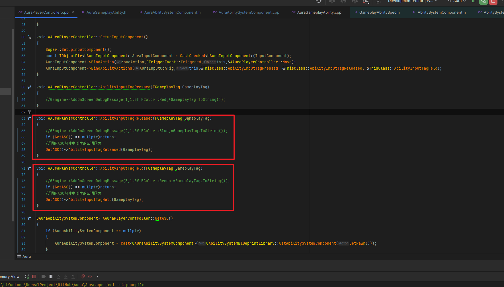
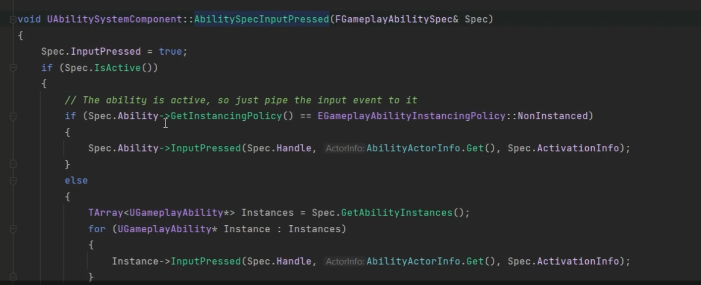
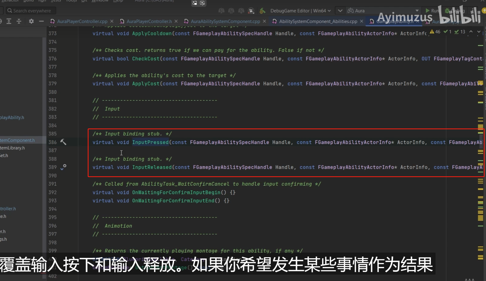
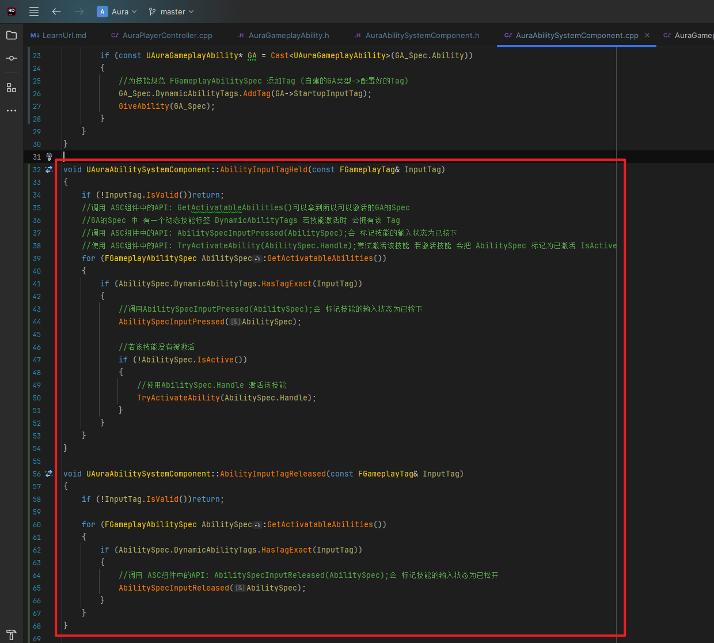
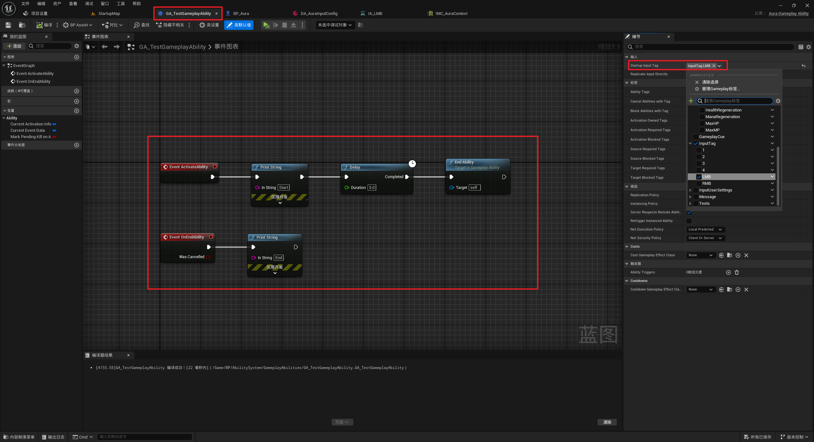

___________________________________________________________________________________________

###### [Go主菜单](../MainMenu.md)
___________________________________________________________________________________________

# GAS 030 GA中配置Tag,并在按下和松开按键时的回调函数中设置,保证释放GA时,触发并持有该Tag
___________________________________________________________________________________________
## 处理关键点
1. 赋予角色技能时,给 技能GA 添加 动态标签DynamicAbilityTag
2. 调用 ASC组件中的API: GetActivatableAbilities()可以拿到所以可以激活的GA的Spec
3. GA的Spec 中 有一个动态技能标签 DynamicAbilityTags 若技能激活时 会拥有该 Tag
4. 调用 ASC组件中的API: `AbilitySpecInputPressed(AbilitySpec);`会 标记技能的输入状态为已按下
5. 使用 ASC组件中的API: `TryActivateAbility(AbilitySpec.Handle);`尝试激活该技能 若激活技能 会把 `AbilitySpec` 标记为已激活 `IsActive`
6. 使用`AbilitySpec.Handle` 激活该技能`TryActivateAbility(AbilitySpec.Handle);`
___________________________________________________________________________________________

# 目录
- [GAS 030 GA中配置Tag,并在按下和松开按键时的回调函数中设置,保证释放GA时,触发并持有该Tag](#gas-030-ga中配置tag并在按下和松开按键时的回调函数中设置保证释放ga时触发并持有该tag)
  - [处理关键点](#处理关键点)
- [目录](#目录)
    - [视频链接:](#视频链接)
      - [6. Callbacks for Ability Input\_哔哩哔哩\_bilibili](#6-callbacks-for-ability-input_哔哩哔哩_bilibili)
    - [UAuraGameplayAbility 中,内部持有 `GameplayTag` 变量](#uauragameplayability-中内部持有-gameplaytag-变量)
      - [内部持有GameplayTag变量](#内部持有gameplaytag变量)
    - [UAuraAbilitySystemComponent中,赋予角色技能时,给技能GA添加动态标签`DynamicAbilityTag`,创建两个松开后的回调函数,传入`tag`](#uauraabilitysystemcomponent中赋予角色技能时给技能ga添加动态标签dynamicabilitytag创建两个松开后的回调函数传入tag)
      - [在赋予角色技能时,可以给 技能GA 添加 动态标签DynamicAbilityTag](#在赋予角色技能时可以给-技能ga-添加-动态标签dynamicabilitytag)
      - [创建两个松开后的回调函数,传入tag](#创建两个松开后的回调函数传入tag)
    - [AAuraPlayerController 中](#aauraplayercontroller-中)
      - [持有asc组件和创建内部获取的方法](#持有asc组件和创建内部获取的方法)
        - [`get`](#get)
      - [开始按下和松开的回调函数中调用ASC组件中创建的开始按下和松开的回调函数](#开始按下和松开的回调函数中调用asc组件中创建的开始按下和松开的回调函数)
    - [UAuraAbilitySystemComponent 中](#uauraabilitysystemcomponent-中)
      - [参考](#参考)
        - [基类ASC组件中的参考（这里是对于 默认没有实例化的GA的操作）](#基类asc组件中的参考这里是对于-默认没有实例化的ga的操作)
        - [基类GA中的参考,虚函数可以重写](#基类ga中的参考虚函数可以重写)
      - [下面是关键步骤](#下面是关键步骤)
    - [*GA* 中配置tag](#ga-中配置tag)

___________________________________________________________________________________________

### 视频链接:
___________________________________________________________________________________________

####  [6. Callbacks for Ability Input_哔哩哔哩_bilibili]("https://www.bilibili.com/video/BV1JD421E7yC?p=100&vd_source=9e1e64122d802b4f7ab37bd325a89e6c")
___________________________________________________________________________________________

### UAuraGameplayAbility 中,内部持有 `GameplayTag` 变量

#### 内部持有GameplayTag变量  

___________________________________________________________________________________________

### UAuraAbilitySystemComponent中,赋予角色技能时,给技能GA添加动态标签`DynamicAbilityTag`,创建两个松开后的回调函数,传入`tag`
___________________________________________________________________________________________

#### 在赋予角色技能时,可以给 技能GA 添加 动态标签DynamicAbilityTag  

___________________________________________________________________________________________

#### 创建两个松开后的回调函数,传入tag  

___________________________________________________________________________________________

### AAuraPlayerController 中

#### 持有asc组件和创建内部获取的方法  

___________________________________________________________________________________________

##### `get`

___________________________________________________________________________________________

#### 开始按下和松开的回调函数中调用ASC组件中创建的开始按下和松开的回调函数  

___________________________________________________________________________________________

### UAuraAbilitySystemComponent 中

#### 参考

##### 基类ASC组件中的参考（这里是对于 默认没有实例化的GA的操作）  

___________________________________________________________________________________________

##### 基类GA中的参考,虚函数可以重写  

___________________________________________________________________________________________

#### 下面是关键步骤
     

___________________________________________________________________________________________

### *GA* 中配置tag
     

___________________________________________________________________________________________

[返回最上面](#Go主菜单)
___________________________________________________________________________________________