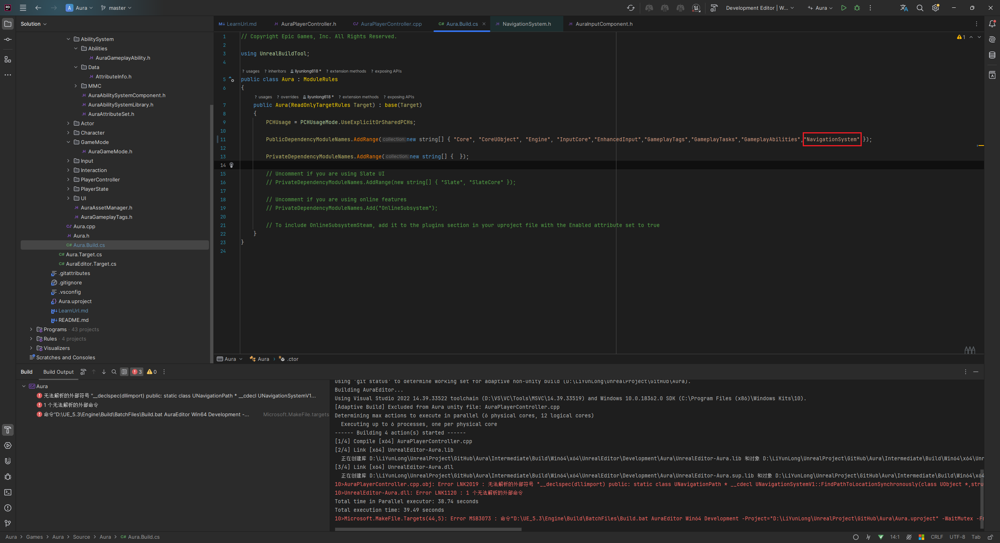
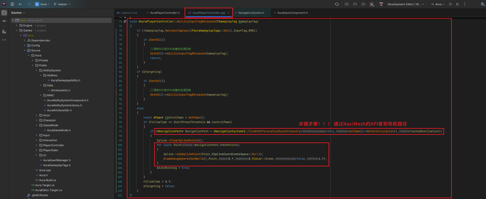
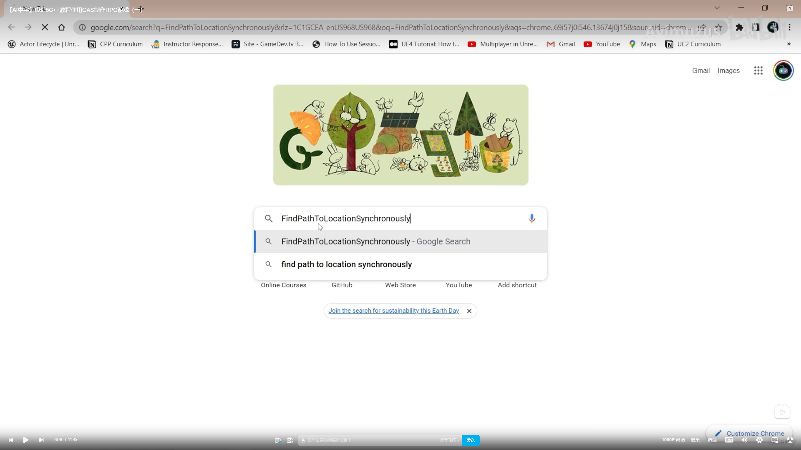
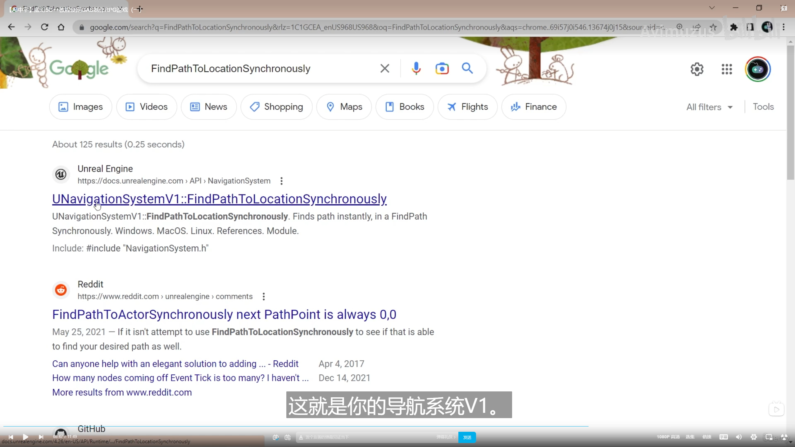
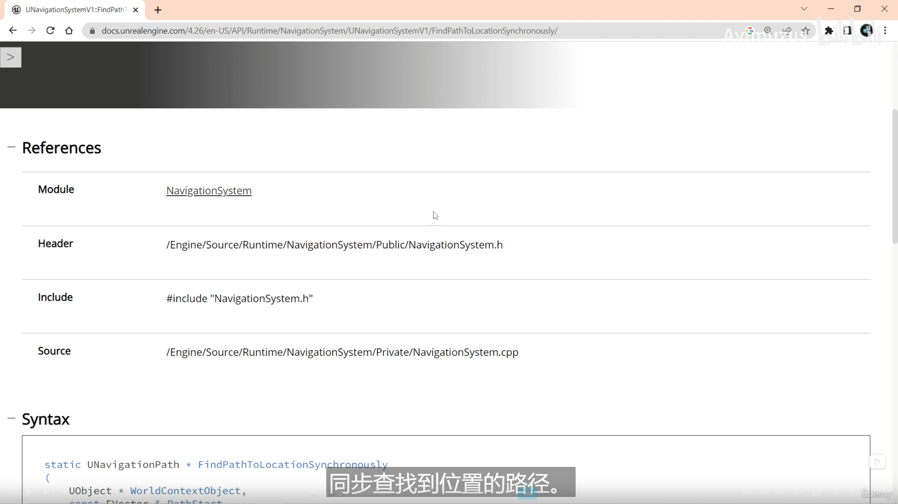
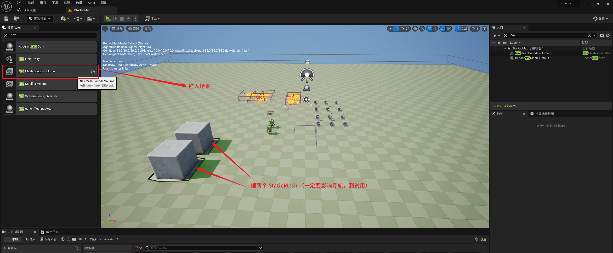

___________________________________________________________________________________________

###### [Go主菜单](../MainMenu.md)
___________________________________________________________________________________________

# GAS 032 PC短按 实现自动移动

___________________________________________________________________________________________

# 目录
- [GAS 032 PC短按 实现自动移动](#gas-032-pc短按-实现自动移动)
- [目录](#目录)
    - [视频链接](#视频链接)
    - [使用 NaviMesh 的 API 需要 引模块 " NavigationSystem "](#使用-navimesh-的-api-需要-引模块--navigationsystem-)
      - [需要引模块" NavigationSystem "](#需要引模块-navigationsystem-)
    - [AAuraPlayerController 中](#aauraplayercontroller-中)
      - [AbilityInputTagReleased 函数中](#abilityinputtagreleased-函数中)
        - [如果不为左键点击tag,调用ASC组件的回调函数,然后return:若为左键点击时,if有目标,调用ASC组件的回调函数:没目标,这里才是需要处理的逻辑:](#如果不为左键点击tag调用asc组件的回调函数然后return若为左键点击时if有目标调用asc组件的回调函数没目标这里才是需要处理的逻辑)
        - [获取NaviMesh导航路径和导航点](#获取navimesh导航路径和导航点)
          - [需要引模块`NavigationSystem`](#需要引模块navigationsystem)
    - [小技巧:当你不知道一个函数的模块时,可以谷歌](#小技巧当你不知道一个函数的模块时可以谷歌)
      - [会定位到官方文档,哈哈哈,所以还是需要在文档里面找](#会定位到官方文档哈哈哈所以还是需要在文档里面找)
    - [加入导航网格体 Nav Mesh Bounds Volume](#加入导航网格体-nav-mesh-bounds-volume)
    - [我使用的是右键移动,此时短按右键,会Debug导航点](#我使用的是右键移动此时短按右键会debug导航点)

___________________________________________________________________________________________

### 视频链接
___________________________________________________________________________________________

[https://www.bilibili.com/video/BV1JD421E7yC?p=104&vd_source=9e1e64122d802b4f7ab37bd325a89e6c]("https://www.bilibili.com/video/BV1JD421E7yC?p=104&vd_source=9e1e64122d802b4f7ab37bd325a89e6c")
___________________________________________________________________________________________

### 使用 NaviMesh 的 API 需要 引模块 " NavigationSystem "

#### 需要引模块" NavigationSystem "  

___________________________________________________________________________________________

### AAuraPlayerController 中

#### AbilityInputTagReleased 函数中

##### 如果不为左键点击tag,调用ASC组件的回调函数,然后return:若为左键点击时,if有目标,调用ASC组件的回调函数:没目标,这里才是需要处理的逻辑:

##### 获取NaviMesh导航路径和导航点

先拿到控制的角色,若点击时间小于等于 阈值 且 控制角色不为空时,先清空样条线的所有点,通过 NaviMesh 的API: `UNavigationSystemV1::FindPathToLocationSynchronously` 拿到 NaviMesh 的导航路径,路径结构体中有个 `PathPoints` 数组保存了路径点的信息,遍历一下为样条线添加点,生成debug球体,然后 `bAutoRunning=true` :然后设置记录鼠标点击时间的变量为0.f,设置 `bTargeting=false`
         

___________________________________________________________________________________________

###### 需要引模块`NavigationSystem` 

___________________________________________________________________________________________

### 小技巧:当你不知道一个函数的模块时,可以谷歌
     

     

#### 会定位到官方文档,哈哈哈,所以还是需要在文档里面找  

___________________________________________________________________________________________

### 加入导航网格体 Nav Mesh Bounds Volume
     

___________________________________________________________________________________________

### 我使用的是右键移动,此时短按右键,会Debug导航点

___________________________________________________________________________________________

[返回最上面](#Go主菜单)
___________________________________________________________________________________________