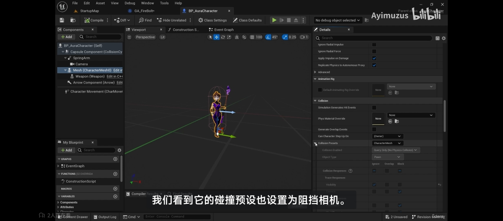
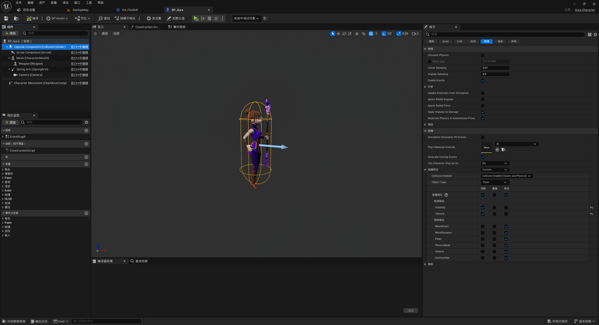
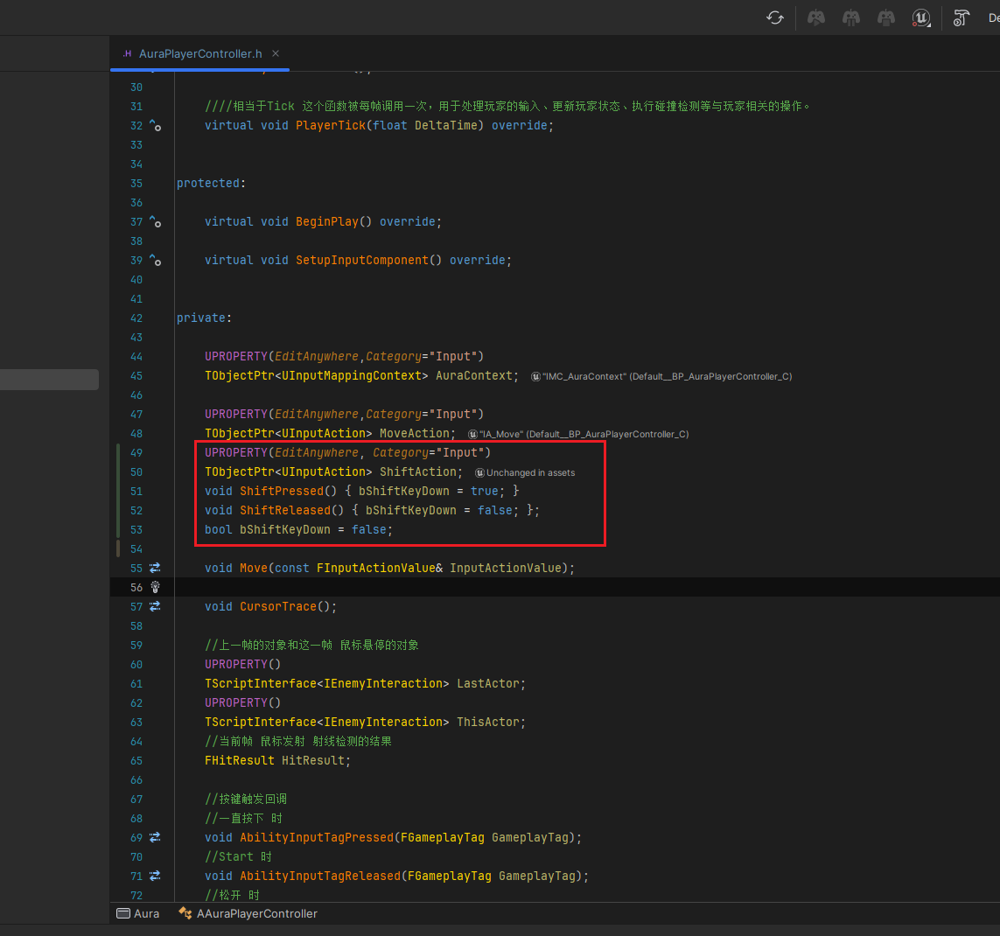
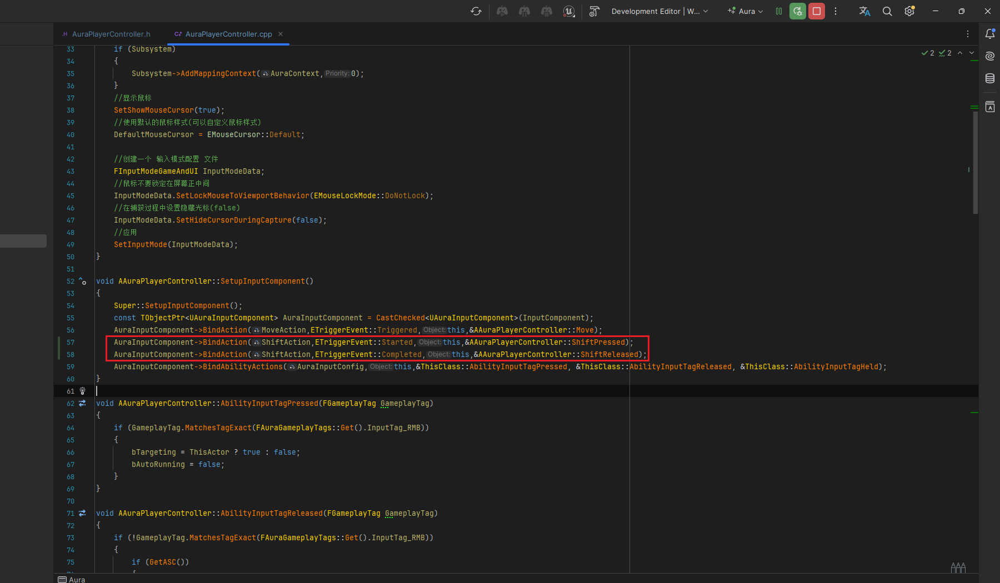
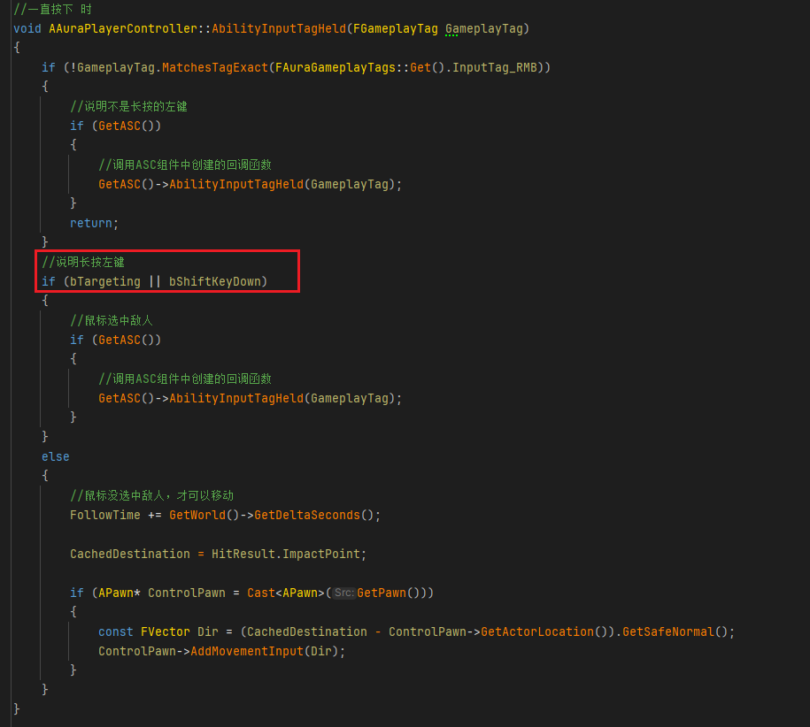
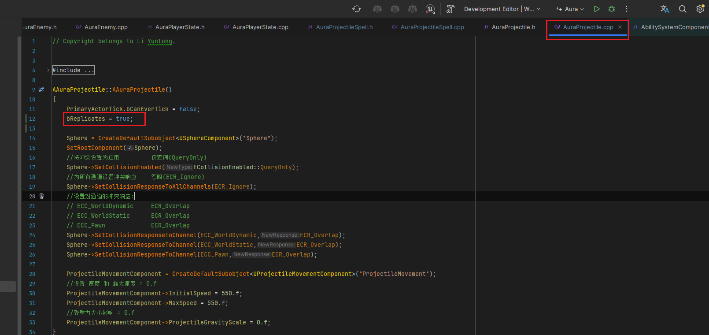

___________________________________________________________________________________________

###### [Go主菜单](../MainMenu.md)
___________________________________________________________________________________________

# GAS 042 修正火球角度,添加复制,按下shift时普攻
___________________________________________________________________________________________
## 处理关键点
1. 使用: `向量.Rotation();` 获取角度FRotator
2. 使用: `角度.Quaternion();` 获取该角度的四元数
3. C++中设置 碰撞通道
4. DS / LS网络复制相关
___________________________________________________________________________________________

# 目录
- [GAS 042 修正火球角度,添加复制,按下shift时普攻](#gas-042-修正火球角度添加复制按下shift时普攻)
  - [处理关键点](#处理关键点)
- [目录](#目录)
    - [视频链接](#视频链接)
    - [生成抛射物的函数 SpawnProjectile 中,](#生成抛射物的函数-spawnprojectile-中)
      - [头文件,添加形参,传入位置](#头文件添加形参传入位置)
      - [源文件,计算方向,设置Rotation](#源文件计算方向设置rotation)
    - [GA蓝图 *GA\_FireBolt* 中,获取HitResult后保存 Location ,传参](#ga蓝图-ga_firebolt-中获取hitresult后保存-location-传参)
    - [此时有个问题,一个角色会把另一个角色弹簧臂挡住,需要C++中设置一下角色capsule和mesh的碰撞通道,对camera为忽略](#此时有个问题一个角色会把另一个角色弹簧臂挡住需要c中设置一下角色capsule和mesh的碰撞通道对camera为忽略)
    - [此时希望添加一个功能,按下shift时,不用点到敌人,也可以发射普通攻击火球](#此时希望添加一个功能按下shift时不用点到敌人也可以发射普通攻击火球)
      - [步骤](#步骤)
        - [1.添加`InputAction`,并设置为`1d`输入](#1添加inputaction并设置为1d输入)
        - [2.配置`InputAction`](#2配置inputaction)
        - [3. `AAuraPlayerController` 中](#3-aauraplayercontroller-中)
        - [*BP\_AuraPlayerController* 中配置](#bp_auraplayercontroller-中配置)
    - [记得火球 `AAuraProjectile` 中开启复制`bReplicates`,否则客户端无法看见](#记得火球-aauraprojectile-中开启复制breplicates否则客户端无法看见)
    - [此时效果gif](#此时效果gif)

___________________________________________________________________________________________

### 视频链接
  - [视频链接](https://b23.tv/IGADhLV)

### 生成抛射物的函数 SpawnProjectile 中,
#### 头文件,添加形参,传入位置
         

#### 源文件,计算方向,设置Rotation
         

___________________________________________________________________________________________

### GA蓝图 *GA_FireBolt* 中,获取HitResult后保存 Location ,传参
     

___________________________________________________________________________________________

### 此时有个问题,一个角色会把另一个角色弹簧臂挡住,需要C++中设置一下角色capsule和mesh的碰撞通道,对camera为忽略
     
  

     

     
  

___________________________________________________________________________________________

### 此时希望添加一个功能,按下shift时,不用点到敌人,也可以发射普通攻击火球

#### 步骤

##### 1.添加`InputAction`,并设置为`1d`输入
             

             

___________________________________________________________________________________________

##### 2.配置`InputAction`
             

___________________________________________________________________________________________

##### 3. `AAuraPlayerController` 中
             

             

             
  

___________________________________________________________________________________________

##### *BP_AuraPlayerController* 中配置
             

___________________________________________________________________________________________

### 记得火球 `AAuraProjectile` 中开启复制`bReplicates`,否则客户端无法看见
     

___________________________________________________________________________________________

### 此时效果gif 
 

___________________________________________________________________________________________

[返回最上面](#Go主菜单)
___________________________________________________________________________________________