___________________________________________________________________________________________

###### [Go主菜单](../MainMenu.md)
___________________________________________________________________________________________

# GAS 045 C++中创建和使用自定义碰撞类型
___________________________________________________________________________________________
## 处理关键点
1. 物体若要碰撞检测需要开启`Generate Overlap Events`
2. 当我们第一次创建自定义碰撞通道时,它会占用游戏追踪1"`ECC_GameTraceChannel1`"这个通道
___________________________________________________________________________________________

# 目录

- [GAS 045 C++中创建和使用自定义碰撞类型](#gas-045-c中创建和使用自定义碰撞类型)
  - [处理关键点](#处理关键点)
- [目录](#目录)
    - [视频链接](#视频链接)
    - [现在有一个问题,就是障碍物不会阻挡普攻火球,因为没有开启`Generate Overlap Events`](#现在有一个问题就是障碍物不会阻挡普攻火球因为没有开启generate-overlap-events)
    - [而目前需要增加一种碰撞类型,将药水和攻击产生的火球区分开](#而目前需要增加一种碰撞类型将药水和攻击产生的火球区分开)
    - [在项目`Aura.h`中定义一个宏,用来指定新的碰撞类型,新增自定义碰撞检测类型 第一次为:`ECC_GameTraceChannel1`](#在项目aurah中定义一个宏用来指定新的碰撞类型新增自定义碰撞检测类型-第一次为ecc_gametracechannel1)
      - [当我们第一次创建自定义碰撞通道时,](#当我们第一次创建自定义碰撞通道时)
    - [设置抛射物的类型为 新创建的碰撞检测通道](#设置抛射物的类型为-新创建的碰撞检测通道)
    - [此时药水对新碰撞通道的检测类型为忽略](#此时药水对新碰撞通道的检测类型为忽略)
    - [抛射物的通道应该为新增的碰撞通道,这一步需要在C++中设置,AAuraProjectile中](#抛射物的通道应该为新增的碰撞通道这一步需要在c中设置aauraprojectile中)
    - [此时 安德烈的mesh碰撞通道检测设置为](#此时-安德烈的mesh碰撞通道检测设置为)
    - [我觉得pawn不能overlap,不然一出来就碰撞了,而且,胶囊体和mesh同时设为检测感觉也会有问题,先往后看吧](#我觉得pawn不能overlap不然一出来就碰撞了而且胶囊体和mesh同时设为检测感觉也会有问题先往后看吧)
    - [在角色的基类中,设置和新的碰撞通道检测为overlap(但角色在蓝图里设置为忽略暂时),这样后期可以做pvp,哈哈哈](#在角色的基类中设置和新的碰撞通道检测为overlap但角色在蓝图里设置为忽略暂时这样后期可以做pvp哈哈哈)

___________________________________________________________________________________________


___________________________________________________________________________________________


### 视频链接
  - [视频链接](https://b23.tv/S4qK6oc)

___________________________________________________________________________________________


### 现在有一个问题,就是障碍物不会阻挡普攻火球,因为没有开启`Generate Overlap Events`

  
 
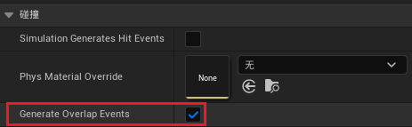


 
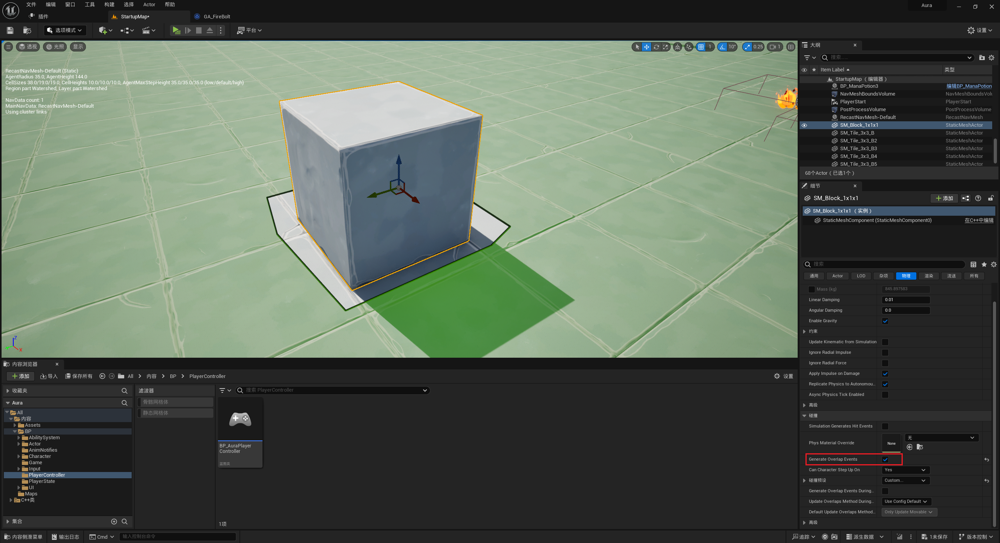

___________________________________________________________________________________________


### 而目前需要增加一种碰撞类型,将药水和攻击产生的火球区分开

- 项目->collision中添加,默认为忽略全部。（这样如果需要和什么发生重叠事件可以手动调整为overlap）使结果更可控

 
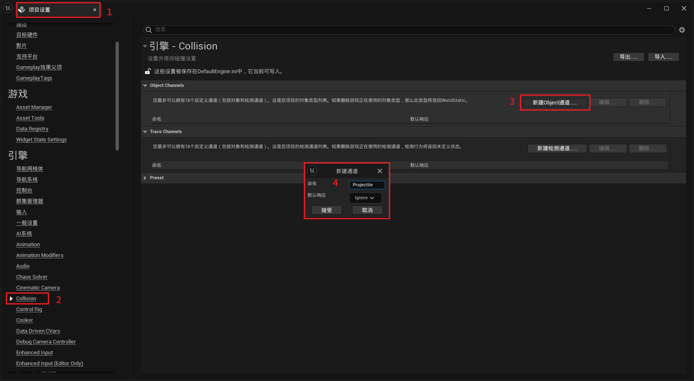

___________________________________________________________________________________________


### 在项目`Aura.h`中定义一个宏,用来指定新的碰撞类型,新增自定义碰撞检测类型 第一次为:`ECC_GameTraceChannel1`

```cpp
ECC_GameTraceChannel1
```

#### 当我们第一次创建自定义碰撞通道时,
它会占用 **游戏追踪1**`ECC_GameTraceChannel1` 这个通道
 
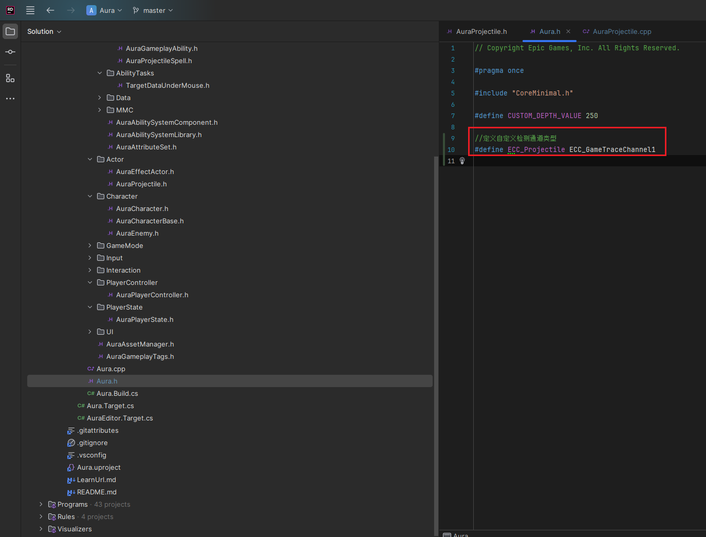

___________________________________________________________________________________________


### 设置抛射物的类型为 新创建的碰撞检测通道

___________________________________________________________________________________________


### 此时药水对新碰撞通道的检测类型为忽略

 


___________________________________________________________________________________________


### 抛射物的通道应该为新增的碰撞通道,这一步需要在C++中设置,AAuraProjectile中

要设置这里
 
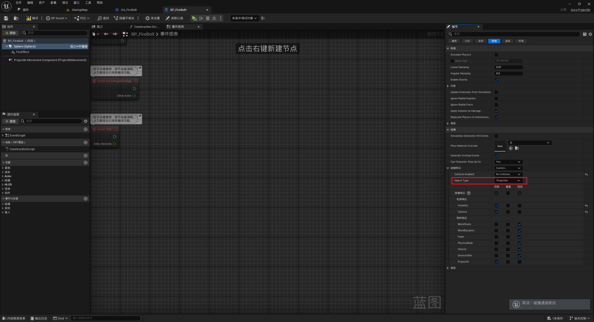

 
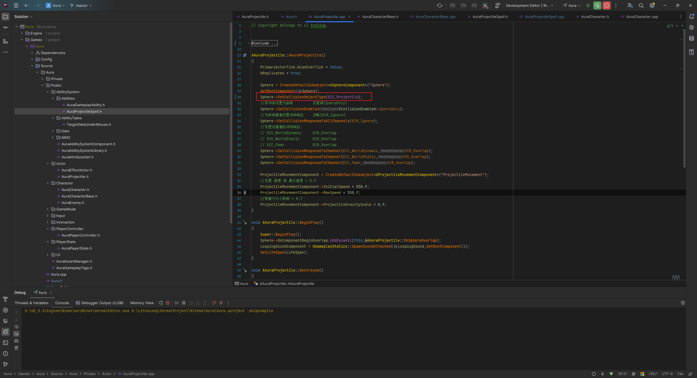

___________________________________________________________________________________________


### 此时 安德烈的mesh碰撞通道检测设置为

 
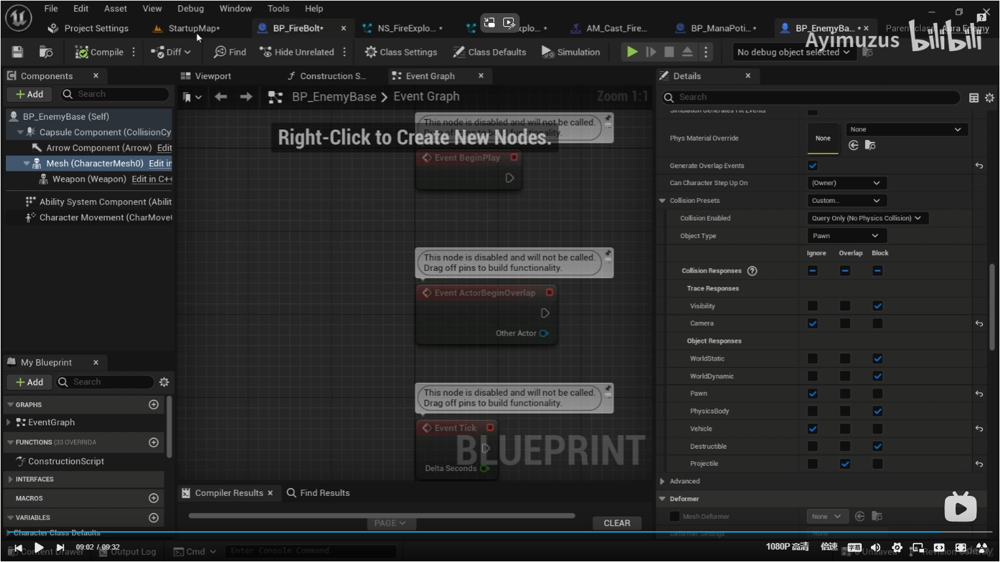

___________________________________________________________________________________________


### 我觉得pawn不能overlap,不然一出来就碰撞了,而且,胶囊体和mesh同时设为检测感觉也会有问题,先往后看吧

___________________________________________________________________________________________


### 在角色的基类中,设置和新的碰撞通道检测为overlap(但角色在蓝图里设置为忽略暂时),这样后期可以做pvp,哈哈哈

 
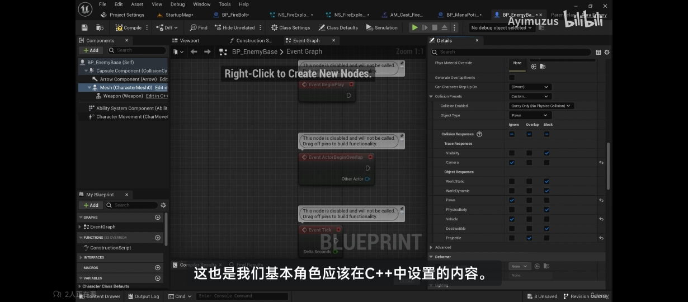
 
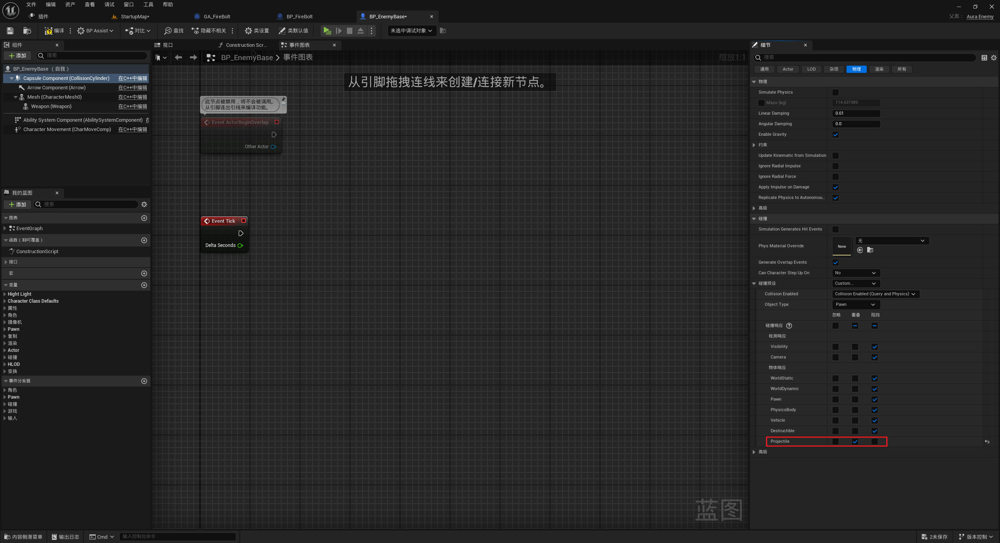
 
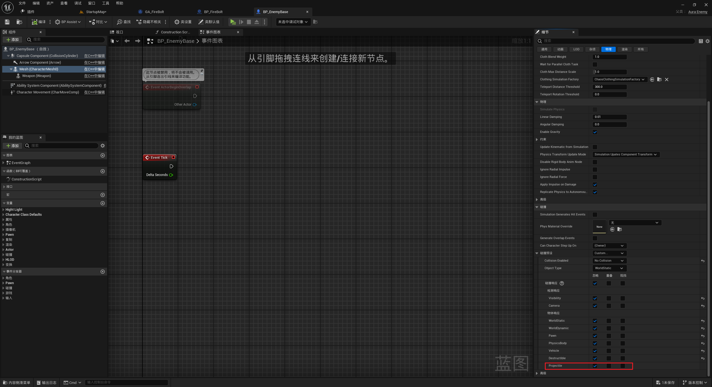

 
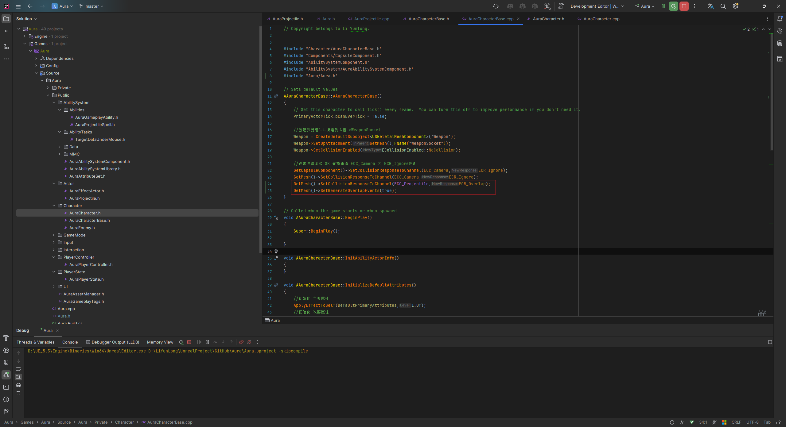

___________________________________________________________________________________________

[返回最上面](#Go主菜单)
___________________________________________________________________________________________