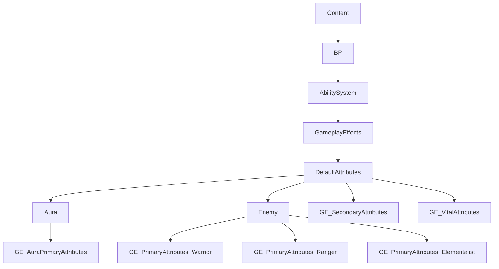

___________________________________________________________________________________________
###### [Go主菜单](../MainMenu.md)
___________________________________________________________________________________________

# GAS 051 使用表格创建CSV和Json;导入CSV/Json生成表格

___________________________________________________________________________________________

## 处理关键点

1. 使用UE引擎内表格导出CSV和Json

2. 导入CSV和Json

3. 三种曲线表格区别和特点

___________________________________________________________________________________________

# 目录

- [GAS 051 使用表格创建CSV和Json;导入CSV/Json生成表格](#gas-051-使用表格创建csv和json导入csvjson生成表格)
  - [处理关键点](#处理关键点)
- [目录](#目录)
    - [整理主要属性、次要属性、基础属性的GE文件夹](#整理主要属性次要属性基础属性的ge文件夹)
    - [在 *DA\_CharacterClassInfo* 中为敌人类配置GE](#在-da_characterclassinfo-中为敌人类配置ge)
    - [上面是 Default Attribute Effects 的内容](#上面是-default-attribute-effects-的内容)
    - [下面是 Curve Tables -CSV and JSON 的内容](#下面是-curve-tables--csv-and-json-的内容)
    - [创建敌人曲线文件夹给不同种类的敌人主要属性GE初始化用 `因为本项目的设计是敌人出生后属性固定，出生前可以指定生成等级`](#创建敌人曲线文件夹给不同种类的敌人主要属性ge初始化用-因为本项目的设计是敌人出生后属性固定出生前可以指定生成等级)
    - [使用UE引擎内表格导出CSV和Json](#使用ue引擎内表格导出csv和json)
    - [导入CSV和Json](#导入csv和json)
    - [需要注意的是导入的csv无法转换为立方插值只能线性，而导入的Json可以选择线性或者立方插值，总的来说Json适配性更高](#需要注意的是导入的csv无法转换为立方插值只能线性而导入的json可以选择线性或者立方插值总的来说json适配性更高)
    - [为主属性配表](#为主属性配表)
    - [此时敌人正和角色使用一样的次要属性GE](#此时敌人正和角色使用一样的次要属性ge)

___________________________________________________________________________________________

视频链接

[Default Attribute Effects](https://www.bilibili.com/video/BV1JD421E7yC?p=127&vd_source=9e1e64122d802b4f7ab37bd325a89e6c)
[Curve Tables -CSV and JSON](https://www.bilibili.com/video/BV1JD421E7yC?p=128&vd_source=9e1e64122d802b4f7ab37bd325a89e6c)

___________________________________________________________________________________________

### 整理主要属性、次要属性、基础属性的GE文件夹

> 整理 `Content/BP/AbilitySystem/GameplayEffects/DefaultAttributes/` 文件夹
>
> 想把敌人的GE也放在这里所以需要在这个文件夹下创建一个 `Aura` 文件夹，将之前创建的，角色的主要属性GE / 次要属性GE / 基础属性GE放到里面
>
> 再创建一个 `Enemy` 文件夹，因为敌人有三种类别，需要创建三种敌人类型的主要属性，继承自 `GameplayEffect` 
>
> - 战士主要属性 `GE_PrimaryAttributes_Warrior` 
> - 游侠主要属性 `GE_PrimaryAttributes_Ranger` 
> - 法师主要属性 `GE_PrimaryAttributes_Elementalist` 
>
> 
>
> 次要属性因为可以共享，因为是计算方式，本项目是相同的计算方式所以
>
> - 将角色的次要属性GE `GE_AuraSecondaryAttributes` 改名为 `GE_SecondaryAttributes` 去掉角色名字，打算和敌人共享计算方式
> - 将角色的基础属性GE `GE_AuraVitalAttributes` 改名为 `GE_VitalAttributes` 
> - 将 `GE_SecondaryAttributes` 和 `GE_VitalAttributes` 挪到 `Content/BP/AbilitySystem/GameplayEffects/DefaultAttributes/` 路径下
>

**此时文件夹结构**

### 在 *DA_CharacterClassInfo* 中为敌人类配置GE

___________________________________________________________________________________________

### 上面是 Default Attribute Effects 的内容
### 下面是 Curve Tables -CSV and JSON 的内容

___________________________________________________________________________________________

### 创建敌人曲线文件夹给不同种类的敌人主要属性GE初始化用 `因为本项目的设计是敌人出生后属性固定，出生前可以指定生成等级` 

在 `Content/BP/AbilitySystem/GameplayEffects/DefaultAttributes/Enemy/` 文件夹下创建文件夹 `CurveTables` 用来保存曲线

> 为每个类型的敌人，创建立方插值类型的曲线表格，分别命名为：
>
> -  `CT_PrimaryAttributes_Warrior` 
> -  `CT_PrimaryAttributes_Ranger` 
> -  `CT_PrimaryAttributes_Elementalist` 

表格一共三种类型

> `右键`->`其他`->`曲线表格`
>
> | 表格类型 | 中文     | 特点                             |
> | -------- | -------- | -------------------------------- |
> | Linear   | 线性     | 点与点之间直线连接，无法插值     |
> | Constant | 常数     | -                                |
> | Cubic    | 立方插值 | 点与点之间可直线可插值，可调曲率 |
>
> 
>
> 

关于表格内的行命名，想使用与Tag标签相同的名字，分别为

| 行命名   | 对应属性 |
| -------- | :----: |
|`Attributes.Primary.Strength`|力量|
|`Attributes.Primary.Intelligence`|智力|
|`Attributes.Primary.Resilience`|韧性|
|`Attributes.Primary.Vigor`|活力|

下面是我使用的不同种类敌人的表格数据

> - Elementalist
>
> | 行命名 |             对应属性              | 1级  | 40级 |
> | ------ | :-------------------------------: | ---- | ---- |
> | 力量   |   `Attributes.Primary.Strength`   | 5    | 25   |
> | 智力   | `Attributes.Primary.Intelligence` | 15   | 40   |
> | 韧性   |  `Attributes.Primary.Resilience`  | 11   | 20   |
> | 活力   |    `Attributes.Primary.Vigor`     | 5    | 14   |
>
> - Ranger
>
> | 行命名 |             对应属性              | 1级  | 40级 |
> | ------ | :-------------------------------: | ---- | ---- |
> | 力量   |   `Attributes.Primary.Strength`   | 6    | 34   |
> | 智力   | `Attributes.Primary.Intelligence` | 12   | 32   |
> | 韧性   |  `Attributes.Primary.Resilience`  | 13   | 33   |
> | 活力   |    `Attributes.Primary.Vigor`     | 11   | 35   |
>
> - Warrior
>
> | 行命名 |             对应属性              | 1级  | 40级 |
> | ------ | :-------------------------------: | ---- | ---- |
> | 力量   |   `Attributes.Primary.Strength`   | 15   | 42   |
> | 智力   | `Attributes.Primary.Intelligence` | 5    | 13   |
> | 韧性   |  `Attributes.Primary.Resilience`  | 15   | 31   |
> | 活力   |    `Attributes.Primary.Vigor`     | 11   | 29   |

___________________________________________________________________________________________

### 使用UE引擎内表格导出CSV和Json

使用UE引擎内表格导出CSV

> - 右键选择表格->导出为CSV
>
> 
> csv可用表格打开编辑，或记事本
>
> 可以在这里重新导入，但是无法撤销!!!慎重!!!

使用UE引擎内表格导出Json

> - 右键选择表格->导出为Json
>
> 

### 导入CSV和Json

导入CSV和Json

> 

___________________________________________________________________________________________

### 需要注意的是导入的csv无法转换为立方插值只能线性，而导入的Json可以选择线性或者立方插值，总的来说Json适配性更高

___________________________________________________________________________________________

### 为主属性配表

这里图片比较多就折叠起来了

> 
>
> 
>
> 

> **配置完成**

___________________________________________________________________________________________

### 此时敌人正和角色使用一样的次要属性GE
- 此GE是一直持续存在在场景里且会随时影响角色的
- 而设想是当地人初始化后，属性固定，不需要再变动
- 所以此时需要根据角色的次要属性GE复制一个
- 把持续时间改为一次性 `Instant` 
- 并在 *DA_CharacterClassInfo* 中替换

___________________________________________________________________________________________

[返回最上面](#Go主菜单)

___________________________________________________________________________________________