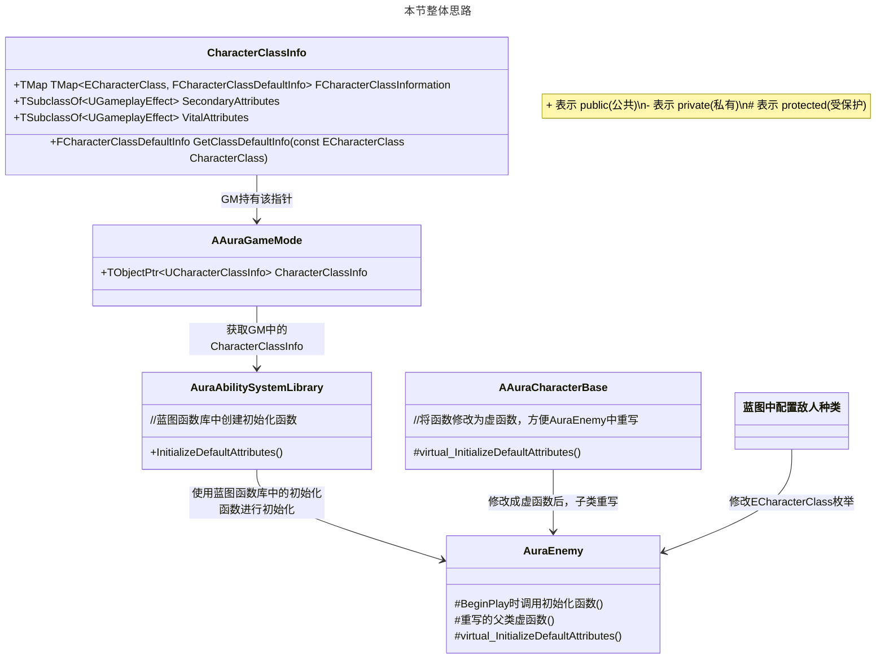
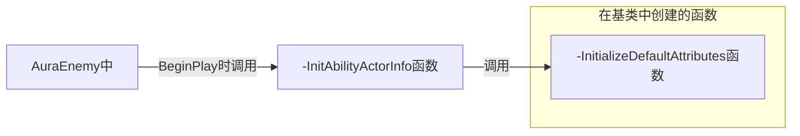

___________________________________________________________________________________________
###### [Go主菜单](../MainMenu.md)
___________________________________________________________________________________________

# GAS 052 初始化敌人属性

___________________________________________________________________________________________

## 处理关键点

1. 蓝图识别的反射宏修改元数据

2. 创建GE并应用到自身的步骤

3. 创建GE并应用到自身最容易忘哪一步？

4. 通过FGameplayEffectSpecHandle对象，都能拿到哪些数据？


___________________________________________________________________________________________

# 目录


- [GAS 052 初始化敌人属性](#gas-052-初始化敌人属性)
	- [本节整体思路](#本节整体思路)
		- [在GM中配置存储数据资产](#在gm中配置存储数据资产)
		- [在蓝图函数库中创建静态函数，需要 `初始化默认属性` 时调用](#在蓝图函数库中创建静态函数需要-初始化默认属性-时调用)
		- [下面需要为次要属性和基础属性也初始化](#下面需要为次要属性和基础属性也初始化)
		- [下面需要为敌人配置种类](#下面需要为敌人配置种类)
			- [来到 `AuraEnemy` 中](#来到-auraenemy-中)
		- [在`AuraEnemy` 重写的虚函数中调用上面写的蓝图函数库的静态函数初始化属性](#在auraenemy-重写的虚函数中调用上面写的蓝图函数库的静态函数初始化属性)
		- [蓝图配置敌人种类并在初始化时断点调试结果](#蓝图配置敌人种类并在初始化时断点调试结果)
	- [有时间可以整理下FGameplayEffectSpecHandle里面的数据类型](#有时间可以整理下fgameplayeffectspechandle里面的数据类型)


___________________________________________________________________________________________

<details>
<summary>视频链接</summary>

[GAS 052 初始化敌人属性视频链接]([5. Initializing Enemy Attributes_哔哩哔哩_bilibili](https://www.bilibili.com/video/BV1JD421E7yC?p=129&vd_source=9e1e64122d802b4f7ab37bd325a89e6c))

</details>


___________________________________________________________________________________________

> **上节课我们创建了数据资产类 `CharacterClassInfo` 和外部调用的方法，本节需要找个地方存储该数据，然后找到合适的机会获取数据并初始化**

___________________________________________________________________________________________

## 本节整体思路



___________________________________________________________________________________________

### 在GM中配置存储数据资产

在 `AuraGameMode` 中创建智能指针保存该数据资产，取名 `CharacterClassInfo` 

```cpp
UPROPERTY(EditDefaultsOnly, Category = "Character Class Defaults")
TObjectPtr<UCharacterClassInfo> CharacterClassInfo;
```
___________________________________________________________________________________________

>现在问题来了：我们如何访问这个数据资产？

___________________________________________________________________________________________

### 在蓝图函数库中创建静态函数，需要 `初始化默认属性` 时调用

在 `AuraAbilitySystemLibrary` 中，创建函数，根据敌人类型和等级，初始化默认属性，取名 `InitializeDefaultAttributes` 

- `AuraAbilitySystemLibrary` 头文件中：创建初始化默认属性函数

  ```CPP
  		UFUNCTION(BlueprintCallable, Category = "AuraAbilitySystemLibrary|CharacterClassDefaults")
  		static void InitializeDefaultAttributes(ECharacterClass CharacterClass, float Level);
  ```
  
- 因为函数内需要获取 GameMode 使用API: `UGameplayStatics::GetGameMode(这里需要一个WorldContextObject)` 

- 所以需要添加一个形参 `const UObject* WorldContextObject` 

<details>
<summary>回忆一下试试咋加WorldContextObject</summary>


```cpp
  		UFUNCTION(BlueprintCallable, Category = "AuraAbilitySystemLibrary|CharacterClassDefaults", meta=( WorldContextObject = "WorldContextObject"))
  		static void InitializeDefaultAttributes(const UObject* WorldContextObject, ECharacterClass CharacterClass, float Level);
```

</details>


___________________________________________________________________________________________


- 添加完后的`AuraAbilitySystemLibrary` 源文件 `InitializeDefaultAttributes` 函数中

  ```CPP
  void UAuraAbilitySystemLibrary::InitializeDefaultAttributes(const UObject* WorldContextObject, ECharacterClass CharacterClass, float Level)
  {
      //拿到有效的GM
  	const AAuraGameMode* GameMode = Cast<AAuraGameMode>(UGameplayStatics::GetGameMode(WorldContextObject));
  	if (GameMode == nullptr)return;
  }
  ```
  
  
___________________________________________________________________________________________

- 因为 `CharacterClassInfo` 中写了：根据枚举类型返回结构体的函数
  

- `AuraAbilitySystemLibrary` 源文件 `InitializeDefaultAttributes` 函数中

  通过图中写好的函数，拿到 `FCharacterClassDefaultInfo` 结构体
  
  ```CPP
  void UAuraAbilitySystemLibrary::InitializeDefaultAttributes(const UObject* WorldContextObject, ECharacterClass CharacterClass, float Level)
  {
  	const AAuraGameMode* GameMode = Cast<AAuraGameMode>(UGameplayStatics::GetGameMode(WorldContextObject));
  	if (GameMode == nullptr)return;
      //通过图中写好的函数，拿到FCharacterClassDefaultInfo结构体
  	FCharacterClassDefaultInfo ClassDefaultInfo = GameMode->CharacterClassInfo->GetClassDefaultInfo(CharacterClass);
  }
  ```

<details>
<summary>如果忘了结构体和CharacterClassInfo中都包含什么，看一眼</summary>


</details>

> 此时想要给目标自身应用一个GE效果，回忆一下应用GE效果需要什么？


<details>
<summary>应用GE效果需要什么？</summary>
答案：ASC组件 `AbilitySystemComponent` 
因为需要使用API:

```CPP
//这里需要传一个FGameplayEffectSpec的引用
AbilitySystemComponent->ApplyGameplayEffectSpecToSelf(const FGameplayEffectSpec& GameplayEffect)
```

想要获取 `FGameplayEffectSpec` 需要使用ASC创建一个 `FGameplayEffectSpecHandle` 类型的变量，需要使用API:

```CPP
//需要的形参: 1.要使用的GE 2.等级 3.一个GE的ContextHandle
const FGameplayEffectSpecHandle SpecHandle = AbilitySystemComponent->MakeOutgoingSpec(TSubclassOf<UGameplayEffect> GameplayEffectClass, float Level, FGameplayEffectContextHandle Context)
```

GE的ContextHandle需要使用API:

```CPP
const FGameplayEffectContextHandle Context = AbilitySystemComponent->MakeEffectContext();
```

这个时候怎么通过FGameplayEffectSpecHandle类型的变量，拿到FGameplayEffectSpec类型的变量呢？

- 假设这里有一个变量 `FGameplayEffectSpecHandle SpecHandle;` 

-  `SpecHandle.Data` 拿到的是一个智能指针

- 因为需要一个变量所以别忘了解引用

   ```CPP
   //将解引用后的参数 FGameplayEffectSpec 传入
   AbilitySystemComponent->ApplyGameplayEffectSpecToSelf(*SpecHandle.Data);
   ```

   

   > **完成生成并应用GE**


</details>


<details>
<summary>那么如何获取？</summary>

答案：传参进来


+ `AuraAbilitySystemLibrary`  `头文件`中：
```cpp
UFUNCTION(BlueprintCallable, Category = "AuraAbilitySystemLibrary|CharacterClassDefaults", meta=( WorldContextObject = "WorldContextObject"))
		static void InitializeDefaultAttributes(const UObject* WorldContextObject, ECharacterClass CharacterClass, float Level, UAbilitySystemComponent* ASC);
```

+ `AuraAbilitySystemLibrary`  `源文件`中：
```cpp
void UAuraAbilitySystemLibrary::InitializeDefaultAttributes(const UObject* WorldContextObject, ECharacterClass CharacterClass, float Level, UAbilitySystemComponent* ASC)
{
	const AAuraGameMode* GameMode = Cast<AAuraGameMode>(UGameplayStatics::GetGameMode(WorldContextObject));
	if (GameMode == nullptr)return;
	const FCharacterClassDefaultInfo ClassDefaultInfo = GameMode->CharacterClassInfo->GetClassDefaultInfo(CharacterClass);
	//生成一个GE并应用到Self
	const FGameplayEffectContextHandle Context = ASC->MakeEffectContext();
	const FGameplayEffectSpecHandle SpecHandle = ASC->MakeOutgoingSpec(ClassDefaultInfo.PrimaryAttributes,Level,Context);
	ASC->ApplyGameplayEffectSpecToSelf(*SpecHandle.Data);
}
```


</details>


### 下面需要为次要属性和基础属性也初始化


+ `AuraAbilitySystemLibrary`  `源文件`中：
```cpp
void UAuraAbilitySystemLibrary::InitializeDefaultAttributes(const UObject* WorldContextObject, ECharacterClass CharacterClass, float Level, UAbilitySystemComponent* ASC)
{
	const AAuraGameMode* GameMode = Cast<AAuraGameMode>(UGameplayStatics::GetGameMode(WorldContextObject));
	if (GameMode == nullptr)return;
	const FCharacterClassDefaultInfo ClassDefaultInfo = GameMode->CharacterClassInfo->GetClassDefaultInfo(CharacterClass);
    
	const FGameplayEffectSpecHandle PrimaryAttributesSpecHandle = ASC->MakeOutgoingSpec(ClassDefaultInfo.PrimaryAttributes,Level,ASC->MakeEffectContext());
	ASC->ApplyGameplayEffectSpecToSelf(*PrimaryAttributesSpecHandle.Data);
    
	const FGameplayEffectSpecHandle SecondaryAttributesSpecHandle = ASC->MakeOutgoingSpec(GameMode->CharacterClassInfo->SecondaryAttributes,Level,ASC->MakeEffectContext());
	ASC->ApplyGameplayEffectSpecToSelf(*SecondaryAttributesSpecHandle.Data);
    
	const FGameplayEffectSpecHandle VitalAttributesSpecHandle = ASC->MakeOutgoingSpec(GameMode->CharacterClassInfo->VitalAttributes,Level,ASC->MakeEffectContext());
	ASC->ApplyGameplayEffectSpecToSelf(*VitalAttributesSpecHandle.Data);
}
```


___________________________________________________________________________________________

### 下面需要为敌人配置种类
#### 来到 `AuraEnemy` 中

```CPP
protected:
	//创建敌人种类枚举
	UPROPERTY(EditAnywhere, BlueprintReadOnly, Category = "Character Class Defaults")
	ECharacterClass CharacterClass = ECharacterClass::Warrior;
```

因为初始化函数写在了基类中，子类不能修改



所以需要，**将 `InitializeDefaultAttributes` 函数修改为虚函数**(不想创建过多单独的函数)

 `AAuraCharacterBase` 基类中修改

### 在`AuraEnemy` 重写的虚函数中调用上面写的蓝图函数库的静态函数初始化属性

+ `头文件`中：
```cpp
protected:
	virtual void InitializeDefaultAttributes() override;
```


+ `源文件`中：
```cpp
void AAuraEnemy::InitializeDefaultAttributes()
{
	UAuraAbilitySystemLibrary::InitializeDefaultAttributes(this,CharacterClass,Level,AbilitySystemComponent);
}
```

> **现在我们应该看到我们的敌人根据他们的职业和等级显示正确的属性。**
> 现在编译引擎

___________________________________________________________________________________________

给 *BP_AuraGameMode* 配置数据资产

> 运行游戏

此时有报错信息

此时在蓝图函数库调用初始化时断点调试


<details>
<summary>调试信息</summary>


</details>

显示 `SourceObject == nullptr` 说明**在生成GE时忘记给 `SourceObject` 了**

此时回到蓝图函数库 `UAuraAbilitySystemLibrary`  `InitializeDefaultAttributes` 函数中

<details>
<summary>使用ASC组件获取AvatarActor并添加到SourceObject</summary>


```CPP
void UAuraAbilitySystemLibrary::InitializeDefaultAttributes(const UObject* WorldContextObject, ECharacterClass CharacterClass, float Level, UAbilitySystemComponent* ASC)
{
	const AAuraGameMode* GameMode = Cast<AAuraGameMode>(UGameplayStatics::GetGameMode(WorldContextObject));
	if (GameMode == nullptr)return;
	const FCharacterClassDefaultInfo ClassDefaultInfo = GameMode->CharacterClassInfo->GetClassDefaultInfo(CharacterClass);

	const AActor* Actor = ASC->GetAvatarActor();
	
	FGameplayEffectContextHandle PrimaryAttributesContextHandle = ASC->MakeEffectContext();
	PrimaryAttributesContextHandle.AddSourceObject(Actor);
	const FGameplayEffectSpecHandle PrimaryAttributesSpecHandle = ASC->MakeOutgoingSpec(ClassDefaultInfo.PrimaryAttributes,Level,PrimaryAttributesContextHandle);
	ASC->ApplyGameplayEffectSpecToSelf(*PrimaryAttributesSpecHandle.Data);
    
	FGameplayEffectContextHandle SecondaryAttributesContextHandle = ASC->MakeEffectContext();
	SecondaryAttributesContextHandle.AddSourceObject(Actor);
	const FGameplayEffectSpecHandle SecondaryAttributesSpecHandle = ASC->MakeOutgoingSpec(GameMode->CharacterClassInfo->SecondaryAttributes,Level,SecondaryAttributesContextHandle);
	ASC->ApplyGameplayEffectSpecToSelf(*SecondaryAttributesSpecHandle.Data);

	FGameplayEffectContextHandle VitalAttributesContextHandle = ASC->MakeEffectContext();
	VitalAttributesContextHandle.AddSourceObject(Actor);
	const FGameplayEffectSpecHandle VitalAttributesSpecHandle = ASC->MakeOutgoingSpec(GameMode->CharacterClassInfo->VitalAttributes,Level,VitalAttributesContextHandle);
	ASC->ApplyGameplayEffectSpecToSelf(*VitalAttributesSpecHandle.Data);
}
```

</details>

### 蓝图配置敌人种类并在初始化时断点调试结果

<details>
<summary>调试结果</summary>


可以在这里断点

断点调试结果

这里甚至可以看到用的什么表格

</details>


> 说明初始化属性正常


___________________________________________________________________________________________

## 有时间可以整理下FGameplayEffectSpecHandle里面的数据类型

___________________________________________________________________________________________

[返回最上面](#Go主菜单)

___________________________________________________________________________________________