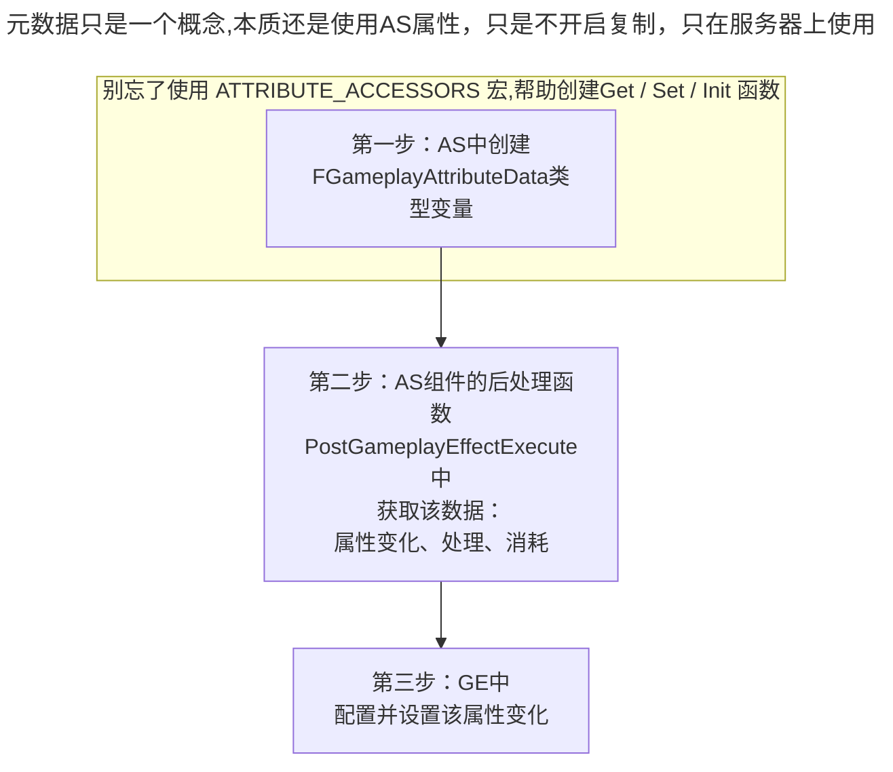

___________________________________________________________________________________________
###### [Go主菜单](../MainMenu.md)
___________________________________________________________________________________________

# GAS 054 创建伤害元属性

___________________________________________________________________________________________

## 处理关键点

1. 元属性特性

2. 元属性从创建到使用


___________________________________________________________________________________________

# 目录


- [GAS 054 创建伤害元属性](#gas-054-创建伤害元属性)
	- [目录](#目录)
		- [整体思路梳理](#整体思路梳理)
		- [为此我们需要创建一个  `即将受到的伤害的元属性` 这将是第一个元属性](#为此我们需要创建一个--即将受到的伤害的元属性-这将是第一个元属性)
		- [需要了解:元属性的特性](#需要了解元属性的特性)
		- [第一步:创建元属性](#第一步创建元属性)
		- [第二步:使用元属性 `IncomingDamage`](#第二步使用元属性-incomingdamage)
		- [第三步:改变我们的伤害游戏效果，让它现在使用我们的元属性](#第三步改变我们的伤害游戏效果让它现在使用我们的元属性)
		- [现在我们在GE\_Damage中使用25.f作为伤害值，我们希望角色造成的伤害可以和GameplayAbility有所关联](#现在我们在ge_damage中使用25f作为伤害值我们希望角色造成的伤害可以和gameplayability有所关联)


___________________________________________________________________________________________

<details>
<summary>视频链接</summary>

[创建伤害元属性视频链接]([2. Damage Meta Attribute_哔哩哔哩_bilibili](https://www.bilibili.com/video/BV1JD421E7yC?p=131&vd_source=9e1e64122d802b4f7ab37bd325a89e6c))

</details>

___________________________________________________________________________________________

### 整体思路梳理


___________________________________________________________________________________________

> 之前的扣血处理是在 *GE_Damage* 文件上处理的简单扣血，需要改成 **元属性** 的方式处理


___________________________________________________________________________________________

我们也希望在任何自定义计算中使用该损坏元属性。

因为受伤计算是更加复杂的计算方式，甚至希望修改为自定义计算方式

___________________________________________________________________________________________

### 为此我们需要创建一个  `即将受到的伤害的元属性` 这将是第一个元属性

 `UAuraAttributeSet` 中创建 `即将受到的伤害的元属性` 取名为 `IncomingDamage` 

___________________________________________________________________________________________

### 需要了解:元属性的特性

需要注意的是元属性： 

- **会影响别的属性**
- **但不会被复制**
- **设置在服务器上**
- **在服务器上处理数据，根据这些计算更改任何 `复制` 的属性**

___________________________________________________________________________________________

### 第一步:创建元属性

```CPP
public:

	/* 这里标注一下是元属性
	 * Meta Attributes
	 */
	UPROPERTY(BlueprintReadOnly,Category = "Meta Attributes")
	FGameplayAttributeData IncomingDamage;
	ATTRIBUTE_ACCESSORS(UAuraAttributeSet,IncomingDamage);//AS组件源码中 帮助 Get / Set / Init 属性的宏
```
___________________________________________________________________________________________

### 第二步:使用元属性 `IncomingDamage` 

在 `PostGameplayEffectExecute` 函数中，

可以从实参拿到 `FGameplayEffectModCallbackData` 类型的变量，就是 `GE修改后的回调数据` **`Data`** 

```CPP
virtual void PostGameplayEffectExecute(const FGameplayEffectModCallbackData& Data) override;
```

需要这个函数内获取使用并 消耗元数据[1^]

```cpp
void UAuraAttributeSet::PostGameplayEffectExecute(const FGameplayEffectModCallbackData& Data)
{
	Super::PostGameplayEffectExecute(Data);
	FEffectProperties Props;
	SetEffectProperties(Data,Props);
	if (Data.EvaluatedData.Attribute == GetHealthAttribute())
	{
		SetHealth(FMath::Clamp(GetHealth(),0.0f,GetMaxHealth()));
		UE_LOG(LogTemp,Error,TEXT("Changed Health on %s, Health%f"),*Props.TargetAvatarActor->GetName(),GetHealth())
	}
	if (Data.EvaluatedData.Attribute == GetManaAttribute())
	{
		SetMana(FMath::Clamp(GetMana(),0.0f,GetMaxMana()));
	}

	//在这里获取使用并 消耗元数据
	if (Data.EvaluatedData.Attribute == GetIncomingDamageAttribute())
	{
		//能走到这里说明拿到了元数据 IncomingDamage 且 该属性正在发生变化
	}
}
```

<details>
<summary>关于如果逻辑走到if里面说明该属性正在发生变化，忘了可以看看这里</summary>

因为之前用在 `UOverlayWidgetController` 中，ASC组件绑定了只有属性变化时才会广播的委托!!!

</details>

1. 此时 `if` 逻辑内，需要创建一个本地的浮点变量，其值为传入的伤害。float类型变量取名为 `LocalIncomingDamage` 

   ```CPP
   const float LocalIncomingDamage = GetIncomingDamage();
   ```

2. 此时我们本地缓存该变量，然后将该元数据属性值清零

   ```cpp
   SetIncomingDamage(0.f);
   ```

   [1^]:消耗元数据指的是：每次使用元数据过后，将该源数据清零。


3. 现在我们知道了IncomingDamage的变化情况，需要在这里添加一些逻辑判断

4. 只有当 `IncomingDamage > 0` 时才判定有效伤害

   ```CPP
   //在这里获取使用并 消耗元数据
   if (Data.EvaluatedData.Attribute == GetIncomingDamageAttribute())
   {
   	//能走到这里说明拿到了元数据 IncomingDamage 且 该属性正在发生变化
   	const float LocalIncomingDamage = GetIncomingDamage();
   	SetIncomingDamage(0.f);
   	if (LocalIncomingDamage > 0.f)
   	{
   		const float NewHealth = GetHealth() - LocalIncomingDamage;
   		SetHealth(FMath::Clamp(NewHealth, 0.f, GetMaxHealth()));
   		//若计算后的健康值小于等于0,判定死亡
   		const bool bFatal = NewHealth <= 0.f;
   	}
   }
   ```

> **以上就是元数据使用的基本框架**


<details>
<summary>如果需要的话，我放一下PostGameplayEffectExecute函数内写的逻辑和UAuraAttributeSet头文件、源文件的代码，有需要可以看下</summary>


+ `PostGameplayEffectExecute函数内逻辑`：
```cpp
void UAuraAttributeSet::PostGameplayEffectExecute(const FGameplayEffectModCallbackData& Data)
{
	Super::PostGameplayEffectExecute(Data);
	FEffectProperties Props;
	SetEffectProperties(Data,Props);
	if (Data.EvaluatedData.Attribute == GetHealthAttribute())
	{
		SetHealth(FMath::Clamp(GetHealth(),0.0f,GetMaxHealth()));
		UE_LOG(LogTemp,Error,TEXT("Changed Health on %s, Health%f"),*Props.TargetAvatarActor->GetName(),GetHealth())
	}
	if (Data.EvaluatedData.Attribute == GetManaAttribute())
	{
		SetMana(FMath::Clamp(GetMana(),0.0f,GetMaxMana()));
	}

	//在这里获取使用并 消耗元数据
	if (Data.EvaluatedData.Attribute == GetIncomingDamageAttribute())
	{
		//能走到这里说明拿到了元数据 IncomingDamage 且 该属性正在发生变化
		const float LocalIncomingDamage = GetIncomingDamage();
		SetIncomingDamage(0.f);
		if (LocalIncomingDamage > 0.f)
		{
			const float NewHealth = GetHealth() - LocalIncomingDamage;
			SetHealth(FMath::Clamp(NewHealth, 0.f, GetMaxHealth()));
			//若计算后的健康值小于等于0,判定死亡
			const bool bFatal = NewHealth <= 0.f;
		}
	}
}
```

+ `UAuraAttributeSet 头文件`：
```cpp
// Copyright belongs to Li Yunlong.

#pragma once

#include "CoreMinimal.h"
#include "AbilitySystemComponent.h"
#include "AttributeSet.h"
#include "AuraAttributeSet.generated.h"

//保存属性更改后，从PostGameplayEffectExecute函数的参数Data获得的，有用的信息
USTRUCT()
struct FEffectProperties
{
	GENERATED_BODY()
	
	FEffectProperties(): SourceASC(nullptr), SourceAvatarActor(nullptr), SourceController(nullptr),
	                     SourceCharacter(nullptr),
	                     TargetASC(nullptr),
	                     TargetAvatarActor(nullptr),
	                     TargetController(nullptr),
	                     TargetCharacter(nullptr)
	{
	}

	UPROPERTY()
	FGameplayEffectContextHandle EffectContextHandle;

	UPROPERTY()
	UAbilitySystemComponent* SourceASC;
	UPROPERTY()
	AActor* SourceAvatarActor;
	UPROPERTY()
	AController* SourceController;
	UPROPERTY()
	ACharacter* SourceCharacter;
	
	UPROPERTY()
	UAbilitySystemComponent* TargetASC;
	UPROPERTY()
	AActor* TargetAvatarActor;
	UPROPERTY()
	AController* TargetController;
	UPROPERTY()
	ACharacter* TargetCharacter;
};
/**
 * 
 */

//从AS组件源码中找到的帮助 Get / Set / Init 属性的宏
#define ATTRIBUTE_ACCESSORS(ClassName, PropertyName) \
	GAMEPLAYATTRIBUTE_PROPERTY_GETTER(ClassName, PropertyName) \
	GAMEPLAYATTRIBUTE_VALUE_GETTER(PropertyName) \
	GAMEPLAYATTRIBUTE_VALUE_SETTER(PropertyName) \
	GAMEPLAYATTRIBUTE_VALUE_INITTER(PropertyName)

UCLASS()
class AURA_API UAuraAttributeSet : public UAttributeSet
{
	GENERATED_BODY()

public:
	
	UAuraAttributeSet();
	
	//此函数规定了:	1.哪些参数同步 以及 2.同步的条件			此函数在UObject中 开启 属性复制(RepNotify)后 需要重写这个函数!
	virtual void GetLifetimeReplicatedProps(TArray<FLifetimeProperty>& OutLifetimeProps) const override;

	//重写基类的 预处理函数 在这里限制属性 最大最小值
	virtual void PreAttributeChange(const FGameplayAttribute& Attribute, float& NewValue) override;

	virtual void PostGameplayEffectExecute(const FGameplayEffectModCallbackData& Data) override;

	//绑定键值对 -> Tag/函数指针
	TMap<FGameplayTag,FGameplayAttribute(*)()> TagToAttributes;
	
	//主要属性
	UPROPERTY(BlueprintReadOnly, ReplicatedUsing = OnRep_Strength, Category="Primary|Attribute")
	FGameplayAttributeData Strength;
	ATTRIBUTE_ACCESSORS(UAuraAttributeSet,Strength);//AS组件源码中 帮助 Get / Set / Init 属性的宏
	UPROPERTY(BlueprintReadOnly, ReplicatedUsing = OnRep_Intelligence, Category="Primary|Attribute")
	FGameplayAttributeData Intelligence;
	ATTRIBUTE_ACCESSORS(UAuraAttributeSet,Intelligence);//AS组件源码中 帮助 Get / Set / Init 属性的宏
	UPROPERTY(BlueprintReadOnly, ReplicatedUsing = OnRep_Resilience, Category="Primary|Attribute")
	FGameplayAttributeData Resilience;
	ATTRIBUTE_ACCESSORS(UAuraAttributeSet,Resilience);//AS组件源码中 帮助 Get / Set / Init 属性的宏
	UPROPERTY(BlueprintReadOnly, ReplicatedUsing = OnRep_Vigor, Category="Primary|Attribute")
	FGameplayAttributeData Vigor;
	ATTRIBUTE_ACCESSORS(UAuraAttributeSet,Vigor);//AS组件源码中 帮助 Get / Set / Init 属性的宏
	//次要属性
	UPROPERTY(BlueprintReadOnly, ReplicatedUsing = OnRep_Armor, Category="Secondary|Attribute")
	FGameplayAttributeData Armor;
	ATTRIBUTE_ACCESSORS(UAuraAttributeSet,Armor);//AS组件源码中 帮助 Get / Set / Init 属性的宏
	UPROPERTY(BlueprintReadOnly, ReplicatedUsing = OnRep_ArmorPenetration, Category="Secondary|Attribute")
	FGameplayAttributeData ArmorPenetration;
	ATTRIBUTE_ACCESSORS(UAuraAttributeSet,ArmorPenetration);//AS组件源码中 帮助 Get / Set / Init 属性的宏
	UPROPERTY(BlueprintReadOnly, ReplicatedUsing = OnRep_BlockChance, Category="Secondary|Attribute")
	FGameplayAttributeData BlockChance;
	ATTRIBUTE_ACCESSORS(UAuraAttributeSet,BlockChance);//AS组件源码中 帮助 Get / Set / Init 属性的宏
	UPROPERTY(BlueprintReadOnly, ReplicatedUsing = OnRep_CriticalHitChance, Category="Secondary|Attribute")
	FGameplayAttributeData CriticalHitChance;
	ATTRIBUTE_ACCESSORS(UAuraAttributeSet,CriticalHitChance);//AS组件源码中 帮助 Get / Set / Init 属性的宏
	UPROPERTY(BlueprintReadOnly, ReplicatedUsing = OnRep_CriticalHitDamage, Category="Secondary|Attribute")
	FGameplayAttributeData CriticalHitDamage;
	ATTRIBUTE_ACCESSORS(UAuraAttributeSet,CriticalHitDamage);//AS组件源码中 帮助 Get / Set / Init 属性的宏
	UPROPERTY(BlueprintReadOnly, ReplicatedUsing = OnRep_CriticalHitResistance, Category="Secondary|Attribute")
	FGameplayAttributeData CriticalHitResistance;
	ATTRIBUTE_ACCESSORS(UAuraAttributeSet,CriticalHitResistance);//AS组件源码中 帮助 Get / Set / Init 属性的宏
	UPROPERTY(BlueprintReadOnly, ReplicatedUsing = OnRep_HealthRegeneration, Category="Secondary|Attribute")
	FGameplayAttributeData HealthRegeneration;
	ATTRIBUTE_ACCESSORS(UAuraAttributeSet,HealthRegeneration);//AS组件源码中 帮助 Get / Set / Init 属性的宏
	UPROPERTY(BlueprintReadOnly, ReplicatedUsing = OnRep_ManaRegeneration, Category="Secondary|Attribute")
	FGameplayAttributeData ManaRegeneration;
	ATTRIBUTE_ACCESSORS(UAuraAttributeSet,ManaRegeneration);//AS组件源码中 帮助 Get / Set / Init 属性的宏
	UPROPERTY(BlueprintReadOnly, ReplicatedUsing = OnRep_MaxHealth, Category="Secondary|Attribute")
	FGameplayAttributeData MaxHealth;
	ATTRIBUTE_ACCESSORS(UAuraAttributeSet,MaxHealth);//AS组件源码中 帮助 Get / Set / Init 属性的宏
	UPROPERTY(BlueprintReadOnly, ReplicatedUsing = OnRep_MaxMana, Category="Secondary|Attribute")
	FGameplayAttributeData MaxMana;
	ATTRIBUTE_ACCESSORS(UAuraAttributeSet,MaxMana);//AS组件源码中 帮助 Get / Set / Init 属性的宏

	
	//ReplicatedUsing = OnRep_Health  :当前属性 Health 发生变化时 自动调用 OnRep_Health 这个函数
	UPROPERTY(BlueprintReadOnly, ReplicatedUsing = OnRep_Health, Category="Vita|Attribute")
	FGameplayAttributeData Health;
	ATTRIBUTE_ACCESSORS(UAuraAttributeSet,Health);//AS组件源码中 帮助 Get / Set / Init 属性的宏
	UPROPERTY(BlueprintReadOnly, ReplicatedUsing = OnRep_Mana, Category="Vita|Attribute")
	FGameplayAttributeData Mana;
	ATTRIBUTE_ACCESSORS(UAuraAttributeSet,Mana);//AS组件源码中 帮助 Get / Set / Init 属性的宏

	/*
	 * Meta Attributes
	 */
	UPROPERTY(BlueprintReadOnly,Category = "Meta Attributes")
	FGameplayAttributeData IncomingDamage;
	ATTRIBUTE_ACCESSORS(UAuraAttributeSet,IncomingDamage);//AS组件源码中 帮助 Get / Set / Init 属性的宏
	
	//在每个回调函数中 需要做 网络同步 相关的事
	UFUNCTION()
	void OnRep_Health(const FGameplayAttributeData& OldHealth);
	UFUNCTION()
	void OnRep_Mana(const FGameplayAttributeData& OldMana);

	//~~~Begin~~~ 属性复制 回调
	//主要属性 
	UFUNCTION()
	void OnRep_Strength(const FGameplayAttributeData& OldStrength);
	UFUNCTION()
	void OnRep_Intelligence(const FGameplayAttributeData& OldIntelligence);
	UFUNCTION()
	void OnRep_Resilience(const FGameplayAttributeData& OldResilience);
	UFUNCTION()
	void OnRep_Vigor(const FGameplayAttributeData& OldVigor);
	//次要属性
	UFUNCTION()
	void OnRep_Armor(const FGameplayAttributeData& OldArmor);
	UFUNCTION()
	void OnRep_ArmorPenetration(const FGameplayAttributeData& OldArmorPenetration);
	UFUNCTION()
	void OnRep_BlockChance(const FGameplayAttributeData& OldBlockChance);
	UFUNCTION()
	void OnRep_CriticalHitChance(const FGameplayAttributeData& OldCriticalHitChance);
	UFUNCTION()
	void OnRep_CriticalHitDamage(const FGameplayAttributeData& OldCriticalHitDamage);
	UFUNCTION()
	void OnRep_CriticalHitResistance(const FGameplayAttributeData& OldCriticalHitResistance);
	UFUNCTION()
	void OnRep_HealthRegeneration(const FGameplayAttributeData& OldHealthRegeneration);
	UFUNCTION()
	void OnRep_ManaRegeneration(const FGameplayAttributeData& OldManaRegeneration);
	UFUNCTION()
	void OnRep_MaxHealth(const FGameplayAttributeData& OldMaxHealth);
	UFUNCTION()
	void OnRep_MaxMana(const FGameplayAttributeData& OldMaxMana);
	//~~~End~~~ 属性复制 回调
private:
	
	//自建函数 保存数据到结构体
	void SetEffectProperties(const FGameplayEffectModCallbackData& Data,FEffectProperties& Props) const;
};

```

+ `UAuraAttributeSet 源文件`：
```cpp
// Copyright belongs to Li Yunlong.


#include "AbilitySystem/AuraAttributeSet.h"

#include "AbilitySystemBlueprintLibrary.h"
#include "AbilitySystemComponent.h"
#include "AuraGameplayTags.h"
#include "GameplayEffectExtension.h"
#include "GameFramework/Character.h"
#include "Net/UnrealNetwork.h"

DECLARE_LOG_CATEGORY_CLASS(UELOG_UAuraAttributeSet,Log,Error);

UAuraAttributeSet::UAuraAttributeSet()
{
	const FAuraGameplayTags& Tags = FAuraGameplayTags::Get();
	//主要属性
	TagToAttributes.Add(Tags.Attributes_Primary_Intelligence, GetIntelligenceAttribute);
	TagToAttributes.Add(Tags.Attributes_Primary_Strength, GetStrengthAttribute);
	TagToAttributes.Add(Tags.Attributes_Primary_Resilience, GetResilienceAttribute);
	TagToAttributes.Add(Tags.Attributes_Primary_Vigor, GetVigorAttribute);
	//次要属性
	TagToAttributes.Add(Tags.Attributes_Secondary_Armor, GetArmorAttribute);
	TagToAttributes.Add(Tags.Attributes_Secondary_ArmorPenetration, GetArmorPenetrationAttribute);
	TagToAttributes.Add(Tags.Attributes_Secondary_BlockChance, GetBlockChanceAttribute);
	TagToAttributes.Add(Tags.Attributes_Secondary_CriticalHitChance, GetCriticalHitChanceAttribute);
	TagToAttributes.Add(Tags.Attributes_Secondary_CriticalHitDamage, GetCriticalHitDamageAttribute);
	TagToAttributes.Add(Tags.Attributes_Secondary_CriticalHitResistance, GetCriticalHitResistanceAttribute);
	TagToAttributes.Add(Tags.Attributes_Secondary_HealthRegeneration, GetHealthRegenerationAttribute);
	TagToAttributes.Add(Tags.Attributes_Secondary_ManaRegeneration, GetManaRegenerationAttribute);
	TagToAttributes.Add(Tags.Attributes_Secondary_MaxHP, GetMaxHealthAttribute);
	TagToAttributes.Add(Tags.Attributes_Secondary_MaxMP, GetMaxManaAttribute);
}

void UAuraAttributeSet::GetLifetimeReplicatedProps(TArray<FLifetimeProperty>& OutLifetimeProps) const
{
	Super::GetLifetimeReplicatedProps(OutLifetimeProps);
	//此函数在UnrealNetwork.cpp中 需要提供的参数(哪个类中,哪个参数,同步条件,什么时候同步数据)
	//主要属性
	DOREPLIFETIME_CONDITION_NOTIFY(UAuraAttributeSet,Strength,COND_None,REPNOTIFY_Always);
	DOREPLIFETIME_CONDITION_NOTIFY(UAuraAttributeSet,Intelligence,COND_None,REPNOTIFY_Always);
	DOREPLIFETIME_CONDITION_NOTIFY(UAuraAttributeSet,Resilience,COND_None,REPNOTIFY_Always);
	DOREPLIFETIME_CONDITION_NOTIFY(UAuraAttributeSet,Vigor,COND_None,REPNOTIFY_Always);
	//次要属性
	DOREPLIFETIME_CONDITION_NOTIFY(UAuraAttributeSet,Armor,COND_None,REPNOTIFY_Always);
	DOREPLIFETIME_CONDITION_NOTIFY(UAuraAttributeSet,ArmorPenetration,COND_None,REPNOTIFY_Always);
	DOREPLIFETIME_CONDITION_NOTIFY(UAuraAttributeSet,BlockChance,COND_None,REPNOTIFY_Always);
	DOREPLIFETIME_CONDITION_NOTIFY(UAuraAttributeSet,CriticalHitChance,COND_None,REPNOTIFY_Always);
	DOREPLIFETIME_CONDITION_NOTIFY(UAuraAttributeSet,CriticalHitDamage,COND_None,REPNOTIFY_Always);
	DOREPLIFETIME_CONDITION_NOTIFY(UAuraAttributeSet,CriticalHitResistance,COND_None,REPNOTIFY_Always);
	DOREPLIFETIME_CONDITION_NOTIFY(UAuraAttributeSet,HealthRegeneration,COND_None,REPNOTIFY_Always);
	DOREPLIFETIME_CONDITION_NOTIFY(UAuraAttributeSet,ManaRegeneration,COND_None,REPNOTIFY_Always);
	DOREPLIFETIME_CONDITION_NOTIFY(UAuraAttributeSet,MaxHealth,COND_None,REPNOTIFY_Always);
	DOREPLIFETIME_CONDITION_NOTIFY(UAuraAttributeSet,MaxMana,COND_None,REPNOTIFY_Always);
	
	
	DOREPLIFETIME_CONDITION_NOTIFY(UAuraAttributeSet,Health,COND_None,REPNOTIFY_Always);
	DOREPLIFETIME_CONDITION_NOTIFY(UAuraAttributeSet,Mana,COND_None,REPNOTIFY_Always);
	
}

void UAuraAttributeSet::PreAttributeChange(const FGameplayAttribute& Attribute, float& NewValue)
{
	Super::PreAttributeChange(Attribute, NewValue);
	
	if (Attribute == GetHealthAttribute())
	{
		NewValue = FMath::Clamp(NewValue,0.0f,GetMaxHealth());
	}
	
	if (Attribute == GetManaAttribute())
	{
		NewValue = FMath::Clamp(NewValue,0.0f,GetMaxMana());
	}
}

void UAuraAttributeSet::PostGameplayEffectExecute(const FGameplayEffectModCallbackData& Data)
{
	Super::PostGameplayEffectExecute(Data);
	FEffectProperties Props;
	SetEffectProperties(Data,Props);
	if (Data.EvaluatedData.Attribute == GetHealthAttribute())
	{
		SetHealth(FMath::Clamp(GetHealth(),0.0f,GetMaxHealth()));
		UE_LOG(LogTemp,Error,TEXT("Changed Health on %s, Health%f"),*Props.TargetAvatarActor->GetName(),GetHealth())
	}
	if (Data.EvaluatedData.Attribute == GetManaAttribute())
	{
		SetMana(FMath::Clamp(GetMana(),0.0f,GetMaxMana()));
	}

	//在这里获取使用并 消耗元数据
	if (Data.EvaluatedData.Attribute == GetIncomingDamageAttribute())
	{
		//能走到这里说明拿到了元数据 IncomingDamage 且 该属性正在发生变化
		const float LocalIncomingDamage = GetIncomingDamage();
		SetIncomingDamage(0.f);
		if (LocalIncomingDamage > 0.f)
		{
			const float NewHealth = GetHealth() - LocalIncomingDamage;
			SetHealth(FMath::Clamp(NewHealth, 0.f, GetMaxHealth()));
			//若计算后的健康值小于等于0,判定死亡
			const bool bFatal = NewHealth <= 0.f;
		}
	}
}


void UAuraAttributeSet::SetEffectProperties(const FGameplayEffectModCallbackData& Data, FEffectProperties& Props) const
{
	//Data.EffectSpec 通过这个拿到 FGameplayEffectSpec
	//Data.EffectSpec.GetContext()通过这个拿到 FGameplayEffectContextHandle(GE上下文句柄)
	Props.EffectContextHandle = Data.EffectSpec.GetContext();
	//通过上下文句柄 使用API:GetOriginalInstigatorAbilitySystemComponent 拿到Instigator的ASC组件
	Props.SourceASC = Props.EffectContextHandle.GetOriginalInstigatorAbilitySystemComponent();
	
	//如果 ASC组件/AbilityActorInfo/AvatarActor不为空
	if (IsValid(Props.SourceASC) && Props.SourceASC->AbilityActorInfo.IsValid() && Props.SourceASC->AbilityActorInfo.Get()->AvatarActor.IsValid())
	{
		//拿到ASC的来源Actor
		Props.SourceAvatarActor = Props.SourceASC->AbilityActorInfo.Get()->AvatarActor.Get();
		//拿到ASC的来源Actor的 Controller
		Props.SourceController = Props.SourceASC->AbilityActorInfo.Get()->PlayerController.Get();
		//如果有 ASC的来源Actor 却没有 Controller
		if (Props.SourceAvatarActor && !Props.SourceController)
		{
			if (const APawn* Pawn = Cast<APawn>(Props.SourceAvatarActor))
			{
				//使用ASC的来源Actor的Controller给变量SourceController赋值
				Props.SourceController = Pawn->GetController();
			}
		}
		if (Props.SourceController)
		{
			//拿到SourceController控制的 角色
			Props.SourceCharacter = Cast<ACharacter>(Props.SourceController->GetPawn());
			//UE_LOG(UELOG_UAuraAttributeSet,Log,TEXT("Props.SourceCharacter : %s"),*Props.SourceCharacter->GetName());
		}
		//UE_LOG(UELOG_UAuraAttributeSet,Log,TEXT("Props.SourceAvatarActor : %s"),*Props.SourceAvatarActor->GetName());
		//UE_LOG(UELOG_UAuraAttributeSet,Log,TEXT("Props.SourceController : %s"),*Props.SourceController->GetName());
		//UE_LOG(UELOG_UAuraAttributeSet,Log,TEXT("Props.SourceASC : %s"),*Props.SourceASC->GetName());
	}
	if (IsValid(&Data.Target) && Data.Target.AbilityActorInfo.IsValid() && Data.Target.AbilityActorInfo.Get()->AvatarActor.IsValid())
	{
		//拿到Target的 Actor /Controller/Character /ASC
		Props.TargetAvatarActor = Data.Target.AbilityActorInfo.Get()->AvatarActor.Get();
		Props.TargetController = Data.Target.AbilityActorInfo.Get()->PlayerController.Get();
		Props.TargetCharacter = Cast<ACharacter>(Props.TargetAvatarActor);
		Props.TargetASC = UAbilitySystemBlueprintLibrary::GetAbilitySystemComponent(Props.TargetAvatarActor);
	}
}

void UAuraAttributeSet::OnRep_Strength(const FGameplayAttributeData& OldStrength)
{
	GAMEPLAYATTRIBUTE_REPNOTIFY(UAuraAttributeSet,Strength,OldStrength);
}

void UAuraAttributeSet::OnRep_Intelligence(const FGameplayAttributeData& OldIntelligence)
{
	GAMEPLAYATTRIBUTE_REPNOTIFY(UAuraAttributeSet,Intelligence,OldIntelligence);
}

void UAuraAttributeSet::OnRep_Resilience(const FGameplayAttributeData& OldResilience)
{
	GAMEPLAYATTRIBUTE_REPNOTIFY(UAuraAttributeSet,Resilience,OldResilience);
}

void UAuraAttributeSet::OnRep_Vigor(const FGameplayAttributeData& OldVigor)
{
	GAMEPLAYATTRIBUTE_REPNOTIFY(UAuraAttributeSet,Vigor,OldVigor);
}

void UAuraAttributeSet::OnRep_Armor(const FGameplayAttributeData& OldArmor)
{
	GAMEPLAYATTRIBUTE_REPNOTIFY(UAuraAttributeSet,Armor,OldArmor);
}

void UAuraAttributeSet::OnRep_ArmorPenetration(const FGameplayAttributeData& OldArmorPenetration)
{
	GAMEPLAYATTRIBUTE_REPNOTIFY(UAuraAttributeSet,ArmorPenetration,OldArmorPenetration);
}

void UAuraAttributeSet::OnRep_BlockChance(const FGameplayAttributeData& OldBlockChance)
{
	GAMEPLAYATTRIBUTE_REPNOTIFY(UAuraAttributeSet,BlockChance,OldBlockChance);
}

void UAuraAttributeSet::OnRep_CriticalHitChance(const FGameplayAttributeData& OldCriticalHitChance)
{
	GAMEPLAYATTRIBUTE_REPNOTIFY(UAuraAttributeSet,CriticalHitChance,OldCriticalHitChance);
}

void UAuraAttributeSet::OnRep_CriticalHitDamage(const FGameplayAttributeData& OldCriticalHitDamage)
{
	GAMEPLAYATTRIBUTE_REPNOTIFY(UAuraAttributeSet,CriticalHitDamage,OldCriticalHitDamage);
}

void UAuraAttributeSet::OnRep_CriticalHitResistance(const FGameplayAttributeData& OldCriticalHitResistance)
{
	GAMEPLAYATTRIBUTE_REPNOTIFY(UAuraAttributeSet,CriticalHitResistance,OldCriticalHitResistance);
}

void UAuraAttributeSet::OnRep_HealthRegeneration(const FGameplayAttributeData& OldHealthRegeneration)
{
	GAMEPLAYATTRIBUTE_REPNOTIFY(UAuraAttributeSet,HealthRegeneration,OldHealthRegeneration);
}

void UAuraAttributeSet::OnRep_ManaRegeneration(const FGameplayAttributeData& OldManaRegeneration)
{
	GAMEPLAYATTRIBUTE_REPNOTIFY(UAuraAttributeSet,ManaRegeneration,OldManaRegeneration);
}

void UAuraAttributeSet::OnRep_MaxHealth(const FGameplayAttributeData& OldMaxHealth)
{
	GAMEPLAYATTRIBUTE_REPNOTIFY(UAuraAttributeSet,MaxHealth,OldMaxHealth);
}

void UAuraAttributeSet::OnRep_MaxMana(const FGameplayAttributeData& OldMaxMana)
{
	GAMEPLAYATTRIBUTE_REPNOTIFY(UAuraAttributeSet,MaxMana,OldMaxMana);
}

void UAuraAttributeSet::OnRep_Health(const FGameplayAttributeData& OldHealth)
{
	//此函数在 ASC组件中 但是可以在AS组件中找到使用方法
	GAMEPLAYATTRIBUTE_REPNOTIFY(UAuraAttributeSet,Health,OldHealth);
}

void UAuraAttributeSet::OnRep_Mana(const FGameplayAttributeData& OldMana)
{
	GAMEPLAYATTRIBUTE_REPNOTIFY(UAuraAttributeSet,Mana,OldMana);
}


```

</details>
___________________________________________________________________________________________

### 第三步:改变我们的伤害游戏效果，让它现在使用我们的元属性

> 编译引擎

修改 *GE_Damage* 的 `Modifiers组件`-> `要影响的属性` 


> ### 此时的流程为：
>
> 从原来的获取health，然后给health加上-10
> **变成了直接设置元属性IncomingDamage的值然后在PostGameplayEffectExecute函数中获取元属性变化广播再给health减去IncomingDamage的值。**

可以断点调试测试下

___________________________________________________________________________________________

**完成使用元属性造成伤害**

___________________________________________________________________________________________

- 现在我们可以把敌人打到0点血，但是我们还没做死亡的逻辑
- 也没有受击逻辑

___________________________________________________________________________________________

### 现在我们在GE_Damage中使用25.f作为伤害值，我们希望角色造成的伤害可以和GameplayAbility有所关联

>**下一节：在GE中使用 `GA的伤害` **
___________________________________________________________________________________________

[返回最上面](#Go主菜单)

___________________________________________________________________________________________