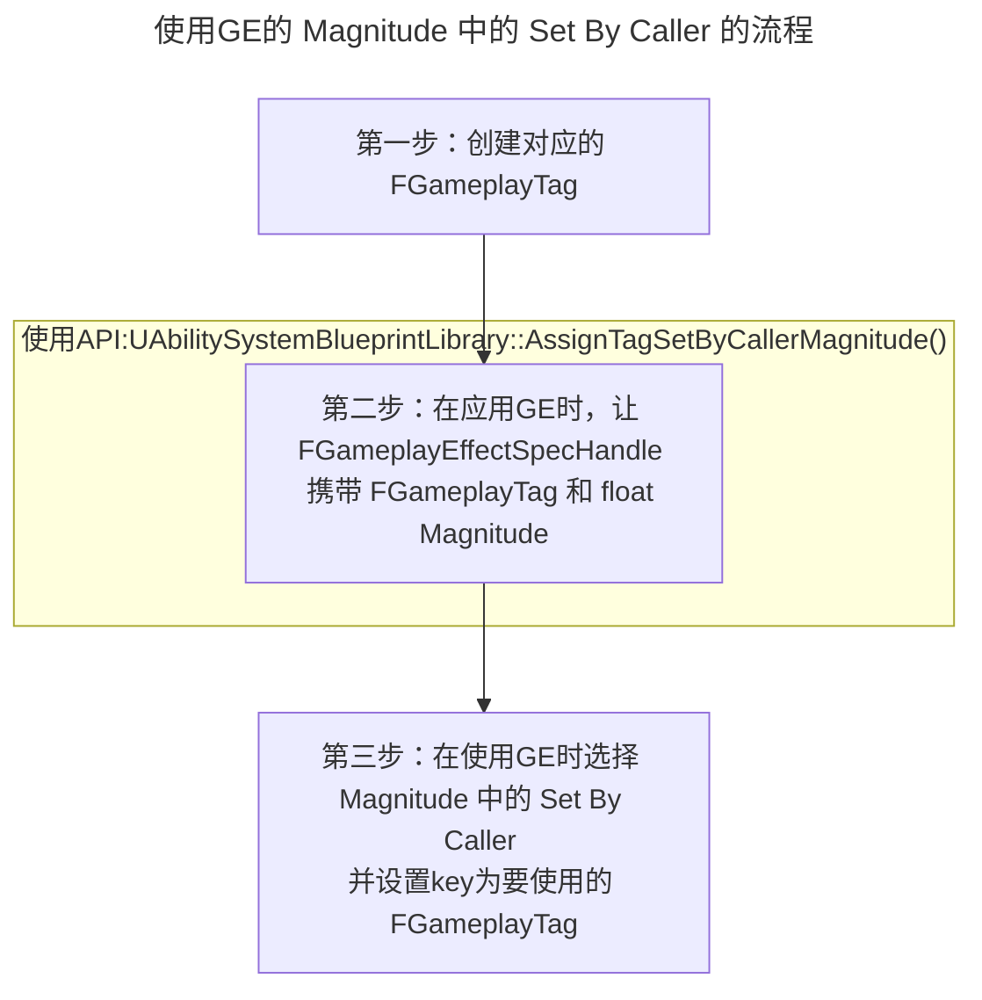

___________________________________________________________________________________________
###### [Go主菜单](../MainMenu.md)
___________________________________________________________________________________________

# GAS 055 Set By Caller Magnitude

___________________________________________________________________________________________

## 处理关键点

1. 使用GE的 `Magnitude` 中的 `Set By Caller`  的流程

___________________________________________________________________________________________

# 目录


- [GAS 055 Set By Caller Magnitude](#gas-055-set-by-caller-magnitude)
	- [处理关键点](#处理关键点)
	- [目录](#目录)
		- [整体思路梳理](#整体思路梳理)
		- [GE的 `Magnitude` 中的 `Set By Caller`  简述](#ge的-magnitude-中的-set-by-caller--简述)
	- [使用GE的 `Magnitude` 中的 `Set By Caller`  的流程](#使用ge的-magnitude-中的-set-by-caller--的流程)
		- [第一步：创建对应的 `FGameplayTag`](#第一步创建对应的-fgameplaytag)
		- [第二步：在应用GE时，让`FGameplayEffectSpecHandle` 携带 `FGameplayTag` 和 `float` `Magnitude`](#第二步在应用ge时让fgameplayeffectspechandle-携带-fgameplaytag-和-float-magnitude)
		- [第三步：在使用GE时选择 `Magnitude` 中的 `Set By Caller`  并设置key( 要使用的 `FGameplayTag` )](#第三步在使用ge时选择-magnitude-中的-set-by-caller--并设置key-要使用的-fgameplaytag-)
		- [测试结果](#测试结果)
			- [现在我们正在使用GA中的数值，在GE中使用](#现在我们正在使用ga中的数值在ge中使用)
			- [GA可以具有伤害属性，我们可以根据游戏能力的等级来设置](#ga可以具有伤害属性我们可以根据游戏能力的等级来设置)
			- [下节预告：所以我们要处理向AuraGameplayAbilityClass中添加一个成员变量来处理伤害](#下节预告所以我们要处理向auragameplayabilityclass中添加一个成员变量来处理伤害)


___________________________________________________________________________________________

<details>
<summary>视频链接</summary>

[3. Set By Caller Magnitude_哔哩哔哩_bilibili](https://www.bilibili.com/video/BV1JD421E7yC?p=132&vd_source=9e1e64122d802b4f7ab37bd325a89e6c)

</details>

___________________________________________________________________________________________

### 整体思路梳理



___________________________________________________________________________________________

<details>
<summary>上一节我们使用了元属性 IncomingDamage 增加固定值 25.f 的方式处理了扣血的逻辑</summary>


</details>

> - 本节想使用 `Magnitude` 中的 `Set By Caller`  来设置
> - **从框架层面考虑，扣血的数值不是GameplayEffect来决定的，应该由GameplayAbility来决定**
> - 需要使用到 `FGameplayEffectSpecHandle` 类型变量

___________________________________________________________________________________________
### GE的 `Magnitude` 中的 `Set By Caller`  简述
 `Magnitude` 中的 `Set By Caller`  是一个键值对，通过 `FGameplayTag` 来获取 `float` `Magnitude` 浮点类型的伤害值
- 键( `FGameplayTag` )
- 值( `float` `Magnitude` )浮点类型的伤害值
___________________________________________________________________________________________
## 使用GE的 `Magnitude` 中的 `Set By Caller`  的流程

### 第一步：创建对应的 `FGameplayTag` 

<details>
<summary>在之前创建的AuraGameplayTags.h这个全局管理单例类中创建Tag</summary>


+ `头文件` `FAuraGameplayTags` 结构体中：
```cpp
public:
	FGameplayTag Damage;
```

+ `源文件` `InitializeNativeGameplayTags` 函数中：
```cpp
GameplayTags.Damage = UGameplayTagsManager::Get().AddNativeGameplayTag(  
    FName("Damage"),  
    FString("Damage"));
```


</details>

___________________________________________________________________________________________

>在火球的GA文件 `UAuraProjectileSpell` 中，还记得之前，在制作火球时，让火球携带了一个 `FGameplayEffectSpecHandle` 
>**现在需要让`FGameplayEffectSpecHandle` 也携带 `FGameplayTag` 和 `float` `Magnitude` **


___________________________________________________________________________________________
### 第二步：在应用GE时，让`FGameplayEffectSpecHandle` 携带 `FGameplayTag` 和 `float` `Magnitude` 

- 需要使用API:

  ```CPP
  UAbilitySystemBlueprintLibrary::AssignTagSetByCallerMagnitude(FGameplayEffectSpecHandle SpecHandle, FGameplayTag DataTag, float Magnitude/*Magnitude指的是伤害数值*/);
  ```

- 在函数 `SpawnProjectile` 中：

  ```CPP
  void UAuraProjectileSpell::SpawnProjectile(const FVector& ProjectileTargetLocation)
  {
  	const bool bIsServer = GetAvatarActorFromActorInfo()->HasAuthority();
  	if (!bIsServer)return;
  
  	if (const TScriptInterface<ICombatInterface> CombatInterfaceActor = GetAvatarActorFromActorInfo())
  	{
  		FVector SocketLocation = CombatInterfaceActor->GetCombatSocketLocation();
  		FRotator SpawnRotation = (ProjectileTargetLocation - SocketLocation).Rotation();
  		SpawnRotation.Pitch = 0.f;
  		FTransform SpawnTransform;
  		SocketLocation.Z = FMath::Clamp(SocketLocation.Z,0.f,MaxFireballHeight);
  		SpawnTransform.SetLocation(SocketLocation);
  		SpawnTransform.SetRotation(SpawnRotation.Quaternion());
  		AAuraProjectile* AuraProjectile = GetWorld()->SpawnActorDeferred<AAuraProjectile>(
  			ProjectileClass,
  			SpawnTransform,
  			GetOwningActorFromActorInfo(),
  			Cast<APawn>(GetOwningActorFromActorInfo()),
  			ESpawnActorCollisionHandlingMethod::AlwaysSpawn);
  		
  		if (const UAbilitySystemComponent* SourceASC = UAbilitySystemBlueprintLibrary::GetAbilitySystemComponent(GetAvatarActorFromActorInfo()))
  		{
  			const FGameplayEffectSpecHandle EffectSpecHandle = SourceASC->MakeOutgoingSpec(DamageEffectClass,GetAbilityLevel(),SourceASC->MakeEffectContext());
  			//获取Tag为了给FGameplayEffectSpecHandle传值
  			const FGameplayTag& Tag = FAuraGameplayTags::Get().Damage;
  			//关键操作:设置键值对
  			UAbilitySystemBlueprintLibrary::AssignTagSetByCallerMagnitude(EffectSpecHandle,Tag,50.f/*这里临时给了50.f*/);
  			
  			AuraProjectile->DamageEffectSpecHandle = EffectSpecHandle;
  		};
  		AuraProjectile->FinishSpawning(SpawnTransform);
  	}
  }
  ```

___________________________________________________________________________________________

>编译引擎

___________________________________________________________________________________________

### 第三步：在使用GE时选择 `Magnitude` 中的 `Set By Caller`  并设置key( 要使用的 `FGameplayTag` )

> - 如下图  


### 测试结果

> - 比上次掉了更多的伤害，应该是 `50.f` 

#### 现在我们正在使用GA中的数值，在GE中使用

> 

___________________________________________________________________________________________
#### GA可以具有伤害属性，我们可以根据游戏能力的等级来设置

#### 下节预告：所以我们要处理向AuraGameplayAbilityClass中添加一个成员变量来处理伤害

___________________________________________________________________________________________

[返回最上面](#Go主菜单)

___________________________________________________________________________________________