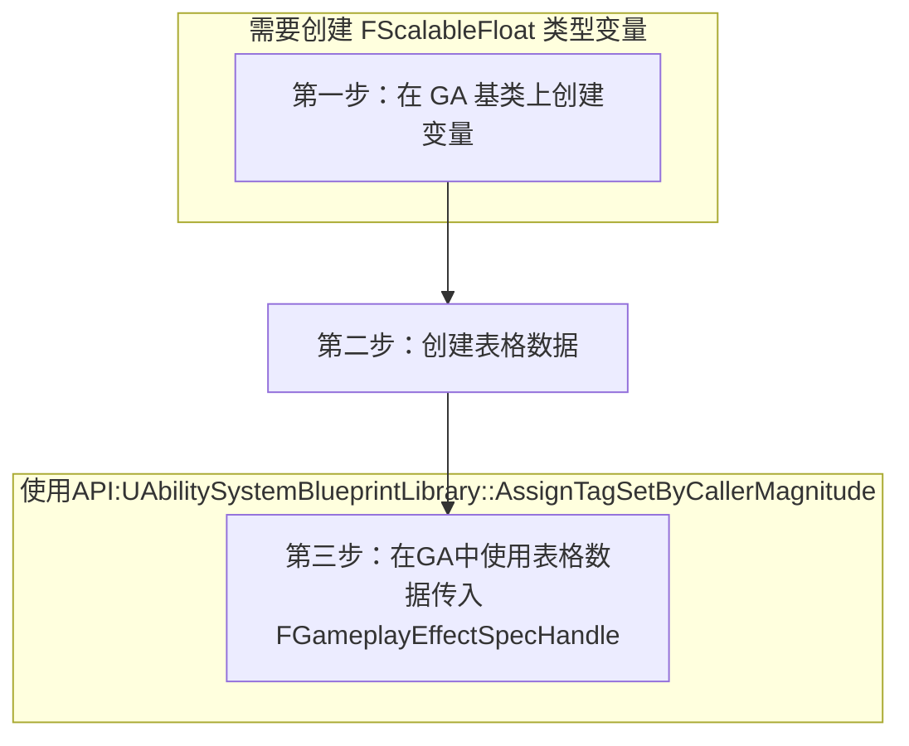

____ ____ ____ ____ ____ ____ ____ ____ ____ ____ ____ ____ ____ ____ ____ ____ ____ ____ ____ ____ ____ _______
###### [Go主菜单](../MainMenu.md)
____ ____ ____ ____ ____ ____ ____ ____ ____ ____ ____ ____ ____ ____ ____ ____ ____ ____ ____ ____ ____ _______

# GAS_056_给GA加伤害配表，并在使用GE时，使用曲线表格中的数据

____ ____ ____ ____ ____ ____ ____ ____ ____ ____ ____ ____ ____ ____ ____ ____ ____ ____ ____ ____ ____ _______

## 处理关键点

1. 可以在蓝图中配表的数据类型 `FScalableFloat` 

2.  `FScalableFloat` 的使用API

3. 在 `GA` 中获取等级

____ ____ ____ ____ ____ ____ ____ ____ ____ ____ ____ ____ ____ ____ ____ ____ ____ ____ ____ ____ ____ _______

# 目录

- [GAS 056 给GA加伤害配表，并在使用GE时，使用曲线表格中的数据](#gas-056-给ga加伤害配表并在使用ge时使用曲线表格中的数据)
	- [目录](#目录)
		- [整体思路梳理](#整体思路梳理)
		- [第一步：在 GA 基类上创建 `FScalableFloat` 类型变量用来配表](#第一步在-ga-基类上创建-fscalablefloat-类型变量用来配表)
			- [参考一下曲线表格配置，给 GA 配表](#参考一下曲线表格配置给-ga-配表)
			- [基类 `UAuraGameplayAbility` 中创建 `FScalableFloat` 类型变量](#基类-uauragameplayability-中创建-fscalablefloat-类型变量)
		- [第二步：创建表格数据](#第二步创建表格数据)
		- [第三步：在GA中使用表格数据传入 `FGameplayEffectSpecHandle`](#第三步在ga中使用表格数据传入-fgameplayeffectspechandle)
			- [需要注意的](#需要注意的)
		- [测试结果](#测试结果)


____ ____ ____ ____ ____ ____ ____ ____ ____ ____ ____ ____ ____ ____ ____ ____ ____ ____ ____ ____ ____ _______

<details>
<summary> 视频链接 </summary>
[4. Ability Damage_哔哩哔哩_bilibili](https://www.bilibili.com/video/BV1JD421E7yC?p=133&vd_source=9e1e64122d802b4f7ab37bd325a89e6c)

</details>

____ ____ ____ ____ ____ ____ ____ ____ ____ ____ ____ ____ ____ ____ ____ ____ ____ ____ ____ ____ ____ _______

### 整体思路梳理



____ ____ ____ ____ ____ ____ ____ ____ ____ ____ ____ ____ ____ ____ ____ ____ ____ ____ ____ ____ ____ _______

>上节使用了 `UAbilitySystemBlueprintLibrary::AssignTagSetByCallerMagnitude` 给了一个临时的 `50.f` 的硬编码

```cpp
UAbilitySystemBlueprintLibrary::AssignTagSetByCallerMagnitude(EffectSpecHandle,Tag,50.f/*这里临时给了 50.f*/);
```

**本节需要给 GA 配表使用动态等级获取 Damage 然后使用**

____ ____ ____ ____ ____ ____ ____ ____ ____ ____ ____ ____ ____ ____ ____ ____ ____ ____ ____ ____ ____ _______

### 第一步：在 GA 基类上创建 `FScalableFloat` 类型变量用来配表

#### 参考一下曲线表格配置，给 GA 配表

- 参考一下药水的曲线表格配置 
- 搜索这个变量名字可以看到创建类型为： `FScalableFloat` 类型 

#### 基类 `UAuraGameplayAbility` 中创建 `FScalableFloat` 类型变量

```CPP
public:
	UPROPERTY(EditDefaultsOnly, BlueprintReadOnly, Category = "Damage")
	FScalableFloat Damage;
```
____ ____ ____ ____ ____ ____ ____ ____ ____ ____ ____ ____ ____ ____ ____ ____ ____ ____ ____ ____ ____ _______

>编译引擎

____ ____ ____ ____ ____ ____ ____ ____ ____ ____ ____ ____ ____ ____ ____ ____ ____ ____ ____ ____ ____ _______

### 第二步：创建表格数据


<details>
<summary> 我这里是导出导入 json 并应用为曲线表格的步骤 </summary>

>我这里是导出导入 json
>
>1. 导出 json 
>
>2. 
>
>3. 修改 json 文件
>
>   ```JSON
>   [
>   	{
>   		"Name": "Damage",
>   		"1": 5,
>   		"5": 10,
>   		"10": 16,
>   		"15": 27,
>   		"20": 41,
>   		"40": 120
>   	}
>   ]
>   ```
>
>4. 导入 json 文件  
>
>   稍微调整下 


</details>


____ ____ ____ ____ ____ ____ ____ ____ ____ ____ ____ ____ ____ ____ ____ ____ ____ ____ ____ ____ ____ _______

### 第三步：在GA中使用表格数据传入 `FGameplayEffectSpecHandle` 

获取技能等级可以使用 API：
```CPP
GetAbilityLevel();
```

可以使用之前创建的 `FScalableFloat` 类型变量 `Damage` ，使用 API：
```CPP
Damage.GetValueAtLevel(/*这里需要传入需要的 float类型 等级*/)
```


```CPP
const float ScaledDamage = Damage.GetValueAtLevel(GetAbilityLevel());
```

>此时使用 `GEngine->AddOnScreenDebugMessage` debug 测试

将原来的 50.f 伤害替换成 `ScaledDamage` 
```CPP
const float ScaledDamage = Damage.GetValueAtLevel(GetAbilityLevel());  
GEngine->AddOnScreenDebugMessage(-1,3.f,FColor::Red,FString::Printf(TEXT("ScaledDamage: %f"),ScaledDamage));  
////将原来的50.f伤害替换成
ScaledDamageUAbilitySystemBlueprintLibrary::AssignTagSetByCallerMagnitude(EffectSpecHandle,Tag,ScaledDamage);
```

#### 需要注意的
-  `GetAbilityLevel()` 返回的是一个int32的整型
- 会发生隐式类型转换
- 检查一下曲线表格 `CT_Damage` 是在 *GA_FireBolt* 中否配置好了

____ ____ ____ ____ ____ ____ ____ ____ ____ ____ ____ ____ ____ ____ ____ ____ ____ ____ ____ ____ ____ _______
### 测试结果


____ ____ ____ ____ ____ ____ ____ ____ ____ ____ ____ ____ ____ ____ ____ ____ ____ ____ ____ ____ ____ _______

[返回最上面](#Go主菜单)

____ ____ ____ ____ ____ ____ ____ ____ ____ ____ ____ ____ ____ ____ ____ ____ ____ ____ ____ ____ ____ _______