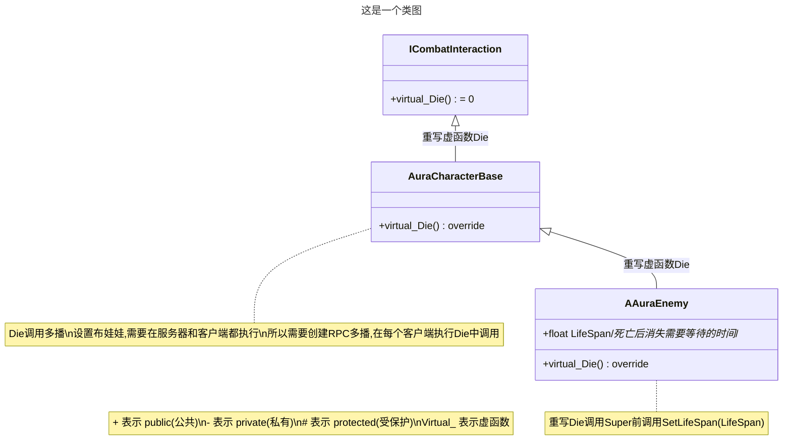
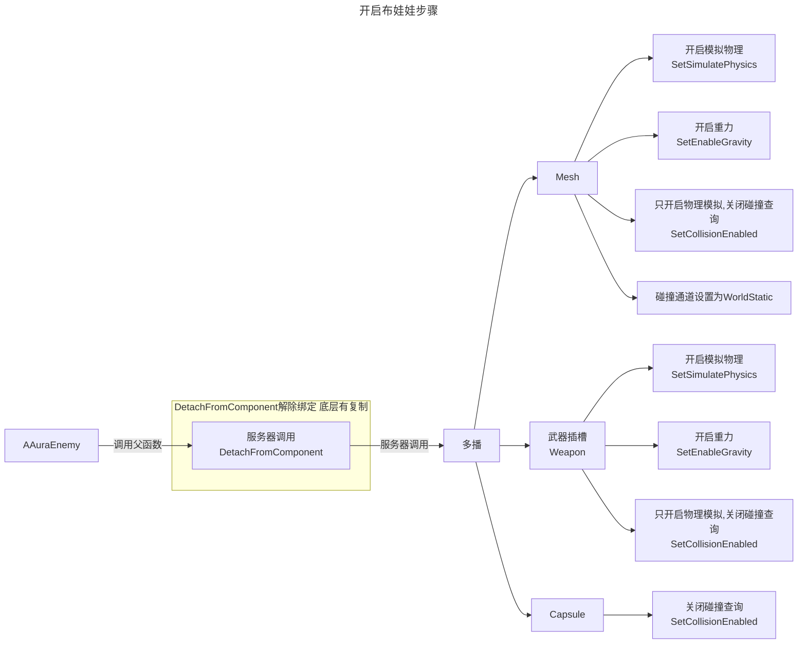

___________________________________________________________________________________________
###### [Go主菜单](../MainMenu.md)
___________________________________________________________________________________________

# GAS 058 处理敌人死亡效果，C++中开启物理模拟/使用布娃娃

___________________________________________________________________________________________

## 处理关键点

1. 模拟物理开启步骤


___________________________________________________________________________________________

# 目录


- [GAS 058 处理敌人死亡效果，C++中开启物理模拟/使用布娃娃](#gas-058-处理敌人死亡效果c中开启物理模拟使用布娃娃)
  - [处理关键点](#处理关键点)
- [目录](#目录)
    - [整体思路梳理](#整体思路梳理)
    - [敌人死亡时变成`布娃娃`](#敌人死亡时变成布娃娃)
      - [接口 `ICombatInteraction` 中创建死亡的 `纯虚函数`](#接口-icombatinteraction-中创建死亡的-纯虚函数)
      - [角色基类 `AuraCharacterBase` 中重写 `Die` 函数，模拟物理布娃娃开启步骤](#角色基类-auracharacterbase-中重写-die-函数模拟物理布娃娃开启步骤)
      - [敌人类 `AAuraEnemy` 中重写 `Die` 函数](#敌人类-aauraenemy-中重写-die-函数)
        - [除此之外需要设置的人的LifeSpan](#除此之外需要设置的人的lifespan)
    - [AS中判定死亡时，调用Die函数](#as中判定死亡时调用die函数)
      - [之前的蒙太奇用错了](#之前的蒙太奇用错了)
    - [此时效果gif](#此时效果gif)


___________________________________________________________________________________________

<details>
<summary>视频链接</summary>

[6. Activating the Enemy Hit React Ability_哔哩哔哩_bilibili](https://www.bilibili.com/video/BV1JD421E7yC?p=135&vd_source=9e1e64122d802b4f7ab37bd325a89e6c)

</details>

___________________________________________________________________________________________

### 整体思路梳理

Mermaid





___________________________________________________________________________________________
> 之前我们在`UAuraAttributeSet`中处理了受击效果，那么我们也可以获得敌人死亡的状态，接下来就需要制作死亡效果，希望在死亡时：
> - 角色
>    1. 打开模拟物理关闭碰撞检测
>    2. 开启布娃娃
>    3. 设置碰撞通道为 `WorldStatic` | `Block`
> - 武器
>    1. **从角色上解除绑定**
>    2. 打开模拟物理关闭碰撞检测
>    3. 开启布娃娃
>    4. 设置碰撞通道为 `WorldStatic` | `Block
---
- **因为设置碰撞打开模拟物理关闭碰撞检测后就不会再检测碰撞事件，所以相当于 `DoOnce`** 
- **死亡**应该是**角色的共有特性**，所以**需要基类拥有**
- 把死亡虚函数写在**接口** `ICombatInteraction` 中，方便查询和调用，这样就**不会限定**角色基类才可以使用
---
### 敌人死亡时变成`布娃娃`

> #### 如果需要将敌人变成布娃娃，`需要在服务器和客户端都执行`
> 搞一个多播， `Die` 函数中调用
#### 接口 `ICombatInteraction` 中创建死亡的 `纯虚函数`

+ `头文件`中：
```cpp
public:
	virtual void Die() = 0;
```

#### 角色基类 `AuraCharacterBase` 中重写 `Die` 函数，模拟物理布娃娃开启步骤

1. 重写 `Die` 函数

2. 创建死亡时调用的多播，取名 `MulticastHandleDeath`

>    - 多播内需要给武器和角色开启模拟物理，**模拟物理布娃娃开启步骤**
>
>      武器组件：
>
>      - 开启模拟物理
>      
>        ```
>        Weapon->SetSimulatePhysics(true);/*开启模拟物理*/
>        ```
>      
>      - 开启重力
>      
>        ```
>        Weapon->SetEnableGravity(true);/*开启重力*/
>        ```
>      
>      - 设置碰撞为：仅物理模拟，关闭碰撞查询
>      
>        ```
>        Weapon->SetCollisionEnabled(ECollisionEnabled::PhysicsOnly);/*只开启物理模拟,关闭碰撞查询*/
>        ```
>      
>      角色 `Mesh` 组件：
>      
>      - 开启模拟物理
>      
>        ```
>        GetMesh()->SetSimulatePhysics(true);/*开启模拟物理*/
>        ```
>      
>      - 开启重力
>      
>        ```
>        GetMesh()->SetEnableGravity(true);/*开启重力*/
>        ```
>      
>      - 设置碰撞为：仅物理模拟，关闭碰撞查询
>      
>        ```
>        GetMesh()->SetCollisionEnabled(ECollisionEnabled::PhysicsOnly);/*只开启物理模拟,关闭碰撞查询*/
>        ```
>      
>      - 碰撞通道设置为WorldStatic,阻挡,因为地面等静态物体是WorldStatic,这样就会被地面阻挡
>      
>        ```
>        GetMesh()->SetCollisionResponseToChannel(ECC_WorldStatic,ECR_Block);
>        ```
>      
>      Capsule胶囊体：
>      
>      - 设置碰撞为：关闭碰撞查询
>      
>        ```
>        GetCapsuleComponent()->SetCollisionEnabled(ECollisionEnabled::NoCollision);/*关闭碰撞查询*/
>        ```


+  `AuraCharacterBase` `头文件`中：
```cpp
public:
	//~ Begin ICombatInteraction  
	virtual void Die() override;  
	//~ End ICombatInteraction  
  
	//自建函数 死亡时调用的多播  
	UFUNCTION(NetMulticast,Reliable)  
	virtual void MulticastHandleDeath();
```

+  `AuraCharacterBase` `源文件`中：
```cpp
void AAuraCharacterBase::Die()  
{  
    //先将武器分离,这个分离是复制的,服务器和客户端都会分离  
    Weapon->DetachFromComponent(FDetachmentTransformRules(EDetachmentRule::KeepWorld,true));  
    MulticastHandleDeath();  
}  
  
void AAuraCharacterBase::MulticastHandleDeath_Implementation()  
{  
    /*  
     * //TODO 目前还没有给力的方向,让角色朝某个方向抛飞  
     * 以下是让人物 朝重力方向 摊成布娃娃状态  
     */    Weapon->SetSimulatePhysics(true);/*开启模拟物理*/  
    Weapon->SetEnableGravity(true);/*开启重力*/  
    Weapon->SetCollisionEnabled(ECollisionEnabled::PhysicsOnly);/*只开启物理模拟,关闭碰撞查询*/  
  
    GetMesh()->SetSimulatePhysics(true);/*开启模拟物理*/  
    GetMesh()->SetEnableGravity(true);/*开启重力*/  
    GetMesh()->SetCollisionEnabled(ECollisionEnabled::PhysicsOnly);/*只开启物理模拟,关闭碰撞查询*/  
    GetMesh()->SetCollisionResponseToChannel(ECC_WorldStatic,ECR_Block);/*碰撞通道设置为WorldStatic,阻挡,因为地面等静态物体是WorldStatic,这样就会被地面阻挡*/  
    GetCapsuleComponent()->SetCollisionEnabled(ECollisionEnabled::NoCollision);/*只开启物理模拟,关闭碰撞查询*/  
}
```
#### 敌人类 `AAuraEnemy` 中重写 `Die` 函数

##### 除此之外需要设置的人的LifeSpan
+ `头文件`中：
```cpp
public:  
    //~ Begin ICombatInteraction  
    virtual void Die() override;  
    //~ End ICombatInteraction  
  
    //敌人死亡后的存留时间  
    UPROPERTY(BlueprintReadOnly, Category="Combat")  
    float LifeSpan = 5.f;
```

+ `源文件`中：
```cpp
void AAuraEnemy::Die()  
{  
    SetLifeSpan(LifeSpan);  
    Super::Die();  
}
```

>这样就完成了敌人死亡函数的设置，下一步是需要找地方调用
---
### AS中判定死亡时，调用Die函数

-  `PostGameplayEffectExecute` 函数中

```CPP
const bool bFatal = NewHealth <= 0.f;  
if (bFatal)  
{  
    if (const TScriptInterface<ICombatInterface> CombatInterfaceObj = Props.TargetAvatarActor)  
    {       CombatInterfaceObj->Die();  
    }}  
else  
{  
    //受击但并没有死亡  
    FGameplayTagContainer TagContainer;  
    TagContainer.AddTag(FAuraGameplayTags::Get().Effects_HitReact);  
    Props.TargetASC->TryActivateAbilitiesByTag(TagContainer);  
}
```

<details>
<summary>下面我放一下我得AS源码</summary>

>+ `UAuraAttributeSet` `头文件`：
>```cpp
>// Copyright belongs to Li Yunlong.
>
>#pragma once
>
>#include "CoreMinimal.h"
>#include "AbilitySystemComponent.h"
>#include "AttributeSet.h"
>#include "AuraAttributeSet.generated.h"
>
>//保存属性更改后，从PostGameplayEffectExecute函数的参数Data获得的，有用的信息
>USTRUCT()
>struct FEffectProperties
>{
>	GENERATED_BODY()
>	
>	FEffectProperties(): SourceASC(nullptr), SourceAvatarActor(nullptr), SourceController(nullptr),
>	                     SourceCharacter(nullptr),
>	                     TargetASC(nullptr),
>	                     TargetAvatarActor(nullptr),
>	                     TargetController(nullptr),
>	                     TargetCharacter(nullptr)
>	{
>	}
>
>	UPROPERTY()
>	FGameplayEffectContextHandle EffectContextHandle;
>
>	UPROPERTY()
>	UAbilitySystemComponent* SourceASC;
>	UPROPERTY()
>	AActor* SourceAvatarActor;
>	UPROPERTY()
>	AController* SourceController;
>	UPROPERTY()
>	ACharacter* SourceCharacter;
>	
>	UPROPERTY()
>	UAbilitySystemComponent* TargetASC;
>	UPROPERTY()
>	AActor* TargetAvatarActor;
>	UPROPERTY()
>	AController* TargetController;
>	UPROPERTY()
>	ACharacter* TargetCharacter;
>};
>/**
> * 
> */
>
>//从AS组件源码中找到的帮助 Get / Set / Init 属性的宏
>#define ATTRIBUTE_ACCESSORS(ClassName, PropertyName) \
>	GAMEPLAYATTRIBUTE_PROPERTY_GETTER(ClassName, PropertyName) \
>	GAMEPLAYATTRIBUTE_VALUE_GETTER(PropertyName) \
>	GAMEPLAYATTRIBUTE_VALUE_SETTER(PropertyName) \
>	GAMEPLAYATTRIBUTE_VALUE_INITTER(PropertyName)
>
>UCLASS()
>class AURA_API UAuraAttributeSet : public UAttributeSet
>{
>	GENERATED_BODY()
>
>public:
>	
>	UAuraAttributeSet();
>	
>	//此函数规定了:	1.哪些参数同步 以及 2.同步的条件			此函数在UObject中 开启 属性复制(RepNotify)后 需要重写这个函数!
>	virtual void GetLifetimeReplicatedProps(TArray<FLifetimeProperty>& OutLifetimeProps) const override;
>
>	//重写基类的 预处理函数 在这里限制属性 最大最小值
>	virtual void PreAttributeChange(const FGameplayAttribute& Attribute, float& NewValue) override;
>
>	virtual void PostGameplayEffectExecute(const FGameplayEffectModCallbackData& Data) override;
>
>	//绑定键值对 -> Tag/函数指针
>	TMap<FGameplayTag,FGameplayAttribute(*)()> TagToAttributes;
>	
>	//主要属性
>	UPROPERTY(BlueprintReadOnly, ReplicatedUsing = OnRep_Strength, Category="Primary|Attribute")
>	FGameplayAttributeData Strength;
>	ATTRIBUTE_ACCESSORS(UAuraAttributeSet,Strength);//AS组件源码中 帮助 Get / Set / Init 属性的宏
>	UPROPERTY(BlueprintReadOnly, ReplicatedUsing = OnRep_Intelligence, Category="Primary|Attribute")
>	FGameplayAttributeData Intelligence;
>	ATTRIBUTE_ACCESSORS(UAuraAttributeSet,Intelligence);//AS组件源码中 帮助 Get / Set / Init 属性的宏
>	UPROPERTY(BlueprintReadOnly, ReplicatedUsing = OnRep_Resilience, Category="Primary|Attribute")
>	FGameplayAttributeData Resilience;
>	ATTRIBUTE_ACCESSORS(UAuraAttributeSet,Resilience);//AS组件源码中 帮助 Get / Set / Init 属性的宏
>	UPROPERTY(BlueprintReadOnly, ReplicatedUsing = OnRep_Vigor, Category="Primary|Attribute")
>	FGameplayAttributeData Vigor;
>	ATTRIBUTE_ACCESSORS(UAuraAttributeSet,Vigor);//AS组件源码中 帮助 Get / Set / Init 属性的宏
>	//次要属性
>	UPROPERTY(BlueprintReadOnly, ReplicatedUsing = OnRep_Armor, Category="Secondary|Attribute")
>	FGameplayAttributeData Armor;
>	ATTRIBUTE_ACCESSORS(UAuraAttributeSet,Armor);//AS组件源码中 帮助 Get / Set / Init 属性的宏
>	UPROPERTY(BlueprintReadOnly, ReplicatedUsing = OnRep_ArmorPenetration, Category="Secondary|Attribute")
>	FGameplayAttributeData ArmorPenetration;
>	ATTRIBUTE_ACCESSORS(UAuraAttributeSet,ArmorPenetration);//AS组件源码中 帮助 Get / Set / Init 属性的宏
>	UPROPERTY(BlueprintReadOnly, ReplicatedUsing = OnRep_BlockChance, Category="Secondary|Attribute")
>	FGameplayAttributeData BlockChance;
>	ATTRIBUTE_ACCESSORS(UAuraAttributeSet,BlockChance);//AS组件源码中 帮助 Get / Set / Init 属性的宏
>	UPROPERTY(BlueprintReadOnly, ReplicatedUsing = OnRep_CriticalHitChance, Category="Secondary|Attribute")
>	FGameplayAttributeData CriticalHitChance;
>	ATTRIBUTE_ACCESSORS(UAuraAttributeSet,CriticalHitChance);//AS组件源码中 帮助 Get / Set / Init 属性的宏
>	UPROPERTY(BlueprintReadOnly, ReplicatedUsing = OnRep_CriticalHitDamage, Category="Secondary|Attribute")
>	FGameplayAttributeData CriticalHitDamage;
>	ATTRIBUTE_ACCESSORS(UAuraAttributeSet,CriticalHitDamage);//AS组件源码中 帮助 Get / Set / Init 属性的宏
>	UPROPERTY(BlueprintReadOnly, ReplicatedUsing = OnRep_CriticalHitResistance, Category="Secondary|Attribute")
>	FGameplayAttributeData CriticalHitResistance;
>	ATTRIBUTE_ACCESSORS(UAuraAttributeSet,CriticalHitResistance);//AS组件源码中 帮助 Get / Set / Init 属性的宏
>	UPROPERTY(BlueprintReadOnly, ReplicatedUsing = OnRep_HealthRegeneration, Category="Secondary|Attribute")
>	FGameplayAttributeData HealthRegeneration;
>	ATTRIBUTE_ACCESSORS(UAuraAttributeSet,HealthRegeneration);//AS组件源码中 帮助 Get / Set / Init 属性的宏
>	UPROPERTY(BlueprintReadOnly, ReplicatedUsing = OnRep_ManaRegeneration, Category="Secondary|Attribute")
>	FGameplayAttributeData ManaRegeneration;
>	ATTRIBUTE_ACCESSORS(UAuraAttributeSet,ManaRegeneration);//AS组件源码中 帮助 Get / Set / Init 属性的宏
>	UPROPERTY(BlueprintReadOnly, ReplicatedUsing = OnRep_MaxHealth, Category="Secondary|Attribute")
>	FGameplayAttributeData MaxHealth;
>	ATTRIBUTE_ACCESSORS(UAuraAttributeSet,MaxHealth);//AS组件源码中 帮助 Get / Set / Init 属性的宏
>	UPROPERTY(BlueprintReadOnly, ReplicatedUsing = OnRep_MaxMana, Category="Secondary|Attribute")
>	FGameplayAttributeData MaxMana;
>	ATTRIBUTE_ACCESSORS(UAuraAttributeSet,MaxMana);//AS组件源码中 帮助 Get / Set / Init 属性的宏
>
>	
>	//ReplicatedUsing = OnRep_Health  :当前属性 Health 发生变化时 自动调用 OnRep_Health 这个函数
>	UPROPERTY(BlueprintReadOnly, ReplicatedUsing = OnRep_Health, Category="Vita|Attribute")
>	FGameplayAttributeData Health;
>	ATTRIBUTE_ACCESSORS(UAuraAttributeSet,Health);//AS组件源码中 帮助 Get / Set / Init 属性的宏
>	UPROPERTY(BlueprintReadOnly, ReplicatedUsing = OnRep_Mana, Category="Vita|Attribute")
>	FGameplayAttributeData Mana;
>	ATTRIBUTE_ACCESSORS(UAuraAttributeSet,Mana);//AS组件源码中 帮助 Get / Set / Init 属性的宏
>
>	/*
>	 * Meta Attributes
>	 */
>	UPROPERTY(BlueprintReadOnly,Category = "Meta Attributes")
>	FGameplayAttributeData IncomingDamage;
>	ATTRIBUTE_ACCESSORS(UAuraAttributeSet,IncomingDamage);//AS组件源码中 帮助 Get / Set / Init 属性的宏
>	
>	//在每个回调函数中 需要做 网络同步 相关的事
>	UFUNCTION()
>	void OnRep_Health(const FGameplayAttributeData& OldHealth);
>	UFUNCTION()
>	void OnRep_Mana(const FGameplayAttributeData& OldMana);
>
>	//~~~Begin~~~ 属性复制 回调
>	//主要属性 
>	UFUNCTION()
>	void OnRep_Strength(const FGameplayAttributeData& OldStrength);
>	UFUNCTION()
>	void OnRep_Intelligence(const FGameplayAttributeData& OldIntelligence);
>	UFUNCTION()
>	void OnRep_Resilience(const FGameplayAttributeData& OldResilience);
>	UFUNCTION()
>	void OnRep_Vigor(const FGameplayAttributeData& OldVigor);
>	//次要属性
>	UFUNCTION()
>	void OnRep_Armor(const FGameplayAttributeData& OldArmor);
>	UFUNCTION()
>	void OnRep_ArmorPenetration(const FGameplayAttributeData& OldArmorPenetration);
>	UFUNCTION()
>	void OnRep_BlockChance(const FGameplayAttributeData& OldBlockChance);
>	UFUNCTION()
>	void OnRep_CriticalHitChance(const FGameplayAttributeData& OldCriticalHitChance);
>	UFUNCTION()
>	void OnRep_CriticalHitDamage(const FGameplayAttributeData& OldCriticalHitDamage);
>	UFUNCTION()
>	void OnRep_CriticalHitResistance(const FGameplayAttributeData& OldCriticalHitResistance);
>	UFUNCTION()
>	void OnRep_HealthRegeneration(const FGameplayAttributeData& OldHealthRegeneration);
>	UFUNCTION()
>	void OnRep_ManaRegeneration(const FGameplayAttributeData& OldManaRegeneration);
>	UFUNCTION()
>	void OnRep_MaxHealth(const FGameplayAttributeData& OldMaxHealth);
>	UFUNCTION()
>	void OnRep_MaxMana(const FGameplayAttributeData& OldMaxMana);
>	//~~~End~~~ 属性复制 回调
>private:
>	
>	//自建函数 保存数据到结构体
>	void SetEffectProperties(const FGameplayEffectModCallbackData& Data,FEffectProperties& Props) const;
>};
>
>```
>
>+ `UAuraAttributeSet` `源文件`：
>```cpp
>// Copyright belongs to Li Yunlong.
>
>
>#include "AbilitySystem/AuraAttributeSet.h"
>
>#include "AbilitySystemBlueprintLibrary.h"
>#include "AbilitySystemComponent.h"
>#include "AuraGameplayTags.h"
>#include "GameplayEffectExtension.h"
>#include "GameFramework/Character.h"
>#include "Interaction/CombatInterface.h"
>#include "Net/UnrealNetwork.h"
>
>DECLARE_LOG_CATEGORY_CLASS(UELOG_UAuraAttributeSet,Log,Error);
>
>UAuraAttributeSet::UAuraAttributeSet()
>{
>	const FAuraGameplayTags& Tags = FAuraGameplayTags::Get();
>	//主要属性
>	TagToAttributes.Add(Tags.Attributes_Primary_Intelligence, GetIntelligenceAttribute);
>	TagToAttributes.Add(Tags.Attributes_Primary_Strength, GetStrengthAttribute);
>	TagToAttributes.Add(Tags.Attributes_Primary_Resilience, GetResilienceAttribute);
>	TagToAttributes.Add(Tags.Attributes_Primary_Vigor, GetVigorAttribute);
>	//次要属性
>	TagToAttributes.Add(Tags.Attributes_Secondary_Armor, GetArmorAttribute);
>	TagToAttributes.Add(Tags.Attributes_Secondary_ArmorPenetration, GetArmorPenetrationAttribute);
>	TagToAttributes.Add(Tags.Attributes_Secondary_BlockChance, GetBlockChanceAttribute);
>	TagToAttributes.Add(Tags.Attributes_Secondary_CriticalHitChance, GetCriticalHitChanceAttribute);
>	TagToAttributes.Add(Tags.Attributes_Secondary_CriticalHitDamage, GetCriticalHitDamageAttribute);
>	TagToAttributes.Add(Tags.Attributes_Secondary_CriticalHitResistance, GetCriticalHitResistanceAttribute);
>	TagToAttributes.Add(Tags.Attributes_Secondary_HealthRegeneration, GetHealthRegenerationAttribute);
>	TagToAttributes.Add(Tags.Attributes_Secondary_ManaRegeneration, GetManaRegenerationAttribute);
>	TagToAttributes.Add(Tags.Attributes_Secondary_MaxHP, GetMaxHealthAttribute);
>	TagToAttributes.Add(Tags.Attributes_Secondary_MaxMP, GetMaxManaAttribute);
>}
>
>void UAuraAttributeSet::GetLifetimeReplicatedProps(TArray<FLifetimeProperty>& OutLifetimeProps) const
>{
>	Super::GetLifetimeReplicatedProps(OutLifetimeProps);
>	//此函数在UnrealNetwork.cpp中 需要提供的参数(哪个类中,哪个参数,同步条件,什么时候同步数据)
>	//主要属性
>	DOREPLIFETIME_CONDITION_NOTIFY(UAuraAttributeSet,Strength,COND_None,REPNOTIFY_Always);
>	DOREPLIFETIME_CONDITION_NOTIFY(UAuraAttributeSet,Intelligence,COND_None,REPNOTIFY_Always);
>	DOREPLIFETIME_CONDITION_NOTIFY(UAuraAttributeSet,Resilience,COND_None,REPNOTIFY_Always);
>	DOREPLIFETIME_CONDITION_NOTIFY(UAuraAttributeSet,Vigor,COND_None,REPNOTIFY_Always);
>	//次要属性
>	DOREPLIFETIME_CONDITION_NOTIFY(UAuraAttributeSet,Armor,COND_None,REPNOTIFY_Always);
>	DOREPLIFETIME_CONDITION_NOTIFY(UAuraAttributeSet,ArmorPenetration,COND_None,REPNOTIFY_Always);
>	DOREPLIFETIME_CONDITION_NOTIFY(UAuraAttributeSet,BlockChance,COND_None,REPNOTIFY_Always);
>	DOREPLIFETIME_CONDITION_NOTIFY(UAuraAttributeSet,CriticalHitChance,COND_None,REPNOTIFY_Always);
>	DOREPLIFETIME_CONDITION_NOTIFY(UAuraAttributeSet,CriticalHitDamage,COND_None,REPNOTIFY_Always);
>	DOREPLIFETIME_CONDITION_NOTIFY(UAuraAttributeSet,CriticalHitResistance,COND_None,REPNOTIFY_Always);
>	DOREPLIFETIME_CONDITION_NOTIFY(UAuraAttributeSet,HealthRegeneration,COND_None,REPNOTIFY_Always);
>	DOREPLIFETIME_CONDITION_NOTIFY(UAuraAttributeSet,ManaRegeneration,COND_None,REPNOTIFY_Always);
>	DOREPLIFETIME_CONDITION_NOTIFY(UAuraAttributeSet,MaxHealth,COND_None,REPNOTIFY_Always);
>	DOREPLIFETIME_CONDITION_NOTIFY(UAuraAttributeSet,MaxMana,COND_None,REPNOTIFY_Always);
>	
>	
>	DOREPLIFETIME_CONDITION_NOTIFY(UAuraAttributeSet,Health,COND_None,REPNOTIFY_Always);
>	DOREPLIFETIME_CONDITION_NOTIFY(UAuraAttributeSet,Mana,COND_None,REPNOTIFY_Always);
>	
>}
>
>void UAuraAttributeSet::PreAttributeChange(const FGameplayAttribute& Attribute, float& NewValue)
>{
>	Super::PreAttributeChange(Attribute, NewValue);
>	
>	if (Attribute == GetHealthAttribute())
>	{
>		NewValue = FMath::Clamp(NewValue,0.0f,GetMaxHealth());
>	}
>	
>	if (Attribute == GetManaAttribute())
>	{
>		NewValue = FMath::Clamp(NewValue,0.0f,GetMaxMana());
>	}
>}
>
>void UAuraAttributeSet::PostGameplayEffectExecute(const FGameplayEffectModCallbackData& Data)
>{
>	Super::PostGameplayEffectExecute(Data);
>	FEffectProperties Props;
>	SetEffectProperties(Data,Props);
>	if (Data.EvaluatedData.Attribute == GetHealthAttribute())
>	{
>		SetHealth(FMath::Clamp(GetHealth(),0.0f,GetMaxHealth()));
>		UE_LOG(LogTemp,Error,TEXT("Changed Health on %s, Health%f"),*Props.TargetAvatarActor->GetName(),GetHealth())
>	}
>	if (Data.EvaluatedData.Attribute == GetManaAttribute())
>	{
>		SetMana(FMath::Clamp(GetMana(),0.0f,GetMaxMana()));
>	}
>
>	//在这里获取使用并 消耗元数据
>	if (Data.EvaluatedData.Attribute == GetIncomingDamageAttribute())
>	{
>		//能走到这里说明拿到了元数据 IncomingDamage 且 该属性正在发生变化
>		const float LocalIncomingDamage = GetIncomingDamage();
>		SetIncomingDamage(0.f);
>		if (LocalIncomingDamage > 0.f)
>		{
>			const float NewHealth = GetHealth() - LocalIncomingDamage;
>			SetHealth(FMath::Clamp(NewHealth, 0.f, GetMaxHealth()));
>			//若计算后的健康值小于等于0,判定死亡
>			const bool bFatal = NewHealth <= 0.f;
>			if (bFatal)
>			{
>				if (const TScriptInterface<ICombatInterface> CombatInterfaceObj = Props.TargetAvatarActor)
>				{
>					CombatInterfaceObj->Die();
>				}
>			}
>			else
>			{
>				//受击但并没有死亡
>				FGameplayTagContainer TagContainer;
>				TagContainer.AddTag(FAuraGameplayTags::Get().Effects_HitReact);
>				Props.TargetASC->TryActivateAbilitiesByTag(TagContainer);
>			}
>		}
>	}
>}
>
>
>void UAuraAttributeSet::SetEffectProperties(const FGameplayEffectModCallbackData& Data, FEffectProperties& Props) const
>{
>	//Data.EffectSpec 通过这个拿到 FGameplayEffectSpec
>	//Data.EffectSpec.GetContext()通过这个拿到 FGameplayEffectContextHandle(GE上下文句柄)
>	Props.EffectContextHandle = Data.EffectSpec.GetContext();
>	//通过上下文句柄 使用API:GetOriginalInstigatorAbilitySystemComponent 拿到Instigator的ASC组件
>	Props.SourceASC = Props.EffectContextHandle.GetOriginalInstigatorAbilitySystemComponent();
>	
>	//如果 ASC组件/AbilityActorInfo/AvatarActor不为空
>	if (IsValid(Props.SourceASC) && Props.SourceASC->AbilityActorInfo.IsValid() && Props.SourceASC->AbilityActorInfo.Get()->AvatarActor.IsValid())
>	{
>		//拿到ASC的来源Actor
>		Props.SourceAvatarActor = Props.SourceASC->AbilityActorInfo.Get()->AvatarActor.Get();
>		//拿到ASC的来源Actor的 Controller
>		Props.SourceController = Props.SourceASC->AbilityActorInfo.Get()->PlayerController.Get();
>		//如果有 ASC的来源Actor 却没有 Controller
>		if (Props.SourceAvatarActor && !Props.SourceController)
>		{
>			if (const APawn* Pawn = Cast<APawn>(Props.SourceAvatarActor))
>			{
>				//使用ASC的来源Actor的Controller给变量SourceController赋值
>				Props.SourceController = Pawn->GetController();
>			}
>		}
>		if (Props.SourceController)
>		{
>			//拿到SourceController控制的 角色
>			Props.SourceCharacter = Cast<ACharacter>(Props.SourceController->GetPawn());
>			//UE_LOG(UELOG_UAuraAttributeSet,Log,TEXT("Props.SourceCharacter : %s"),*Props.SourceCharacter->GetName());
>		}
>		//UE_LOG(UELOG_UAuraAttributeSet,Log,TEXT("Props.SourceAvatarActor : %s"),*Props.SourceAvatarActor->GetName());
>		//UE_LOG(UELOG_UAuraAttributeSet,Log,TEXT("Props.SourceController : %s"),*Props.SourceController->GetName());
>		//UE_LOG(UELOG_UAuraAttributeSet,Log,TEXT("Props.SourceASC : %s"),*Props.SourceASC->GetName());
>	}
>	if (IsValid(&Data.Target) && Data.Target.AbilityActorInfo.IsValid() && Data.Target.AbilityActorInfo.Get()->AvatarActor.IsValid())
>	{
>		//拿到Target的 Actor /Controller/Character /ASC
>		Props.TargetAvatarActor = Data.Target.AbilityActorInfo.Get()->AvatarActor.Get();
>		Props.TargetController = Data.Target.AbilityActorInfo.Get()->PlayerController.Get();
>		Props.TargetCharacter = Cast<ACharacter>(Props.TargetAvatarActor);
>		Props.TargetASC = UAbilitySystemBlueprintLibrary::GetAbilitySystemComponent(Props.TargetAvatarActor);
>	}
>}
>
>void UAuraAttributeSet::OnRep_Strength(const FGameplayAttributeData& OldStrength)
>{
>	GAMEPLAYATTRIBUTE_REPNOTIFY(UAuraAttributeSet,Strength,OldStrength);
>}
>
>void UAuraAttributeSet::OnRep_Intelligence(const FGameplayAttributeData& OldIntelligence)
>{
>	GAMEPLAYATTRIBUTE_REPNOTIFY(UAuraAttributeSet,Intelligence,OldIntelligence);
>}
>
>void UAuraAttributeSet::OnRep_Resilience(const FGameplayAttributeData& OldResilience)
>{
>	GAMEPLAYATTRIBUTE_REPNOTIFY(UAuraAttributeSet,Resilience,OldResilience);
>}
>
>void UAuraAttributeSet::OnRep_Vigor(const FGameplayAttributeData& OldVigor)
>{
>	GAMEPLAYATTRIBUTE_REPNOTIFY(UAuraAttributeSet,Vigor,OldVigor);
>}
>
>void UAuraAttributeSet::OnRep_Armor(const FGameplayAttributeData& OldArmor)
>{
>	GAMEPLAYATTRIBUTE_REPNOTIFY(UAuraAttributeSet,Armor,OldArmor);
>}
>
>void UAuraAttributeSet::OnRep_ArmorPenetration(const FGameplayAttributeData& OldArmorPenetration)
>{
>	GAMEPLAYATTRIBUTE_REPNOTIFY(UAuraAttributeSet,ArmorPenetration,OldArmorPenetration);
>}
>
>void UAuraAttributeSet::OnRep_BlockChance(const FGameplayAttributeData& OldBlockChance)
>{
>	GAMEPLAYATTRIBUTE_REPNOTIFY(UAuraAttributeSet,BlockChance,OldBlockChance);
>}
>
>void UAuraAttributeSet::OnRep_CriticalHitChance(const FGameplayAttributeData& OldCriticalHitChance)
>{
>	GAMEPLAYATTRIBUTE_REPNOTIFY(UAuraAttributeSet,CriticalHitChance,OldCriticalHitChance);
>}
>
>void UAuraAttributeSet::OnRep_CriticalHitDamage(const FGameplayAttributeData& OldCriticalHitDamage)
>{
>	GAMEPLAYATTRIBUTE_REPNOTIFY(UAuraAttributeSet,CriticalHitDamage,OldCriticalHitDamage);
>}
>
>void UAuraAttributeSet::OnRep_CriticalHitResistance(const FGameplayAttributeData& OldCriticalHitResistance)
>{
>	GAMEPLAYATTRIBUTE_REPNOTIFY(UAuraAttributeSet,CriticalHitResistance,OldCriticalHitResistance);
>}
>
>void UAuraAttributeSet::OnRep_HealthRegeneration(const FGameplayAttributeData& OldHealthRegeneration)
>{
>	GAMEPLAYATTRIBUTE_REPNOTIFY(UAuraAttributeSet,HealthRegeneration,OldHealthRegeneration);
>}
>
>void UAuraAttributeSet::OnRep_ManaRegeneration(const FGameplayAttributeData& OldManaRegeneration)
>{
>	GAMEPLAYATTRIBUTE_REPNOTIFY(UAuraAttributeSet,ManaRegeneration,OldManaRegeneration);
>}
>
>void UAuraAttributeSet::OnRep_MaxHealth(const FGameplayAttributeData& OldMaxHealth)
>{
>	GAMEPLAYATTRIBUTE_REPNOTIFY(UAuraAttributeSet,MaxHealth,OldMaxHealth);
>}
>
>void UAuraAttributeSet::OnRep_MaxMana(const FGameplayAttributeData& OldMaxMana)
>{
>	GAMEPLAYATTRIBUTE_REPNOTIFY(UAuraAttributeSet,MaxMana,OldMaxMana);
>}
>
>void UAuraAttributeSet::OnRep_Health(const FGameplayAttributeData& OldHealth)
>{
>	//此函数在 ASC组件中 但是可以在AS组件中找到使用方法
>	GAMEPLAYATTRIBUTE_REPNOTIFY(UAuraAttributeSet,Health,OldHealth);
>}
>
>void UAuraAttributeSet::OnRep_Mana(const FGameplayAttributeData& OldMana)
>{
>	GAMEPLAYATTRIBUTE_REPNOTIFY(UAuraAttributeSet,Mana,OldMana);
>}
>
>
>```

---

</details>

------

> 编译引擎

------

**。。。。我攻击太低了，我在UAuraProjectileSpell中把攻击的等级提高为40级，再试试**

------

#### 之前的蒙太奇用错了


------

### 此时效果gif


___________________________________________________________________________________________

[返回最上面](#Go主菜单)

___________________________________________________________________________________________