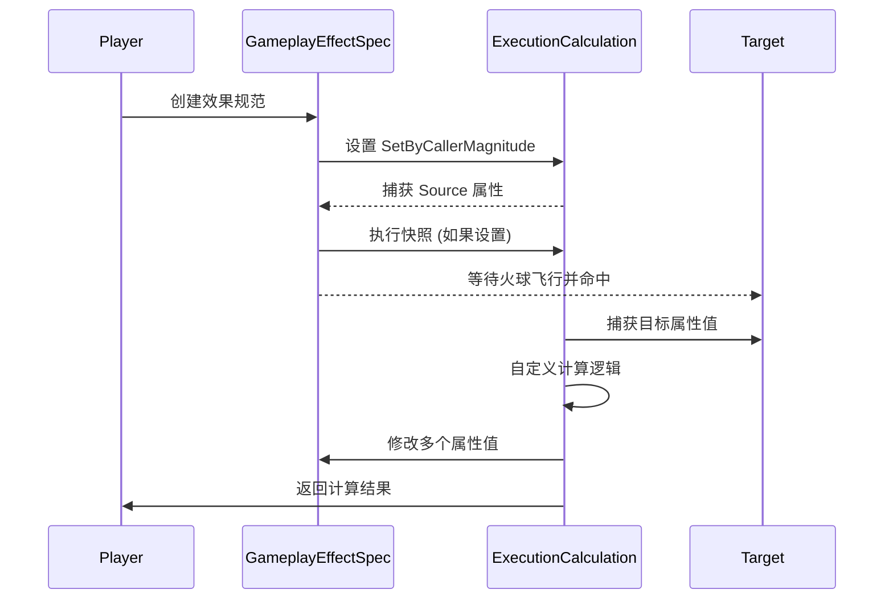

___________________________________________________________________________________________
###### [Go主菜单](../MainMenu.md)
___________________________________________________________________________________________

# GAS 061 概念:ExecutionCalculations(执行计算)

___________________________________________________________________________________________

# 目录

- [GAS 061 概念:ExecutionCalculations(执行计算)](#gas-061-概念executioncalculations执行计算)
  - [目录](#目录)
    - [整体思路梳理](#整体思路梳理)
    - [简单介绍](#简单介绍)
    - [Execution Calculation 是最强大和最自定义的属性修改方式](#execution-calculation-是最强大和最自定义的属性修改方式)
    - [`ExecutionCalculations` 的使用注意事项：](#executioncalculations-的使用注意事项)
    - [`Execution Calculation` 中的快照机制：](#execution-calculation-中的快照机制)
    - [快照机制：以我们的火球为例](#快照机制以我们的火球为例)

___________________________________________________________________________________________

视频链接

[11. Execution Calculations_哔哩哔哩_bilibili](https://www.bilibili.com/video/BV1JD421E7yC?p=140&vd_source=9e1e64122d802b4f7ab37bd325a89e6c)

___________________________________________________________________________________________

### 整体思路梳理

Mermaid

___________________________________________________________________________________________

> 在之前我们使用了：
>
> - `Modifier Magnitude calculation` (自定义属性计算方式)
>
> 本节，我们将使用另一个计算方式
>
> - `ExecutionCalculations` (执行计算)

------

### 简单介绍

### Execution Calculation 是最强大和最自定义的属性修改方式

> Execution Calculation 被认为是游戏效果中修改属性最强大和最自定义的方式。这种机制允许开发者在游戏中使用捕获的属性值来进行复杂的计算，进而影响多个属性。与只能够修改单个属性的 `UModifierMagnitudeCalculation`（MMC）不同，Execution Calculation 具有更大的灵活性和强大的能力。
>
> #### 功能和灵活性
>
> - **多属性捕获与修改**：Execution Calculation 可以捕获多个属性值，并基于这些值进行复杂的计算和多属性修改。这种能力提供了极大的灵活性，使开发者可以设计复杂的游戏机制和交互。
> - **自定义计算逻辑**：开发者可以在 `Execute` 方法中编写自定义逻辑，以精确地控制属性如何根据游戏状态或其他因素进行调整。这个功能允许开发者实现更复杂和细致的游戏效果。
>
> Execution Calculation 作为 Gameplay Ability System 中最强大和最灵活的属性修改工具，允许开发者通过捕获多个属性并使用复杂的自定义逻辑来实现高复杂度的游戏效果。它在设计和实现游戏机制时提供了极大的自由度，但同时也要求开发者在使用时注意一些关键的限制和规则，以确保效果按预期运行。

------

------

### `ExecutionCalculations` 的使用注意事项：

> 1. **Capture Attributes**
>    **捕获属性**
>    UGameplayEffectExecutionCalculation 可以捕获多个属性的值来用于计算。
>
> 2. **Can change more than one Attribute**
>    **可以改变多个属性**
>    该计算可以同时修改多个属性的值。
>
> 3. **Can have programmer logic**
>    **可以包含程序员逻辑**
>    可以在计算中加入程序员自定义的逻辑来决定属性值的变化。
>
> 4. **No prediction**
>    **不支持预测**
>    该计算不会在客户端进行预测，只有在服务器上才会进行计算。
>
> 5. **Only Instant or Periodic Gameplay Effects**
>    **只适用于瞬时或周期性游戏效果**
>    该计算仅适用于瞬时（Instant）或周期性（Periodic）的GameplayEffect，不支持持续（Duration）效果。
>
> 6. **Capturing doesn't run PreAttributeChange; any clamping done there must be done again**
>    **捕获不会运行 PreAttributeChange；任何在那里的限制都必须再次执行**
>    在捕获属性时，不会执行 `PreAttributeChange` 回调，因此任何限制（如属性值的限制）需要在计算中重新执行。
>
> 7. **Only executed on the Server from Gameplay Abilities with Local Predicted, Server Initiated, and Server Only**
>    **仅在具有本地预测、服务器启动和仅服务器的游戏能力中在服务器上执行**
>    该计算仅在服务器上执行，适用于本地预测、服务器启动以及仅服务器的Gameplay Ability。
>
> 8. **Net Execution Policies**
>    **网络执行策略**
>    描述了在网络环境中如何执行该计算的策略。

------

### `Execution Calculation` 中的快照机制：

> - **关键点：**
>   1. **快照（Snapshot）**是一个选项，用于捕获 **Source** 的属性值。
>   2. 只适用于捕获 **Source** 的属性，而不是 **Target**。
>   3. **快照的作用**是在**创建**游戏效果规范（Spec）时，将属性值固定下来，以防后续变化。
>   
> - **分情况说明：**
>   - **如果属性被设置为使用快照：**
>     - **作用：** 在创建 `Spec` 时，立即捕获当前属性值。
>     - **结果：** `Execution Calculation` 使用的是 `Spec` 创建时的属性值，即使之后属性值改变也不会影响计算。
>     - **例子：** 玩家在使用某个技能时，玩家的力量属性（Source）被捕获并快照，之后力量值改变，但计算仍使用最初的力量值。
>   
>   - **如果属性没有设置为使用快照：**
>     - **作用：** 不会在创建 `Spec` 时捕获属性值。
>     - **结果：** `Execution Calculation` 使用的是效果实际执行时的属性值，受属性的实时变化影响。
>     - **例子：** 玩家使用技能，玩家的力量属性（Source）在执行计算时直接读取当前值，因此如果力量值在期间改变，计算将反映这个变化。
>
>
> - **总结：**
> - 使用快照：捕获并锁定属性值，计算时不受后续变化影响。
>   
> - 不使用快照：属性值实时读取，计算时反映当前的属性状态。

### 快照机制：以我们的火球为例

> - **创建效果规范（Spec）**：
>   - 在生成火球时，我们创建了效果规范（Spec），并将该 `Spec Handle` 存储在火球上。
> - **等待应用**：
>   - 火球飞行时，我们等待它撞到某个目标。
> - **应用效果**：
>   - 当火球撞到目标时，我们使用 `Spec Handle` 对该目标应用游戏效果。
>
> #### 关于快照和属性捕获的关键点
>
> - **使用快照时**：
>   - 创建 `Spec` 时就捕获并固定了 `Source` 属性的值（例如施法者的属性），在效果应用前不会再变化。
> - **不使用快照时**：
>   - 在效果实际应用时捕获 `Source` 属性的值，这样可以反映最新的属性状态。
> - **Target 属性**：
>   - 对于 `Target`，不论是否设置为快照，属性都是在效果应用时捕获。因为在创建 `spec` 时，我们还不知道目标是谁，只有在效果应用时才能确定。
>
> #### 总结
>
> - 火球在创建时捕获 `Source` 属性（如果使用快照）。
> - 火球击中目标时，应用效果，并捕获 `Target` 属性值。

------

现在的 **Execution Calculation** 非常强大。

假设我们有一个 **Gameplay Effect Spec**，在这个 **Spec** 中，我们使用 **Gameplay Effect** 类来执行自定义计算，现在我们知道，这个 **Execution Calculation** 能够捕捉属性。它还能按 **Set by Caller Magnitude** 捕捉设置。换句话说，我们可以设置一个键值对，其中键是 **Gameplay Tag**，值是一些浮点数的大小。我们可以在 **Gameplay Effect Spec** 上设置它，一旦我们创建它，我们可以分配 **Set by Caller** 的标签和值，当 **Gameplay Effect** 被应用时，**Execution Calculation** 能够根据 **Set by Caller** 设置检索到它。

在 **Gameplay Effect** 本身中，我们也可以添加由属性支持的修饰符（Modifiers）。因此，我们可以在 **Source** 或 **Target** 上修改属性。现在将应用此修改，假设我们想要覆盖、添加、减去、乘以我们想要对捕获的任何属性值做的操作。我们可以直接在 **Gameplay Effect** 上做到这一点。一旦我们开始执行计算，如果我们捕获了该属性，我们将在计算后得到捕获的值，并且这些值已被修饰符修改。因此，你可以看到，**Gameplay Effect Execution Calculation** 非常强大。其中一个常见用例是复杂的伤害计算，需要考虑许多属性和其他值。这就是我们要使用的内容。

___________________________________________________________________________________________

[返回最上面](#Go主菜单)

___________________________________________________________________________________________