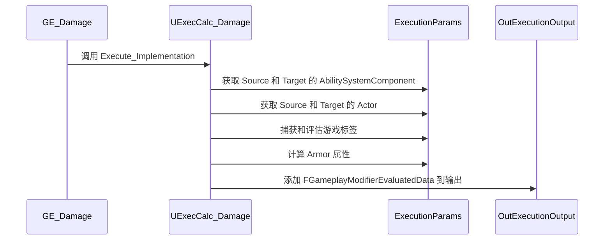

___________________________________________________________________________________________
###### [Go主菜单](../MainMenu.md)

___________________________________________________________________________________________

# GAS 062 使用ExecutionCalculations计算伤害

___________________________________________________________________________________________

## 处理关键点

1. 使用ExecutionCalculations计算伤害需要先 `捕获属性` 再计算并应用  `捕获属性` 

2.  `捕获属性` 的两种：一种自己创建；一种是用官方宏

3.  `捕获属性` 五个步骤

4. 计算并应用  `捕获属性` 五个步骤

5. 回顾自定义计算类MMC的流程


___________________________________________________________________________________________

# 目录


- [GAS 062 使用ExecutionCalculations计算伤害](#gas-062-使用executioncalculations计算伤害)
	- [处理关键点](#处理关键点)
	 - [目录](#目录)
		- [整体思路梳理](#整体思路梳理)
		- [创建自定义计算的C++类](#创建自定义计算的c类)
		- [`捕获属性`  第一步：创建一个结构体](#捕获属性--第一步创建一个结构体)
		- [`捕获属性`  第二步：为结构体创建构造](#捕获属性--第二步为结构体创建构造)
		- [`捕获属性`  第三步：在全局域中创建一个静态的结构体对象实例并返回](#捕获属性--第三步在全局域中创建一个静态的结构体对象实例并返回)
		- [`捕获属性`  第四步：使用官方帮助处理的宏 帮助 声明一些新的捕获定义](#捕获属性--第四步使用官方帮助处理的宏-帮助-声明一些新的捕获定义)
		- [`捕获属性`  第五步：构造中，把要捕获的属性添加到 `RelevantAttributesToCapture` 数组](#捕获属性--第五步构造中把要捕获的属性添加到-relevantattributestocapture-数组)
		  - [以上就是捕获属性的五个步骤，下面是在 `Execute` 函数中处理计算和应用捕获的属性](#以上就是捕获属性的五个步骤下面是在-Execute-函数中处理计算和应用捕获的属性)
		- [`捕获的属性`  计算和应用 第一步：使用API获取捕获的属性值](#捕获的属性--计算和应用-第一步使用api获取捕获的属性值)
		- [`捕获的属性`  计算和应用 第二步：对 获取捕获的属性值 进行 `夹值` 限制](#捕获的属性--计算和应用-第二步对-获取捕获的属性值-进行-夹值-限制)
		  - [与MMC不同的是我们还应该进行 `夹值` ( `FMath::Clamp` )的限制](#与mmc不同的是我们还应该进行-夹值--fmathclamp-的限制)
		- [`捕获的属性`  计算和应用 第三步：使用 `float` 值计算](#捕获的属性--计算和应用-第三步使用-float-值计算)
		- [`捕获的属性`  计算和应用 第四步：使用实参 `OutExecutionOutput` 将计算结果输出](#捕获的属性--计算和应用-第四步使用实参-outexecutionoutput-将计算结果输出)
		- [`捕获的属性`  计算和应用 第五步：蓝图GE中配置 `Calculation Class`](#捕获的属性--计算和应用-第五步蓝图ge中配置-calculation-class)
		- [断点测试结果](#断点测试结果)
		- [完成！以上就是复杂运算的完整步骤。注意整理！](#完成以上就是复杂运算的完整步骤结合之前的mmc一共两种捕获属性的声明初始化方式注意整理)


___________________________________________________________________________________________

<details>
<summary>视频链接</summary>

[12. Damage Execution Calculation_哔哩哔哩_bilibili](https://www.bilibili.com/video/BV1JD421E7yC?p=141&vd_source=9e1e64122d802b4f7ab37bd325a89e6c)

[13. ExecCalcs - Capturing Attributes_哔哩哔哩_bilibili](https://www.bilibili.com/video/BV1JD421E7yC?p=142&vd_source=9e1e64122d802b4f7ab37bd325a89e6c)

</details>

___________________________________________________________________________________________

### 整体思路梳理

Mermaid




___________________________________________________________________________________________

> **之前**，当我们需要计算受到的伤害时(比如计算护甲/魔抗之类)就要用到 **`自定义计算方式`** 
>
> 我们需要使用 `GE->Modifiers->ModifierMagnitude->MagnitudeCalculationType` 下的 `Custom Calculation Class`
>
> 而今天我们要学的是这个

------

### 创建自定义计算的C++类

1. `C++类/Aura/Public/AbilitySystem/` 文件夹下，新建文件夹，命名为 `ExecCalc`

2. 创建 `GameplayEffectExecutionCalculation` 类，命名为 `ExecCalc_Damage`

> 这是我们 **`基于游戏效果执行计算的自定义计算类`**，类似于MMC(自定义伤害计算类)

- 需要创建一个构造函数

  ```CPP
  UExecCalc_Damage();
  ```

- 需要重写一个虚函数 `Execute_Implementation`，有两个参数

<details>
<summary>介绍虚函数 Execute_Implementation</summary>

> | 参数                                                         | 用途                                            |
> | ------------------------------------------------------------ | ----------------------------------------------- |
> | `const FGameplayEffectCustomExecutionParameters& ExecutionParams` | 传入的参数，可以获取很多数据                    |
> | `FGameplayEffectCustomExecutionOutput& OutExecutionOutput`   | 没有const，说明是传入参数，通过引用改变参数输出 |
>
>   **函数内部可以不调用 `Super` !**
>
>   可以通过 `ExecutionParams.` 获取好多有用的参数，比如：
>
> | 参数                                            | 获取的数据               |
> | ----------------------------------------------- | ------------------------ |
> | ExecutionParams.GetOwningSpec                   | 拥有此计算的游戏效果规范 |
> | ExecutionParams.GetPredictionKey                | 获取预测密钥             |
> | ExecutionParams.GetSourceAbilitySystemComponent | 获取Source的ASC组件      |
> | ExecutionParams.GetTargetAbilitySystemComponent | 获取Target的ASC组件      |
> | ...                                             | ...                      |
>
>   

------

</details>
虚函数 `Execute_Implementation` 中需要从 `ExecutionParams` 获取

1. **SourceAbilitySystemComponent**，命名为 `SourceASC` 
2. **TargetAbilitySystemComponent**，命名为 `TargetASC` 
3. **SourceActor**，命名为 `SourceAvatar` 
4. **TargetActor**，命名为 `TargetAvatar` 
5. **GameplayEffectSpec**，命名为 `Spec` 


```CPP
void UExecCalc_Damage::Execute_Implementation(const FGameplayEffectCustomExecutionParameters& ExecutionParams,
                                              FGameplayEffectCustomExecutionOutput& OutExecutionOutput) const
{
	//Super::Execute_Implementation(ExecutionParams, OutExecutionOutput);
	const UAbilitySystemComponent* Source = ExecutionParams.GetSourceAbilitySystemComponent();
	const UAbilitySystemComponent* Target = ExecutionParams.GetTargetAbilitySystemComponent();

	AActor* SourceAvatar = Source->GetAvatarActor();
	AActor* TargetAvatar = Target->GetAvatarActor();

	FGameplayEffectSpec GE_Spec = ExecutionParams.GetOwningSpec();
}
```

------

> 以上为创建 `GameplayEffectExecutionCalculation` 类，并获取数据的步骤，下面将**捕获属性**并计算

------

**在虚幻官方演示的动作RPG项目中，多次使用这样的方式：**

那就是，**创建一个结构体来储存我们捕获的属性定义**，并对其进行定义

<details>
<summary>回顾之前的MMC(UModifierMagnitudeCalculation)中的捕获属性的方式</summary>


> 这些属性捕获定义是我们捕获属性的方式。
> 1. 首先我们使用构造函数来设置捕获参数定义并将其添加到相关属性中以捕获。这就是我们在MMC中捕获属性的方式。
>    - MMC类本身上的属性捕获定义的T数组 `RelevantAttributesToCapture`
> 2. 使用了一个捕获定义，并在实际函数 `CalculateBaseMagnitude_Implementation` 中计算
>    - 我们创建了一些评估参数，并在函数GetCapturedAttributeMagnitude中，传递评估参数引用，然后得到了捕获属性的值。
> 3. 这就是 MMC 中捕获属性的方式。
>
> 

------


</details>

> **在 ExecutionCalculations 中我们也将使用这种捕获属性的方式，但是，这次使用官方给的帮助宏和结构体，除了计算方式与MMC略有不同**

---
### `捕获属性`  第一步：创建一个结构体

命名为 `AuraDamageStatics`
- 没有使用 `F` 开头因为，这是一个原始结构
  - **完全不会将其暴露给蓝图或反射系统**
  - **也不是一个 `U` 类结构**，所以不用添加那个对于 `U` 结构所需的 `F`
  - **也不需要 `GENERATE_BODY` 宏**
- **这只是一个在这个CPP文件中使用的原始内部结构**

```CPP
struct AuraDamageStatics
{
};
```

---
### `捕获的属性`  第二步：为结构体创建构造

```CPP
struct AuraDamageStatics
{
	AuraDamageStatics()
	{
		
	}
};
```

---
### `捕获属性`  第三步：在全局域中创建一个静态的结构体对象实例并返回

> 静态对象意味着，第一次访问时将创建一个实例，并返回。后续每次访问，只返回该实例。

```CPP
static const AuraDamageStatics& DamageStatics()
{
	static AuraDamageStatics DStatics;
	return DStatics;
}
```


---
### `捕获属性`  第四步：使用官方帮助处理的宏 帮助 声明一些新的捕获定义

- **官方 `帮助声明新的捕获定义` 的 宏**

- 使用这个宏来为我们创建一个 **AS属性** `FProperty*` 和一个**捕获定义**的 `FGameplayEffectAttributeCaptureDefinition` 类型变量。

  ```CPP
  DECLARE_ATTRIBUTE_CAPTUREDEF(这里填入要捕获的AS中的属性名);
  ```

  ```CPP
  DEFINE ATTRIBUTE CAPTUREDEF(S,P,T,B);/*四个参数分别为AttributeSetClass, AttributeName, Source, bSnapshot*/
  ```

  

<details>
<summary>使用官方帮助处理的宏 源码</summary>


>1. `DECLARE_ATTRIBUTE_CAPTUREDEF` 宏
>  - 接受我放进去的文本，在这种情况下是盔甲
>  - 创建一个名为 Armor Property 的类型为F属性指针的新变量 
>  - 不一定非要填入 `要捕获的AS中的属性名` 可以是 **`为该属性创建的变量名`**
>  - 因为传入的内容并不是视为变量，而是视为一个名字
>  - 所以生成的变量名字为 —— `填入的内容+Def`[^1] 
>  - 比如这里，正在创建一个名为 `ArmorDef` 的 `FGameplayEffectAttributeCaptureDefinition` 类型变量。
>
>下面还有一个
>
>2. `DEFINE_ATTRIBUTE_CAPTUREDEF` 宏
>
>   - 它接受四种不同的东西，分别为 `S` `P` `T` `B`
>
>     | `DEFINE_ATTRIBUTE_CAPTUREDEF` 宏参数 | 作用            |                        |
>     | :----------------------------------: | :-------------- | ---------------------- |
>     |                **S**                 | AS的 `类名`     | `AttributeSetClass`    |
>     |                **P**                 | 这是个 `AS属性` | `AttributeName`        |
>     |                **T**                 | `目标类型枚举`  | `Source` 或者 `Target` |
>     |                **B**                 | `布尔` 是否快照 | `bSnapshot`            |
>
>   - 宏 中 `GET_MEMBER_NAME_CHECKED(S,P)`看样子是检查 `S` 这个类中有没有 `P` 这个属性
>
>   - `P##Def = FGameplayEffectAttributeCaptureDefinition(P##Property,EGameplavEffectAttributeCaptureSource::T,B);` 这行代码看样子是使用有参构造为变量赋值
>


------

</details>

------

>  **可以帮助我们制定我们的属性捕获定义并对其进行定义**

------

使用示例：

```CPP
struct AuraDamageStatics
{
	DECLARE_ATTRIBUTE_CAPTUREDEF(Armor);
	AuraDamageStatics()
	{
		DEFINE_ATTRIBUTE_CAPTUREDEF(UAuraAttributeSet,Armor,Target,false);
	}
};

static const AuraDamageStatics& DamageStatics()
{
	static AuraDamageStatics DStatics;
	return DStatics;
}
```


------

### `捕获属性`  第五步：构造中，把要捕获的属性添加到 `RelevantAttributesToCapture` 数组

##### 这一步才是真正的捕获属性：

```CPP
UExecCalc_Damage::UExecCalc_Damage()
{
	RelevantAttributesToCapture.Add(DamageStatics().ArmorDef);
}
```


<details>
<summary>在MMC中做过类似的事</summary>

>区别是：之前在MMC中是手动做的，手动创建VigorDef，设置属性
>

------

</details>

**区别是，在本节我们是使用 `官方的帮助声明和初始化捕获属性` 来完成的**

##### 以上就是捕获属性的五个步骤，下面是在 `Execute` 函数中处理计算和应用捕获的属性

---

###  `捕获的属性`  计算和应用 第一步：使用API获取捕获的属性值

调用函数 `ExecutionParams.AttemptCalculateCapturedAttributeMagnitude` 传参

**再获取数据后调用函数：`尝试计算捕获属性的大小`**，它需要三个参数：

1. 一个属性捕获定义 `FGameplayEffectAttributeCaptureDefinition`
2. 需要一个F聚合器来评估参数 `FAggregatorEvaluateParameters`

```CPP
ExecutionParams.AttemptCalculateCapturedAttributeMagnitude()
```


##### `FGameplayEffectAttributeCaptureDefinition` 可以通过 `DamageStatics().ArmorDef` 获得

##### `FAggregatorEvaluateParameters` 需要创建一个这个类型的变量(参考MMC)

> -  **传入 `SourceTag` 和 `TargetTag`**

<details>
<summary>MMC中的参考</summary>

>

------

</details>

```CPP
void UExecCalc_Damage::Execute_Implementation(const FGameplayEffectCustomExecutionParameters& ExecutionParams,
                                              FGameplayEffectCustomExecutionOutput& OutExecutionOutput) const
{
	//Super::Execute_Implementation(ExecutionParams, OutExecutionOutput);
	const UAbilitySystemComponent* Source = ExecutionParams.GetSourceAbilitySystemComponent();
	const UAbilitySystemComponent* Target = ExecutionParams.GetTargetAbilitySystemComponent();

	AActor* SourceAvatar = Source->GetAvatarActor();
	AActor* TargetAvatar = Target->GetAvatarActor();

	const FGameplayEffectSpec GE_Spec = ExecutionParams.GetOwningSpec();
	
	FAggregatorEvaluateParameters EvaluateParameters;
	EvaluateParameters.SourceTags = GE_Spec.CapturedSourceTags.GetAggregatedTags();
	EvaluateParameters.TargetTags = GE_Spec.CapturedTargetTags.GetAggregatedTags();
}
```

##### 创建局部float变量，传入函数中，因为是引用会修改该值，也就得到了该属性的 `float` 值


<details>
<summary>所以就像我们在MMC中所做的那样，我们将创建一个局部变量，我们将把它传递进去，然后在调用这个函数之后，它现在应该具有被捕获属性的值</summary>

>

------

</details>

###  `捕获的属性`  计算和应用 第二步：对 获取捕获的属性值 进行 `夹值` 限制

##### 与MMC不同的是我们还应该进行 `夹值` ( `FMath::Clamp` )的限制

```CPP
Armor = FMath::Max<float>(0.f,Armor); 
```


------

###  `捕获的属性`  计算和应用 第三步：使用 `float` 值计算

> **计算公式自己设计吧**

------

###  `捕获的属性`  计算和应用 第四步：使用实参 `OutExecutionOutput` 将计算结果输出

使用API：

```CPP
OutExecutionOutput.AddOutputModifier(FGameplayModifierEvaluatedData类型变量);
```

> - 需要传入一个 `FGameplayModifierEvaluatedData` 类型的变量，需要有参构造一个

`构造` **一共需要三个参数：**

1. ###### `FGameplayAttribute` 可以通过 `DamageStatics().ArmorProperty` 获得

2. `EGameplayModOp` 类型的 `枚举`

3. `float` 的属性值

```CPP
OutExecutionOutput.AddOutputModifier(FGameplayModifierEvaluatedData(1,2,3));
```

> - 然后给 `OutExecutionOutput.AddOutputModifier`  函数传入上面创建的 `FGameplayModifierEvaluatedData` 类型的变量

```CPP
void UExecCalc_Damage::Execute_Implementation(const FGameplayEffectCustomExecutionParameters& ExecutionParams,
                                              FGameplayEffectCustomExecutionOutput& OutExecutionOutput) const
{
	//Super::Execute_Implementation(ExecutionParams, OutExecutionOutput);
	const UAbilitySystemComponent* Source = ExecutionParams.GetSourceAbilitySystemComponent();
	const UAbilitySystemComponent* Target = ExecutionParams.GetTargetAbilitySystemComponent();

	AActor* SourceAvatar = Source->GetAvatarActor();
	AActor* TargetAvatar = Target->GetAvatarActor();

	const FGameplayEffectSpec GE_Spec = ExecutionParams.GetOwningSpec();
	
	FAggregatorEvaluateParameters EvaluateParameters;
	EvaluateParameters.SourceTags = GE_Spec.CapturedSourceTags.GetAggregatedTags();
	EvaluateParameters.TargetTags = GE_Spec.CapturedTargetTags.GetAggregatedTags();

	float Armor = 0.f;
	
	ExecutionParams.AttemptCalculateCapturedAttributeMagnitude(DamageStatics().ArmorDef,EvaluateParameters,Armor);
	
	Armor = FMath::Max<float>(0.f,Armor); /*夹值*/
	
	Armor += 10.f;/*假装这是复杂计算*/

	const FGameplayModifierEvaluatedData EvaluatedData = FGameplayModifierEvaluatedData(DamageStatics().ArmorProperty, EGameplayModOp::Override, Armor);
	
	OutExecutionOutput.AddOutputModifier(EvaluatedData);
}
```


------

<details>
<summary>下面我放一下我的文件ExecCalc_Damage代码</summary>

>
>
>
>
>+ **`ExecCalc_Damage.h`中：**
>```cpp
>// Copyright belongs to Li Yunlong.
>
>#pragma once
>
>#include "CoreMinimal.h"
>#include "GameplayEffectExecutionCalculation.h"
>#include "AbilitySystem/AuraAttributeSet.h"
>#include "ExecCalc_Damage.generated.h"
>
>struct AuraDamageStatics
>{
>	DECLARE_ATTRIBUTE_CAPTUREDEF(Armor);
>	AuraDamageStatics()
>	{
>		DEFINE_ATTRIBUTE_CAPTUREDEF(UAuraAttributeSet,Armor,Target,false);
>	}
>};
>
>static const AuraDamageStatics& DamageStatics()
>{
>	static AuraDamageStatics DStatics;
>	return DStatics;
>}
>
>/**
> * 
> */
>UCLASS()
>class AURA_API UExecCalc_Damage : public UGameplayEffectExecutionCalculation
>{
>	GENERATED_BODY()
>
>public:
>	UExecCalc_Damage();
>
>	virtual void Execute_Implementation(const FGameplayEffectCustomExecutionParameters& ExecutionParams, FGameplayEffectCustomExecutionOutput& OutExecutionOutput) const override;
>};
>
>```
>
>+ **`ExecCalc_Damage.cpp`中：**
>```cpp
>// Copyright belongs to Li Yunlong.
>
>
>#include "AbilitySystem/ExecCalc/ExecCalc_Damage.h"
>
>#include "AbilitySystemComponent.h"
>
>UExecCalc_Damage::UExecCalc_Damage()
>{
>	RelevantAttributesToCapture.Add(DamageStatics().ArmorDef);
>}
>
>void UExecCalc_Damage::Execute_Implementation(const FGameplayEffectCustomExecutionParameters& ExecutionParams,
>                                              FGameplayEffectCustomExecutionOutput& OutExecutionOutput) const
>{
>	//Super::Execute_Implementation(ExecutionParams, OutExecutionOutput);
>	const UAbilitySystemComponent* Source = ExecutionParams.GetSourceAbilitySystemComponent();
>	const UAbilitySystemComponent* Target = ExecutionParams.GetTargetAbilitySystemComponent();
>
>	AActor* SourceAvatar = Source->GetAvatarActor();
>	AActor* TargetAvatar = Target->GetAvatarActor();
>
>	const FGameplayEffectSpec GE_Spec = ExecutionParams.GetOwningSpec();
>	
>	FAggregatorEvaluateParameters EvaluateParameters;
>	EvaluateParameters.SourceTags = GE_Spec.CapturedSourceTags.GetAggregatedTags();
>	EvaluateParameters.TargetTags = GE_Spec.CapturedTargetTags.GetAggregatedTags();
>
>	float Armor = 0.f;
>	
>	ExecutionParams.AttemptCalculateCapturedAttributeMagnitude(DamageStatics().ArmorDef,EvaluateParameters,Armor);
>	
>	Armor = FMath::Max<float>(0.f,Armor); /*夹值*/
>	
>	Armor += 10.f;/*假装这是复杂计算*/
>
>	const FGameplayModifierEvaluatedData EvaluatedData = FGameplayModifierEvaluatedData(DamageStatics().ArmorProperty, EGameplayModOp::Override, Armor);
>	
>	OutExecutionOutput.AddOutputModifier(EvaluatedData);
>}
>
>```

------

</details>

------
###  `捕获的属性`  计算和应用 第五步：蓝图GE中配置 `Calculation Class` 

蓝图的 *GE_Damage* 中配置 `Calculation Class` 

- **`GE->Modifiers->Executions` 下添加元素， `Calculation Class` 选择 `Custom Calculation Class` **

- **然后选择自己创建的ExecutionCalculations类 `ExecCalc_Damage` **


------

### 断点测试结果

断点这一行，查看结果

> **继续一次再释放火球，查看断点数据是否准确**

------

### 完成！以上就是复杂运算的完整步骤，结合之前的MMC，一共两种捕获属性的声明初始化方式。注意整理！

___________________________________________________________________________________________

[返回最上面](#Go主菜单)

___________________________________________________________________________________________
[^1]: 比如输入的是Armor那么变量名字就是ArmorDef