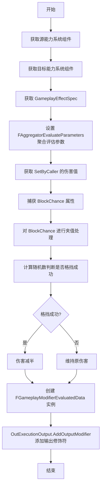

___________________________________________________________________________________________
###### [Go主菜单](../MainMenu.md)
___________________________________________________________________________________________

# GAS 063 实现格挡计算；在C++中使用SetByCaller

___________________________________________________________________________________________

## 处理关键点

1. 捕获属性流程

2. 生成处理随机数/概率


___________________________________________________________________________________________

# 目录


- [GAS 063 实现格挡计算；在C++中使用SetByCaller](#gas-063-实现格挡计算在c中使用setbycaller)
  - [处理关键点](#处理关键点)
- [目录](#目录)
    - [整体思路梳理](#整体思路梳理)
    - [在C++中使用SetByCaller](#在c中使用setbycaller)
    - [小测试1](#小测试1)


___________________________________________________________________________________________

<details>
<summary>视频链接</summary>

[视频链接](ZHELISHISHIPINLIANJIE)

------

</details>

___________________________________________________________________________________________

### 整体思路梳理

Mermaid




___________________________________________________________________________________________
### 在C++中使用SetByCaller

<details>
<summary>删除旧的逻辑</summary>

> 之前是测试用护甲，把这部分临时逻辑移除

------

</details>

在 `UExecCalc_Damage` 的 `Execute_Implementation` 函数中
使用 `FGameplayEffectSpec` 获取 `SetByCallerMagnitude`

```CPP
float Damage = GE_Spec.GetSetByCallerMagnitude(FAuraGameplayTags::Get().Damage);
```

`FGameplayModifierEvaluatedData` 有参构造时，传入新的属性

```CPP
const FGameplayModifierEvaluatedData EvaluatedData = FGameplayModifierEvaluatedData(UAuraAttributeSet::GetIncomingDamageAttribute(), EGameplayModOp::Override, Damage);

OutExecutionOutput.AddOutputModifier(EvaluatedData);
```

此时 `UExecCalc_Damage` 的 `Execute_Implementation` 函数逻辑完整为：

```cpp
void UExecCalc_Damage::Execute_Implementation(const FGameplayEffectCustomExecutionParameters& ExecutionParams,
                                              FGameplayEffectCustomExecutionOutput& OutExecutionOutput) const
{
    //Super::Execute_Implementation(ExecutionParams, OutExecutionOutput);
    const UAbilitySystemComponent* Source = ExecutionParams.GetSourceAbilitySystemComponent();
    const UAbilitySystemComponent* Target = ExecutionParams.GetTargetAbilitySystemComponent();

    AActor* SourceAvatar = Source->GetAvatarActor();
    AActor* TargetAvatar = Target->GetAvatarActor();

    const FGameplayEffectSpec GE_Spec = ExecutionParams.GetOwningSpec();
    
    FAggregatorEvaluateParameters EvaluateParameters;
    EvaluateParameters.SourceTags = GE_Spec.CapturedSourceTags.GetAggregatedTags();
    EvaluateParameters.TargetTags = GE_Spec.CapturedTargetTags.GetAggregatedTags();

    //float Armor = 0.f;
    //ExecutionParams.AttemptCalculateCapturedAttributeMagnitude(DamageStatics().ArmorDef,EvaluateParameters,Armor);
    //Armor = FMath::Max<float>(0.f,Armor); /*夹值*/
    //Armor += 10.f;/*假装这是复杂计算*/
    
    float Damage = GE_Spec.GetSetByCallerMagnitude(FAuraGameplayTags::Get().Damage);
    
    const FGameplayModifierEvaluatedData EvaluatedData = FGameplayModifierEvaluatedData(UAuraAttributeSet::GetIncomingDamageAttribute(), EGameplayModOp::Override, Damage);
    
    OutExecutionOutput.AddOutputModifier(EvaluatedData);
}
```

------

> 编译引擎，运行发现 **和原来的在蓝图中设置 `Modifiers` 一样**
>
> **通过SetByCaller获取了一个 `键值对集合`**

------

### 小测试1


你要实现格挡几率。以下是你需要做的事情:

1. 你需要捕获格挡几率，从目标中捕获。

2. 不要使用快照，尽管你知道反正不会使用快照。

3. 然后检查是否成功格挡。

4. 如果格挡成功，将伤害减半。


接下来进行测试，看看你是否可以攻击敌人并成功被敌人格挡。

测试一下这个功能。你甚至可以尝试改变你正在对其发射火球的敌人的格挡几率，如果你想试试的话。现在暂停视频并实现格挡机制。


<details>
<summary>自己尝试一下</summary>

> 1. 捕获属性
>    - 在结构体中
>
>      ```cpp
>      struct AuraDamageStatics
>      {
>          DECLARE_ATTRIBUTE_CAPTUREDEF(Armor);
>          DECLARE_ATTRIBUTE_CAPTUREDEF(BlockChance);/*使用官方宏帮助 声明 捕获属性变量的Def*/
>          AuraDamageStatics()
>          {
>             DEFINE_ATTRIBUTE_CAPTUREDEF(UAuraAttributeSet,Armor,Target,false);
>             DEFINE_ATTRIBUTE_CAPTUREDEF(UAuraAttributeSet,BlockChance,Target,false);/*使用官方宏帮助 获取 捕获属性*/
>          }
>      };
>
>      static const AuraDamageStatics& DamageStatics()
>      {
>          static AuraDamageStatics DStatics;
>          return DStatics;
>      }
>      ```
>
>    - 在构造中
>
>      ```cpp
>      UExecCalc_Damage::UExecCalc_Damage()
>      {
>          RelevantAttributesToCapture.Add(DamageStatics().ArmorDef);
>          RelevantAttributesToCapture.Add(DamageStatics().BlockChanceDef);/*这里将属性加入捕获属性数组*/
>      }
>      ```
>
> 2. 获取捕获的属性值
>
>    ```cpp
>    float BlockChance = 0.f;
>    ExecutionParams.AttemptCalculateCapturedAttributeMagnitude(DamageStatics().BlockChanceDef,EvaluateParameters,BlockChance);
>    BlockChance = FMath::Max<float>(0.f,BlockChance);/*对属性进行夹值*/
>    ```
>
> 3. 计算格挡概率
>
>    ```cpp
>    const float Blocked = FMath::RandRange(1, 100);
>    Damage = Blocked < BlockChance ? Damage *= 0.5f : Damage;
>    ```
>
> 下面是完整的 `UExecCalc_Damage` 代码
>
> + `头文件`中：
> ```cpp
> // Copyright belongs to Li Yunlong.
> 
> #pragma once
> 
> #include "CoreMinimal.h"
> #include "GameplayEffectExecutionCalculation.h"
> #include "AbilitySystem/AuraAttributeSet.h"
> #include "ExecCalc_Damage.generated.h"
> 
> struct AuraDamageStatics
> {
> 	DECLARE_ATTRIBUTE_CAPTUREDEF(Armor);
> 	DECLARE_ATTRIBUTE_CAPTUREDEF(BlockChance);
> 	AuraDamageStatics()
> 	{
> 		DEFINE_ATTRIBUTE_CAPTUREDEF(UAuraAttributeSet,Armor,Target,false);
> 		DEFINE_ATTRIBUTE_CAPTUREDEF(UAuraAttributeSet,BlockChance,Target,false);
> 	}
> };
> 
> static const AuraDamageStatics& DamageStatics()
> {
> 	static AuraDamageStatics DStatics;
> 	return DStatics;
> }
> 
> /**
>  * 
>  */
> UCLASS()
> class AURA_API UExecCalc_Damage : public UGameplayEffectExecutionCalculation
> {
> 	GENERATED_BODY()
> 
> public:
> 	UExecCalc_Damage();
> 
> 	virtual void Execute_Implementation(const FGameplayEffectCustomExecutionParameters& ExecutionParams, FGameplayEffectCustomExecutionOutput& OutExecutionOutput) const override;
> };
> 
> ```
>
> + `源文件`中：
> ```cpp
> // Copyright belongs to Li Yunlong.
> 
> 
> #include "AbilitySystem/ExecCalc/ExecCalc_Damage.h"
> 
> #include "AbilitySystemComponent.h"
> #include "AuraGameplayTags.h"
> 
> UExecCalc_Damage::UExecCalc_Damage()
> {
> 	RelevantAttributesToCapture.Add(DamageStatics().ArmorDef);
> 	RelevantAttributesToCapture.Add(DamageStatics().BlockChanceDef);
> }
> 
> void UExecCalc_Damage::Execute_Implementation(const FGameplayEffectCustomExecutionParameters& ExecutionParams,
>                                               FGameplayEffectCustomExecutionOutput& OutExecutionOutput) const
> {
> 	//Super::Execute_Implementation(ExecutionParams, OutExecutionOutput);
> 	const UAbilitySystemComponent* Source = ExecutionParams.GetSourceAbilitySystemComponent();
> 	const UAbilitySystemComponent* Target = ExecutionParams.GetTargetAbilitySystemComponent();
> 
> 	AActor* SourceAvatar = Source->GetAvatarActor();
> 	AActor* TargetAvatar = Target->GetAvatarActor();
> 
> 	const FGameplayEffectSpec GE_Spec = ExecutionParams.GetOwningSpec();
> 	
> 	FAggregatorEvaluateParameters EvaluateParameters;
> 	EvaluateParameters.SourceTags = GE_Spec.CapturedSourceTags.GetAggregatedTags();
> 	EvaluateParameters.TargetTags = GE_Spec.CapturedTargetTags.GetAggregatedTags();
> 
> 	//float Armor = 0.f;
>     //ExecutionParams.AttemptCalculateCapturedAttributeMagnitude(DamageStatics().ArmorDef,EvaluateParameters,Armor);
>     //Armor = FMath::Max<float>(0.f,Armor); /*夹值*/
>     //Armor += 10.f;/*假装这是复杂计算*/
> 
> 	float Damage = GE_Spec.GetSetByCallerMagnitude(FAuraGameplayTags::Get().Damage);
> 	
> 	float BlockChance = 0.f;
> 	ExecutionParams.AttemptCalculateCapturedAttributeMagnitude(DamageStatics().BlockChanceDef,EvaluateParameters,BlockChance);
> 	BlockChance = FMath::Max<float>(0.f,BlockChance);/*对属性进行夹值*/
> 
> 	const float Blocked = FMath::RandRange(1, 100);
> 	Damage = Blocked < BlockChance ? Damage *= 0.5f : Damage;
> 	
> 	const FGameplayModifierEvaluatedData EvaluatedData = FGameplayModifierEvaluatedData(UAuraAttributeSet::GetIncomingDamageAttribute(), EGameplayModOp::Override, Damage);
> 	
> 	OutExecutionOutput.AddOutputModifier(EvaluatedData);
> }
> 
> ```

------

</details>

---
### GA中修改了等级，使用正常的等级


------

### 此时效果gif


___________________________________________________________________________________________

[返回最上面](#Go主菜单)

___________________________________________________________________________________________