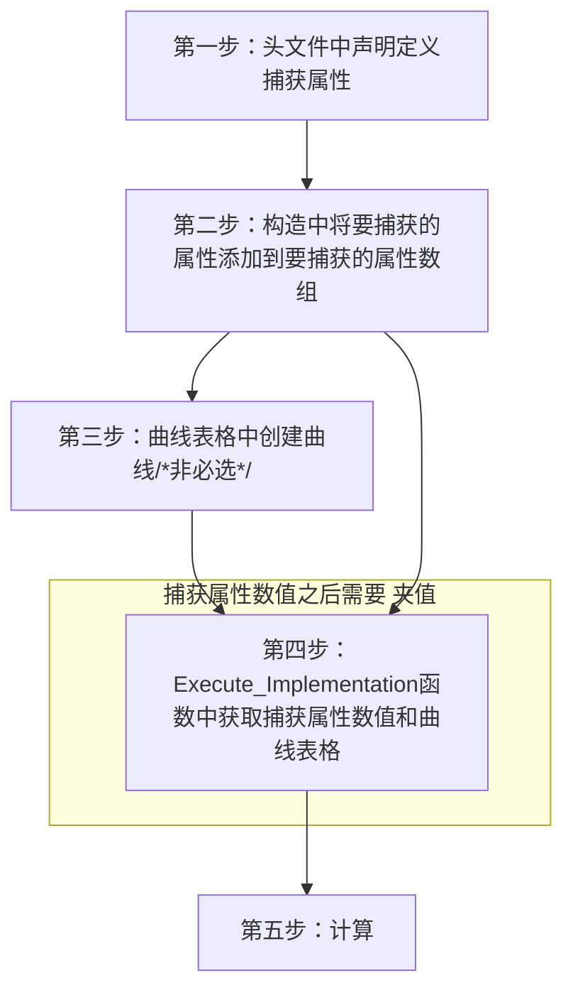

___________________________________________________________________________________________
###### [Go主菜单](../MainMenu.md)
___________________________________________________________________________________________

# GAS 065 实现暴击率/暴伤/暴击抗性

___________________________________________________________________________________________

# 目录


- [GAS 065 实现暴击率/暴伤/暴击抗性](#gas-065-实现暴击率暴伤暴击抗性)
  - [目录](#目录)
    - [Mermaid整体思路梳理](#mermaid整体思路梳理)
    - [小测试1](#小测试1)


___________________________________________________________________________________________

<details>
<summary>视频链接</summary>
[17.lmplementing Critical Hits](https://www.bilibili.com/video/BV1JD421E7yC/?p=146&vd_source=9e1e64122d802b4f7ab37bd325a89e6c)

------

</details>

___________________________________________________________________________________________

### Mermaid整体思路梳理

Mermaid




___________________________________________________________________________________________

### 小测试1

在本次测试中你需要实现暴击率/暴伤/暴击抗性的计算，还需要使用曲线表格来动态获取数值

> ## 任务说明
>
> ### 欢迎来到下一个任务
>
> 这次任务中，你将要实现暴击机制。这意味着你需要捕捉一些属性，并确定这次打击是否是关键的。
>
> - 你需要捕获以下属性：
>   - 暴击几率 `CriticalHitChance`
>   - 暴击伤害 `CriticalHitDamage`
>   - 暴击抗性 `CriticalHitResistance`
> - 如果造成了暴击，伤害翻倍并额外增加暴击伤害奖励。
> - 你可以使用暴击几率，并使用暴击抗性来降低有效暴击伤害。
>
> ### 额外挑战
>
> - 你可以添加一个暴击抵抗系数。
> - 我们有一个曲线表用于我们的伤害计算系数，如果你感兴趣的话，可以把它作为一个参数。
> - 你可以通过根据等级变化的系数来调整你的暴击抵抗能力。
>
> ### 实现需求
>
> 你需要决定这些属性是在 **Source** 还是 **Target** 捕捉。这项任务有几个步骤，但我相信你有能力处理它。
>
> ------
>
> ### 你需要实现：
>
> - 捕获 `暴击率` / `暴击伤害` / `暴击抗性`
> - 计算出暴击时的伤害


<details>
<summary>自己尝试一下</summary>

> ## 第一步：头文件中声明定义捕获属性
>
> ```cpp
> struct AuraDamageStatics
> {
> DECLARE_ATTRIBUTE_CAPTUREDEF(Armor);
> DECLARE_ATTRIBUTE_CAPTUREDEF(BlockChance);
> DECLARE_ATTRIBUTE_CAPTUREDEF(ArmorPenetration);
> DECLARE_ATTRIBUTE_CAPTUREDEF(CriticalHitChance);      /*暴击率*/
> DECLARE_ATTRIBUTE_CAPTUREDEF(CriticalHitDamage);      /*暴击伤害*/
> DECLARE_ATTRIBUTE_CAPTUREDEF(CriticalHitResistance);   /*暴击抗性*/
> AuraDamageStatics()
> {
> DEFINE_ATTRIBUTE_CAPTUREDEF(UAuraAttributeSet,Armor, Target ,false);
> DEFINE_ATTRIBUTE_CAPTUREDEF(UAuraAttributeSet,BlockChance, Target ,false);
> DEFINE_ATTRIBUTE_CAPTUREDEF(UAuraAttributeSet,ArmorPenetration, Source ,false);
> 
> DEFINE_ATTRIBUTE_CAPTUREDEF(UAuraAttributeSet,CriticalHitChance, Source ,false);      /*暴击率*/
> DEFINE_ATTRIBUTE_CAPTUREDEF(UAuraAttributeSet,CriticalHitDamage, Source ,false);      /*暴击伤害*/
> DEFINE_ATTRIBUTE_CAPTUREDEF(UAuraAttributeSet,CriticalHitResistance, Target ,false);   /*暴击抗性*/
> }
> };
> 
> static const AuraDamageStatics& DamageStatics()
> {
> static AuraDamageStatics DStatics;
> return DStatics;
> }
> ```
>
> ## 第二步：构造中将要捕获的属性添加到要捕获的属性数组
>
> ```cpp
> UExecCalc_Damage::UExecCalc_Damage()
> {
> RelevantAttributesToCapture.Add(DamageStatics().ArmorDef);
> RelevantAttributesToCapture.Add(DamageStatics().BlockChanceDef);
> RelevantAttributesToCapture.Add(DamageStatics().ArmorPenetrationDef);
> 
> RelevantAttributesToCapture.Add(DamageStatics().CriticalHitChanceDef);    /*暴击率*/
> RelevantAttributesToCapture.Add(DamageStatics().CriticalHitDamageDef);    /*暴击伤害*/
> RelevantAttributesToCapture.Add(DamageStatics().CriticalHitResistanceDef); /*暴击抗性*/
> }
> ```
>
> ## 第三步：曲线表格中创建曲线
>
> 
>
> ## 第四步：Execute_Implementation函数中获取捕获属性数值( 这之后需要 `夹值` )和曲线表格
>
> ```cpp
> float SourceCriticalHitChance = 0.f;/*源 暴击率*/
> ExecutionParams.AttemptCalculateCapturedAttributeMagnitude(DamageStatics().CriticalHitChanceDef, EvaluateParameters, SourceCriticalHitChance);
> SourceCriticalHitChance = FMath::Max<float>(SourceCriticalHitChance,0.f);
> 
> float SourceCriticalHitDamage = 0.f;/*源 暴击伤害*/
> ExecutionParams.AttemptCalculateCapturedAttributeMagnitude(DamageStatics().CriticalHitDamageDef, EvaluateParameters, SourceCriticalHitDamage);
> SourceCriticalHitDamage = FMath::Max<float>(SourceCriticalHitDamage,0.f);
> 
> float TargetCriticalHitResistance = 0.f;/*目标 暴击抗性*/
> ExecutionParams.AttemptCalculateCapturedAttributeMagnitude(DamageStatics().CriticalHitResistanceDef, EvaluateParameters, TargetCriticalHitResistance);
> TargetCriticalHitResistance = FMath::Max<float>(TargetCriticalHitResistance, 0.f);
> 
> //先去蓝图函数库拿 UCharacterClassInfo*
> UCharacterClassInfo* CharacterClassInfo = UAuraAbilitySystemLibrary::GetCharacterClassInfo(Source);
> check(CharacterClassInfo);
> //拿到DataAsset上的曲线表格
> UCurveTable* Curve = CharacterClassInfo->DamageCalculationCoefficients;
> check(Curve);
> 
> FRealCurve* CriticalHitResistanceCurve = CharacterClassInfo->DamageCalculationCoefficients->FindCurve(FName("CriticalHitResistance"),TEXT("CriticalHitResistance is not find !!!"));
> check(CriticalHitResistanceCurve);
> float CriticalHitResistanceCoefficient = CriticalHitResistanceCurve->Eval(Target_ICombatInterface->GetPlayerLevel());
> ```
>
> ## 第五步：计算
>
> #### 这一步就首先要明白一个概念
>
> 暴击抗性，到底影响的是：
>
> - 目标受到暴击的概率？
>
> - 还是降低目标受到暴击伤害后的伤害数值？
>
> 我觉得是第一种
>
> 那么计算方式为：
>
> - `暴击率` = `暴击率` - `目标抗暴击系数` * `抗暴击基数_这是曲线中的值`
> - 如果 `暴击` ? `伤害` = `伤害` * 2 + `暴击伤害` 
> - 这里是先计算 `护甲穿透` 和 `减伤` 之后再计算的 `暴击率` `暴击伤害`
>
> 下面是计算部分的代码：
>
> ```cpp
> // 暴击率 = 暴击率 - 目标抗暴击系数 * 抗暴击基数_这是曲线中的值
> float CriticalHitChance = SourceCriticalHitChance - TargetCriticalHitResistance * CriticalHitResistanceCoefficient;
> 
> const float Random = FMath::RandRange(1, 100);
> 
> // 如果 暴击? 伤害 = 伤害 * 2.f + 暴击伤害 
> Damage = Random < CriticalHitChance ? Damage * 2.f + SourceCriticalHitDamage: Damage;
> ```

------

</details>

下面是我的 `UExecCalc_Damage.cpp` 完整代码


<details>
<summary>UExecCalc_Damage.cpp</summary>

>```CPP
>// Copyright belongs to Li Yunlong.
>
>
>#include "AbilitySystem/ExecCalc/ExecCalc_Damage.h"
>
>#include "AbilitySystemComponent.h"
>#include "AuraGameplayTags.h"
>#include "AbilitySystem/AuraAbilitySystemLibrary.h"
>#include "AbilitySystem/Data/CharacterClassInfo.h"
>#include "Interaction/CombatInterface.h"
>// CriticalHitChance
>// CriticalHitDamage
>// CriticalHitResistance
>UExecCalc_Damage::UExecCalc_Damage()
>{
>    RelevantAttributesToCapture.Add(DamageStatics().ArmorDef);
>    RelevantAttributesToCapture.Add(DamageStatics().BlockChanceDef);
>    RelevantAttributesToCapture.Add(DamageStatics().ArmorPenetrationDef);
>    
>    RelevantAttributesToCapture.Add(DamageStatics().CriticalHitChanceDef);    /*暴击率*/
>    RelevantAttributesToCapture.Add(DamageStatics().CriticalHitDamageDef);    /*暴击伤害*/
>    RelevantAttributesToCapture.Add(DamageStatics().CriticalHitResistanceDef); /*暴击抗性*/
>}
>
>void UExecCalc_Damage::Execute_Implementation(const FGameplayEffectCustomExecutionParameters& ExecutionParams,
>                                              FGameplayEffectCustomExecutionOutput& OutExecutionOutput) const
>{
>    //Super::Execute_Implementation(ExecutionParams, OutExecutionOutput);
>    const UAbilitySystemComponent* Source = ExecutionParams.GetSourceAbilitySystemComponent();
>    const UAbilitySystemComponent* Target = ExecutionParams.GetTargetAbilitySystemComponent();
>
>    AActor* SourceAvatar = Source->GetAvatarActor();
>    AActor* TargetAvatar = Target->GetAvatarActor();
>    TScriptInterface<ICombatInterface> Source_ICombatInterface = SourceAvatar;
>    TScriptInterface<ICombatInterface> Target_ICombatInterface = TargetAvatar;
>    
>
>    const FGameplayEffectSpec GE_Spec = ExecutionParams.GetOwningSpec();
>    
>    FAggregatorEvaluateParameters EvaluateParameters;
>    EvaluateParameters.SourceTags = GE_Spec.CapturedSourceTags.GetAggregatedTags();
>    EvaluateParameters.TargetTags = GE_Spec.CapturedTargetTags.GetAggregatedTags();
>    
>    float Damage = GE_Spec.GetSetByCallerMagnitude(FAuraGameplayTags::Get().Damage);
>
>    float SourceCriticalHitChance = 0.f;/*源 暴击率*/
>    ExecutionParams.AttemptCalculateCapturedAttributeMagnitude(DamageStatics().CriticalHitChanceDef, EvaluateParameters, SourceCriticalHitChance);
>    SourceCriticalHitChance = FMath::Max<float>(SourceCriticalHitChance,0.f);
>    
>    float SourceCriticalHitDamage = 0.f;/*源 暴击伤害*/
>    ExecutionParams.AttemptCalculateCapturedAttributeMagnitude(DamageStatics().CriticalHitDamageDef, EvaluateParameters, SourceCriticalHitDamage);
>    SourceCriticalHitDamage = FMath::Max<float>(SourceCriticalHitDamage,0.f);
>    
>    float TargetCriticalHitResistance = 0.f;/*目标 暴击抗性*/
>    ExecutionParams.AttemptCalculateCapturedAttributeMagnitude(DamageStatics().CriticalHitResistanceDef, EvaluateParameters, TargetCriticalHitResistance);
>    TargetCriticalHitResistance = FMath::Max<float>(TargetCriticalHitResistance, 0.f);
>
>    //先去蓝图函数库拿 UCharacterClassInfo*
>    UCharacterClassInfo* CharacterClassInfo = UAuraAbilitySystemLibrary::GetCharacterClassInfo(Source);
>    check(CharacterClassInfo);
>    //拿到DataAsset上的曲线表格
>    UCurveTable* Curve = CharacterClassInfo->DamageCalculationCoefficients;
>    check(Curve);
>    //拿到表格行ArmorPenetration
>    FRealCurve* CurveRow_ArmorPenetration =  Curve->FindCurve(FName("ArmorPenetration"),TEXT("ArmorPenetration Is Not Find"));
>    check(CurveRow_ArmorPenetration);
>    float ArmorPenetrationCoefficient = CurveRow_ArmorPenetration->Eval(Source_ICombatInterface->GetPlayerLevel());
>    //拿到表格行EffectiveArmor
>    FRealCurve* CurveRow_EffectiveArmor =  Curve->FindCurve(FName("EffectiveArmor"),TEXT("ArmorPenetration Is Not Find"));
>    check(CurveRow_EffectiveArmor);
>    float EffectiveArmorCoefficient = CurveRow_EffectiveArmor->Eval(Target_ICombatInterface->GetPlayerLevel());
>    
>    FRealCurve* CriticalHitResistanceCurve = CharacterClassInfo->DamageCalculationCoefficients->FindCurve(FName("CriticalHitResistance"),TEXT("CriticalHitResistance is not find !!!"));
>    check(CriticalHitResistanceCurve);
>    float CriticalHitResistanceCoefficient = CriticalHitResistanceCurve->Eval(Target_ICombatInterface->GetPlayerLevel());
>    
>    /*
>     * 下面是计算
>     */
>    
>    float TargetBlockChance = 0.f;/*目标 伤害抗性*/
>    ExecutionParams.AttemptCalculateCapturedAttributeMagnitude(DamageStatics().BlockChanceDef,EvaluateParameters,TargetBlockChance);
>    TargetBlockChance = FMath::Max<float>(0.f,TargetBlockChance);
>
>    float SourceArmorPenetration = 0.f;/*源 护甲穿透*/
>    ExecutionParams.AttemptCalculateCapturedAttributeMagnitude(DamageStatics().ArmorPenetrationDef,EvaluateParameters,SourceArmorPenetration);
>    SourceArmorPenetration = FMath::Max<float>(SourceArmorPenetration,0.f);
>
>    float TargetArmor = 0.f;/*目标 护甲*/
>    ExecutionParams.AttemptCalculateCapturedAttributeMagnitude(DamageStatics().ArmorDef,EvaluateParameters,TargetArmor);
>    TargetArmor = FMath::Max<float>(TargetArmor,0.f);
>
>    
>    const float Blocked = FMath::RandRange(1, 100);
>    // 如果 被格挡? 伤害 = 伤害 * 0.5f 
>    Damage = Blocked < TargetBlockChance ? Damage *= 0.5f : Damage;
>    
>    //使用基数1,计算目标还剩的护甲值
>    const float EffectiveArmor = TargetArmor *= (100 - SourceArmorPenetration * ArmorPenetrationCoefficient ) / 100.f;
>    
>    //还剩的护甲乘以一个基数2,再计算伤害百分比
>    Damage *= (100 - EffectiveArmor * EffectiveArmorCoefficient ) / 100.f;
>    
>    // 暴击率 = 暴击率 - 目标抗暴击系数 * 抗暴击基数_这是曲线中的值
>    float CriticalHitChance = SourceCriticalHitChance - TargetCriticalHitResistance * CriticalHitResistanceCoefficient;
>    
>    const float Random = FMath::RandRange(1, 100);
>
>    // 如果 暴击? 伤害 = 伤害 * 2.f + 暴击伤害 
>    Damage = Random < CriticalHitChance ? Damage * 2.f + SourceCriticalHitDamage: Damage;
>    
>    
>    
>    
>    const FGameplayModifierEvaluatedData EvaluatedData = FGameplayModifierEvaluatedData(UAuraAttributeSet::GetIncomingDamageAttribute(), EGameplayModOp::Override, Damage);
>    
>    OutExecutionOutput.AddOutputModifier(EvaluatedData);
>}
>```

------

</details>


___________________________________________________________________________________________

[返回最上面](#Go主菜单)

___________________________________________________________________________________________