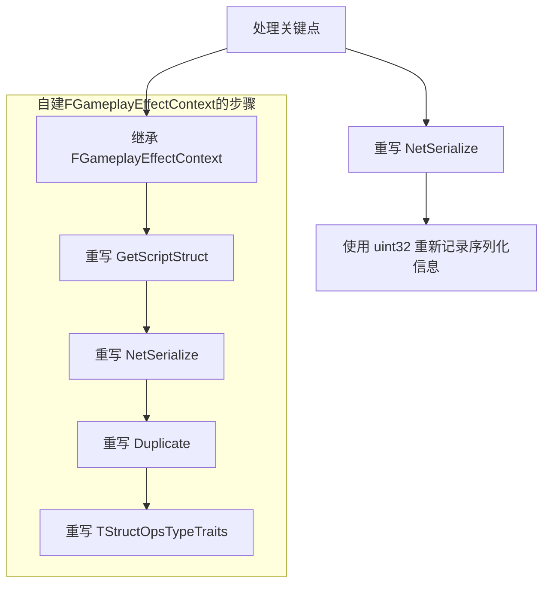
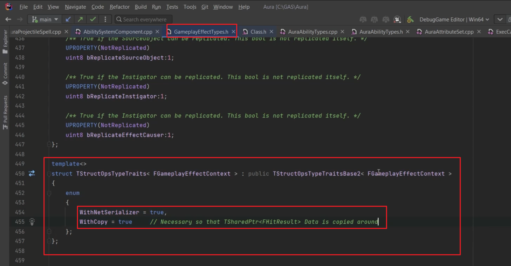
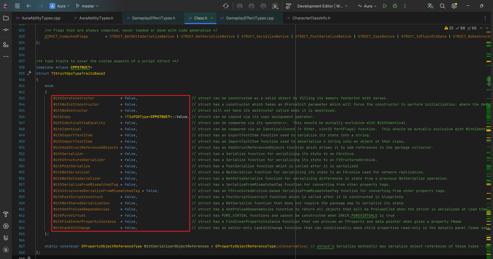
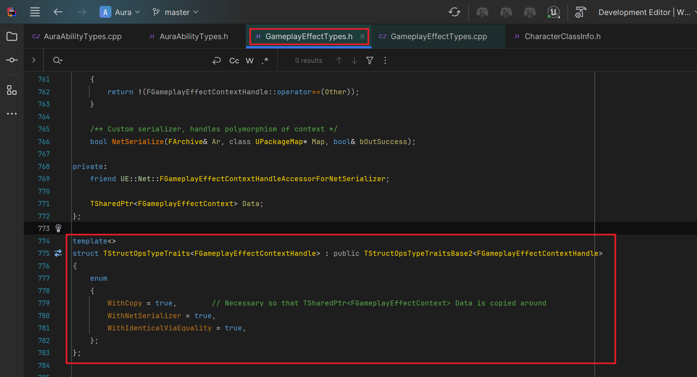
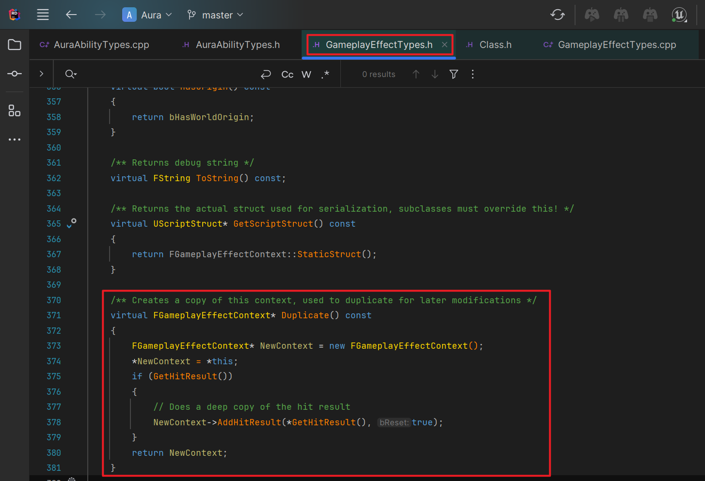
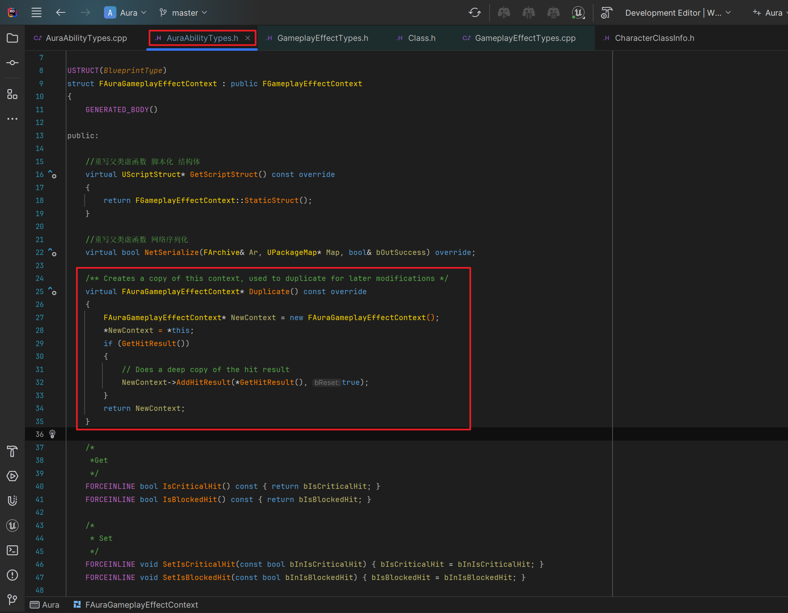
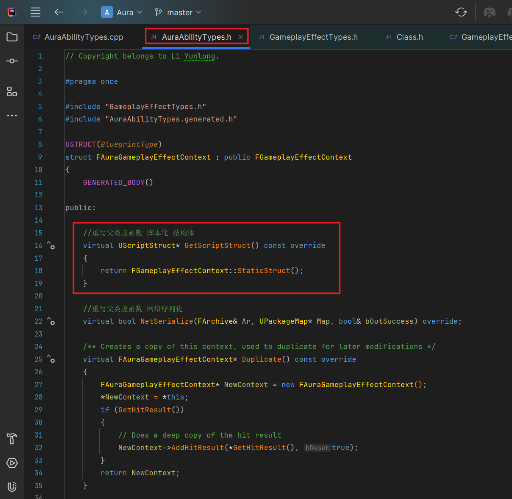
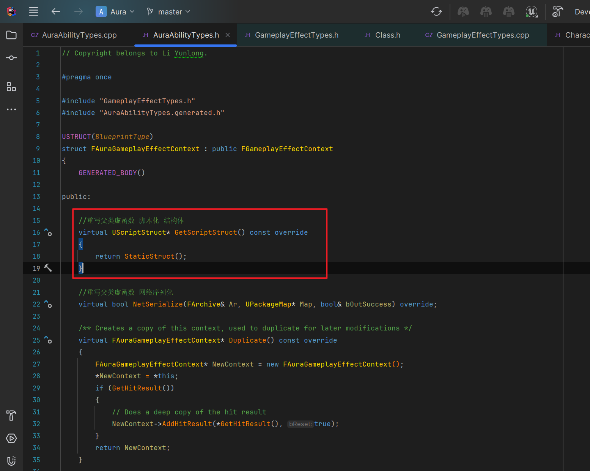

___________________________________________________________________________________________
###### [Go主菜单](../MainMenu.md)
___________________________________________________________________________________________

# GAS 068 自建FGameplayEffectContext(2)；重写 模板结构体TStructOpsTypeTraits；重写 虚函数Duplicate；UE_5.2和UE_5.3这里的区别；自建FGameplayEffectContext需要的步骤梳理

___________________________________________________________________________________________

## 处理关键点

1. 重写 网络序列化函数 `NetSerialize`，使用 `uint32` 无符号整数来 重新记录序列化信息
2. 自建FGameplayEffectContext需要的步骤：
   - 第一步：**继承** `FGameplayEffectContext`
   - 第二步：**重写 `GetScriptStruct`**: 实现该函数以使自定义结构在反射系统中被正确识别和处理。 `(UE_5.3有变更)`
   - 第三步：**重写 `NetSerialize`**: 定义如何在网络传输时序列化和反序列化自定义数据。
   - 第四步：**重写 `Duplicate`**: 确保自定义上下文能够被深拷贝以支持复杂数据的复制。 `(UE_5.3有变更)`
   - 第五步：**重写 `TStructOpsTypeTraits`**: 设置结构体的操作特性，以控制其复制、序列化和比较行为。 `(UE_5.3有变更)

___________________________________________________________________________________________

# 目录


  - [处理关键点](#处理关键点)
	- [目录](#目录)
    - [Mermaid整体思路梳理](#mermaid整体思路梳理)
    - [小测试1](#小测试1)
    - [如果要完成网络序列化，还需要的步骤：](#如果要完成网络序列化还需要的步骤)
      - [需要在子类中重写 `TStructOpsTypeTraits` 这个模板结构体，函数体中重写枚举](#需要在子类中重写-tstructopstypetraits-这个模板结构体函数体中重写枚举)
      - [在子类中重写 `Duplicate` 函数](#在子类中重写-duplicate-函数)
      - [还有一个要修改的函数是：`GetScriptStruct`](#还有一个要修改的函数是getscriptstruct)

___________________________________________________________________________________________

<details>
<summary>视频链接</summary>

[4. Implementing Net Serialize_哔哩哔哩_bilibili](https://www.bilibili.com/video/BV1JD421E7yC?p=150&vd_source=9e1e64122d802b4f7ab37bd325a89e6c)

[5. Struct Ops Type Traits_哔哩哔哩_bilibili](https://www.bilibili.com/video/BV1JD421E7yC?p=151&vd_source=9e1e64122d802b4f7ab37bd325a89e6c)

------

</details>

___________________________________________________________________________________________

### Mermaid整体思路梳理

Mermaid




___________________________________________________________________________________________

### 小测试1

- 你将为我们的自定义 `FGameplayEffectContext` 实现网络序列化
- 现在，制作一个 `uint32` ，命名为 `RepBits`
- 加载时为每个变量翻转其中的位。
- 现在，请确保在Repbits上调用 `SerializeBits`
- 然后检查每个位并存档或取消存档
- 根据每个变量是否已经翻转的位
- 现在，请查看Net Serialize的实现方式

> #### 看看你能否处理这个


<details>
<summary>自己尝试一下</summary>


>## 头文件在上一节已经写完了，这一节无改动
>
>## 源文件中需要：
>
>1. #### 保存时，增加自己的bool所占的bit位
>
>   ```CPP
>   /*
>    * 在这里增加了自己的类型
>    */
>   if (bIsBlockedHit)
>   {
>       RepBits |= 1 << 7;
>   }
>   if (bIsCriticalHit)
>   {
>       RepBits |= 1 << 8;
>   }
>   ```
>
>2. #### 读取时，增加自己的bool所占的bit位
>
>   ```CPP
>   /*
>    * 在这里增加了自己的类型
>    */
>   if (RepBits & (1 << 7))
>   {
>       Ar << bIsBlockedHit;
>   }
>   if (RepBits & (1 << 8))
>   {
>       Ar << bIsCriticalHit;
>   }
>   ```
>
>3. #### 需要设置 **`所占bit位的总长度`**
>
>   ```CPP
>   //在这里 需要将原来的长度从 7 修改成 9 (因为自己增加了两位)
>   Ar.SerializeBits(&RepBits, 9);
>   ```
>
>
>
>- `AuraAbilityTypes.h` 中
>
>```CPP
>// Copyright belongs to Li Yunlong.
>
>#pragma once
>
>#include "GameplayEffectTypes.h"
>#include "AuraAbilityTypes.generated.h"
>
>USTRUCT(BlueprintType)
>struct FAuraGameplayEffectContext : public FGameplayEffectContext
>{
>    GENERATED_BODY()
>
>public:
>
>    //重写父类虚函数 脚本化 结构体
>    virtual UScriptStruct* GetScriptStruct() const override
>    {
>       return FGameplayEffectContext::StaticStruct();
>    }
>
>    //重写父类虚函数 网络序列化
>    virtual bool NetSerialize(FArchive& Ar, UPackageMap* Map, bool& bOutSuccess) override;
>
>    /*
>     *Get
>     */
>    FORCEINLINE bool IsCriticalHit() const { return bIsCriticalHit; }
>    FORCEINLINE bool IsBlockedHit() const { return bIsBlockedHit; }
>
>    /*
>     * Set
>     */
>    FORCEINLINE void SetIsCriticalHit(const bool bInIsCriticalHit) { bIsCriticalHit = bInIsCriticalHit; }
>    FORCEINLINE void SetIsBlockedHit(const bool bInIsBlockedHit) { bIsBlockedHit = bInIsBlockedHit; }
>
>protected:
>
>    UPROPERTY()
>    bool bIsBlockedHit = false;/*是否被格挡*/
>    UPROPERTY()
>    bool bIsCriticalHit = false;/*是否暴击*/
>};
>```
>
>- `AuraAbilityTypes.cpp` 中
>
>```CPP
>#include "AuraAbilityTypes.h"
>
>bool FAuraGameplayEffectContext::NetSerialize(FArchive& Ar, UPackageMap* Map, bool& bOutSuccess)
>{
>    //原来是创建了 uint8 8bit的无符号整数 现在需要创建一个 uint32 32bit的无符号整数 携带更多信息
>    uint32 RepBits = 0;
>
>    if (Ar.IsSaving())
>    {
>       if (bReplicateInstigator && Instigator.IsValid())
>       {
>          RepBits |= 1 << 0;
>       }
>       if (bReplicateEffectCauser && EffectCauser.IsValid() )
>       {
>          RepBits |= 1 << 1;
>       }
>       if (AbilityCDO.IsValid())
>       {
>          RepBits |= 1 << 2;
>       }
>       if (bReplicateSourceObject && SourceObject.IsValid())
>       {
>          RepBits |= 1 << 3;
>       }
>       if (Actors.Num() > 0)
>       {
>          RepBits |= 1 << 4;
>       }
>       if (HitResult.IsValid())
>       {
>          RepBits |= 1 << 5;
>       }
>       if (bHasWorldOrigin)
>       {
>          RepBits |= 1 << 6;
>       }
>       /*
>        * 在这里增加了自己的类型
>        */
>       if (bIsBlockedHit)
>       {
>          RepBits |= 1 << 7;
>       }
>       if (bIsCriticalHit)
>       {
>          RepBits |= 1 << 8;
>       }
>    }
>
>    //在这里 需要将原来的长度从 7 修改成 9 (因为自己增加了两位)
>    Ar.SerializeBits(&RepBits, 9);
>
>    if (RepBits & (1 << 0))
>    {
>       Ar << Instigator;
>    }
>    if (RepBits & (1 << 1))
>    {
>       Ar << EffectCauser;
>    }
>    if (RepBits & (1 << 2))
>    {
>       Ar << AbilityCDO;
>    }
>    if (RepBits & (1 << 3))
>    {
>       Ar << SourceObject;
>    }
>    if (RepBits & (1 << 4))
>    {
>       SafeNetSerializeTArray_Default<31>(Ar, Actors);
>    }
>    if (RepBits & (1 << 5))
>    {
>       if (Ar.IsLoading())
>       {
>          if (!HitResult.IsValid())
>          {
>             HitResult = TSharedPtr<FHitResult>(new FHitResult());
>          }
>       }
>       HitResult->NetSerialize(Ar, Map, bOutSuccess);
>    }
>    if (RepBits & (1 << 6))
>    {
>       Ar << WorldOrigin;
>       bHasWorldOrigin = true;
>    }
>    else
>    {
>       bHasWorldOrigin = false;
>    }
>
>    /*
>     * 在这里增加了自己的类型
>     */
>    if (RepBits & (1 << 7))
>    {
>       Ar << bIsBlockedHit;
>    }
>    if (RepBits & (1 << 8))
>    {
>       Ar << bIsCriticalHit;
>    }
>
>    if (Ar.IsLoading())
>    {
>       AddInstigator(Instigator.Get(), EffectCauser.Get()); // Just to initialize InstigatorAbilitySystemComponent
>    }  
>
>    bOutSuccess = true;
>    return true;
>}
>```

------

</details>

> ### 在之前的课程中我们重写了自建的FGameplayEffectContext的两个虚函数
>
> - #### `GetScriptStruct` 函数 —— **为反射系统创建脚本结构的函数**
> - #### `NetSerialize` 函数 —— **网络序列化 函数，不是序列化的唯一条件！！！**

### 如果要完成网络序列化，还需要的步骤：

#### 需要在子类中重写 `TStructOpsTypeTraits` 这个模板结构体，函数体中重写枚举

>#### UE_5.3 这里用到的三个枚举：
>
>- **WithCopy = true**:
>
>  - **含义**: 这个枚举成员表示结构体可以通过其拷贝赋值运算符进行复制。这意味着结构体在赋值或传递时，可以直接进行内存拷贝操作。这对于 `TSharedPtr` 这样的智能指针非常重要，因为它需要在多个地方安全地共享同一个数据指针，并确保在复制时能够正确处理指针的引用计数。
>
>  - **示例**: 在你的例子中，`TSharedPtr<FGameplayEffectContext> Data` 需要在不同地方安全地复制和共享，因此需要 `WithCopy = true`。
>
>
>- **WithNetSerializer = true**:
>
>  - **含义**: 这个枚举成员表示结构体具有一个 `NetSerialize` 函数，用于将其状态序列化到 `FArchive` 中。这个功能通常用于网络复制，即在网络传输时将结构体的数据转换为字节流，并从字节流还原数据。这对需要在网络上传输的结构体非常重要，确保其能够正确地序列化和反序列化。
>
>  - **用途**: 结构体中的数据可能需要在不同客户端之间同步，因此必须支持网络序列化。
>
>
>- **WithIdenticalViaEquality = true**:
>
>  - **含义**: 这个枚举成员表示结构体可以通过 `operator==` 运算符进行比较。这意味着你可以使用 `==` 运算符来判断两个该结构体的实例是否相等。通常，这需要开发者为结构体实现 `operator==`，确保结构体的各个成员变量的比较逻辑正确。
>
>  - **用途**: 这种比较方式在判断结构体是否变化时非常有用，比如在网络同步时判断数据是否需要更新。备注说：**这与脚本结构有关，该结构被反射系统使用，它还用于其他重要事情，比如序列化和结构操作类型特性只是定义了该脚本结构能够做什么。**
>
>#### UE_5.2 这里用到的两个枚举：
>
>- **WithCopy = true**:
>- **WithNetSerializer = true**:
>
>- 也就是 UE_5.3 的前两个
>
>


<details>
<summary>去 GameplayEffectTypes.h 源码中寻找</summary>

>### 找到模板结构体：`TStructOpsTypeTraits` (结构操作类型特征) 
>
>- 继承自 `TStructOpsTypeTraitsBase2` (结构操作类型特征库2)
>- 下面的枚举根据true/false转换成1/0
>
><details>
><summary>去到基类里面，查看枚举的类型</summary>
>
>
>
>
>
>------
>
></details>
>
>#### 我重写了前两个

------

</details>

```cpp
template<>
struct TStructOpsTypeTraits<FAuraGameplayEffectContext> : public TStructOpsTypeTraitsBase2<FAuraGameplayEffectContext>
{
    enum
    {
       WithCopy = true,      // Necessary so that TSharedPtr<FGameplayEffectContext> Data is copied around
       WithNetSerializer = true,
       WithIdenticalViaEquality = true,
    };
};
```

------

#### 在子类中重写 `Duplicate` 函数

- 需要替换类型为自建的 `FGameplayEffectContext` 类型 **( UE_5.3之后必须修改，之前可以不修改 )**

<details>
<summary>FGameplayEffectContext 中的 Duplicate 函数</summary>

>

------

</details>




```cpp
public:
    /** Creates a copy of this context, used to duplicate for later modifications */
    virtual FAuraGameplayEffectContext* Duplicate() const override
    {
       FAuraGameplayEffectContext* NewContext = new FAuraGameplayEffectContext();
       *NewContext = *this;
       if (GetHitResult())
       {
          // Does a deep copy of the hit result
          NewContext->AddHitResult(*GetHitResult(), true);
       }
       return NewContext;
    }
```

#### 还有一个要修改的函数是：`GetScriptStruct`

UE_5.3之前的是这样就可以：

原来的：



##### UE_5.3之后需要修改成：

```cpp
public:

    //重写父类虚函数 脚本化 结构体
    virtual UScriptStruct* GetScriptStruct() const override
    {
       return StaticStruct();
    }
```



------

> #### 在接下来的课程中，将应用自建FGameplayEffectContext

___________________________________________________________________________________________

[返回最上面](#Go主菜单)

___________________________________________________________________________________________