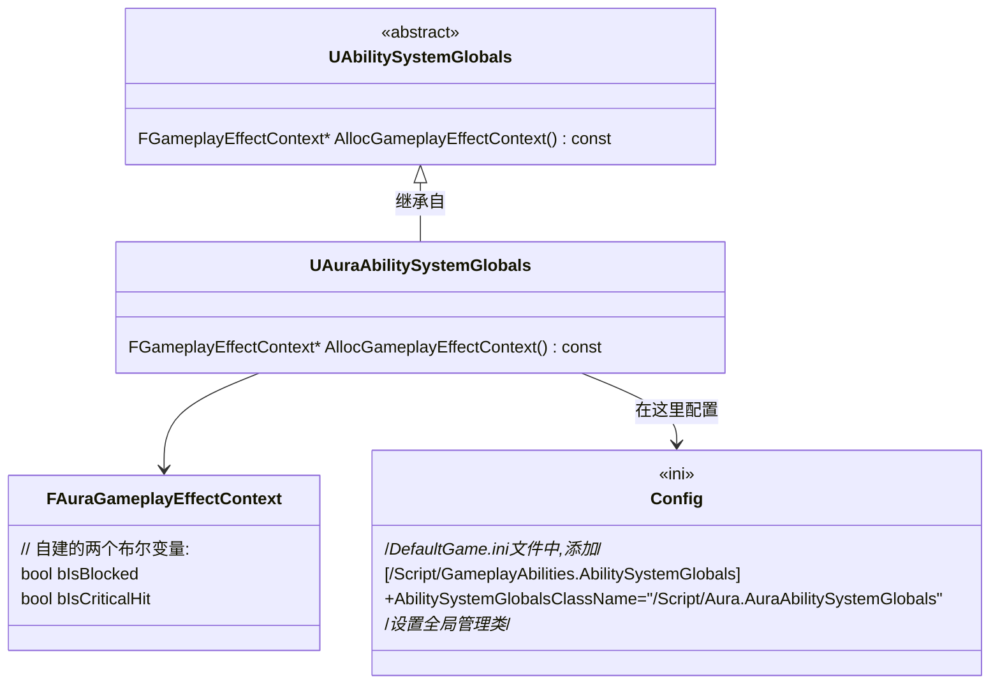

___________________________________________________________________________________________
###### [Go主菜单](../MainMenu.md)
___________________________________________________________________________________________

# GAS 069 创建自建的全局管理类AbilitySystemGlobles应用自建的FGameplayEffectContext类

___________________________________________________________________________________________

## 处理关键点

1. 应用 `FGameplayEffectContext` 的步骤

2. 应用自建的 `AbilitySystemGlobles`的步骤

   - 创建 `AbilitySystemGlobles` c++类

   - `DefaultGame.ini` 中配置

___________________________________________________________________________________________

# 目录


- [GAS 069 创建自建的全局管理类AbilitySystemGlobles应用自建的FGameplayEffectContext类](#gas-069-创建自建的全局管理类abilitysystemglobles应用自建的fgameplayeffectcontext类)
  - [处理关键点](#处理关键点)
- [目录](#目录)
    - [Mermaid整体思路梳理](#mermaid整体思路梳理)
    - [应用自建的 `FGameplayEffectContext`](#应用自建的-fgameplayeffectcontext)
    - [自建 `AbilitySystemGlobles` 的C++类](#自建-abilitysystemglobles-的c类)
    - [应用自建的AbilitySystemGlobles全局管理类](#应用自建的abilitysystemglobles全局管理类)
    - [此时断点调试](#此时断点调试)


___________________________________________________________________________________________

<details>
<summary>视频链接</summary>

[6. Aura Ability System Globals_哔哩哔哩_bilibili](https://www.bilibili.com/video/BV1JD421E7yC?p=152&spm_id_from=pageDriver&vd_source=9e1e64122d802b4f7ab37bd325a89e6c)

------

</details>

___________________________________________________________________________________________

### Mermaid整体思路梳理

Mermaid




___________________________________________________________________________________________

### 应用自建的 `FGameplayEffectContext`

- 来到 `MakeEffectContext` 函数中，
- 看到使用 全局管理类 `AbilitySystemGlobles` 调用 `AllocGameplayEffectContext` 函数返回的 `Context`


------

> ## 我们需要子类化 `AbilitySystemGlobles` 

------

### 自建 `AbilitySystemGlobles` 的C++类

- 在 `C++类/Aura/Public/AbilitySystem/` 文件夹下

- 创建 `AbilitySystemGlobles` 的 C++类 ，命名为 `AuraAbilitySystemGlobles`
  
- 重写虚函数 `AllocGameplayEffectContext`
  
>#### 调用这个函数时，new一个自建的 `FGameplayEffectContext` 类，返回
>
>+ `AuraAbilitySystemGlobles.h`中：
>```cpp
>// Copyright belongs to Li Yunlong.
>
>#pragma once
>
>#include "CoreMinimal.h"
>#include "AbilitySystemGlobals.h"
>#include "AuraAbilitySystemGlobals.generated.h"
>
>/**
> * 
> */
>UCLASS()
>class AURA_API UAuraAbilitySystemGlobals : public UAbilitySystemGlobals
>{
>	GENERATED_BODY()
>
>public:
>	virtual FGameplayEffectContext* AllocGameplayEffectContext() const override;
>};
>```
>
>+ `AuraAbilitySystemGlobles.cpp`中：
>```cpp
>// Copyright belongs to Li Yunlong.
>
>
>#include "AbilitySystem/AuraAbilitySystemGlobals.h"
>
>#include "AuraAbilityTypes.h"
>
>FGameplayEffectContext* UAuraAbilitySystemGlobals::AllocGameplayEffectContext() const
>{
>	return new FAuraGameplayEffectContext();
>}
>```
>
>

------

### 应用自建的AbilitySystemGlobles全局管理类

1. 打开 `Config/DefaultGame.ini` 文件

2. 添加如下文本

> #### `[/Script/GameplayAbilities.AbilitySystemGlobals]`
> #### `+AbilitySystemGlobalsClassName="/Script/项目名.自建的AbilitySystemGlobals类的名字"`
>
> - 因为我的项目名是 **Aura** 
> - 自建的AbilitySystemGlobals类的名字是 **AuraAbilitySystemGlobals**

   ```ini
   [/Script/GameplayAbilities.AbilitySystemGlobals]
   +AbilitySystemGlobalsClassName="/Script/Aura.AuraAbilitySystemGlobals"
   ```


------

### 此时断点调试
- 分别在释放火球创造GameplayEffectContext时；

- 和AS后处理函数中接收到GameplayEffectContext时。

  

看否可以看到GameplayEffectContext中带有自建的两个布尔(是否被阻挡/是否暴击)变量


  


___________________________________________________________________________________________

[返回最上面](#Go主菜单)

___________________________________________________________________________________________