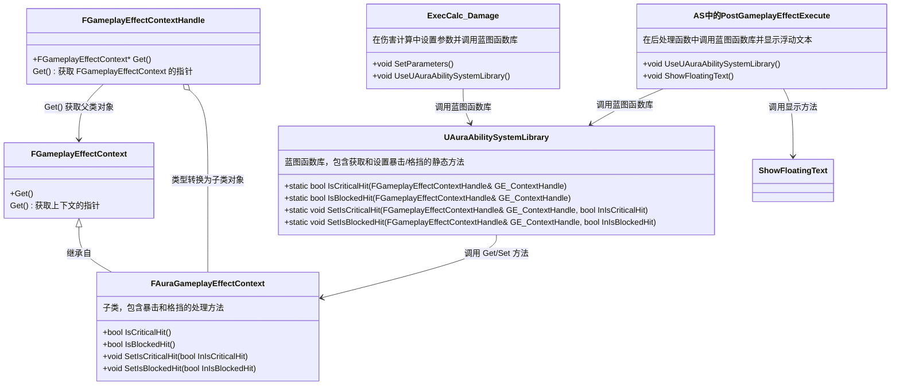

___________________________________________________________________________________________
###### [Go主菜单](../MainMenu.md)
___________________________________________________________________________________________

# GAS 070 现在需要在 ExecCalc_Damage 中设置参数，并在AS的后处理函数中获取 自建 Context 上携带的 bool

___________________________________________________________________________________________

## 处理关键点

1. 如何把拿到的 `FGameplayEffectContext` 类型转换成自己的 `FAuraGameplayEffectContext`
2. 结构梳理：
   - 谁送 —— 在 `ExecCalc_Damage` 中设置参数
   - 谁拿 —— 在 `AS` 的后处理函数中获取 自建 `Context` 上携带的 `bool`
   - 怎么拿 —— 通过蓝图函数库 `AuraAbilitySystemLibrary` 创建 `Set` / `Get` 函数

___________________________________________________________________________________________

# 目录

- [GAS 070 现在需要在 ExecCalc\_Damage 中设置参数，并在AS的后处理函数中获取 自建 Context 上携带的 bool](#gas-070-现在需要在-execcalc_damage-中设置参数并在as的后处理函数中获取-自建-context-上携带的-bool)
  - [处理关键点](#处理关键点)
- [目录](#目录)
    - [Mermaid整体思路梳理](#mermaid整体思路梳理)
    - [传递是否 `暴击` 和 `被格挡`，获得结果是在 `ExecCalc_Damage` 中](#传递是否-暴击-和-被格挡获得结果是在-execcalc_damage-中)
    - [想把上面的逻辑挪到 自建的蓝图函数库中](#想把上面的逻辑挪到-自建的蓝图函数库中)
    - [`类型&`修改为 传入参数 使用宏 `UPARAM(ref)`](#类型修改为-传入参数-使用宏-uparamref)
    - [现在在原来的逻辑地方改成调用蓝图函数库中的函数](#现在在原来的逻辑地方改成调用蓝图函数库中的函数)
    - [需要对应的修改这些参数，需要增加传递的参数](#需要对应的修改这些参数需要增加传递的参数)
    - [函数中断点看数据是否正常](#函数中断点看数据是否正常)


___________________________________________________________________________________________

<details>
<summary>视频链接</summary>
[7. Using a Custom Effect Context_哔哩哔哩_bilibili](https://www.bilibili.com/video/BV1JD421E7yC?p=153&vd_source=9e1e64122d802b4f7ab37bd325a89e6c)

[8. Floating Text Color_哔哩哔哩_bilibili](https://www.bilibili.com/video/BV1JD421E7yC?p=154&vd_source=9e1e64122d802b4f7ab37bd325a89e6c)

------

</details>

___________________________________________________________________________________________

### Mermaid整体思路梳理

Mermaid




___________________________________________________________________________________________

> ### 现在我们需要传递，暴击和被阻挡的bool，来到计算的地方 ExecCalc_Damage 中

------

### 传递是否 `暴击` 和 `被格挡`，获得结果是在 `ExecCalc_Damage` 中

- 通过 `GE_Spec.GetContext()` 拿到 `ContextHandle` 
- `ContextHandle.Get()` 拿到 `Context` 
- 但这个时候拿到的是 父类的类型 需要 `cast` 一下


```CPP
FGameplayEffectContextHandle FGameplayEffectContextHandle = GE_Spec.GetContext();
FGameplayEffectContext* GameplayEffectContext = FGameplayEffectContextHandle.Get();
//如果类型检查失败就会崩溃
FAuraGameplayEffectContext* AuraGameplayEffectContext = static_cast< FAuraGameplayEffectContext* >(GameplayEffectContext);
```

------

### 想把上面的逻辑挪到 自建的蓝图函数库中

- 创建get和set( `暴击` 和 `被格挡`)的方法

  ```cpp
  public:
      	/*
  		 * Get
  		 */
  	
  		UFUNCTION(BlueprintPure, Category = "AuraAbilitySystemLibrary|GameplayEffects")
  		static bool IsCriticalHit(const FGameplayEffectContextHandle& GE_ContextHandle);
  	
  		UFUNCTION(BlueprintPure, Category = "AuraAbilitySystemLibrary|GameplayEffects")
  		static bool IsBlockedHit(const FGameplayEffectContextHandle& GE_ContextHandle);
  
  		/*
  		 * Set
  		 */
  		UFUNCTION(BlueprintCallable, Category = "AuraAbilitySystemLibrary|GameplayEffects")
  		static void SetIsCriticalHit( FGameplayEffectContextHandle& GE_ContextHandle, bool InIsCriticalHit);
  	
  		UFUNCTION(BlueprintCallable, Category = "AuraAbilitySystemLibrary|GameplayEffects")
  		static void SetIsBlockedHit( FGameplayEffectContextHandle& GE_ContextHandle, bool InIsBlockedHit);
  ```

  ```cpp
  bool UAuraAbilitySystemLibrary::IsCriticalHit(const FGameplayEffectContextHandle& GE_ContextHandle)
  {
  	if (const FAuraGameplayEffectContext* AuraGameplayEffectContext = static_cast<const FAuraGameplayEffectContext*>(GE_ContextHandle.Get()))
  	{
  		return AuraGameplayEffectContext->IsCriticalHit();
  	}
  	return false;
  }
  
  bool UAuraAbilitySystemLibrary::IsBlockedHit(const FGameplayEffectContextHandle& GE_ContextHandle)
  {
  	if (const FAuraGameplayEffectContext* AuraGameplayEffectContext = static_cast<const FAuraGameplayEffectContext*>(GE_ContextHandle.Get()))
  	{
  		return AuraGameplayEffectContext->IsBlockedHit();
  	}
  	return false;
  }
  
  void UAuraAbilitySystemLibrary::SetIsCriticalHit(FGameplayEffectContextHandle& GE_ContextHandle, bool InIsCriticalHit)
  {
  	if (FAuraGameplayEffectContext* AuraGameplayEffectContext = static_cast<FAuraGameplayEffectContext*>(GE_ContextHandle.Get()))
  	{
  		AuraGameplayEffectContext->SetIsCriticalHit(InIsCriticalHit);
  	}
  }
  
  void UAuraAbilitySystemLibrary::SetIsBlockedHit(FGameplayEffectContextHandle& GE_ContextHandle, bool InIsBlockedHit)
  {
  	if (FAuraGameplayEffectContext* AuraGameplayEffectContext = static_cast<FAuraGameplayEffectContext*>(GE_ContextHandle.Get()))
  	{
  		AuraGameplayEffectContext->SetIsBlockedHit(InIsBlockedHit);
  	}
  }
  ```

- 遇到一个问题，`UFUNCTION(BlueprintCallable)` :

  - `const 类型&`是 `传入参数` ；
  - `类型&` 是 `传出的参数` ；
  - 但如果想 `类型&` 是 传入参数 呢？

> ### 如果不调整是这样 —— 


###  `类型&`修改为 传入参数 使用宏 `UPARAM(ref)`

```CPP
UFUNCTION(BlueprintCallable, Category = "AuraAbilitySystemLibrary|GameplayEffects")
static void SetIsCriticalHit(UPARAM(ref) FGameplayEffectContextHandle& GE_ContextHandle, bool InIsCriticalHit);
```

> ### 修改后蓝图中的节点 —— 


------

### 现在在原来的逻辑地方改成调用蓝图函数库中的函数

>- #### **我这个121行代码是断点用的**

```cpp
/*
 * 下面是传递参数
 */

FGameplayEffectContextHandle GameplayEffectContextHandle = GE_Spec.GetContext();

if (Blocked < TargetBlockChance)
{
    UE_LOG(LogTemp,Log,TEXT(" IsBlockedHit == true !!!"))
}
UAuraAbilitySystemLibrary::SetIsBlockedHit(GameplayEffectContextHandle,Blocked < TargetBlockChance);
UAuraAbilitySystemLibrary::SetIsCriticalHit(GameplayEffectContextHandle,Random < CriticalHitChance);
```

------

### 需要对应的修改这些参数，需要增加传递的参数


简单列下要修改的函数：

- UAuraAttributeSet::ShowFloatingText
- AAuraPlayerController::ShowDamageNumber
- UDamageTextComponent::SetDamageText

AS 的后处理函数 `PostGameplayEffectExecute` 中，需要调用蓝图函数库中获取 bool 的逻辑，然后传参给 PC 的 `RPC_Client` 事件，再传给自建的 UWidgetComponent 类 `UDamageTextComponent` 中的函数 `SetDamageText`

```cpp
//判断 不是自己打自己时
if (Props.SourceCharacter != Props.TargetCharacter)
{
    const FGameplayEffectContextHandle GameplayEffectContextHandle = Data.EffectSpec.GetContext();
    const bool IsBlockedHit = UAuraAbilitySystemLibrary::IsBlockedHit(GameplayEffectContextHandle);
    const bool IsCriticalHit = UAuraAbilitySystemLibrary::IsCriticalHit(GameplayEffectContextHandle);
    ShowFloatingText(Props,LocalIncomingDamage,IsBlockedHit,IsCriticalHit);
}
```

------

### 函数中断点看数据是否正常

- 可以创建测试用的GE_SecondaryAttributes_Test


>### 断到以后，接下来断这里


>### 说明获取 bool 信息正常


------

> #### 下面是另一节

------

### UI中创建根据情况设置颜色的函数，并修改相关参数，包括 自建的 WidgetComponent

> ### *WBP_DamageText* 内创建函数，命名为 `GetColorBasedOnBlockAndCrit`
>
> 我的颜色设置为：
>
> 


------

### 添加暴击伤害的文字


___________________________________________________________________________________________

[返回最上面](#Go主菜单)

___________________________________________________________________________________________