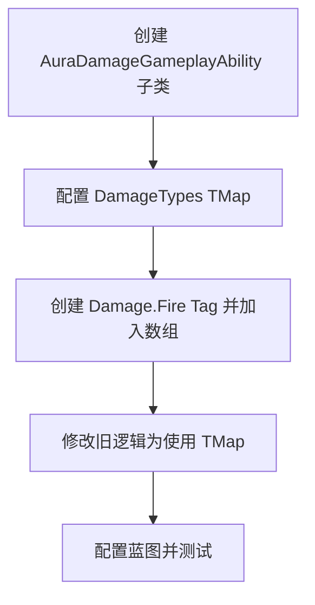

___________________________________________________________________________________________
###### [Go主菜单](../MainMenu.md)
___________________________________________________________________________________________

# GAS 071 创建多种属性伤害类型

___________________________________________________________________________________________

# 目录


- [GAS 071 创建多种属性伤害类型](#gas-071-创建多种属性伤害类型)
- [目录](#目录)
    - [Mermaid整体思路梳理](#mermaid整体思路梳理)
    - [创建GA子类，为该类创建伤害类型](#创建ga子类为该类创建伤害类型)
    - [需要创建伤害类型的Tag](#需要创建伤害类型的tag)
    - [修改旧的使用曲线表位置的逻辑](#修改旧的使用曲线表位置的逻辑)
    - [新建的GA中不需要曲线表了，因为有TMap，需要在蓝图中配置](#新建的ga中不需要曲线表了因为有tmap需要在蓝图中配置)
    - [测试gif正常](#测试gif正常)


___________________________________________________________________________________________

<details>
<summary>视频链接</summary>
[10. Damage Types_哔哩哔哩_bilibili](https://www.bilibili.com/video/BV1JD421E7yC?p=156&vd_source=9e1e64122d802b4f7ab37bd325a89e6c)

------

</details>

___________________________________________________________________________________________

### Mermaid整体思路梳理

Mermaid




___________________________________________________________________________________________

### 创建GA子类，为该类创建伤害类型

- `C++类/Aura/Public/AbilitySystem/Abilities/` 文件夹下
- 创建GA继承自 `AuraGameplayAbility`，命名为 `AuraDamageGameplayAbility`
- 修改 `AuraProjectileSpell` 继承自 新建的GA

<details>
<summary>过程截图</summary>

>
>
>

------

</details>

- 将DamageEffectClass挪到新建的GA中

- 把AuraGameplayAbility中的曲线挪到新建的GA中

- 新建的GA中还需要创建一个TMap来映射Tag和曲线表

  - 创建TMap，命名为 `DamageTypes`

    - `AuraDamageGameplayAbility.h` 中
    
      ```CPP
      public:
          
          //给火球配置的GE
          UPROPERTY(EditDefaultsOnly, BlueprintReadOnly)
          TSubclassOf<UGameplayEffect> DamageEffectClass;
          
          UPROPERTY(EditDefaultsOnly, BlueprintReadOnly, Category = "Damage")
          FScalableFloat Damage;
      
          UPROPERTY(EditDefaultsOnly, BlueprintReadOnly, Category = "Damage")
          TMap<FGameplayTag,FScalableFloat> DamageTypes;
      ```

<details>
<summary>过程截图</summary>

>

------

</details>


------

### 需要创建伤害类型的Tag

- 创建Tag`Damage.Fire`
  - 火属性攻击
- 创建Tag数组

  - 命名为 `DamageTypes`
- 加入数组

<details>
<summary>过程截图</summary>

>

------

</details>


------

### 修改旧的使用曲线表位置的逻辑

- 下面这里使用了表格Damage，需要替换成，使用上面创建的 `TMap`
- 改成用 `for` 循环绑定 `SetByCaller` 的键值对
  - 确保 `SetByCaller` 只发送要用的Tag，也就是GA上只保留与本技能有关的属性

- 还有使用Exec_Calc_Damage的时候


- 修改成

```cpp
for (const TTuple<FGameplayTag, FScalableFloat> Pair:DamageTypes)
{
    const float ScaledDamage = Pair.Value.GetValueAtLevel(GetAbilityLevel());
    UAbilitySystemBlueprintLibrary::AssignTagSetByCallerMagnitude(EffectSpecHandle,Pair.Key,ScaledDamage);
}
```


- 修改成

```cpp
float Damage = 0;
for (const FGameplayTag Tag : FAuraGameplayTags::Get().DamageTypes)
{
    float DamageTypeValue = GE_Spec.GetSetByCallerMagnitude(Tag);
    Damage += DamageTypeValue;
}
```


------

### 新建的GA中不需要曲线表了，因为有TMap，需要在蓝图中配置

- 确保SetByCaller只发送要用的Tag，也就是GA上只保留与本技能有关的属性


- 需要 将原来的Damage移除 之后换成新的


### 测试gif正常


___________________________________________________________________________________________

[返回最上面](#Go主菜单)

___________________________________________________________________________________________