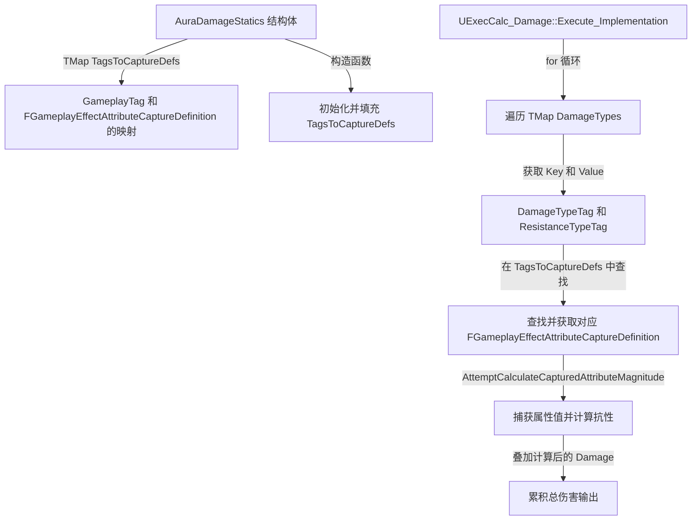
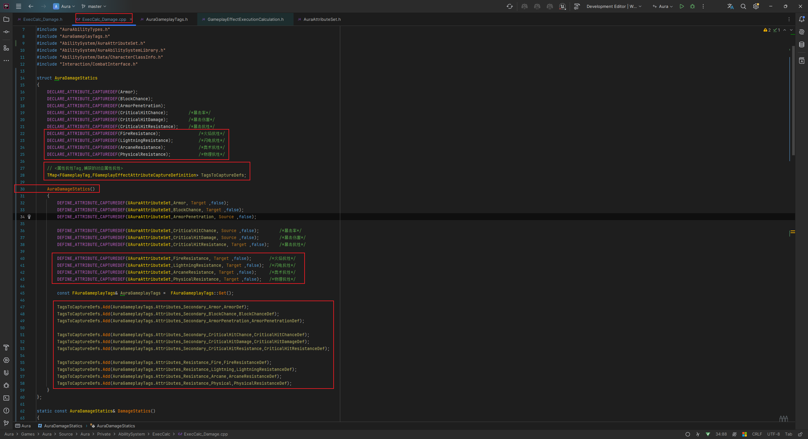
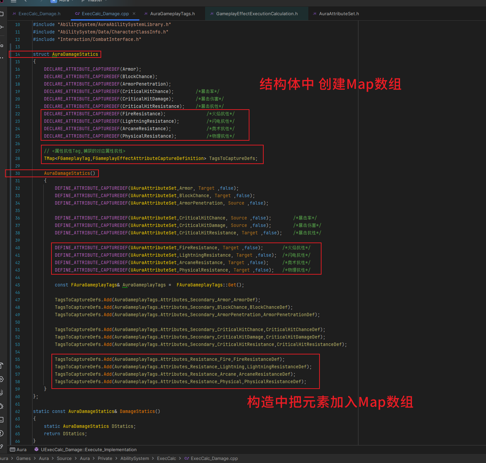
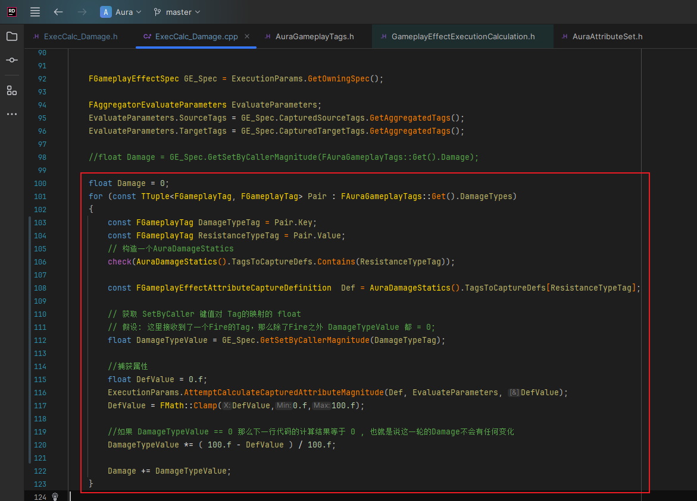

___________________________________________________________________________________________
###### [Go主菜单](../MainMenu.md)
___________________________________________________________________________________________

# GAS 074 计算单次扣除对应抗性的属性伤害叠加

___________________________________________________________________________________________

## 处理关键点

1. `设计模式` ：使用具有相同的元素(比如<A,B><B,C>)两个TMap数组，通过循环中 `查找` `计算` 叠加值，在循环后给出结果


___________________________________________________________________________________________

# 目录


- [GAS 074 计算单次扣除对应抗性的属性伤害叠加](#gas-074-计算单次扣除对应抗性的属性伤害叠加)
	- [处理关键点](#处理关键点)
- [目录](#目录)
		- [Mermaid整体思路梳理](#mermaid整体思路梳理)
	- [`AuraDamageStatics` 结构体需要在源文件中 ！！！](#auradamagestatics-结构体需要在源文件中-)
		- [`AuraDamageStatics` 结构体中，创建一个TMap，构造中 映射 GameplayTag 和 捕获的属性](#auradamagestatics-结构体中创建一个tmap构造中-映射-gameplaytag-和-捕获的属性)
		- [在 `UExecCalc_Damage` 的 `Execute_Implementation` 函数中](#在-uexeccalc_damage-的-execute_implementation-函数中)
			- [这里的编程思路是使用具有相同的元素(比如\<A,B\>\<B,C\>)两个TMap数组，通过循环中 `查找` `计算` 叠加值，在循环后给出结果](#这里的编程思路是使用具有相同的元素比如abbc两个tmap数组通过循环中-查找-计算-叠加值在循环后给出结果)


___________________________________________________________________________________________

<details>
<summary>视频链接</summary>

[13. Resistance Damage Reduction_哔哩哔哩_bilibili](https://www.bilibili.com/video/BV1JD421E7yC?p=159&vd_source=9e1e64122d802b4f7ab37bd325a89e6c)

------

</details>

___________________________________________________________________________________________

### Mermaid整体思路梳理

Mermaid




___________________________________________________________________________________________

## `AuraDamageStatics` 结构体需要在源文件中 ！！！

> ### 上节我们添加了属性抗性，到次要属性。需要在 ExecCalc_Damage中捕获
>
> 想要创建一个 TMap 映射 GameplayTag 和 捕获的属性。

### `AuraDamageStatics` 结构体中，创建一个TMap，构造中 映射 GameplayTag 和 捕获的属性

- 在结构体的构造中，把 GameplayTag 和捕获的属性 Add 到 TMap 中
  -  TMap 命名为 `TagsToCaptureDefs`



```cpp
struct AuraDamageStatics
{
	DECLARE_ATTRIBUTE_CAPTUREDEF(Armor);
	DECLARE_ATTRIBUTE_CAPTUREDEF(BlockChance);
	DECLARE_ATTRIBUTE_CAPTUREDEF(ArmorPenetration);
	DECLARE_ATTRIBUTE_CAPTUREDEF(CriticalHitChance);		/*暴击率*/
	DECLARE_ATTRIBUTE_CAPTUREDEF(CriticalHitDamage);		/*暴击伤害*/
	DECLARE_ATTRIBUTE_CAPTUREDEF(CriticalHitResistance);	/*暴击抗性*/
	DECLARE_ATTRIBUTE_CAPTUREDEF(FireResistance);				/*火焰抗性*/
	DECLARE_ATTRIBUTE_CAPTUREDEF(LightningResistance);			/*闪电抗性*/
	DECLARE_ATTRIBUTE_CAPTUREDEF(ArcaneResistance);				/*奥术抗性*/
	DECLARE_ATTRIBUTE_CAPTUREDEF(PhysicalResistance);			/*物理抗性*/

	// <属性抗性Tag,捕获的对应属性抗性>
	TMap<FGameplayTag,FGameplayEffectAttributeCaptureDefinition> TagsToCaptureDefs;
	
	AuraDamageStatics()
	{
		DEFINE_ATTRIBUTE_CAPTUREDEF(UAuraAttributeSet,Armor, Target ,false);
		DEFINE_ATTRIBUTE_CAPTUREDEF(UAuraAttributeSet,BlockChance, Target ,false);
		DEFINE_ATTRIBUTE_CAPTUREDEF(UAuraAttributeSet,ArmorPenetration, Source ,false);
		
		DEFINE_ATTRIBUTE_CAPTUREDEF(UAuraAttributeSet,CriticalHitChance, Source ,false);		/*暴击率*/
		DEFINE_ATTRIBUTE_CAPTUREDEF(UAuraAttributeSet,CriticalHitDamage, Source ,false);		/*暴击伤害*/
		DEFINE_ATTRIBUTE_CAPTUREDEF(UAuraAttributeSet,CriticalHitResistance, Target ,false);	/*暴击抗性*/
		
		DEFINE_ATTRIBUTE_CAPTUREDEF(UAuraAttributeSet,FireResistance, Target ,false);		/*火焰抗性*/
		DEFINE_ATTRIBUTE_CAPTUREDEF(UAuraAttributeSet,LightningResistance, Target ,false);	/*闪电抗性*/
		DEFINE_ATTRIBUTE_CAPTUREDEF(UAuraAttributeSet,ArcaneResistance, Target ,false);		/*奥术抗性*/
		DEFINE_ATTRIBUTE_CAPTUREDEF(UAuraAttributeSet,PhysicalResistance, Target ,false);	/*物理抗性*/

		const FAuraGameplayTags& AuraGameplayTags =  FAuraGameplayTags::Get();
		
		TagsToCaptureDefs.Add(AuraGameplayTags.Attributes_Secondary_Armor,ArmorDef);
		TagsToCaptureDefs.Add(AuraGameplayTags.Attributes_Secondary_BlockChance,BlockChanceDef);
		TagsToCaptureDefs.Add(AuraGameplayTags.Attributes_Secondary_ArmorPenetration,ArmorPenetrationDef);
		
		TagsToCaptureDefs.Add(AuraGameplayTags.Attributes_Secondary_CriticalHitChance,CriticalHitChanceDef);
		TagsToCaptureDefs.Add(AuraGameplayTags.Attributes_Secondary_CriticalHitDamage,CriticalHitDamageDef);
		TagsToCaptureDefs.Add(AuraGameplayTags.Attributes_Secondary_CriticalHitResistance,CriticalHitResistanceDef);
		
		TagsToCaptureDefs.Add(AuraGameplayTags.Attributes_Resistance_Fire,FireResistanceDef);
		TagsToCaptureDefs.Add(AuraGameplayTags.Attributes_Resistance_Lightning,LightningResistanceDef);
		TagsToCaptureDefs.Add(AuraGameplayTags.Attributes_Resistance_Arcane,ArcaneResistanceDef);
		TagsToCaptureDefs.Add(AuraGameplayTags.Attributes_Resistance_Physical,PhysicalResistanceDef);
	}
};

static const AuraDamageStatics& DamageStatics()
{
	static AuraDamageStatics DStatics;
	return DStatics;
}
```



### 在 `UExecCalc_Damage` 的 `Execute_Implementation` 函数中


- 确保SetByCaller只发送要用的Tag，也就是GA上只保留与本技能有关的属性，这样就保证了不发送的Tag，调用这个API 获取 float == 0。所以这个for循环内会根据技能拥有的属性。单次计算伤害和抗性扣除后，再把数值叠加到Damage变量上，最后输出


>### for 循环的是 Tags中的 `<属性伤害Tag,属性抗性Tag>数组` 叫做 `DamageTypes` 
>
>### 在 `AuraDamageStatics` 结构体中创建的Map `<属性抗性Tag,捕获的属性>数组` 叫做 `TagsToCaptureDefs` 


#### 这里的编程思路是使用具有相同的元素(比如<A,B><B,C>)两个TMap数组，通过循环中 `查找` `计算` 叠加值，在循环后给出结果


>- [ ] 先局部变量保存一下 `DamageTypes` 的 `key` 和 `Value`
>
>- [ ] 将  `DamageTypes` 的 `Value` 作为key 传入 `TagsToCaptureDefs` 中看是否有对应的映射也就是 `FGameplayEffectAttributeCaptureDefinition` 类型的捕获属性 返回 ( 查找前记得先check断言检查是否有，否则后面会崩溃 )
>
>- [ ] 创建 float 将上一步捕获的属性传入尝试捕获属性函数 `ExecutionParams.AttemptCalculateCapturedAttributeMagnitude` 中 ( 这一步如果没有捕获属性，float = 0.f )
>
>- [ ] 上一步 float 夹值
>
>- [ ] 计算抗性扣除后的伤害
>
>  ```cpp
>  float Damage = 0;
>  for (const TTuple<FGameplayTag, FGameplayTag> Pair : FAuraGameplayTags::Get().DamageTypes)
>  {
>      const FGameplayTag DamageTypeTag = Pair.Key;
>      const FGameplayTag ResistanceTypeTag = Pair.Value;
>      // 构造一个AuraDamageStatics
>      check(AuraDamageStatics().TagsToCaptureDefs.Contains(ResistanceTypeTag));
>      
>      const FGameplayEffectAttributeCaptureDefinition  Def = AuraDamageStatics().TagsToCaptureDefs[ResistanceTypeTag];
>  
>      // 获取 SetByCaller 键值对 Tag的映射的 float
>      // 假设: 这里接收到了一个Fire的Tag，那么除了Fire之外 DamageTypeValue 都 = 0;
>      float DamageTypeValue = GE_Spec.GetSetByCallerMagnitude(DamageTypeTag);
>  
>      //捕获属性
>      float DefValue = 0.f;
>      ExecutionParams.AttemptCalculateCapturedAttributeMagnitude(Def, EvaluateParameters, DefValue);
>      DefValue = FMath::Clamp(DefValue,0.f,100.f);
>  
>      //如果 DamageTypeValue == 0 那么下一行代码的计算结果等于 0 , 也就是说这一轮的Damage不会有任何变化
>      DamageTypeValue *= ( 100.f - DefValue ) / 100.f;
>      
>      Damage += DamageTypeValue;
>  }
>  ```





___________________________________________________________________________________________

[返回最上面](#Go主菜单)

___________________________________________________________________________________________