___________________________________________________________________________________________
###### [Go主菜单](../MainMenu.md)
___________________________________________________________________________________________

# GAS 075 多人LS/DS模式下 测试和bug修复

___________________________________________________________________________________________

## 处理关键点

1. 网络DS相关，需要多看一看


___________________________________________________________________________________________

# 目录


- [GAS 075 多人LS/DS模式下 测试和bug修复](#gas-075-多人lsds模式下-测试和bug修复)
  - [处理关键点](#处理关键点)
- [目录](#目录)
    - [Mermaid整体思路梳理](#mermaid整体思路梳理)
    - [第一个问题,直接运行多人DS模式直接崩溃](#第一个问题直接运行多人ds模式直接崩溃)
    - [第二个问题：客户端攻击，但是没有伤害ui](#第二个问题客户端攻击但是没有伤害ui)
    - [第三个问题，播放声音的组件，如果为nullptr，调用stop函数，会崩溃](#第三个问题播放声音的组件如果为nullptr调用stop函数会崩溃)
    - [这里好像是处理重叠的对象不能是自身，如果是自身直接 return](#这里好像是处理重叠的对象不能是自身如果是自身直接-return)
    - [第四个问题DS模式下，客户端的火球高度不对，打不到敌人](#第四个问题ds模式下客户端的火球高度不对打不到敌人)
    - [第五个问题：作者说他DS模式下客户端听到了两遍声音](#第五个问题作者说他ds模式下客户端听到了两遍声音)
    - [此时可以PVP，并不是要做pvp而是没有限制，所以检查一下逻辑，是否可以造成pvp的伤害](#此时可以pvp并不是要做pvp而是没有限制所以检查一下逻辑是否可以造成pvp的伤害)
    - [](#)


___________________________________________________________________________________________

<details>
<summary>视频链接</summary>

[14. Multiplayer Test_哔哩哔哩_bilibili](https://www.bilibili.com/video/BV1JD421E7yC/?p=160&spm_id_from=333.880.my_history.page.click&vd_source=9e1e64122d802b4f7ab37bd325a89e6c)

------

</details>

___________________________________________________________________________________________

### Mermaid整体思路梳理

Mermaid

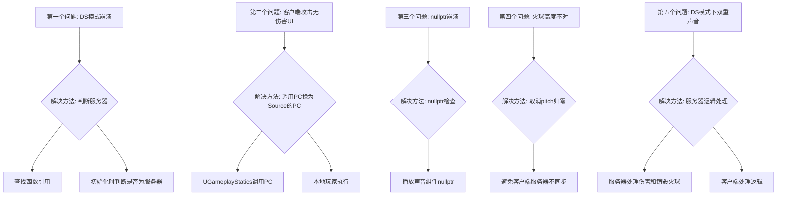


___________________________________________________________________________________________

### 第一个问题,直接运行多人DS模式直接崩溃

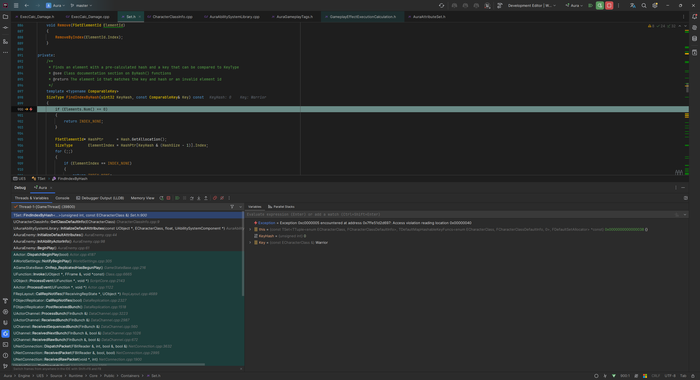

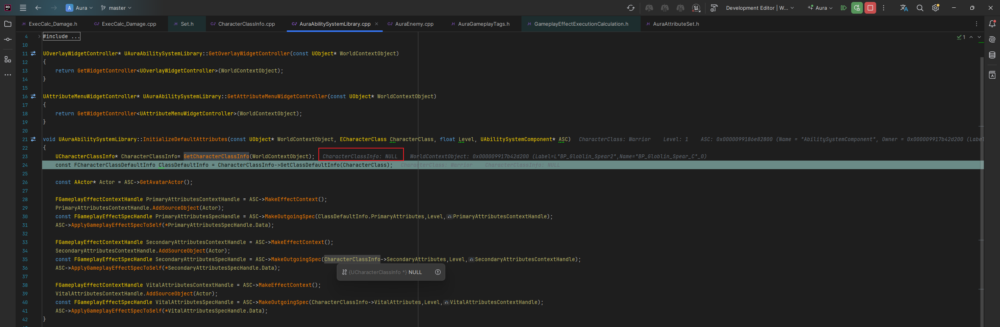

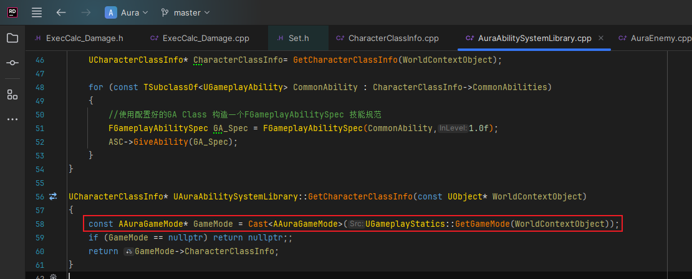

- 因为只有服务器才有GM所以客户端没有，崩溃

- 所以
  - 初始化时，需要判断是否为服务器

<details>
<summary>解决方法</summary>

>### 查找函数的引用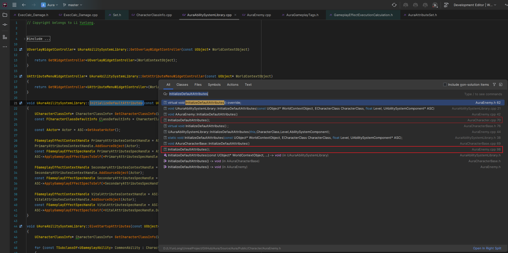
>
>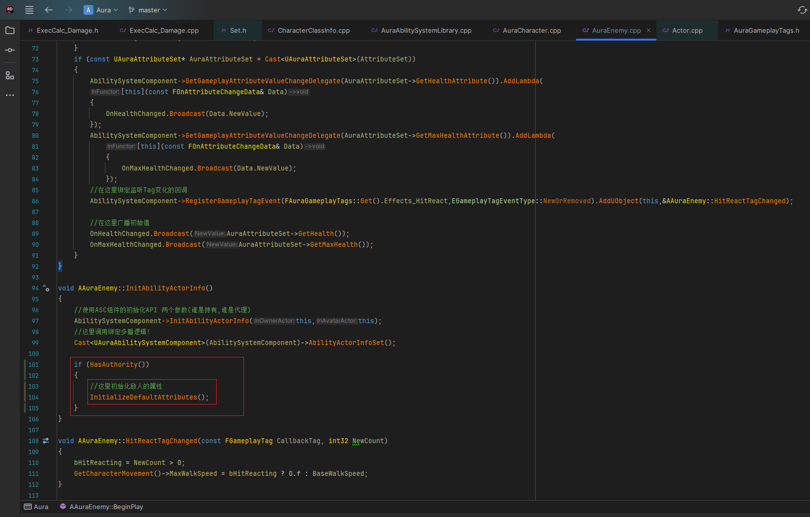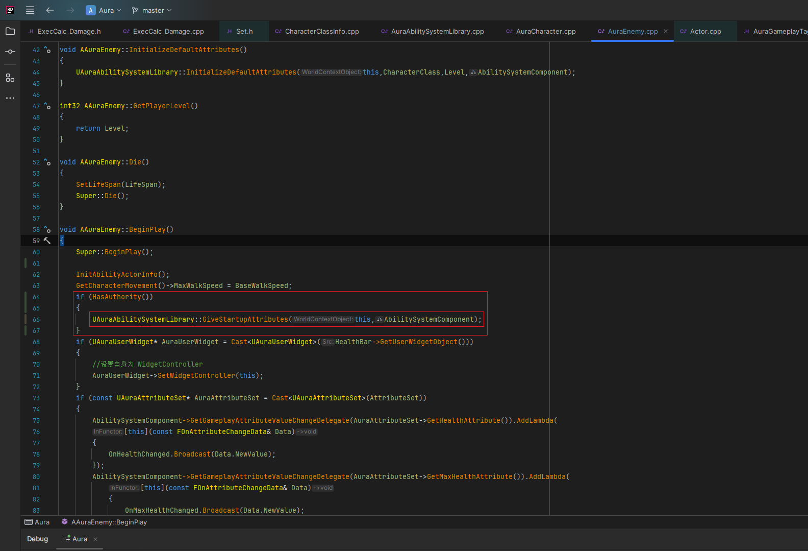

------

</details>


------

### 第二个问题：客户端攻击，但是没有伤害ui

- 血量正常是因为依赖属性AS，而AS属性是复制的
- 这个元属性，只在服务器上有，因为没有复制

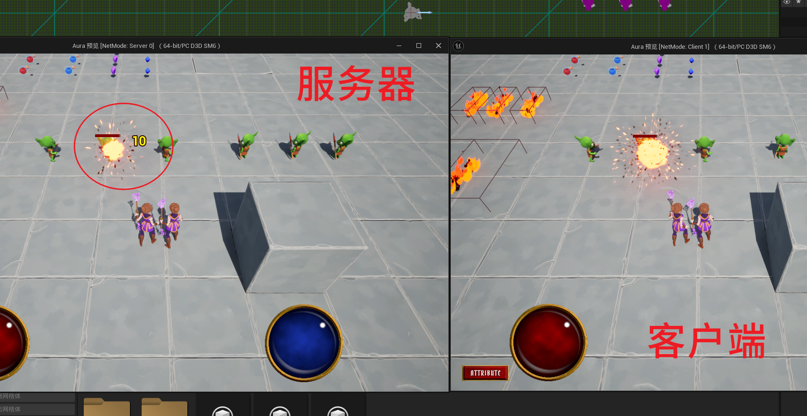

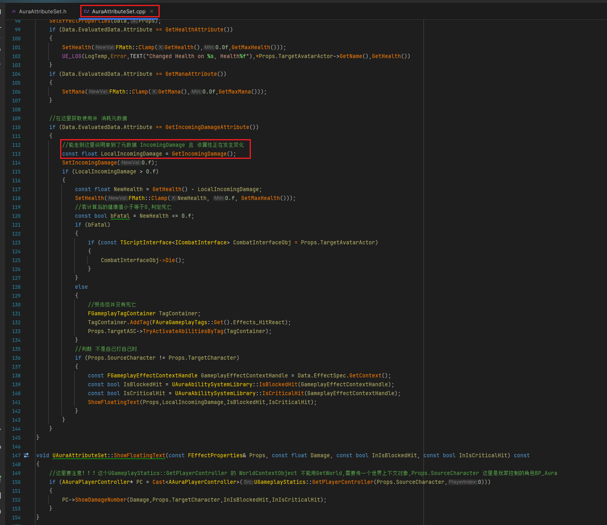

- 我们知道这个应该在服务器调用，然后RPC在客户端执行

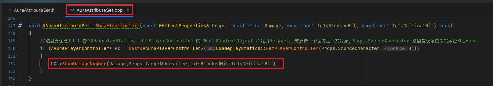

- 如果在服务器，这个UGameplayStatic调用的应该是Index为0的PC，也就是服务器的PC，服务器控制的玩家控制器在客户端上不存在。所以这里调用的PC不对，应该 调用客户端控制的角色的PC

<details>
<summary>解决方法</summary>

>#### 所以应该这样处理:
>
>- 调用PC换为Source的PC
>
>  ```cpp
>  void UAuraAttributeSet::ShowFloatingText(const FEffectProperties& Props, const float Damage, const bool InIsBlockedHit, const bool InIsCriticalHit) const
>  {
>      //这里要注意！！！这个UGameplayStatics::GetPlayerController 的 WorldContextObject 不能用GetWorld,需要传一个世界上下文对象,Props.SourceCharacter 这里是玩家控制的角色BP_Aura
>      if (AAuraPlayerController* PC = Cast<AAuraPlayerController>(Props.SourceCharacter->GetController()/*这里需要获取的是释放技能角色的PC*/))
>      {
>         PC->ShowDamageNumber(Damage,Props.TargetCharacter,InIsBlockedHit,InIsCriticalHit);
>      }
>  }
>  ```
>
>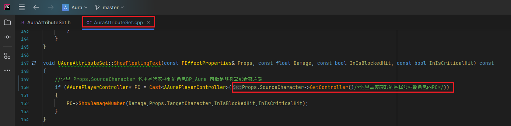
>
>- 且本地玩家，才能执行
>
>  ```cpp
>  void AAuraPlayerController::ShowDamageNumber_Implementation(float DamageAmount, ACharacter* TargetCharacter,
>  	const bool InIsBlockedHit, const bool InIsCriticalHit)
>  {
>  	if (IsValid(TargetCharacter) && DamageTextComponentClass && IsLocalController()/*且本地玩家，才能执行*/)
>  	{
>  		UDamageTextComponent* DamageTextComponent = NewObject<UDamageTextComponent>(TargetCharacter,DamageTextComponentClass);
>  		DamageTextComponent->RegisterComponent();
>  		DamageTextComponent->AttachToComponent(TargetCharacter->GetRootComponent(),FAttachmentTransformRules::KeepRelativeTransform);
>  		DamageTextComponent->DetachFromComponent(FDetachmentTransformRules::KeepWorldTransform);
>  		DamageTextComponent->SetDamageText(DamageAmount,InIsBlockedHit,InIsCriticalHit);
>  	}
>  }
>  ```
>
>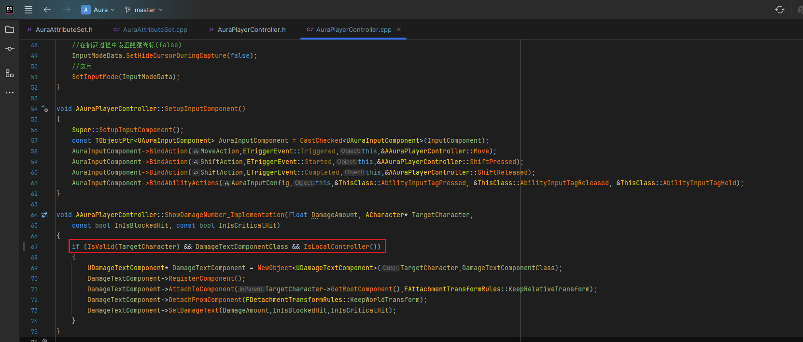
>
>
>
>当客户端发送生成火球的请求时，服务器会接收到这个请求并处理相关的逻辑。在这个过程中，`PostGameplayEffectExecute` 函数是在服务器上调用的，而 `Data` 中的 `PC`（Player Controller）代表的是服务器上的那个 Player Controller。但这个 Player Controller 实际上是对应于客户端发出请求的那个玩家角色。
>
>### 关键点：
>
>- **服务器的 Player Controller**: 当你在服务器上处理来自客户端的请求时，服务器会有一个模拟客户端 Player Controller 的对象（即服务器端的 PC）。这个 PC 对应的是客户端控制的角色。
>- **Index 可能不是 0**: 如果服务器上有多个玩家连接，每个玩家在服务器上都会有一个对应的 Player Controller 实例。这些实例的索引（index）并不一定是 0，它们取决于玩家在游戏中的顺序和服务器的处理方式。索引 `0` 通常对应服务器本身的 PC，而其他索引对应不同的客户端玩家。
>
>因此，在服务器上，`PostGameplayEffectExecute` 中的 `Data` 包含的 `PC` 是服务器端的 Player Controller，但它模拟的是客户端对应的那个角色，而不是服务器自身的角色。这意味着它的索引（index）可能并不是 `0`，而是对应于那个客户端玩家的索引。

------

</details>

------

### 第三个问题，播放声音的组件，如果为nullptr，调用stop函数，会崩溃

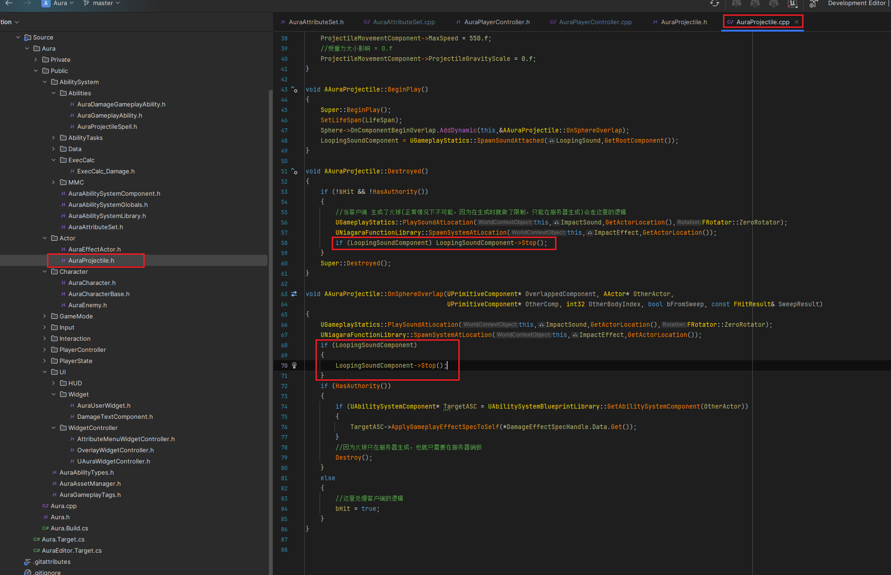

------

### 这里好像是处理重叠的对象不能是自身，如果是自身直接 return

这里加了判断 让自身不能触发

- Instigator可能是角色(释放火球的人)
- EffectCauser 是火球

> ### [这一点在 `FGameplayEffectContext` 那节有说到过，这里是跳转链接](./_FGameplayEffectContext_.md)

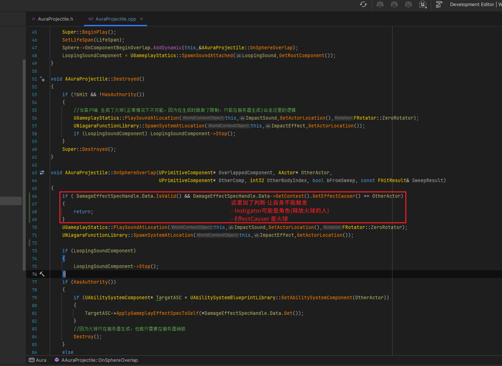


------

### 第四个问题DS模式下，客户端的火球高度不对，打不到敌人

- 这个问题我之前修过了，但是这里还是参照着改一下

> ### 取消了设置pitch为0，因为可能服务器客户端不同步延迟，导致的socket的出手位置过高，打不到人。


- 因为客户端和服务器之间总是存在差异，所以如果我们的插座位置有点高，如果这与我们在客户身上看到的时间有点偏差，那么我们的启动可能会太高。

- 所以这里不用把pitch归零

<details>
<summary>解决方法</summary>

>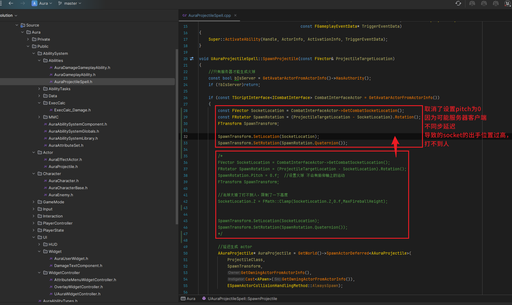

------

</details>

------

### 第五个问题：作者说他DS模式下客户端听到了两遍声音

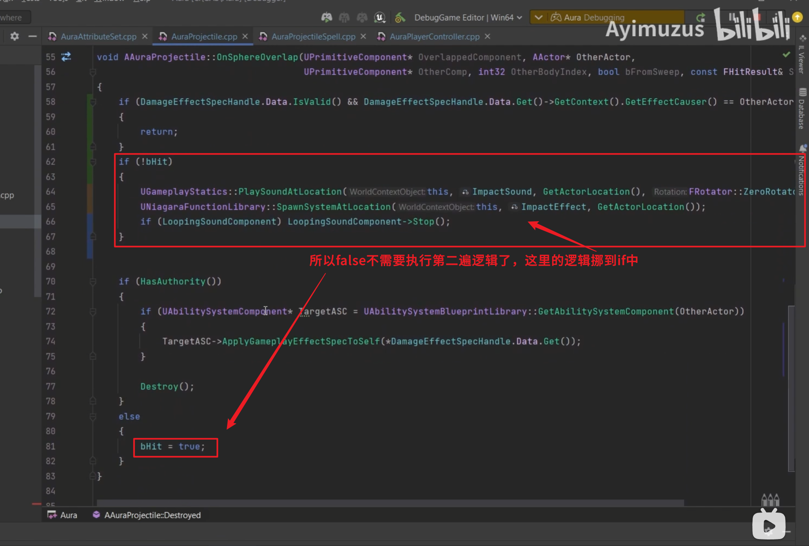

```CPP
void AAuraProjectile::OnSphereOverlap(UPrimitiveComponent* OverlappedComponent, AActor* OtherActor,
                                      UPrimitiveComponent* OtherComp, int32 OtherBodyIndex, bool bFromSweep, const FHitResult& SweepResult)
{
    if ( !DamageEffectSpecHandle.Data.IsValid() || DamageEffectSpecHandle.Data->GetContext().GetEffectCauser() == OtherActor)return;
    
    if (!bHit)
    {
       UGameplayStatics::PlaySoundAtLocation(this,ImpactSound,GetActorLocation(),FRotator::ZeroRotator);
       UNiagaraFunctionLibrary::SpawnSystemAtLocation(this,ImpactEffect,GetActorLocation());
    
       if (LoopingSoundComponent)
       {
          LoopingSoundComponent->Stop();
       }
    }
    
    if (HasAuthority())
    {
       if (UAbilitySystemComponent* TargetASC = UAbilitySystemBlueprintLibrary::GetAbilitySystemComponent(OtherActor))
       {
          TargetASC->ApplyGameplayEffectSpecToSelf(*DamageEffectSpecHandle.Data.Get());
       }
       //因为火球只在服务器生成，也就只需要在服务器销毁
       Destroy();
    }
    else
    {
       //这里处理客户端的逻辑
       bHit = true;
    }
}
```

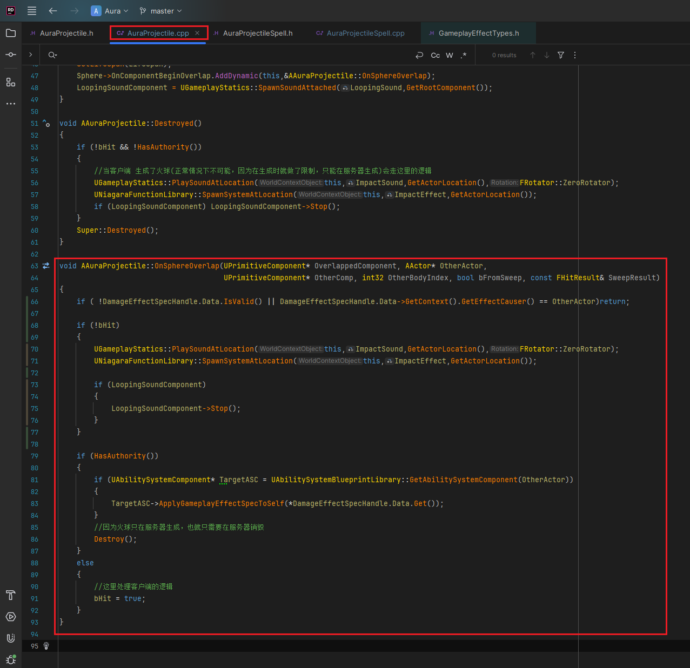


------

### 此时可以PVP，并不是要做pvp而是没有限制，所以检查一下逻辑，是否可以造成pvp的伤害

### 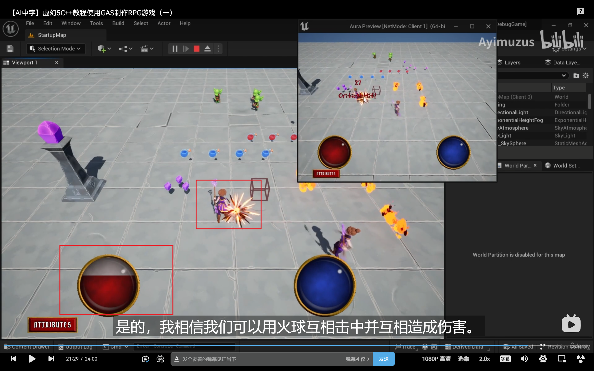


>## 下一节将开始AI相关


___________________________________________________________________________________________

[返回最上面](#Go主菜单)

___________________________________________________________________________________________