___________________________________________________________________________________________
###### [Go主菜单](../MainMenu.md)
___________________________________________________________________________________________

# GAS 078 使血瓶等道具不对敌人生效，但是火焰对敌人生效；修复敌人转向问题

___________________________________________________________________________________________

## 处理关键点

1. 在 `Character` 中调用移动组件，需要调用子类 `UCharacterMovementComponent`

   比如：`GetCharacterMovement()->bUseControllerDesiredRotation = true;`

___________________________________________________________________________________________

# 目录


- [GAS 078 使血瓶等道具不对敌人生效，但是火焰对敌人生效；修复敌人转向问题](#gas-078-使血瓶等道具不对敌人生效但是火焰对敌人生效修复敌人转向问题)
  - [处理关键点](#处理关键点)
- [目录](#目录)
    - [Mermaid整体思路梳理](#mermaid整体思路梳理)
    - [发现此时敌人转向有些问题](#发现此时敌人转向有些问题)
    - [上面需要调整的参数需要在C++中调整，下面是操作](#上面需要调整的参数需要在c中调整下面是操作)
    - [在敌人的基类构造中设置](#在敌人的基类构造中设置)
    - [测试gif](#测试gif)
    - [当敌人站在火上时，会掉血，所以需要 配置 一下，谁可以在火上掉血，谁不掉血](#当敌人站在火上时会掉血所以需要-配置-一下谁可以在火上掉血谁不掉血)
    - [为敌人使用道具如血瓶，增加限制](#为敌人使用道具如血瓶增加限制)
    - [蓝图中配置道具](#蓝图中配置道具)
    - [测试gif](#测试gif-1)


___________________________________________________________________________________________

<details>
<summary>视频链接</summary>

[6. AI and Effect Actors_哔哩哔哩_bilibili](https://www.bilibili.com/video/BV1JD421E7yC?p=166&vd_source=9e1e64122d802b4f7ab37bd325a89e6c)

------

</details>

___________________________________________________________________________________________

### Mermaid整体思路梳理

Mermaid

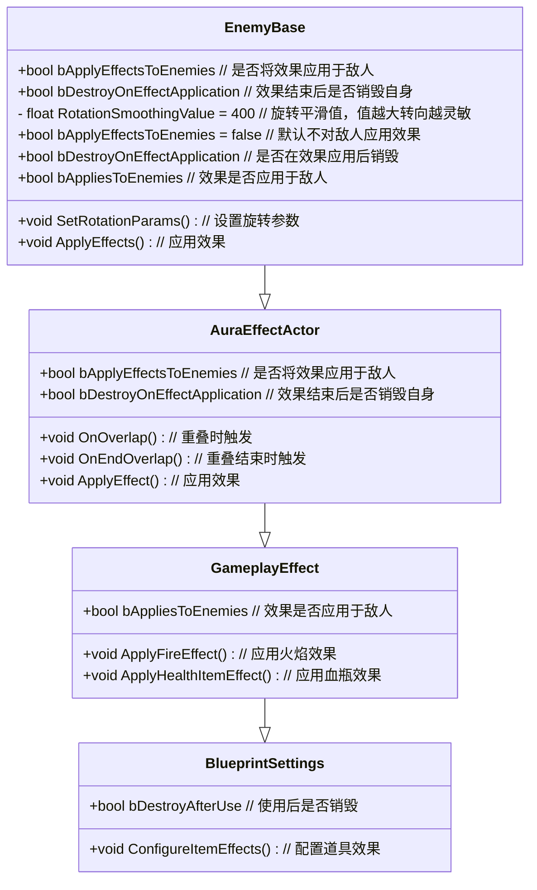

___________________________________________________________________________________________

### 发现此时敌人转向有些问题

> ### 需要调整的参数：
>
> - #### 不使用 `Controller` 的旋转
>
> - #### 旋转的平滑值
>
>  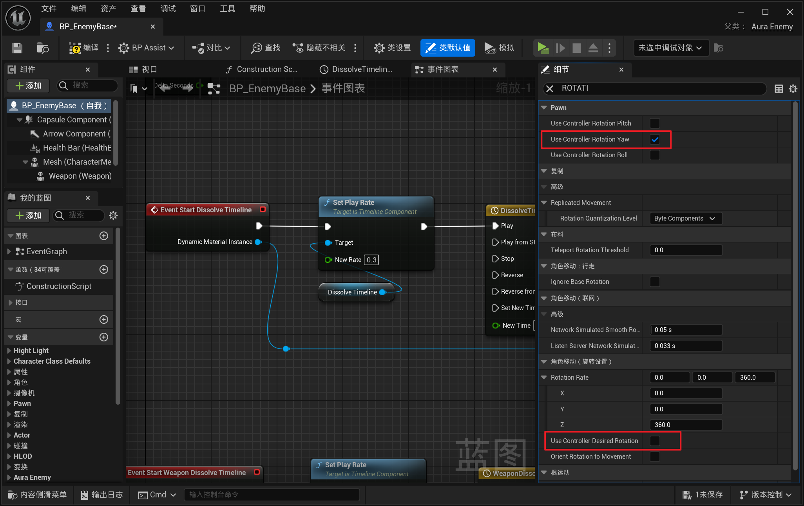
>
> - #### **这个是 `旋转的平滑值` ，越高转向越灵敏**
>
>   - ##### 大约设置为 **400** 就可以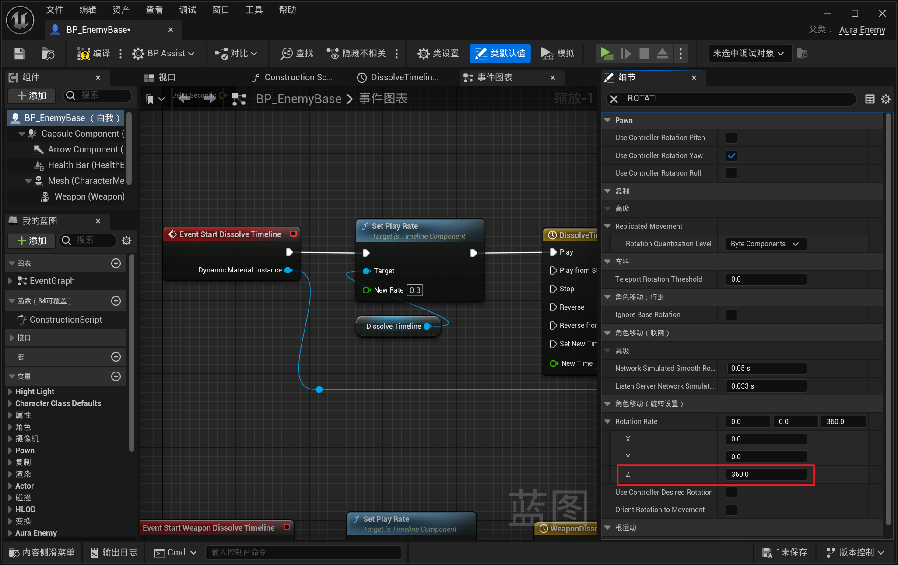

------

### 上面需要调整的参数需要在C++中调整，下面是操作

------

### 在敌人的基类构造中设置

> 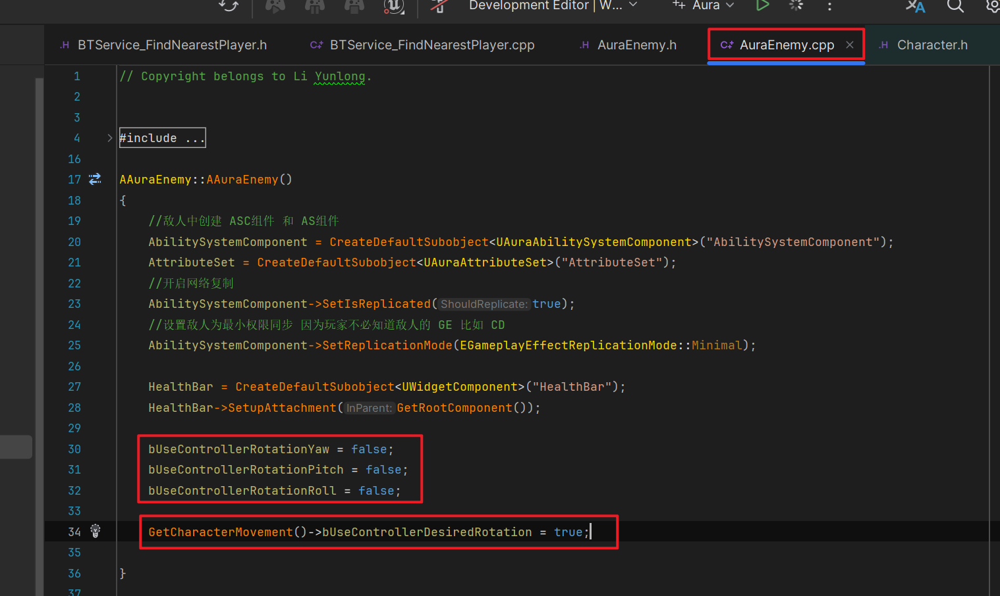

------

### 测试gif

> - #### 我觉得还有点卡顿感的原因是：服务的 `Tick频率` 是 0.5 ，我调成 0.1 就好很多了，先不调整，知道有这个问题
>
> S

------

### 当敌人站在火上时，会掉血，所以需要 配置 一下，谁可以在火上掉血，谁不掉血

------

### 为敌人使用道具如血瓶，增加限制

>### 敌人且不需要对敌人应用时，return，否则才能使 效果类道具 生效，比如血瓶
>
>
>
>### 在 `AuraEffectActor` 上
>
>- #### 创建 bool 变量 (标识该效果是否应用在敌人身上)，命名为 `bApplyEffectsToEnemies`
>
>  ```cpp
>  protected:
>      // 标识该效果是否应用在敌人身上
>      UPROPERTY(EditAnywhere, BlueprintReadOnly,Category="Applied Effects")
>      bool bApplyEffectsToEnemies = false;
>  ```
>
>- #### 修改变量名字，为 `bDestroyOnEffectApplication`
>
>  ```cpp
>  protected:
>      // 效果结束时 是否摧毁自身
>      UPROPERTY(EditAnywhere,BlueprintReadOnly,Category="Applied Effects")
>      bool bDestroyOnEffectApplication;
>  ```
>
>- #### 当应用效果到目标时，检查目标是不是敌人，如果 是敌人 或者，上面的 bool 为 false，return
>
>  ```cpp
>  //如果是敌人触发了,没有打开应用敌人的效果就 return
>  if (TargetActor->ActorHasTag(FName("Enemy")) && !bApplyEffectsToEnemies) return;
>  ```
>
>
>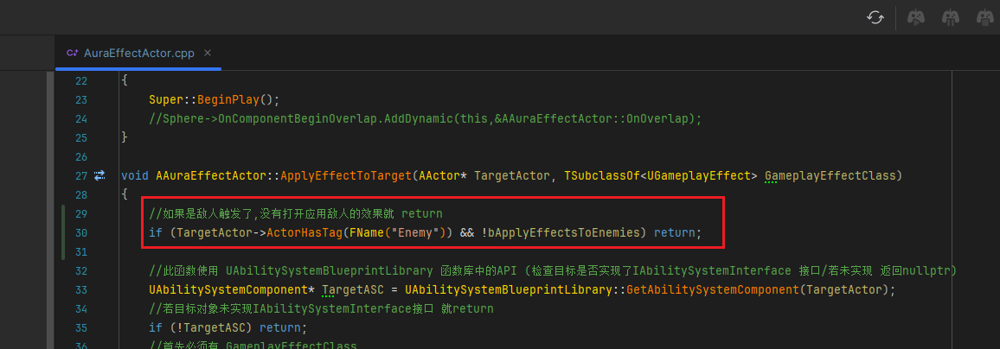
>
>#### `OnOverlap` 和 `OnEndOverlap` 时也要这样处理
>
>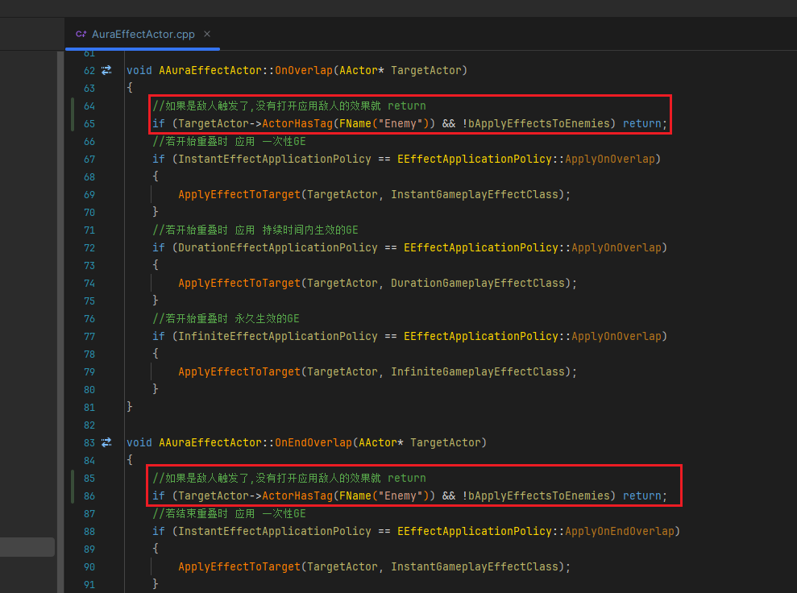
>
>### 如果这不是永久性的效果，那我们在执行后就摧毁
>
>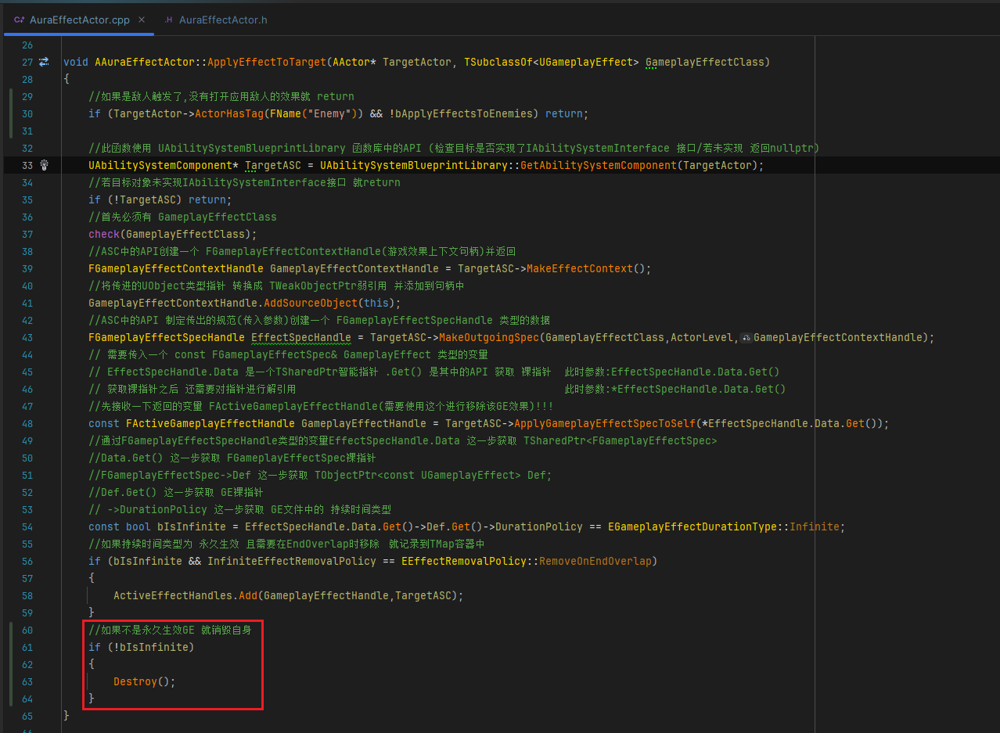
>
>### 原来是在蓝图中处理的这段逻辑，现在使用C++需要把所有道具蓝图的这里这里调用 Destroy 的逻辑都移除
>
>### 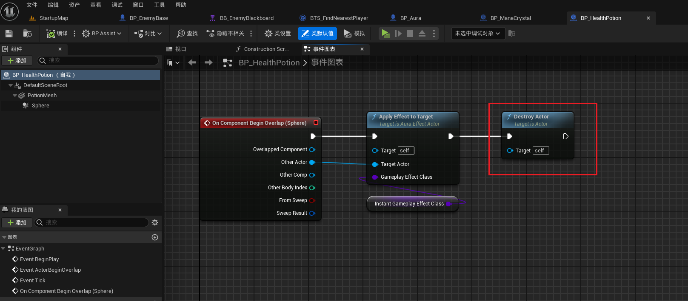

------

### 蓝图中配置道具

>-  #### **希望火对敌人生效**
>
>-  #### **道具不要对敌人生效**
>
>-  #### **然后道具使用后需要后销毁**
>
> ### 所以配置 bool
>
> <details>
> <summary>过程截图</summary>
>
> >- ### 火场的GE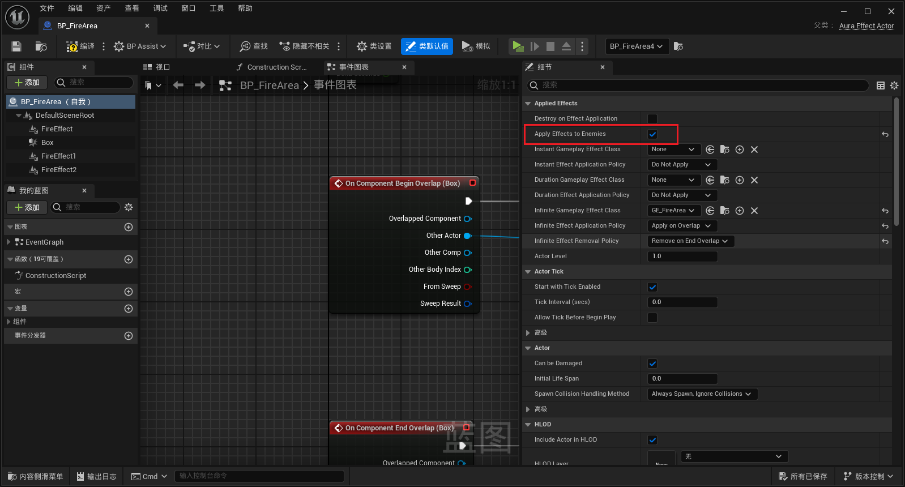
> >
> >- ### 一次性和持续时间类 GE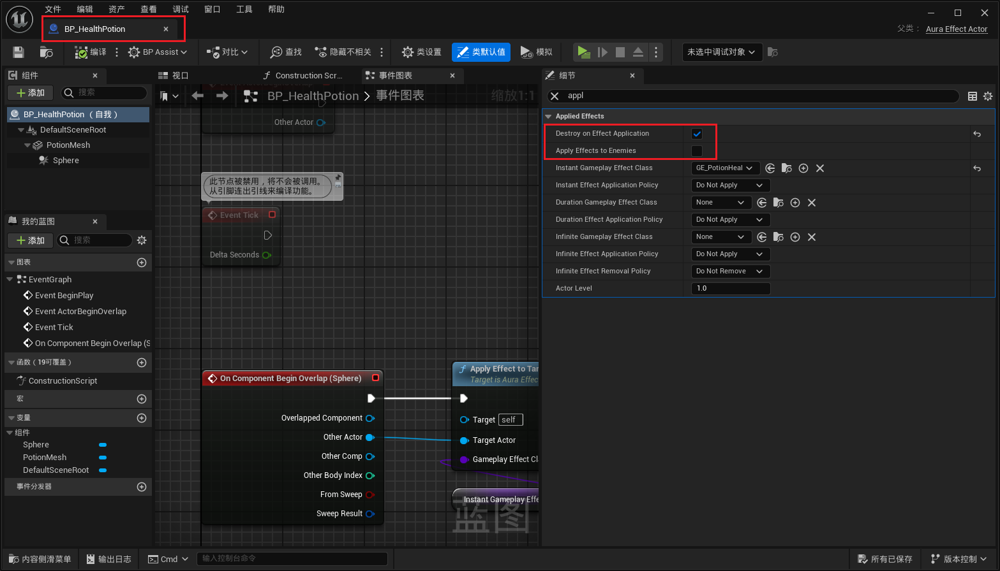
>
> ------
>
> </details>

------

### 测试gif

> #### 如果开启敌人应用道具,敌人可以吃掉沿途的血瓶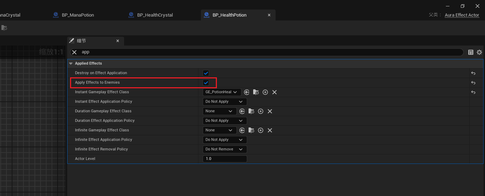
>
> 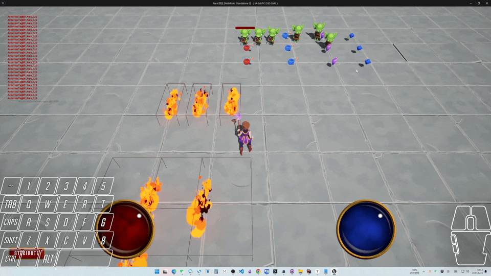


___________________________________________________________________________________________

[返回最上面](#Go主菜单)

___________________________________________________________________________________________