___________________________________________________________________________________________
###### [Go主菜单](../MainMenu.md)
___________________________________________________________________________________________

# GAS 079 行为树中不同敌人执行不同分支；使用装饰器

___________________________________________________________________________________________

## 处理关键点

1. 行为树中 `装饰器` 的使用


___________________________________________________________________________________________

# 目录

- [GAS 079 行为树中不同敌人执行不同分支；使用装饰器](#gas-079-行为树中不同敌人执行不同分支使用装饰器)
  - [处理关键点](#处理关键点)
- [目录](#目录)
    - [Mermaid整体思路梳理](#mermaid整体思路梳理)
    - [使用 装饰器 (类似于 if 语句)](#使用-装饰器-类似于-if-语句)
    - [行为树节点等级](#行为树节点等级)
    - [行为树中创建装饰器，`Is Set` 当 `变量条件 == true` 时，执行下面的逻辑](#行为树中创建装饰器is-set-当-变量条件--true-时执行下面的逻辑)
    - [下面想让敌人对受击作出反应](#下面想让敌人对受击作出反应)
    - [行为树中，添加装饰器，如果受击状态，需要打断自身并返回失败](#行为树中添加装饰器如果受击状态需要打断自身并返回失败)
    - [接下来我们可以开始思考](#接下来我们可以开始思考)
    - [接下来想要根据敌人的种类执行不同的逻辑](#接下来想要根据敌人的种类执行不同的逻辑)
    - [黑板中创建 bool 变量，判断是否为远程攻击者](#黑板中创建-bool-变量判断是否为远程攻击者)
    - [创建不同类型敌人的行为树分支](#创建不同类型敌人的行为树分支)
    - [先在C++敌人基类中PossessedBy时，设置黑板中的 bool 敌人的类型](#先在c敌人基类中possessedby时设置黑板中的-bool-敌人的类型)
    - [行为树中设置是否为远程](#行为树中设置是否为远程)
    - [行为树中，设置，当敌人距离小于Distance，进行近战攻击](#行为树中设置当敌人距离小于distance进行近战攻击)
    - [接着来写移动的逻辑](#接着来写移动的逻辑)
    - [为节点起别名](#为节点起别名)
    - [测试一下](#测试一下)


___________________________________________________________________________________________

<details>
<summary>视频链接</summary>

[7. Behavior Tree Decorators_哔哩哔哩_bilibili](https://www.bilibili.com/video/BV1JD421E7yC?p=167&vd_source=9e1e64122d802b4f7ab37bd325a89e6c)

------

</details>

___________________________________________________________________________________________

### Mermaid整体思路梳理

Mermaid

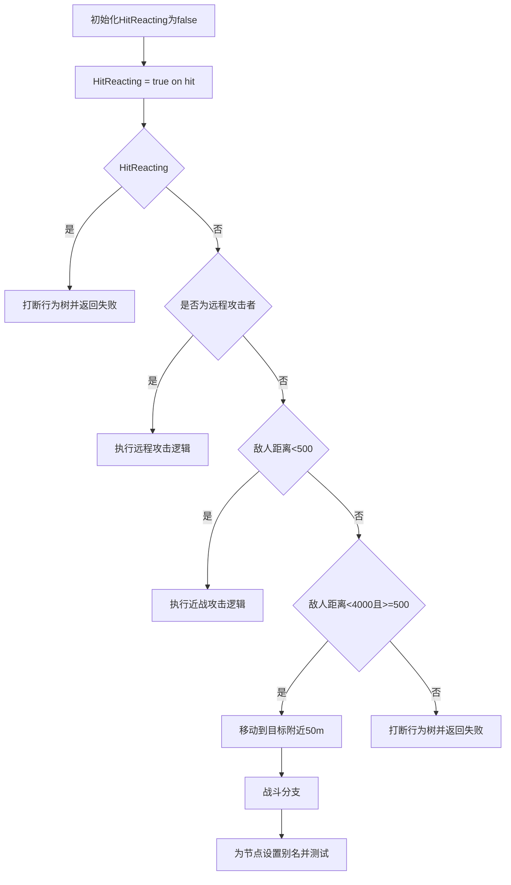


___________________________________________________________________________________________

### 使用 装饰器 (类似于 if 语句)

> #### 条件基于黑板值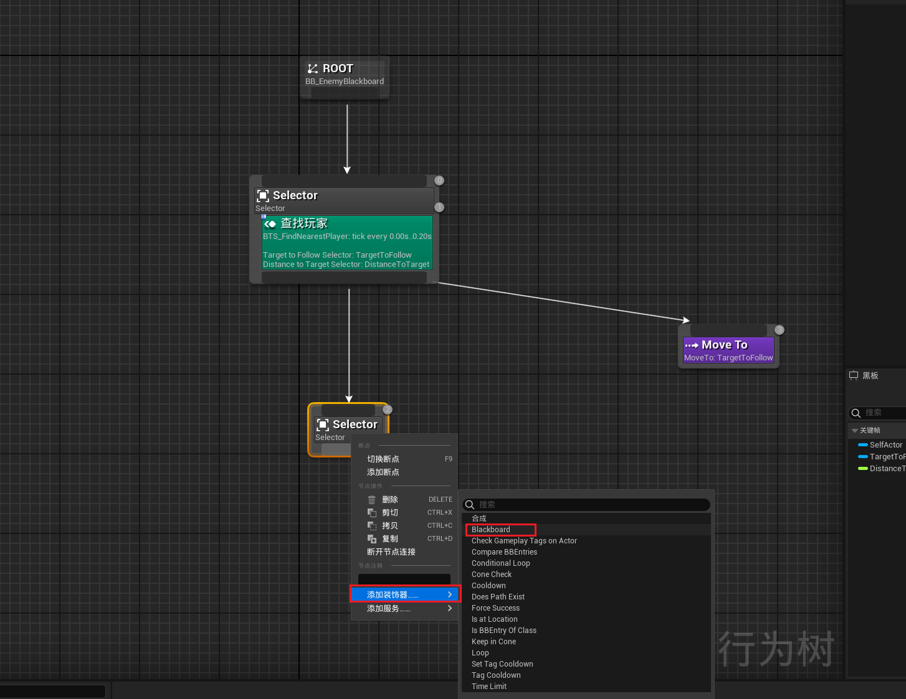

------

### 行为树节点等级

> 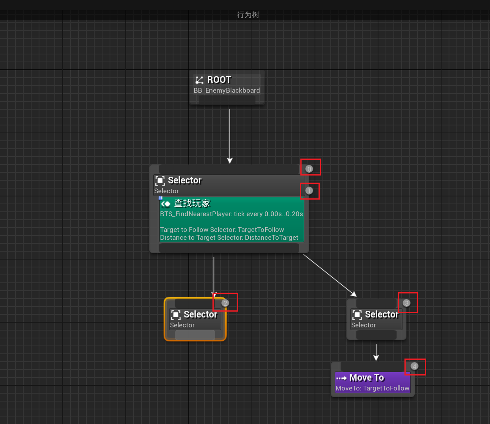

------

### 行为树中创建装饰器，`Is Set` 当 `变量条件 == true` 时，执行下面的逻辑

> 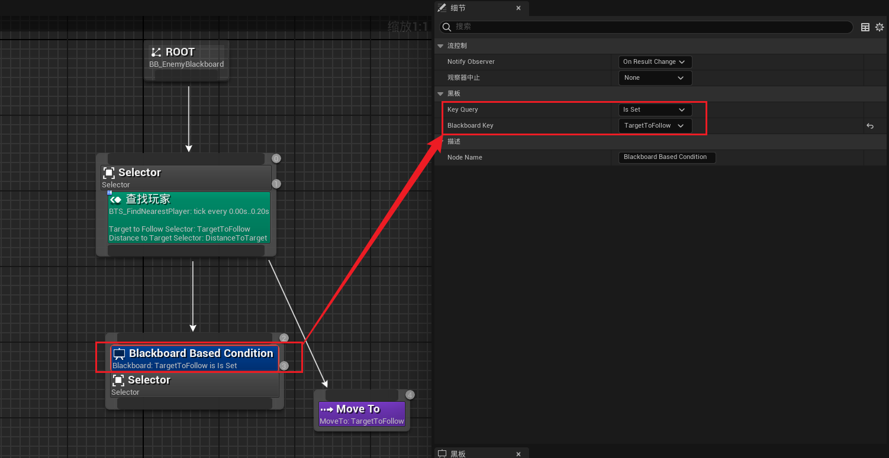

------

### 下面想让敌人对受击作出反应

> - ### **黑板中创建受击的 bool**
>
>   - #### **命名为 `HitReacting`，默认为 `false*`**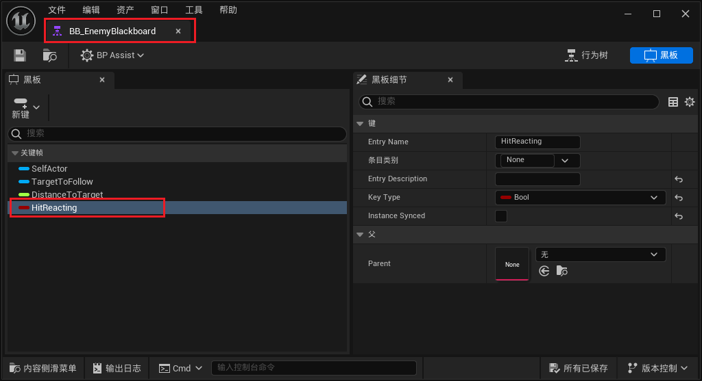
>
> - #### 接下来去敌人中设置
>
>   - #### **`设置初始值` 为 `false`**
>
>   - #### **`受到攻击后` 设为 `true`**
>
>     - ##### 有一个受击的回调函数 `HitReactTagChanged` ，在这里处理
>
>   - #### 确保 敌人的 `AIController` 已经被设置
>
>     ```CPP
>     AIController->GetBlackboardComponent()->SetValueAsBool(FName("HitReacting"),false);
>     ```
>
>     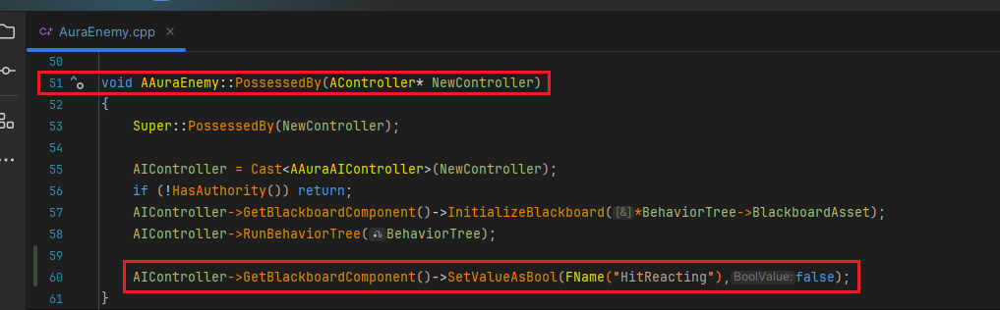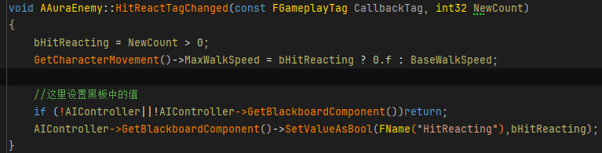
>     
>     
>     
>     ```cpp
>     void AAuraEnemy::HitReactTagChanged(const FGameplayTag CallbackTag, int32 NewCount)
>     {
>     	bHitReacting = NewCount > 0;
>     	GetCharacterMovement()->MaxWalkSpeed = bHitReacting ? 0.f : BaseWalkSpeed;
>                 
>     	//这里设置黑板中的值
>     	if (!AIController||!AIController->GetBlackboardComponent())return;
>     	AIController->GetBlackboardComponent()->SetValueAsBool(FName("HitReacting"),bHitReacting);
>     }
>     ```
>     
>     

------

### 行为树中，添加装饰器，如果受击状态，需要打断自身并返回失败

> - #### 如果命中反应变为真，我们在这里进行的任何节点都将停止
>
> - #### 只有该 bool == false 时，才会执行下面的节点；否则失败返回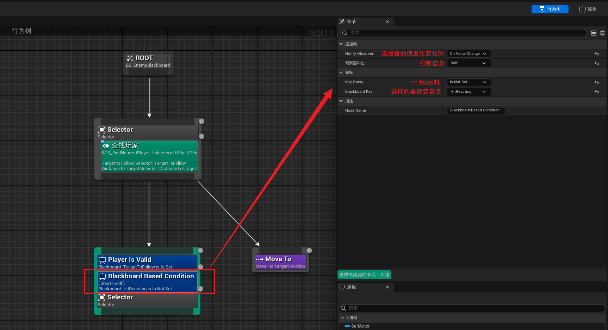

------

### 接下来我们可以开始思考

> - 如何让敌人靠近角色
>
> - 并攻击角色。

------

### 接下来想要根据敌人的种类执行不同的逻辑

> - 远程敌人
>
> - 近战敌人
>
> - 所以需要一个黑板中的bool值来判断，敌人是否为 近战角色

------

### 黑板中创建 bool 变量，判断是否为远程攻击者

> #### 命名为 `RangedAttacker`
>
> #### 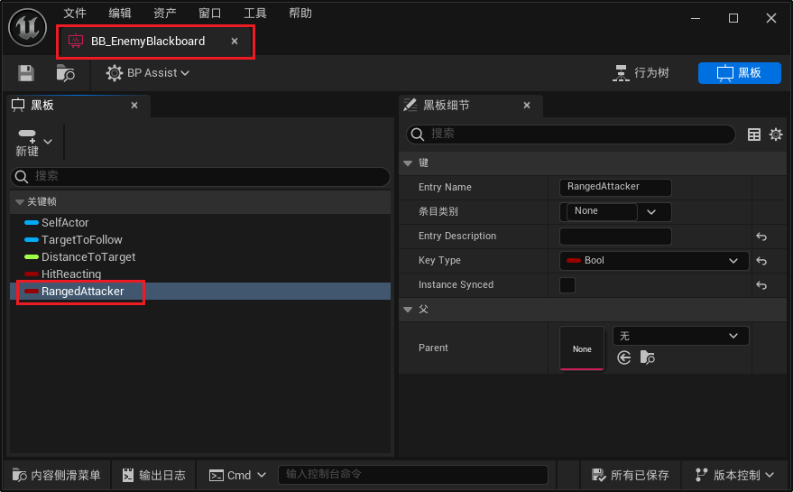

------

### 创建不同类型敌人的行为树分支

> #### 因为上级是select节点，所以只会选择一个执行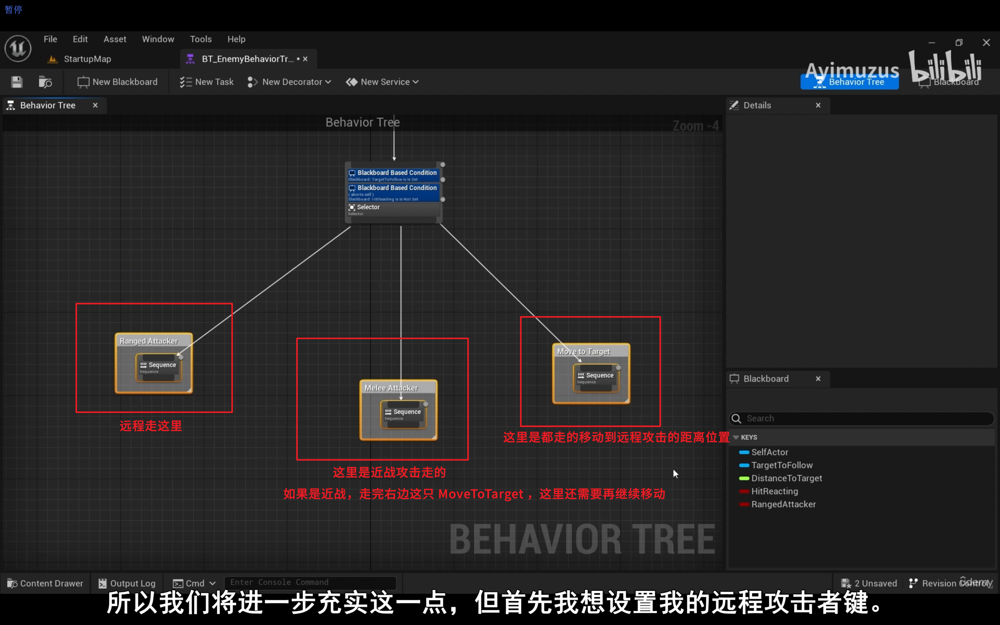

------

### 先在C++敌人基类中PossessedBy时，设置黑板中的 bool 敌人的类型

> #### 这里游侠和元素师都是远程，所以判断是否为近战角色，直接将结果作为bool传入黑板
>
> ```cpp
> const bool IsNotWarrior = CharacterClass != ECharacterClass::Warrior;
> AIController->GetBlackboardComponent()->SetValueAsBool(FName("RangedAttacker"),IsNotWarrior);
> ```
>
> #### 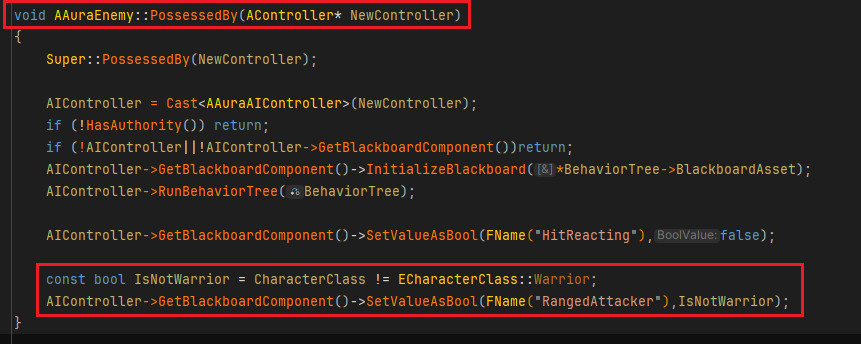

------

### 行为树中设置是否为远程

> #### 只有当设置为 远程bool RangedAttacker == true 时才会执行下面的逻辑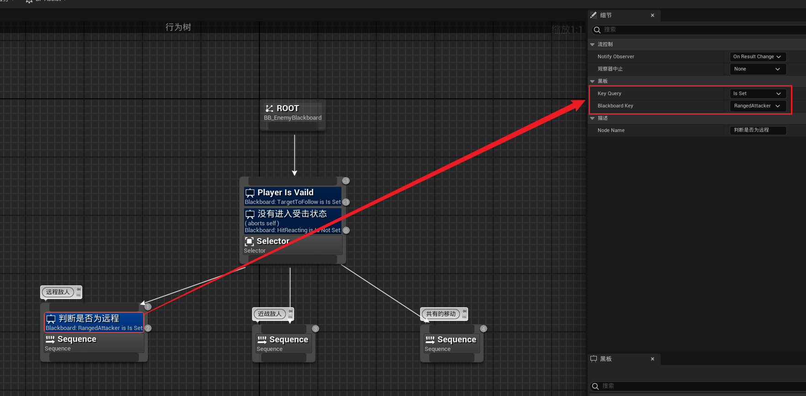

------

### 行为树中，设置，当敌人距离小于Distance，进行近战攻击

> - ### 浮点型float黑板值可以设置：
>
>   | 浮点型float黑板值装饰器 设置打断条件 | 翻译       |
>   | ------------------------------------ | ---------- |
>   | Is Equal To                          | 等于       |
>   | Is Not Equal To                      | 不等于     |
>   | Is Less Than                         | 小于       |
>   | Is Less Than Or Equal To             | 小于或等于 |
>   | Is Greater Than                      | 大于       |
>   | Is Greater Than Or Equal To          | 大于或等于 |
>
> - #### 距离小于500时，激活下面的节点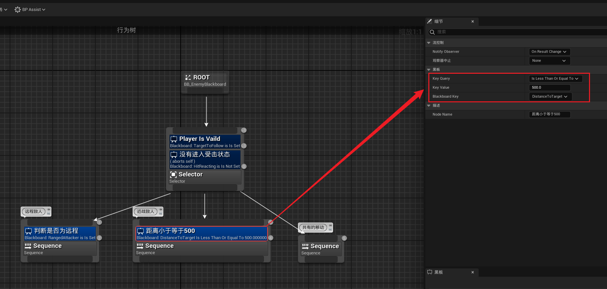

------

### 接着来写移动的逻辑

> - 移动到离目标 50m 远就停止
>
> - 移动前加个 0.5 秒的随机 Delay
>
> - 如果足够远就停止打断自身(使用装饰器)
>
> - 如果足够近也希望停止同时断掉自身逻辑，这样就可以去中间的战斗分支
>
> 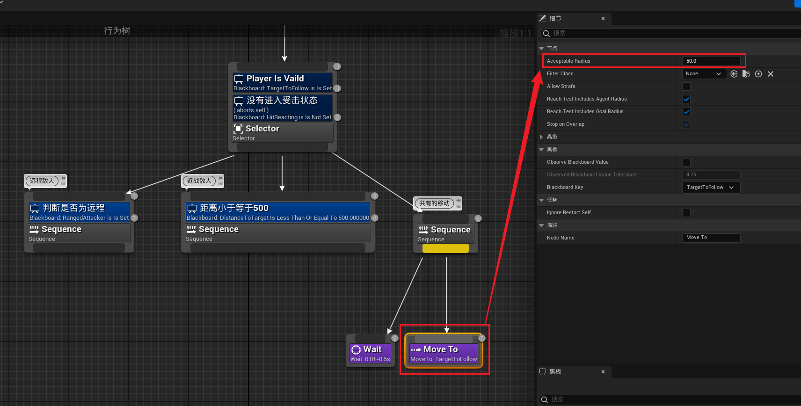
>
> 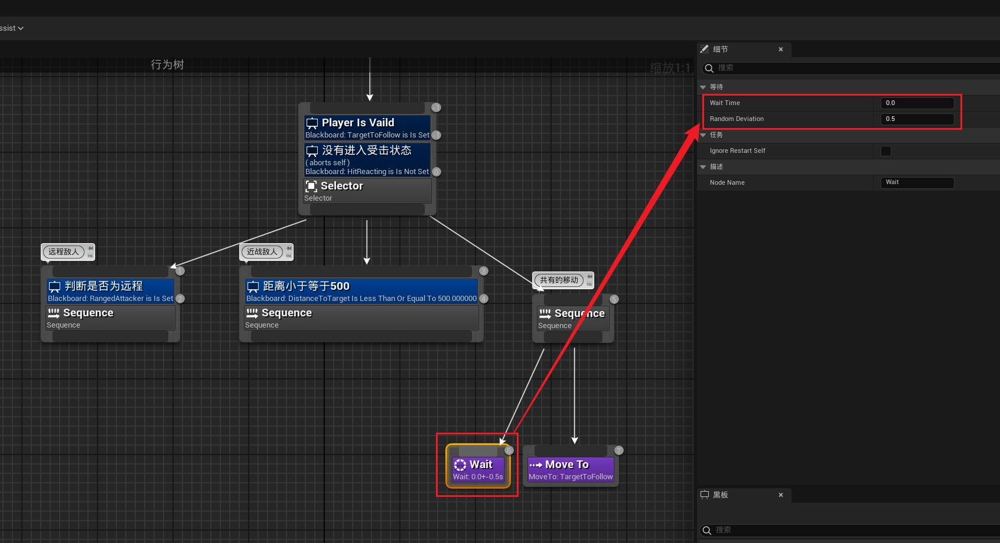
>
> - ### **小于4000** 且 **大于等于500** 时才执行下面的逻辑，失败时断掉自身逻辑
>
>   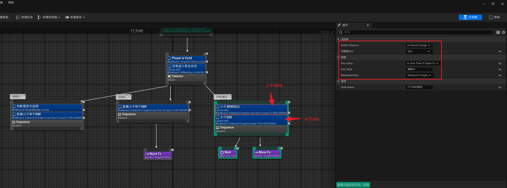

------

### 为节点起别名

> 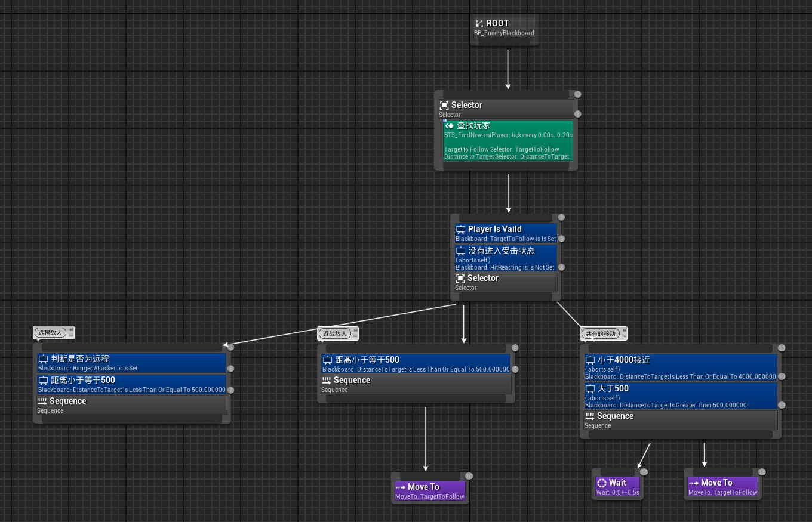

------

### 测试一下

> ## 别忘了连上服务
>
> - #### **看看行为树是否正常运行**
>
> ## 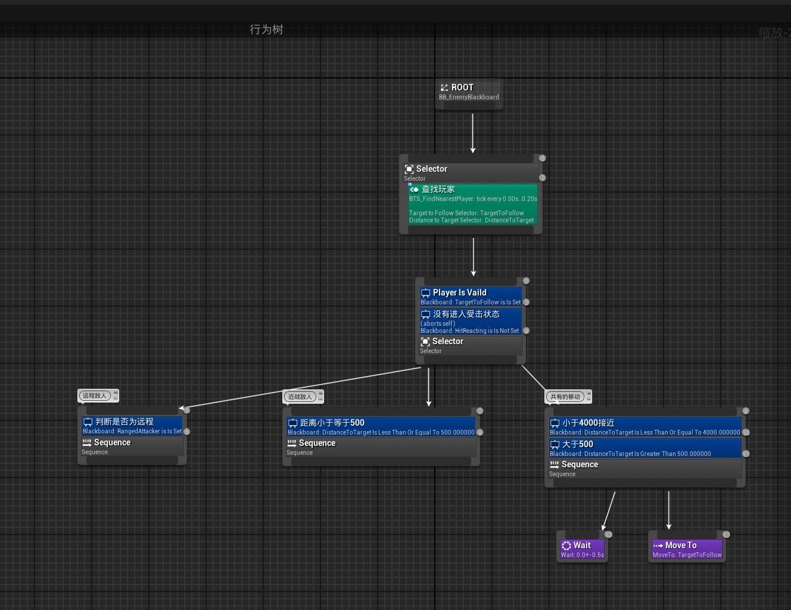
>
> 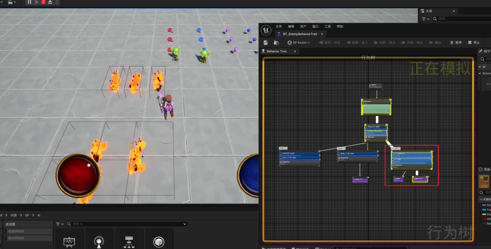


___________________________________________________________________________________________

[返回最上面](#Go主菜单)

___________________________________________________________________________________________