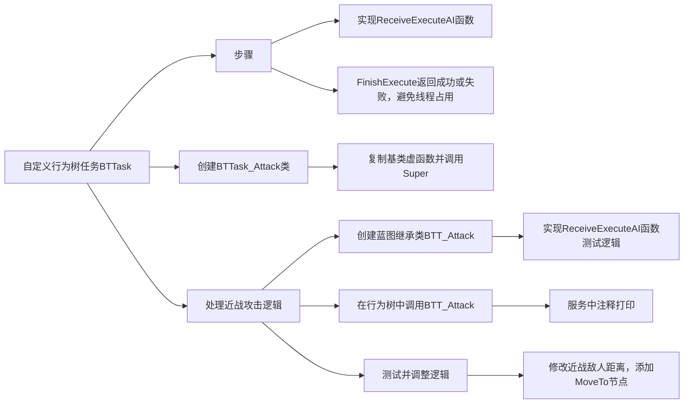

___________________________________________________________________________________________
###### [Go主菜单](../MainMenu.md)
___________________________________________________________________________________________

# GAS 080 行为树中实现敌人攻击逻辑；创建行为树任务BTTask

___________________________________________________________________________________________

## 处理关键点

1. 创建自定义行为树任务BTTask，需要重写的函数 `ExecuteTask`

2. 蓝图中也需要实现 `ExecuteTaskAI` 函数

3. 必须！实现 `FinishExecute` 函数，确保任务返回成功或失败，避免线程占用
___________________________________________________________________________________________

# 目录


- [GAS 080 行为树中实现敌人攻击逻辑；创建行为树任务BTTask](#gas-080-行为树中实现敌人攻击逻辑创建行为树任务bttask)
  - [处理关键点](#处理关键点)
- [目录](#目录)
    - [Mermaid整体思路梳理](#mermaid整体思路梳理)
    - [现在为了战斗，并没有任何内置的节点，所以我们需要创建自定义行为树任务BTTask](#现在为了战斗并没有任何内置的节点所以我们需要创建自定义行为树任务bttask)
    - [使用自定义任务节点的步骤：](#使用自定义任务节点的步骤)
    - [创建自定义行为树任务BTTask](#创建自定义行为树任务bttask)
    - [我们去到 UBTTask\_BlueprintBase 基类可以看到很多可以重写的虚函数](#我们去到-ubttask_blueprintbase-基类可以看到很多可以重写的虚函数)
    - [复制基类的虚函数到自建的BTTask\_Attack中](#复制基类的虚函数到自建的bttask_attack中)
    - [接下来我们先处理近战攻击的逻辑](#接下来我们先处理近战攻击的逻辑)
    - [为 `自建的BTTask_Attack` 创建蓝图的继承类，命名为 `BTT_Attack`](#为-自建的bttask_attack-创建蓝图的继承类命名为-btt_attack)
    - [实现ReceiveExeecuteAl函数](#实现receiveexeecuteal函数)
    - [接下来行为树中调用上面创建的战斗的节点 BTT\_Attack](#接下来行为树中调用上面创建的战斗的节点-btt_attack)
    - [测试gif](#测试gif)
    - [接下来，取消打印改成画测试球体](#接下来取消打印改成画测试球体)
    - [测试结果gif](#测试结果gif)
    - [近战敌人需要移动的更近一点](#近战敌人需要移动的更近一点)
    - [修改节点名字使行为树更加易读](#修改节点名字使行为树更加易读)
    - [测试结果gif](#测试结果gif-1)
    - [还有一些问题，但是暂时不会处理，比如](#还有一些问题但是暂时不会处理比如)


___________________________________________________________________________________________

<details>
<summary>视频链接</summary>

[8. Attack Behavior Tree Task_哔哩哔哩_bilibili](https://www.bilibili.com/video/BV1JD421E7yC?p=168&vd_source=9e1e64122d802b4f7ab37bd325a89e6c)

------

</details>

___________________________________________________________________________________________

### Mermaid整体思路梳理

Mermaid

___________________________________________________________________________________________

### 现在为了战斗，并没有任何内置的节点，所以我们需要创建自定义行为树任务BTTask

------

### 使用自定义任务节点的步骤：

>1. #### 实现ReceiveExeecuteAl函数
>
>
>
>2. #### 任务必须返回失败或者成功，否则将一直执行，占用线程
>
>     如果要返回成功或者失败，调用节点
>     
>     
>

------

### 创建自定义行为树任务BTTask

> - ### 在 `Aura/Public/AI/` 文件夹下
>
> - ### 创建自定义行为树任务C++类 `BTTask_BlueprintBase`，命名为 `BTTask_Attack`

------

### 我们去到 UBTTask_BlueprintBase 基类可以看到很多可以重写的虚函数

> - ## 最重要的是 执行任务 和 中止任务 的 虚函数
>
> # 注意这个几个函数是私有的，不是 `Protected` ，不能重写!!!!!!!!!!
>
> 
>
> ### 这里调用了蓝图的

------

### 复制基类的虚函数到自建的BTTask_Attack中

> #### 需要调用 `super` ，因为 `super` 负责执行蓝图的逻辑
>
> ```cpp
> virtual EBTNodeResult::Type ExecuteTask(UBehaviorTreeComponent& OwnerComp, uint8* NodeMemory) override;
> ```
>
> ```cpp
> EBTNodeResult::Type UBTTask_Attack::ExecuteTask(UBehaviorTreeComponent& OwnerComp, uint8* NodeMemory)
> {
>     return Super::ExecuteTask(OwnerComp, NodeMemory);
> }
> ```

------

### 接下来我们先处理近战攻击的逻辑

------

### 为 `自建的BTTask_Attack` 创建蓝图的继承类，命名为 `BTT_Attack`

> 

------

### 实现ReceiveExeecuteAl函数

> 
> #### 先使用测试逻辑

------

### 接下来行为树中调用上面创建的战斗的节点 BTT_Attack

> - ### 这里注意一下不要调用成 C++ 的版本，因为 C++中 没有写逻辑
>

------

> ## 把服务中的打印注了

------

### 测试gif

> - #### 刚开始不打印
>
> - #### 近到一定距离开始打印

------

### 接下来，取消打印改成画测试球体

> 

------

### 测试结果gif

> 远程敌人没有画球，近战敌人画球

------

### 近战敌人需要移动的更近一点

> - ### 添加 `MoveTo` 节点
>
> - ### 可以改名字
>
>   

------

### 修改节点名字使行为树更加易读

------

### 测试结果gif

> 近战跟着走并画球，远程走到500

------

### 还有一些问题，但是暂时不会处理，比如

> - #### 比如敌人之间不会影响导航，所以会忽视彼此，互相顶着走
>
> - #### 比如，按 `p` 显示 `NaviMesh` 没有白色的区域，说明没有影响NaviMesh导航
>
> 
>
> - ### 暂时不调整，这些后面再说


___________________________________________________________________________________________

[返回最上面](#Go主菜单)

___________________________________________________________________________________________