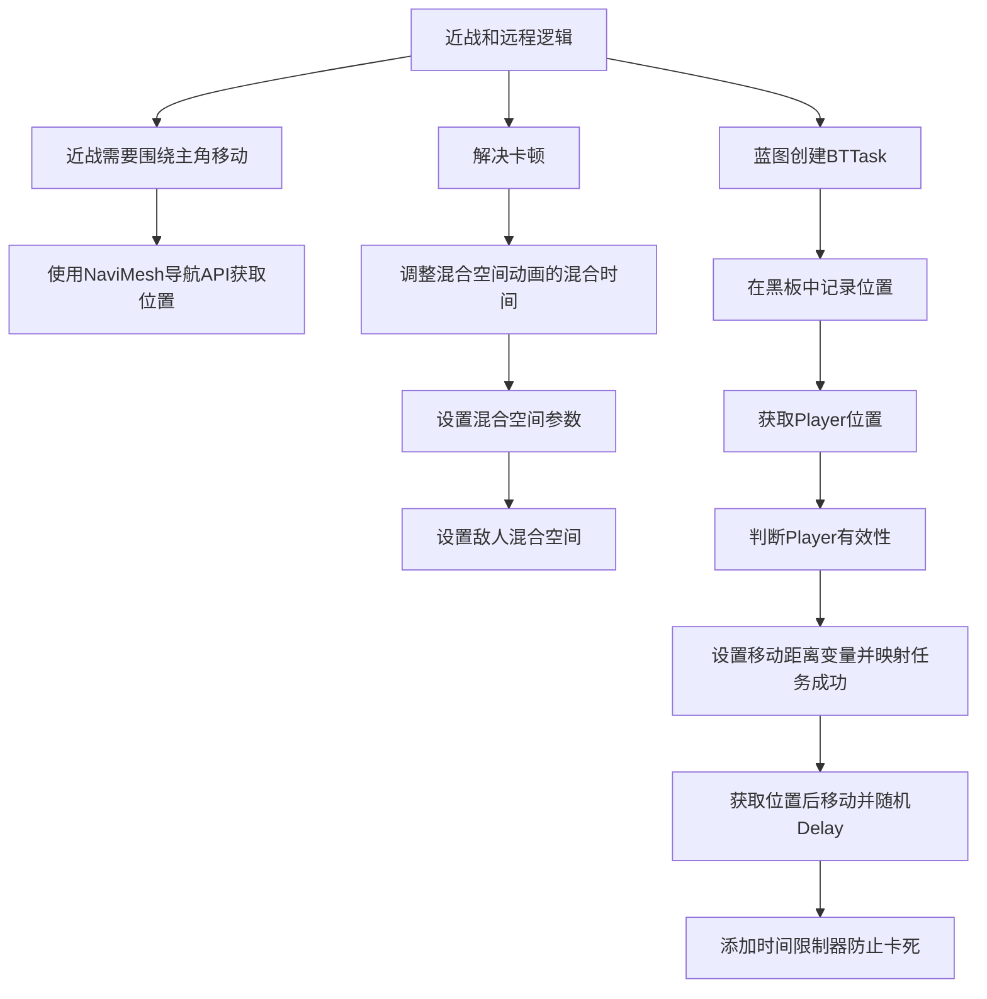

___________________________________________________________________________________________
###### [Go主菜单](../MainMenu.md)
___________________________________________________________________________________________

# GAS 081 动画切换混合空间卡顿；使用预设的装饰器(时间限制器)；使用 NaviMesh获取导航上的随机点

___________________________________________________________________________________________

## 处理关键点

1. **近战逻辑**：近战敌人攻击后围绕主角移动，使用 `NaviMesh` 导航 API 获取新位置。

2. **解决卡顿**：调整混合空间动画的混合时间，设置敌人混合空间参数。

3. **防止卡死**：添加时间限制器，防止移动过程中因障碍卡死。

___________________________________________________________________________________________

# 目录

- [GAS 081 动画切换混合空间卡顿；使用预设的装饰器(时间限制器)；使用 NaviMesh获取导航上的随机点](#gas-081-动画切换混合空间卡顿使用预设的装饰器时间限制器使用-navimesh获取导航上的随机点)
  - [处理关键点](#处理关键点)
- [目录](#目录)
    - [Mermaid整体思路梳理](#mermaid整体思路梳理)
    - [先处理一个bug：](#先处理一个bug)
    - [卡顿解决方法：调整混合空间的动画混合时间](#卡顿解决方法调整混合空间的动画混合时间)
    - [此时效果gif](#此时效果gif)
      - [敌人的混合空间两个敌人都需要设置！](#敌人的混合空间两个敌人都需要设置)
    - [先取消调试信息](#先取消调试信息)
    - [接着处理需求，在蓝图中创建BTTask](#接着处理需求在蓝图中创建bttask)
    - [先在黑板中，记录要去的位置](#先在黑板中记录要去的位置)
    - [蓝图创建BTTask](#蓝图创建bttask)
    - [蓝图Task任务中创建设置黑板 Vector 的变量 BlackboardSelect 扣开眼睛，用来设置新的位置](#蓝图task任务中创建设置黑板-vector-的变量-blackboardselect-扣开眼睛用来设置新的位置)
    - [那么如何获取player的位置呢？](#那么如何获取player的位置呢)
    - [使用Player变量前，需要先判断有效性](#使用player变量前需要先判断有效性)
    - [接下来，将获取距离的半径设为变量，扣开眼睛，这样在行为树中可以直接配置，如果获取成功直接设置黑板中的值，并将获取位置的结果，与任务成功与否，结果映射。](#接下来将获取距离的半径设为变量扣开眼睛这样在行为树中可以直接配置如果获取成功直接设置黑板中的值并将获取位置的结果与任务成功与否结果映射)
    - [获取位置后需要移动到该地点；然后再攻击之后加一个随机的delay](#获取位置后需要移动到该地点然后再攻击之后加一个随机的delay)
    - [有一个问题，就是下图的第五个节点MoveTo有可能在执行移动的时间比较长(比如说根本到不了，被卡住了等等)那么就需要打断这个任务，防止卡死，需要添加装饰器](#有一个问题就是下图的第五个节点moveto有可能在执行移动的时间比较长比如说根本到不了被卡住了等等那么就需要打断这个任务防止卡死需要添加装饰器)
    - [此时效果gif](#此时效果gif-1)

___________________________________________________________________________________________

视频链接

[9. Find New Location Around Target_哔哩哔哩_bilibili](https://www.bilibili.com/video/BV1JD421E7yC?p=169&vd_source=9e1e64122d802b4f7ab37bd325a89e6c)

------

___________________________________________________________________________________________

### Mermaid整体思路梳理

Mermaid

___________________________________________________________________________________________

> ### 现在近战会冲到脸上攻击，远程会站在那里(因为还没写远程逻辑)，
>
> ### 现在希望 近战，打一下，围着主角绕着走，而不是傻傻站在原地等待第二下攻击，
>
> ### 所以需要围绕着主角获取一个能够导航到的点，需要用到 `NaviMesh` 导航 `API` 获取位置

------

### 先处理一个bug：

> - #### 近战敌人在从第三个行为树分支切换到第二支时，会有一下明显的卡顿
>
>   仔细看 **近战** 有卡顿
>
> - #### gif
>
>   #### 

### 卡顿解决方法：调整混合空间的动画混合时间

> - #### 需要看一下混合空间 `Sample Smoothing` 选项下的 `Weight Speed`
>
>   - **数值越大，混合时间越短**
>
>   - **比如说：`Weight Speed` = 4；那么混合时间就是 1/4 = `0.25s`**
>
> 

### 此时效果gif

> - 感觉还是有一点卡顿，先这么地吧

#### 敌人的混合空间两个敌人都需要设置！

------

### 先取消调试信息

> #### 这个在上一节注掉了已经

------

### 接着处理需求，在蓝图中创建BTTask

------

### 先在黑板中，记录要去的位置

> #### 创建 `Vector` 类型变量，命名为 `MoveToLocation`
>
> 

### 蓝图创建BTTask

> #### 命名为 `BTT_GoAroundTarget`

### 蓝图Task任务中创建设置黑板 Vector 的变量 BlackboardSelect 扣开眼睛，用来设置新的位置

> #### 命名为：`NewLocation`
>
> 

------

### 那么如何获取player的位置呢？

> #### 需要获取黑板值
>
> - #### 所以需要新建 `BlackboardSelect` 变量，这样直接拿黑板的值就行了
>
>   #### 命名为 `Target` 
>
>   #### 
>

------

### 使用Player变量前，需要先判断有效性

> 

------

### 接下来，将获取距离的半径设为变量，扣开眼睛，这样在行为树中可以直接配置，如果获取成功直接设置黑板中的值，并将获取位置的结果，与任务成功与否，结果映射。

> 
> ### 可以在获取位置的时候加一个Debug节点

------

### 获取位置后需要移动到该地点；然后再攻击之后加一个随机的delay

> - ### **我这里加了一个转向目标的节点**
>
>   ### **`Rotate to face BB entry`**
>
> 

------

### 有一个问题，就是下图的第五个节点MoveTo有可能在执行移动的时间比较长(比如说根本到不了，被卡住了等等)那么就需要打断这个任务，防止卡死，需要添加装饰器

> 
>
> ### 使用系统写好的预设：时间限制器
>
> - #### 配置时间2秒左右
>
> - #### 自动打断自身
>
> - #### 防止卡死
>
> 
>

------

### 此时效果gif

> #### 敌人会攻击玩自动寻找附近位置，且玩家可以移动

___________________________________________________________________________________________

[返回最上面](#Go主菜单)

___________________________________________________________________________________________