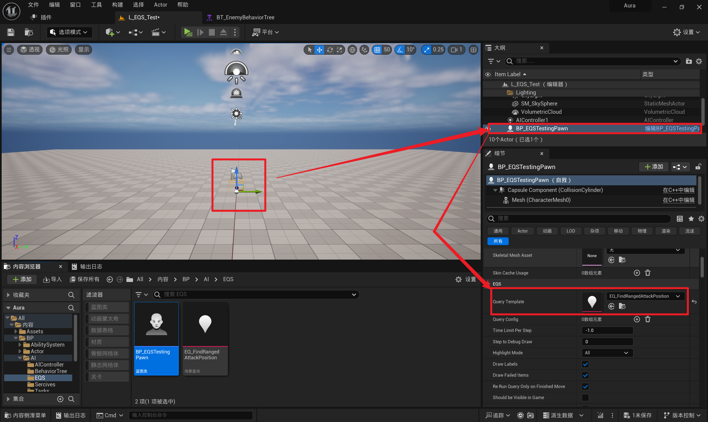
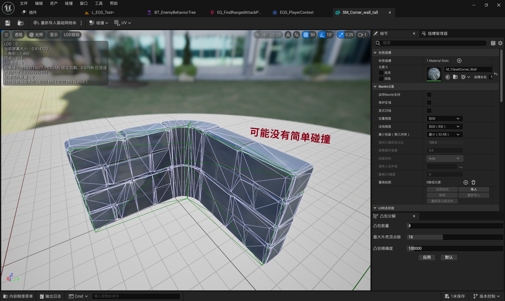

___________________________________________________________________________________________
###### [Go主菜单](../MainMenu.md)
___________________________________________________________________________________________

# GAS 083 使用EQS环境查询 整个流程

___________________________________________________________________________________________

## 处理关键点

**EQS使用步骤**

1. 创建EQS

  2. 创建特殊的Pawn类
       - `EQSTestingPawn`

  3. 创建新的测试地图
  4. 将自建 `EQSTestingPawn` 拖入场景，并配置对应的 `EQS`
  5. 打开EQS并设置节点和需要的 `Test`
  
       - 1.添加节点：点 路径网络 —— `Points: Pathing Grid`
       - 2.右键节点，添加 `Test` -> `Trace` 跟踪
         - 可以创建自建的 `Context` ，也就是目标收集用的
         - 想制作的效果是敌人会找离我们尽可能近的点，然后能攻击到的视野不被遮挡的点 

  6. 在行为树上使用 `EQS`
  
       - 行为树直接调用 `EQS` 节点，并配置要使用的 `EQS` 
       - 在运行查询后，它将设置我们指定的黑板键之一 

___________________________________________________________________________________________

# 目录

- [GAS 083 使用EQS环境查询 整个流程](#gas-083-使用eqs环境查询-整个流程)
  - [处理关键点](#处理关键点)
- [目录](#目录)
    - [在这之前先整理一下文件](#在这之前先整理一下文件)
    - [EQS使用步骤](#eqs使用步骤)
      - [创建EQS](#创建eqs)
      - [第二步：创建EQS需要的特殊Pawn，类型是： EQSTestingPawn](#第二步创建eqs需要的特殊pawn类型是-eqstestingpawn)
      - [第三步：创建新的测试地图](#第三步创建新的测试地图)
      - [第四步：将自建EQSTestingPawn拖入场景，并配置对应的EQS](#第四步将自建eqstestingpawn拖入场景并配置对应的eqs)
      - [第五步：打开EQS并设置节点和需要的Test](#第五步打开eqs并设置节点和需要的test)
    - [5. 我们想制作的效果是敌人会找离我们尽可能近的点，然后能攻击到的视野不被遮挡的点](#5-我们想制作的效果是敌人会找离我们尽可能近的点然后能攻击到的视野不被遮挡的点)
      - [第六步：在行为树上使用EQS](#第六步在行为树上使用eqs)
        - [远程的行为树分支上流程为： EQS设置位置 -\> MoveTo -\> 攻击 -\> Wait](#远程的行为树分支上流程为-eqs设置位置---moveto---攻击---wait)
    - [添加墙 `StaticMesh` 测试](#添加墙-staticmesh-测试)
    - [这里有个bug：在墙附近，不小心点到墙面，崩溃了](#这里有个bug在墙附近不小心点到墙面崩溃了)
    - [测试结果gif](#测试结果gif)

___________________________________________________________________________________________

视频链接

[11. Environment Queries](https://www.bilibili.com/video/BV1JD421E7yC/?p=171&vd_source=9e1e64122d802b4f7ab37bd325a89e6c)

[12. EQS Tests](https://www.bilibili.com/video/BV1JD421E7yC?p=172&vd_source=9e1e64122d802b4f7ab37bd325a89e6c)

[13. Distance Test](https://www.bilibili.com/video/BV1JD421E7yC?p=173&vd_source=9e1e64122d802b4f7ab37bd325a89e6c)

[14. Using EQS Queries in Behavior Tree](https://www.bilibili.com/video/BV1JD421E7yC?p=174&vd_source=9e1e64122d802b4f7ab37bd325a89e6c)

------

___________________________________________________________________________________________

### 在这之前先整理一下文件

> - #### 创建四个文件夹
>
>   - #### `BehaviorTree`
>
>   - #### `Tasks`
>
>   - #### `Sercives` 
>
>   - #### `AlController`
>
> #### 现在有这些文件
>
> #### 整理成这样的结构
>
> !

------

### EQS使用步骤

> 1. ### 创建 `EQS`
>
> 2. ### 创建特殊的Pawn类
>
>    - #### `EQSTestingPawn`
>
>
> 3. ### 创建新的测试地图
>
> 4. ### 将自建 `EQSTestingPawn` 拖入场景，并配置对应的 `EQS`
>
> 5. ### 打开 `EQS` 并设置节点和需要的 `Test`
>
>      - 1.添加节点：点 路径网络 —— `Points: Pathing Grid`
>
>      - 2.右键节点，添加 `Test` -> `Trace` 跟踪
>
>      - 可以创建自建的 `Context`，也就是目标收集用的
>
>      - 想制作的效果是敌人会找离我们尽可能近的点，然后能攻击到的视野不被遮挡的点
>
> 6. ### 在行为树上使用 `EQS`
>
>      - 行为树直接调用EQS节点，并配置要使用的EQS
>
>      - 在运行查询后，它将设置我们指定的黑板键之一

------

### 创建EQS

> - #### 在 `BP/AI/EQS/` 文件夹下
>
> - #### 命名为 `EQ_FindRangedAttackPosition`
>
> 

------

### 第二步：创建EQS需要的特殊Pawn，类型是： EQSTestingPawn

> - ### 存在一种`特殊类型的Pawn`，我们可以 `使用它来测试我们的环境查询`。
>
>   ##### 我们可以通过为我们生成的所有项目绘制一堆调试形状来测试他们正在做什么。
>
> - #### 命名为 `BP_EQSTestingPawn`
>
>
> 

------

### 第三步：创建新的测试地图

> - #### 在 `Content/Maps/` 下创建新的测试地图

------

### 第四步：将自建EQSTestingPawn拖入场景，并配置对应的EQS

> 

------

### 第五步：打开EQS并设置节点和需要的Test

1. #### 添加节点

> 

> 
了解用 

>
> >
> >
> >- #### 这里以添加：点 路径网络 —— `Points: Pathing Grid` 为例
> > - #### 可以围绕一个查询点，生成点网格
> >
> >
> >
> >
> >- #### 查询点指的是
> >
> > - #### 当我们打开上下文，会发现有一个默认的 `EnvQueryContext_Querier`
> >
> > - #### 默认情况下，这通常是 `运行此环境查询的Pawn`。
> >
> >  
> >
> >  
> >
> >  
> >
> >- ## 使用别的节点可以生成圆形的
>
> ------
>
> 

>
> 
>
>   - #### 添加：点 路径网络 —— `Points: Pathing Grid`
>
>   - #### 作用：可以围绕一个查询点，生成点网格

2. #### 右键节点，添加 `Test`

> - #### 添加 Trace 跟踪
>
>   - #### `Test Purpose` 使用：`过滤` —— `Filter Only`
>
>   - #### `Context` 使用默认还是自建的有待确认
>
>
> 

> 
了解用

>
> >- 这里以添加 Trace 跟踪 为例
> >
> > - Test Purpose 这里是对每个点的处理方式
> >
> >   - `得分` —— `Score Only`
> >
> >   - `过滤` —— `Filter Only`
> >
> >   - `得分且过滤` —— `Filter and Score`
> >
> >- 我们选择它，默认情况下它会根据可见性通道进行追踪。
> >
> >- 可以在测试详细信息面板中 `Context` ，我们可以从 `Context` 追踪到每个给定点
> >
> > - 事实上，上下文是一个类，我们可以创建并确定我们要跟踪的内容
> >
> >-  `Context` 默认值为 `EnvQueryContext_Querier` 这意味着我们将 `Trace` ，`可见通道`  `Visibility查询` 。而测试地图并没有什么障碍物
> >
> > - 当我们没有可以跟踪和命中的上下文时，跟踪并没有多大意义，
> >
> >
> >
> >
>
> ------
>
> 

3. 可以创建自建的 `Context`，也就是目标收集用的

创建自建的Context，目标收集用的

>### 因此，我们将创建一个环境查询 `Context` 并准确定义我们想要跟踪 `Trace` 的内容
>
>- 在 `Content/Blueprints/AI/EQS/` 文件夹下
>
>- 创建 `EnvQueryContext_BlueprintBase` 类
>
>- 命名为 `EQS_PlayerContext`
>
>- 需要 **`重写一个函数`** ！！！(这几个挑一个重写就行)
>
> | 重写的函数                | 返回类型           |
> | ------------------------- | ------------------ |
> | `Provide Actors Set`      | 返回一个Actor数组  |
> | `Provide Locations Set`   | 返回一个Vector数组 |
> | `Provide Single Actor`    | 返回一个Actor      |
> | `Provide Single Location` | 返回一个Vector     |
>
>- 这里使用的是 `Provide Actors Set` 返回 `Actors`
>
>- 使用 `GetAllActorsOfClass` 获取 `BP_Aura` 类对象
>
>- Bool Match
>
>- 表示是否要根据查询滤掉结果
> - 假如都为蓝色也就是OK，取消勾选这个Bool Match，所有都变成红色，也就是，不OK了
>
>
>
>挑一个重写就行
>
>
>
>
>
>### 在 `Test` 的 `Trace` 上选择刚才自建的 `Context`
>
>
>
>#### 这个时候拖入玩家 *BP_Aura* 角色，发现所有的点都是蓝色，表示OK，因为时通过 `Visibility` 通道查询，而且没有遮挡物
>
>
>
>#### 此时我们拖入几何体发现，可以看到蓝色的是OK的过滤点，完全是躲着人走的感觉
>
>
>
>#### 躲着玩家和实现可以看到玩家的效果可以通过调节Test的Trace的参数Bool Match实现
>
>在 `Test` 的 `Trace` 的参数 Bool Match 的影响
>
>- `Bool Match == true`，**视线总可以看到玩家**
>
>  
>
>- **`Bool Match == false`**，躲着玩家
>
>### 有个问题：几何体内部也有红色的查询球体
>
>- #### 原因是：这个 StaticMesh 没有简单碰撞，只有复杂碰撞，且没有设置启用复杂碰撞
>
>
>
>#### 原来可能没有简单碰撞，加上碰撞
>
>- #### 加入 `Nav Mesh Bounds Volume` ，这个是路径网格，路径与寻路有笑，而寻路与AI有关，所以路径网格不会给我们任何不可导航的点，所以这是需要注意的事情
>
>
>
>###  接下来我们将创建一个 `test` 获得一个评分最高的地点
>
>
>
>###  添加一个新 `Test` `Distance`
>
>- 允许我们计算从每个点到任一查询的距离
>- 结果颜色
>- `红色 0 分 -> 绿色 1 分`
>- 使用 `归一化值` 表示
>- 当结果 `Scoring Factor == -1` 时结果为反向值
>
>#  红色 0 分 -> 绿色 1 分
>
>- 比如下图所示
>
>  - ### `Scoring Factor == -1`
>
>  - ### `Scoring Factor == 1`
>
>- ### 若 `Context` 选择玩家，这里 玩家越远分数越高
>
>#### 为了测试方便我们这样设置
>
>#### 距离指的是每一个点到Context的距离
>
>
>
>
>
>## 如果评分选择自建的Context，那越接近Aura得分越高
>
>
>
>`Scoring Factor选择相反的值` 则结果相反

------

4. #### 添加一个新`Test Distance`

> - 设置为：
>   - 上图
>   
>     
>

#### 5. 我们想制作的效果是敌人会找离我们尽可能近的点，然后能攻击到的视野不被遮挡的点

> - #### 所以使用
>
> - 刚才忘了调整StaticMesh的碰撞通道，因为这个Trace默认基于Visibility通道检测，StaticMesh需要设为阻挡Visibility
>
>   

------

### 第六步：在行为树上使用EQS

> - #### 行为树直接调用EQS节点，并配置要使用的EQS
>
> - #### 在运行查询后，它将设置我们指定的黑板键之一
>
> 

------

### 远程的行为树分支上流程为： EQS设置位置 -> MoveTo -> 攻击 -> Wait

> - 这里需要mermaid
>
> - ## EQS设置位置 -> MoveTo -> 攻击 -> Wait
>
> 

------

### 添加墙 `StaticMesh` 测试

> 

### 这里有个bug：在墙附近，不小心点到墙面，崩溃了

> - #### 原因是之前获取NaviMesh导航的最后一个路径点使用的时Num()-1 当数组长度为0时，点击就会 `下标越界` 导致崩溃
>
> - #### 解决方法：使用前记得加 if 判断

### 测试结果gif

> #### 敌人会选择最近且视野不被遮挡的攻击位置，并进行攻击。

___________________________________________________________________________________________

[返回最上面](#Go主菜单)

___________________________________________________________________________________________