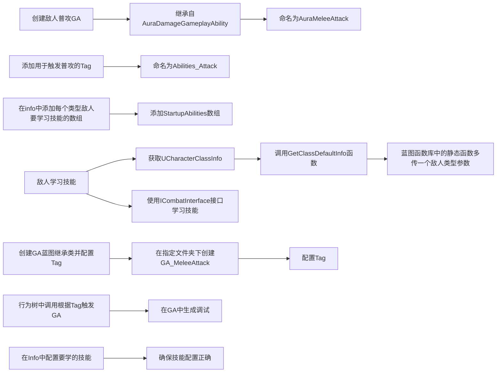
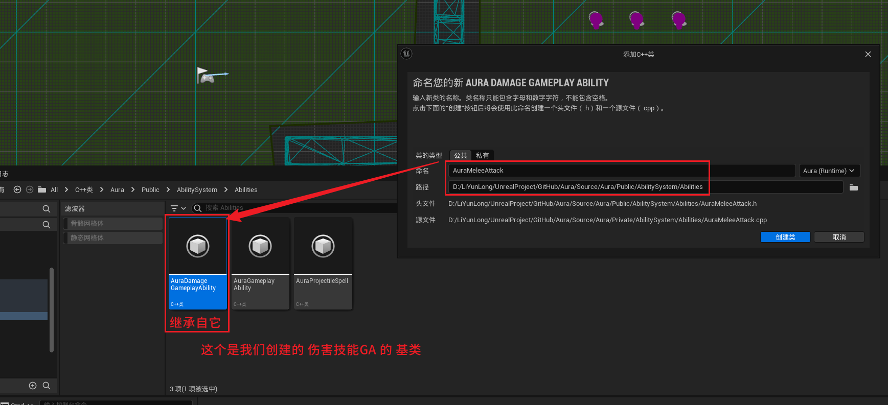
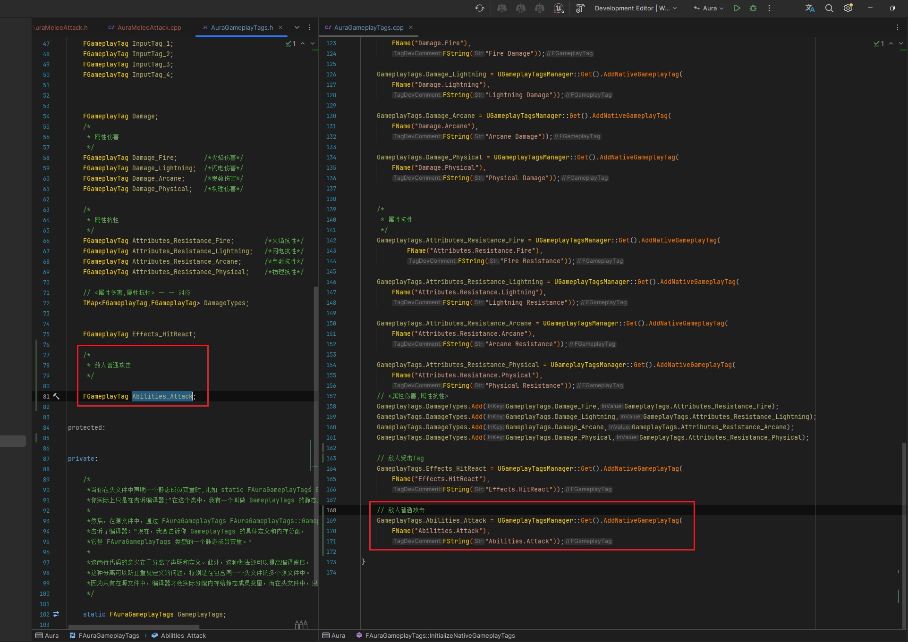
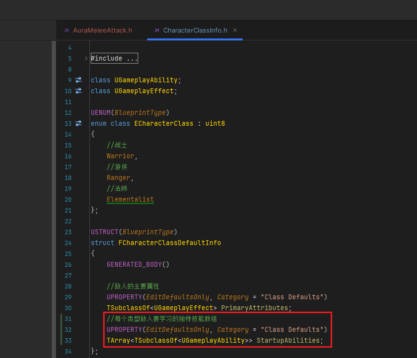
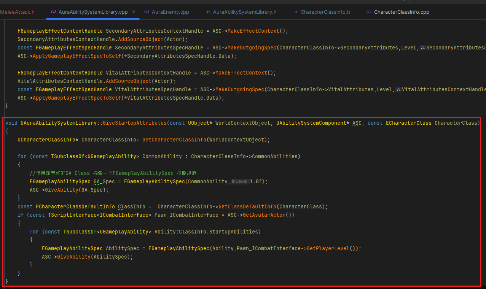
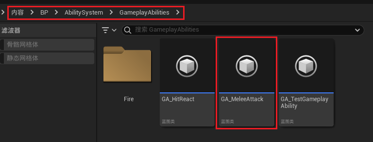
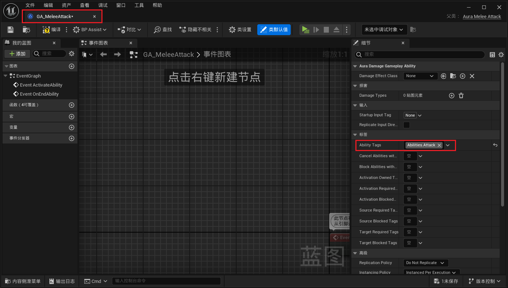
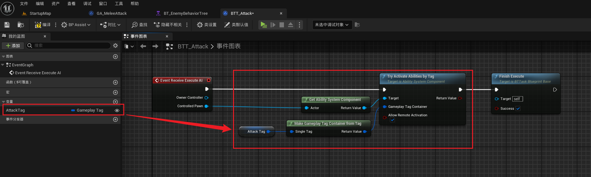
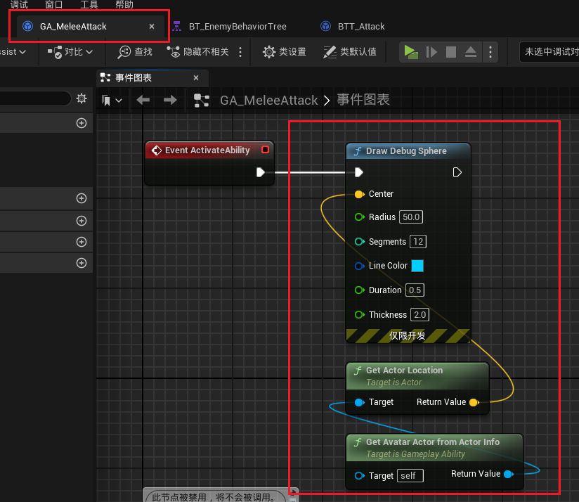
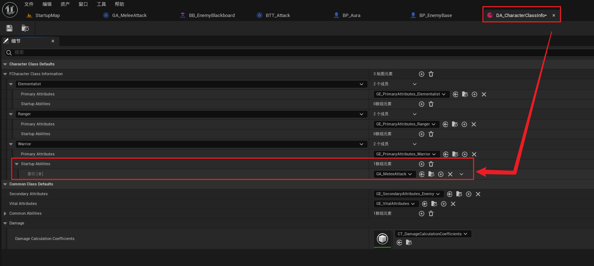

___________________________________________________________________________________________
###### [Go主菜单](../MainMenu.md)
___________________________________________________________________________________________

# GAS 084 敌人行为树触发GA攻击

___________________________________________________________________________________________

## 处理关键点

1. 通过 `GameplayTag` 触发 `GA` 的流程
   - 添加 `GameplayTag`
   - 需要构造一个 `FGameplayAbilitySpec`
   - 通过 `ASC组件` 给予技能 `ASC->GiveAbility(AbilitySpec);`
   - 然后才能通过 `GameplayTag` 触发 `GA` 调用API：`TryActivateAbilitiesByTag`

___________________________________________________________________________________________

# 目录


- [GAS 084 敌人行为树触发GA攻击](#gas-084-敌人行为树触发ga攻击)
  - [处理关键点](#处理关键点)
- [目录](#目录)
    - [Mermaid整体思路梳理](#mermaid整体思路梳理)
    - [创建敌人普攻GA，文件夹下继承自 Damage](#创建敌人普攻ga文件夹下继承自-damage)
    - [添加用于触发普攻的GameplayTag](#添加用于触发普攻的gameplaytag)
    - [在info中添加每个类型敌人要学习技能的数组](#在info中添加每个类型敌人要学习技能的数组)
    - [敌人学习技能时一并学习了](#敌人学习技能时一并学习了)
    - [创建 `GA蓝图继承类`  并配置 `Tag`](#创建-ga蓝图继承类--并配置-tag)
    - [行为树中调用 `根据Tag触发GA` ，GA中生成调试](#行为树中调用-根据tag触发ga-ga中生成调试)
    - [在Info中配置要学的技能！！！不然东西学，放不了](#在info中配置要学的技能不然东西学放不了)


___________________________________________________________________________________________

<details>
<summary>视频链接</summary>

[1. Melee Attack Ability_哔哩哔哩_bilibili](https://www.bilibili.com/video/BV1JD421E7yC?p=175&vd_source=9e1e64122d802b4f7ab37bd325a89e6c)

------

</details>

___________________________________________________________________________________________

### Mermaid整体思路梳理

Mermaid



1. **创建敌人普攻GA：**
   - 在指定文件夹下创建名为 `AuraMeleeAttack` 的GA，继承自 `AuraDamageGameplayAbility`。


2. **添加触发普攻的Tag：**
   - 添加名为 `Abilities_Attack` 的Tag用于触发普攻。

3. **配置敌人学习技能的数组：**
   - 在 `info` 中添加 `StartupAbilities` 数组，定义每个敌人类型要学习的独特技能。

4. **敌人学习技能逻辑：**
   - 调用 `GetClassDefaultInfo` 函数获取 `FCharacterClassDefaultInfo` 结构体，传入敌人类型作为参数。
   - 使用 `ICombatInterface` 接口根据敌人等级学习技能。

5. **创建GA蓝图继承类并配置Tag：**
   - 在指定路径下创建 `GA_MeleeAttack` 并配置相关的Tag。

6. **在行为树中调用GA：**
   - 将原本的行为树逻辑转移至GA中，通过Tag触发。

7. **确保技能配置正确：**
   - 在 `Info` 中配置要学习的技能，确保GA能够正常触发。

___________________________________________________________________________________________

### 创建敌人普攻GA，文件夹下继承自 Damage

> - #### 在 `Aura/Public/AbilitySystem/Abilities/` 文件夹下创建 GA 
>
> - #### 继承自 `AuraDamageGameplayAbility`
>
> - #### 命名为 `AuraMeleeAttack`
>
> 
>

------

### 添加用于触发普攻的GameplayTag

> - #### 命名为 `Abilities_Attack`
>
> 

------

### 在info中添加每个类型敌人要学习技能的数组

> 
>
> ```cpp
> //每个类型敌人要学习的独特技能数组
> UPROPERTY(EditDefaultsOnly, Category = "Class Defaults")
> TArray<TSubclassOf<UGameplayAbility>> StartupAbilities;
> ```

------

### 敌人学习技能时一并学习了

> 1. #### 首先需要获取 `UCharacterClassInfo` 中的 `FCharacterClassDefaultInfo` 结构体，就需要调用自建的 `GetClassDefaultInfo` 函数
>
> 2. #### 而 `GetClassDefaultInfo` 函数需要传入一个敌人类型，所以蓝图函数库中的这个静态函数，需要多传一个参数
>
> 3. #### 需要学习技能，使用敌人的等级，可以使用之前的接口 `ICombatInterface`
>
> 
>
> ```cpp
> void UAuraAbilitySystemLibrary::GiveStartupAttributes(const UObject* WorldContextObject, UAbilitySystemComponent* ASC, const ECharacterClass CharacterClass)
> {
>     UCharacterClassInfo* CharacterClassInfo= GetCharacterClassInfo(WorldContextObject);
> 
>     for (const TSubclassOf<UGameplayAbility> CommonAbility : CharacterClassInfo->CommonAbilities)
>     {
>        //使用配置好的GA Class 构造一个FGameplayAbilitySpec 技能规范
>        FGameplayAbilitySpec GA_Spec = FGameplayAbilitySpec(CommonAbility,1.0f);
>        ASC->GiveAbility(GA_Spec);
>     }
>     const FCharacterClassDefaultInfo ClassInfo =  CharacterClassInfo->GetClassDefaultInfo(CharacterClass);
>     if (const TScriptInterface<ICombatInterface> Pawn_ICombatInterface = ASC->GetAvatarActor())
>     {
>        for (const TSubclassOf<UGameplayAbility> Ability:ClassInfo.StartupAbilities)
>        {
>           FGameplayAbilitySpec AbilitySpec = FGameplayAbilitySpec(Ability,Pawn_ICombatInterface->GetPlayerLevel());
>           ASC->GiveAbility(AbilitySpec);
>        }
>     }
> }
> ```

------

### 创建 `GA蓝图继承类`  并配置 `Tag`

> - #### 在 `Content/BP/GameplayAbilities/AbilitySystem/` 文件夹下
>
> - #### 命名为 ***GA_MeleeAttack***
>
> - #### 配置 `Tag`
>
> 

------

### 行为树中调用 `根据Tag触发GA` ，GA中生成调试

> 
>
> ## 其实就相当于把原来行为树中的逻辑挪到ga中触发

### 在Info中配置要学的技能！！！不然东西学，放不了

> 


___________________________________________________________________________________________

[返回最上面](#Go主菜单)

___________________________________________________________________________________________