___________________________________________________________________________________________
###### [Go主菜单](../MainMenu.md)
___________________________________________________________________________________________

# GAS 085敌人攻击时转向玩家使用 MotionWarping ；使用接口Get和Set获Player位置

___________________________________________________________________________________________

## 处理关键点

1. 使用 Motion Warping 的基本流程：

   - //1.添加 MotionWarping 组件

     - 在敌人或角色的 Blueprint 或 C++ 类中，添加 MotionWarpingComponent。

     - 这个组件负责在播放蒙太奇时进行动态调整，以实现精确的定位和对齐。

   - //2.实现 AddOrUpdateWarpTargetFromLocation 函数

   - //3.在动画蓝图中添加 MotionWarping 动画通知

     - 在需要进行运动扭曲的动画中添加 MotionWarping 通知。

     - 该通知通常只对 root 动画生效，因此要确保动画符合要求。

     - 在 Animation Notify 中配置 Warp Target Name，比如设置为 FacingTarget。

   - //4.在行为树或代码中调用
     - 在行为树或相关逻辑中，确保目标位置的更新。


___________________________________________________________________________________________

# 目录


- [GAS 085敌人攻击时转向玩家使用 MotionWarping ；使用接口Get和Set获Player位置](#gas-085敌人攻击时转向玩家使用-motionwarping-使用接口get和set获player位置)
  - [处理关键点](#处理关键点)
- [目录](#目录)
    - [Mermaid整体思路梳理](#mermaid整体思路梳理)
    - [关键点概述：](#关键点概述)
    - [这里有一个问题就是之前一直没有为角色动画蓝图模板设置Speed](#这里有一个问题就是之前一直没有为角色动画蓝图模板设置speed)
    - [小测试](#小测试)
    - [此时效果gif](#此时效果gif)
    - [我们发现哥布林攻击的时候长矛不指着player,需要使用MotionWarping](#我们发现哥布林攻击的时候长矛不指着player需要使用motionwarping)
    - [之前是在这里使用的](#之前是在这里使用的)
    - [在敌人中添加 `MotionWarping组件` ，实现 `UpdateFacingTarget` 函数，参考之前。](#在敌人中添加-motionwarping组件-实现-updatefacingtarget-函数参考之前)
    - [敌人动画蓝图中添加 MotionWarping 动画通知。并设置。只对root动画生效！！别忘了](#敌人动画蓝图中添加-motionwarping-动画通知并设置只对root动画生效别忘了)
  - [下面是第二节](#下面是第二节)
    - [现在我们需要在蓝图中获取 `Player的位置`](#现在我们需要在蓝图中获取-player的位置)
    - [在敌人身上创建指针保存目标用](#在敌人身上创建指针保存目标用)
    - [我们之前创建了一个敌人的接口，用于勾边用](#我们之前创建了一个敌人的接口用于勾边用)
    - [在这个接口中创建Get和Set 敌人身上目标的函数，蓝图中重写和蓝图可叫](#在这个接口中创建get和set-敌人身上目标的函数蓝图中重写和蓝图可叫)
    - [敌人身上实现这两个函数，这样我们可以在c++和蓝图中都可以写逻辑，且不会耦合](#敌人身上实现这两个函数这样我们可以在c和蓝图中都可以写逻辑且不会耦合)
    - [行为树自己写的近战远程攻击节点中，添加变量，以便在节点中获取黑板值，并在行为树中配置](#行为树自己写的近战远程攻击节点中添加变量以便在节点中获取黑板值并在行为树中配置)
    - [节点中使用黑板的值，调用接口，中的函数，设置敌人的目标](#节点中使用黑板的值调用接口中的函数设置敌人的目标)
    - [GA中播放蒙太奇前，检查接口实现，调用接口函数，和UpdateFacingTarget](#ga中播放蒙太奇前检查接口实现调用接口函数和updatefacingtarget)
    - [去掉行为树中的 `Rotate to face BB entry`节点](#去掉行为树中的-rotate-to-face-bb-entry节点)
    - [此时结果](#此时结果)
    - [关于敌人获取玩家位置，可以用观察者模式，敌人身上的bool一旦打开就可以获取位置更新，一旦关闭就不更新，这里只做介绍，具体自己实现](#关于敌人获取玩家位置可以用观察者模式敌人身上的bool一旦打开就可以获取位置更新一旦关闭就不更新这里只做介绍具体自己实现)


___________________________________________________________________________________________

<details>
<summary>视频链接</summary>
[2. Attack Montage_哔哩哔哩_bilibili](https://www.bilibili.com/video/BV1JD421E7yC?p=176&vd_source=9e1e64122d802b4f7ab37bd325a89e6c)

[3. Combat Target_哔哩哔哩_bilibili](https://www.bilibili.com/video/BV1JD421E7yC?p=177&vd_source=9e1e64122d802b4f7ab37bd325a89e6c)

------

</details>

___________________________________________________________________________________________

### Mermaid整体思路梳理

Mermaid

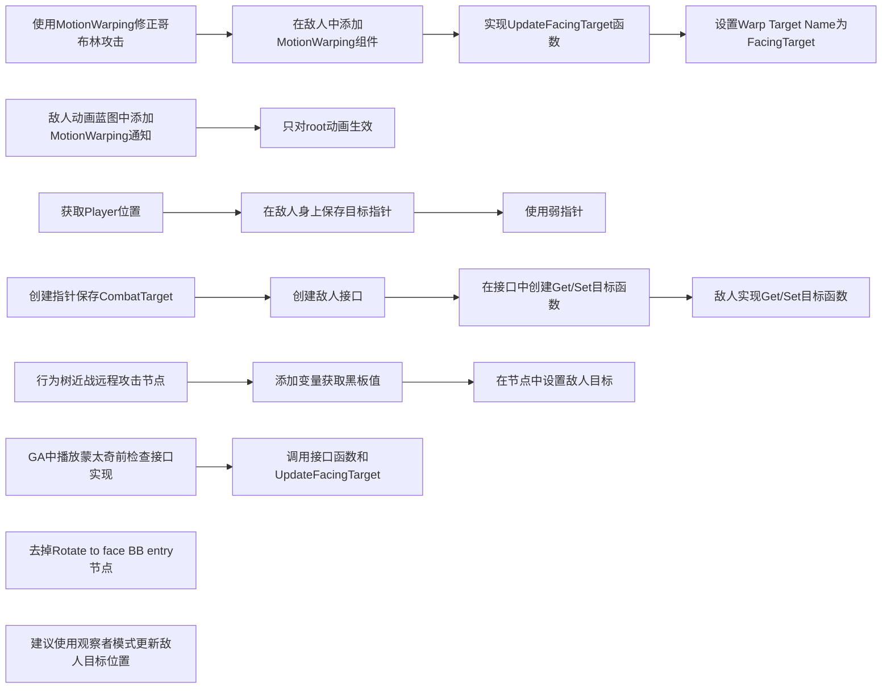

### 关键点概述：

1. **修正哥布林攻击方向：**
   - 使用 `MotionWarping` 修正哥布林攻击时长矛不指向玩家的问题，通过 `UpdateFacingTarget` 函数实现，设置 `Warp Target Name` 为 `FacingTarget`。
   - 在敌人动画蓝图中添加 `MotionWarping` 动画通知，仅对root动画生效。
2. **获取Player位置并保存目标指针：**
   - 在敌人中创建弱指针 `CombatTarget` 用于保存目标，并在敌人接口中创建 `Get/Set` 函数以便获取和设置目标。
3. **行为树配置：**
   - 在近战远程攻击节点中添加变量，以便在节点中获取黑板值并设置敌人目标。
   - 在GA中播放蒙太奇前，检查接口实现并调用接口函数和 `UpdateFacingTarget`。
4. **去除不必要节点与观察者模式建议：**
   - 去掉行为树中的 `Rotate to face BB entry` 节点。
   - 建议使用观察者模式更新敌人目标位置，通过控制一个 `bool` 开关来管理位置更新。

___________________________________________________________________________________________

### 这里有一个问题就是之前一直没有为角色动画蓝图模板设置Speed

> 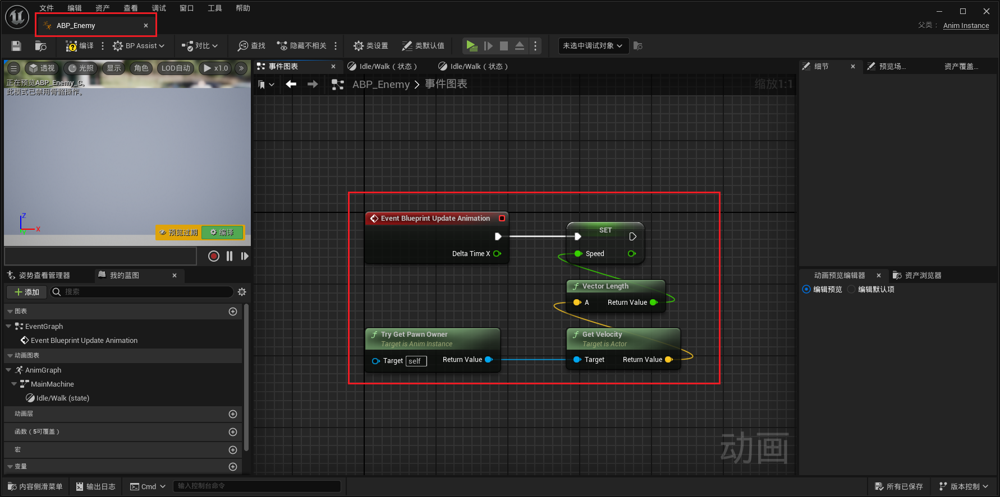

------

### 小测试

>- 为近战角色创建蒙太奇
> - 要注意可复用
>
>
>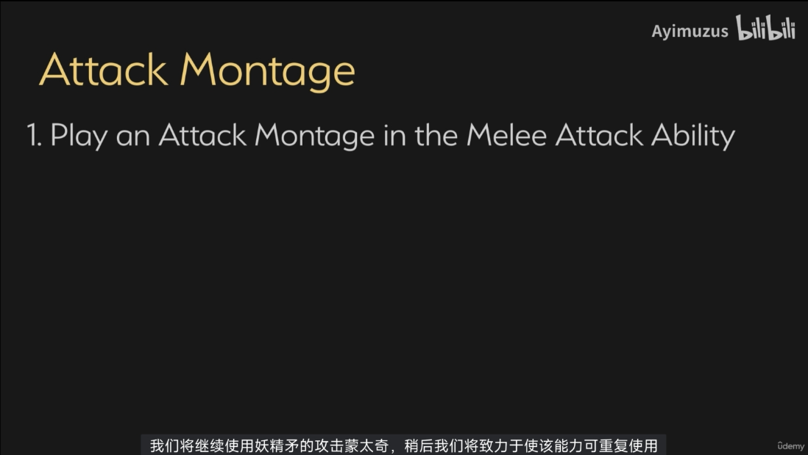

------


<details>
<summary>自己尝试一下</summary>

>  - #### 上节我们创建了GA
>
>  - #### 创建蒙太奇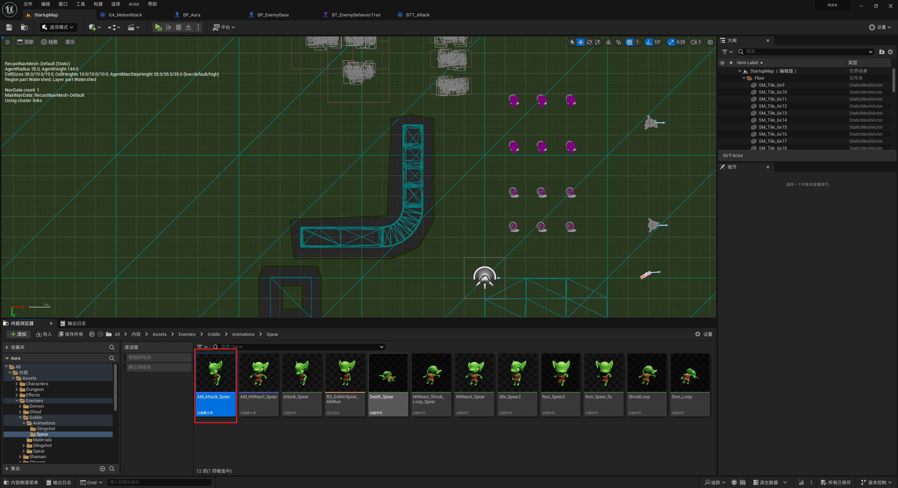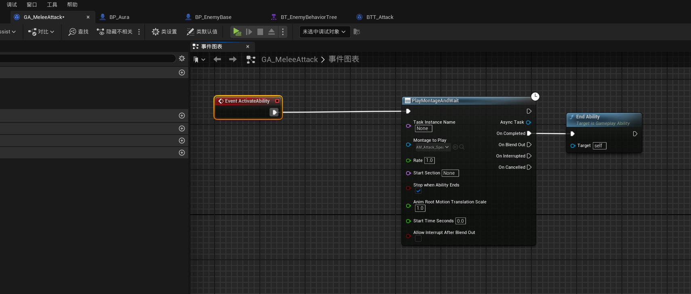

------

</details>

### 此时效果gif

> 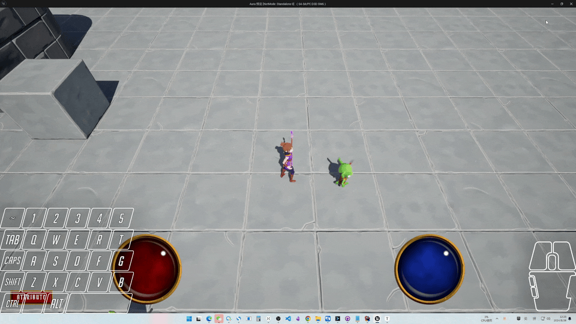

------

### 我们发现哥布林攻击的时候长矛不指着player,需要使用MotionWarping

> #### 我这里指着是因为之前加了私货
>
> #### 

------

### 之前是在这里使用的

> 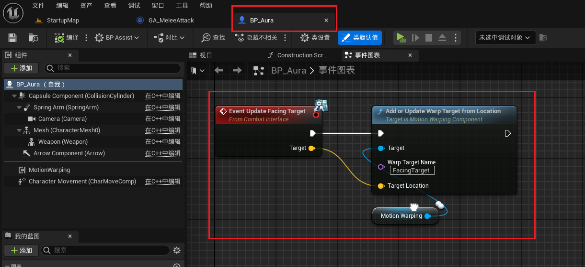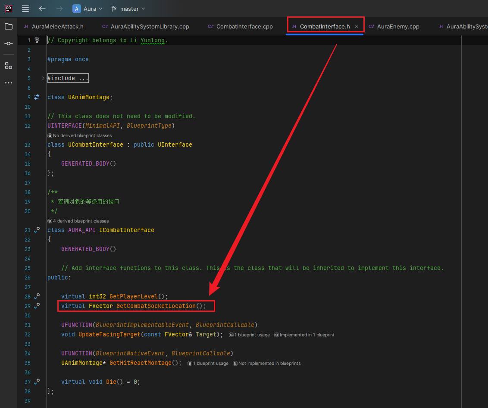

------

### 在敌人中添加 `MotionWarping组件` ，实现 `UpdateFacingTarget` 函数，参考之前。

> - #### `Warp Target Name` 是 `FacingTarget`
>
> 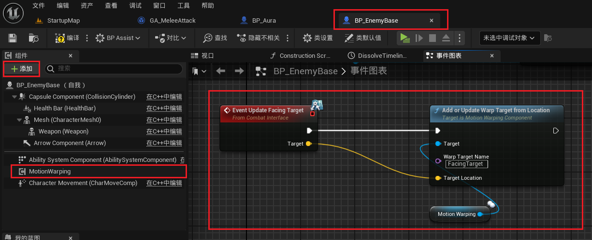

------

### 敌人动画蓝图中添加 MotionWarping 动画通知。并设置。只对root动画生效！！别忘了

> 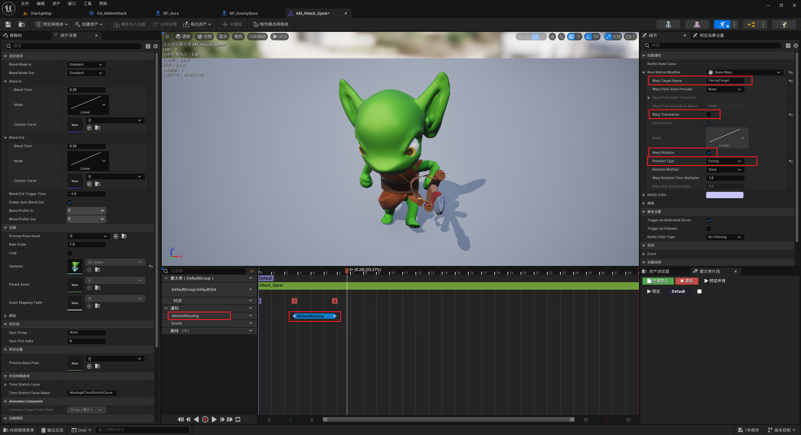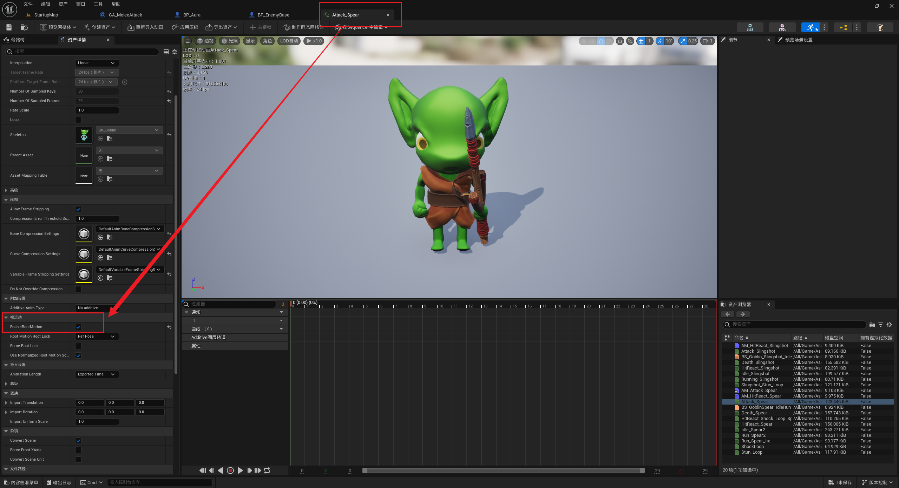

------

## 下面是第二节

------

### 现在我们需要在蓝图中获取 `Player的位置`

> - #### 所以需要也给敌人身上保存一个目标的指针
>
> - #### 我觉得应该是弱指针

------

### 在敌人身上创建指针保存目标用

> 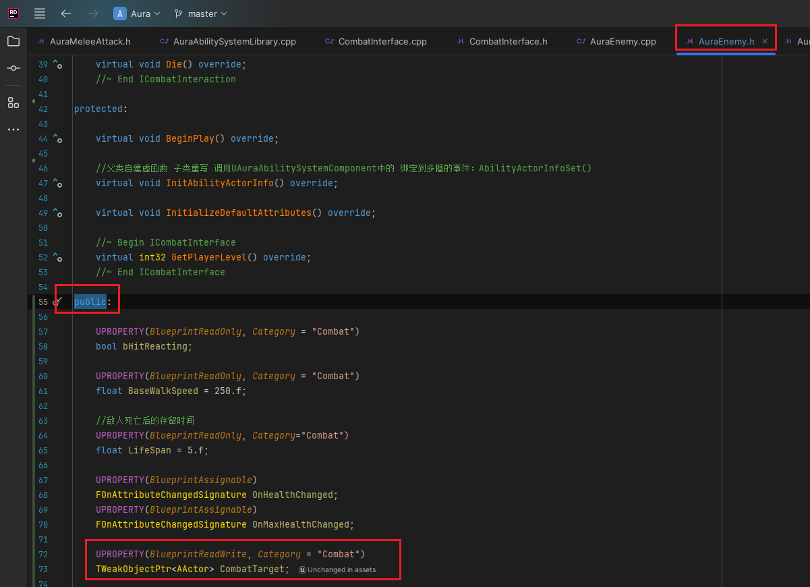
>
> ```cpp
> public:
>     UPROPERTY(BlueprintReadWrite, Category = "Combat")
>     TWeakObjectPtr<AActor> CombatTarget;
> ```

------

### 我们之前创建了一个敌人的接口，用于勾边用

------

### 在这个接口中创建Get和Set 敌人身上目标的函数，蓝图中重写和蓝图可叫

> 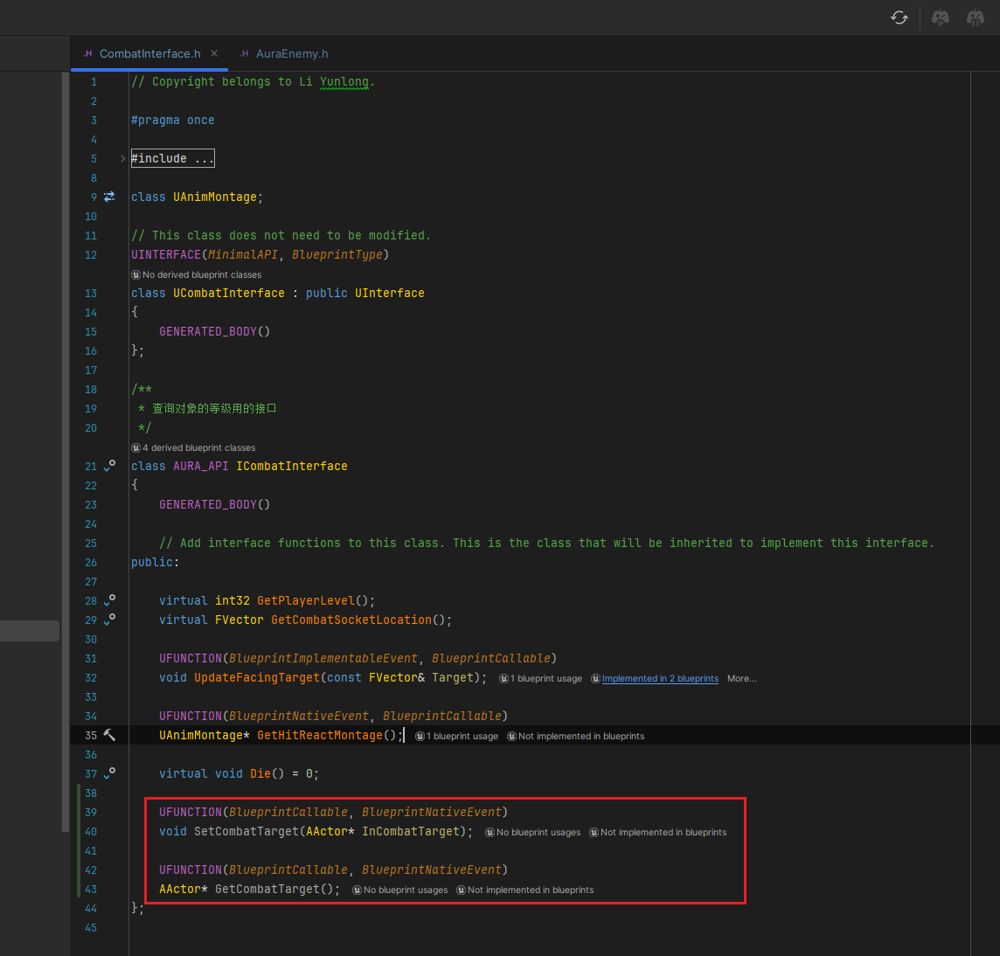
>
> ```cpp
> public:
> 
>     UFUNCTION(BlueprintCallable, BlueprintNativeEvent)
>     void SetCombatTarget(AActor* InCombatTarget);
> 
>     UFUNCTION(BlueprintCallable, BlueprintNativeEvent)
>     AActor* GetCombatTarget();
> ```

------

### 敌人身上实现这两个函数，这样我们可以在c++和蓝图中都可以写逻辑，且不会耦合

> 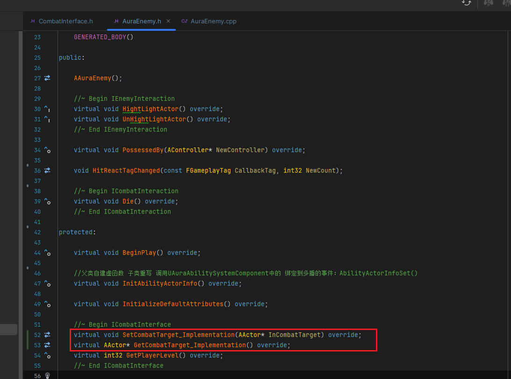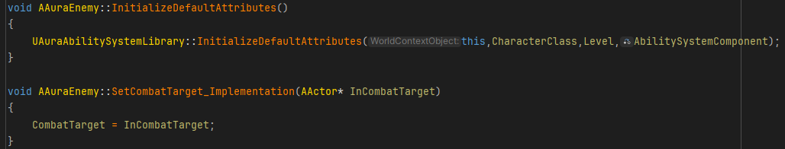
>
> ```cpp
> protected:
> 
>     //~ Begin ICombatInterface
>     virtual void SetCombatTarget_Implementation(AActor* InCombatTarget) override;
>     virtual AActor* GetCombatTarget_Implementation() override;
>     //~ End ICombatInterface
> ```

------

### 行为树自己写的近战远程攻击节点中，添加变量，以便在节点中获取黑板值，并在行为树中配置

> 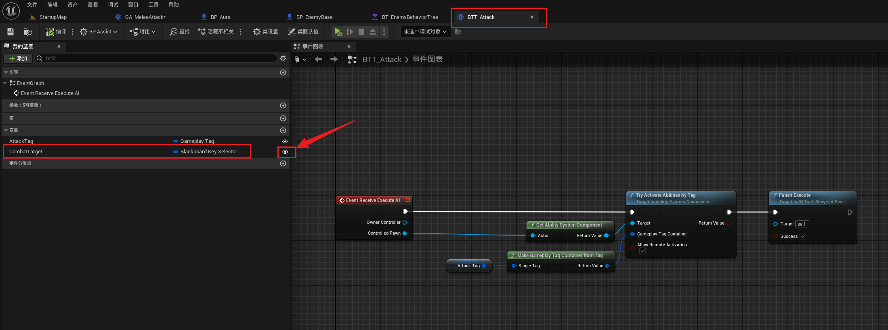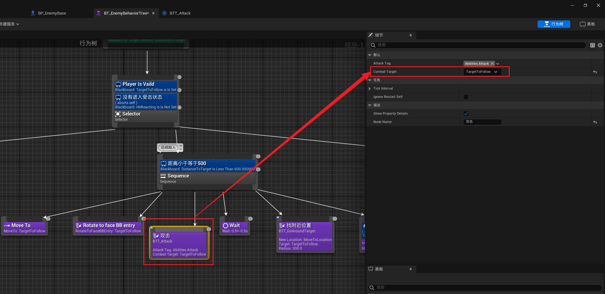

------

### 节点中使用黑板的值，调用接口，中的函数，设置敌人的目标

> 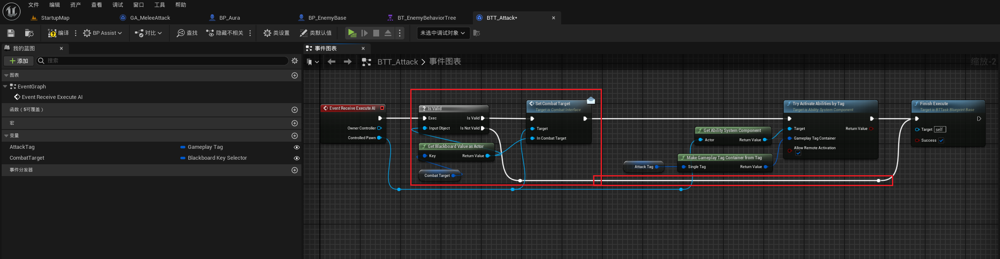

------

### GA中播放蒙太奇前，检查接口实现，调用接口函数，和UpdateFacingTarget

> 

------

### 去掉行为树中的 `Rotate to face BB entry`节点

------

### 此时结果

> 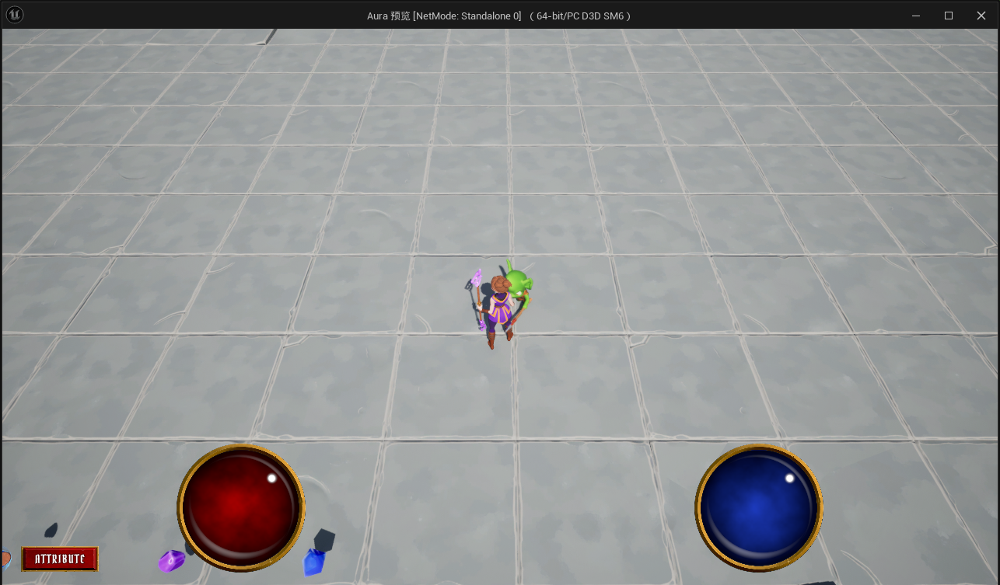

------

### 关于敌人获取玩家位置，可以用观察者模式，敌人身上的bool一旦打开就可以获取位置更新，一旦关闭就不更新，这里只做介绍，具体自己实现


___________________________________________________________________________________________

[返回最上面](#Go主菜单)

___________________________________________________________________________________________