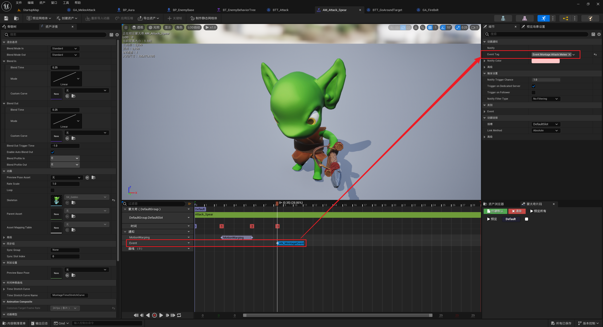

___________________________________________________________________________________________
###### [Go主菜单](../MainMenu.md)
___________________________________________________________________________________________

# GAS 086 蒙太奇触发Tag事件；敌人获取Weapon插槽位置；若接口函数为蓝图实现，需要使用反射生成的静态函数！

___________________________________________________________________________________________

## 处理关键点

1. **创建与配置**：创建 `GameplayTag` 并在蒙太奇中配置到指定阶段。

2. **监听事件**：在 `GA` 中使用 `WaitGameplayEvent` 监听 `GameplayTag`。

3. **接口调用修改**：C++ 调用蓝图接口时，需通过静态函数方式，不再使用 `Cast`。

___________________________________________________________________________________________

# 目录


- [GAS 086 蒙太奇触发Tag事件；敌人获取Weapon插槽位置；若接口函数为蓝图实现，需要使用反射生成的静态函数！](#gas-086-蒙太奇触发tag事件敌人获取weapon插槽位置若接口函数为蓝图实现需要使用反射生成的静态函数)
  - [处理关键点](#处理关键点)
- [目录](#目录)
    - [Mermaid整体思路梳理](#mermaid整体思路梳理)
    - [之前是这样实现的](#之前是这样实现的)
    - [之前使用接口获取武器插槽位置，如果蓝图也想调用那就需要，修改加上蓝图调用宏](#之前使用接口获取武器插槽位置如果蓝图也想调用那就需要修改加上蓝图调用宏)
    - [测试GIF](#测试gif)
    - [发现位置不对，检查一下，发现敌人没有设置插槽名字](#发现位置不对检查一下发现敌人没有设置插槽名字)
    - [测试gif](#测试gif-1)
    - [此时玩家攻击敌人，触发断点](#此时玩家攻击敌人触发断点)


___________________________________________________________________________________________

<details>
<summary>视频链接</summary>

[4. Melee Attack Gameplay Event_哔哩哔哩_bilibili](https://www.bilibili.com/video/BV1JD421E7yC?p=178&vd_source=9e1e64122d802b4f7ab37bd325a89e6c)

------

</details>

___________________________________________________________________________________________

### Mermaid整体思路梳理

Mermaid


___________________________________________________________________________________________

小测试：需要给敌人的蒙太奇播放到一定阶段发送触发 `GameplayEventByTag` 事件，并在 `Weapon插槽` 上 `DrawDebugSphere` ，如果不记得了的话可以参考之前做的Aura的火球

> 

------

### 之前是这样实现的

> 

------

<details>
<summary>自己尝试一下</summary>


>- ### 创建触发 `Event` 的 `GameplayTag`
>
>  `Event.Montage.Attack.Melee`
>
>  ### 
>
>- ### 蒙太奇中触发，配置
>
>- ### GA中调用WaitGameplayEvent

------

</details>

### 之前使用接口获取武器插槽位置，如果蓝图也想调用那就需要，修改加上蓝图调用宏

> 
> ### **所有用到的地方都需要修改**
>
> ------
>
> ### 蓝图中蓝图中收到 `Event` 的 `GameplayTag` 后，获取位置生成Debug

------

### 测试GIF

> #### 插槽位置好像有一点不对，在差不多手的位置，不是武器插槽的位置

------

### 发现位置不对，检查一下，发现敌人没有设置插槽名字

> 

------

### 测试gif

> 

------

### 此时玩家攻击敌人，触发断点

> 
>
> ### 注意上一行的备注，说是如果蓝图实现且蓝图可叫接口函数，那么C++就不能直接调用该函数，而是要改成调用该函数的静态函数！！！
>
> ### 这样修改，也不用Cast了
>
> ```cpp
> //FVector SocketLocation = CombatInterfaceActor->GetCombatSocketLocation();不用这个了
> FVector SocketLocation = ICombatInterface::Execute_GetCombatSocketLocation(GetAvatarActorFromActorInfo());/*改成这样调用接口函数*/
> ```
>
> ### 


___________________________________________________________________________________________

[返回最上面](#Go主菜单)

___________________________________________________________________________________________