___________________________________________________________________________________________
###### [Go主菜单](../MainMenu.md)
___________________________________________________________________________________________

# GAS 087在敌人攻击时，将目标地点半径内的Actors加入数组

___________________________________________________________________________________________

## 处理关键点

1. 参考 `ApplyRadialDamageWithFalloff` 实现 `Overlap` 检测逻辑。


___________________________________________________________________________________________

# 目录


- [GAS 087在敌人攻击时，将目标地点半径内的Actors加入数组](#gas-087在敌人攻击时将目标地点半径内的actors加入数组)
  - [处理关键点](#处理关键点)
- [目录](#目录)
    - [Mermaid整体思路梳理](#mermaid整体思路梳理)
    - [下面我们需要在敌人攻击时，以目标地点为半径，获取Actors数组](#下面我们需要在敌人攻击时以目标地点为半径获取actors数组)
    - [打算写到蓝图函数库里，方便调用获取](#打算写到蓝图函数库里方便调用获取)
  - [先处理死亡](#先处理死亡)
    - [先在接口中创建查询死亡和返回自身的函数](#先在接口中创建查询死亡和返回自身的函数)
    - [角色标记没有死亡的变量，创建一个bool](#角色标记没有死亡的变量创建一个bool)
    - [角色基类中重写 ，接口函数打好备注](#角色基类中重写-接口函数打好备注)
    - [死亡变量无需复制](#死亡变量无需复制)
    - [蓝图函数库中创建要用的函数](#蓝图函数库中创建要用的函数)
    - [重叠检测步骤](#重叠检测步骤)
    - [蓝图中调用](#蓝图中调用)
    - [此时站在火堆旁边，被敌人攻击，崩溃了](#此时站在火堆旁边被敌人攻击崩溃了)
    - [此时可以站在敌人旁边进行测试gif](#此时可以站在敌人旁边进行测试gif)


___________________________________________________________________________________________

<details>
<summary>视频链接</summary>

[5. Get Live Players Within Radius_哔哩哔哩_bilibili](https://www.bilibili.com/video/BV1JD421E7yC?p=179&vd_source=9e1e64122d802b4f7ab37bd325a89e6c)

------

</details>

___________________________________________________________________________________________

### Mermaid整体思路梳理

Mermaid

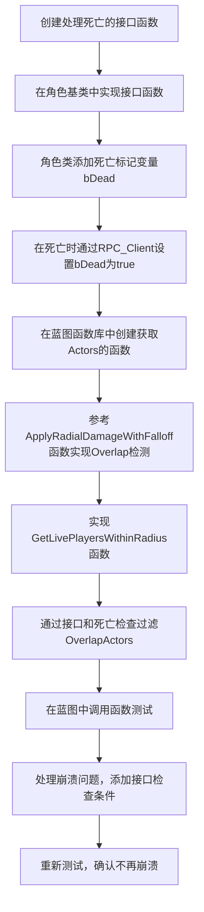

1. **接口与死亡处理**：在角色基类中实现接口函数，添加死亡标记变量 `bDead`，并在死亡时通过 `RPC_Client` 设置该变量。
2. **Overlap检测**：在蓝图函数库中创建获取 `Actors` 的函数，参考 `ApplyRadialDamageWithFalloff` 实现 `Overlap` 检测逻辑。
3. **函数实现**：实现 `GetLivePlayersWithinRadius` 函数，通过接口和死亡检查过滤 `OverlapActors`。
4. **崩溃修复**：处理函数调用中的崩溃问题，添加接口检查条件以避免非法调用。
5. **测试验证**：在蓝图中调用该函数进行测试，确认崩溃问题得到解决。

___________________________________________________________________________________________

### 下面我们需要在敌人攻击时，以目标地点为半径，获取Actors数组

> 这个比较常用，比如可以批量的应用某种GE，这个涉及到查询相关的知识
>
> - 需要忽略一部分 Actor，比如忽略自身；或者敌人使用时，忽略同一阵营时；或者忽略已经死了的 Pawn

### 打算写到蓝图函数库里，方便调用获取

## 先处理死亡

### 先在接口中创建查询死亡和返回自身的函数

> 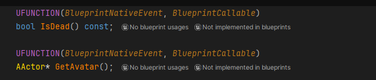
>
> ```cpp
> UFUNCTION(BlueprintNativeEvent, BlueprintCallable)
> bool IsDead() const;
> 	
> UFUNCTION(BlueprintNativeEvent, BlueprintCallable)
> AActor* GetAvatar();
> ```
>
> 下面这个不用const的原因是，角色不是AActor，会发生隐式类型转换

------

### 角色标记没有死亡的变量，创建一个bool

> 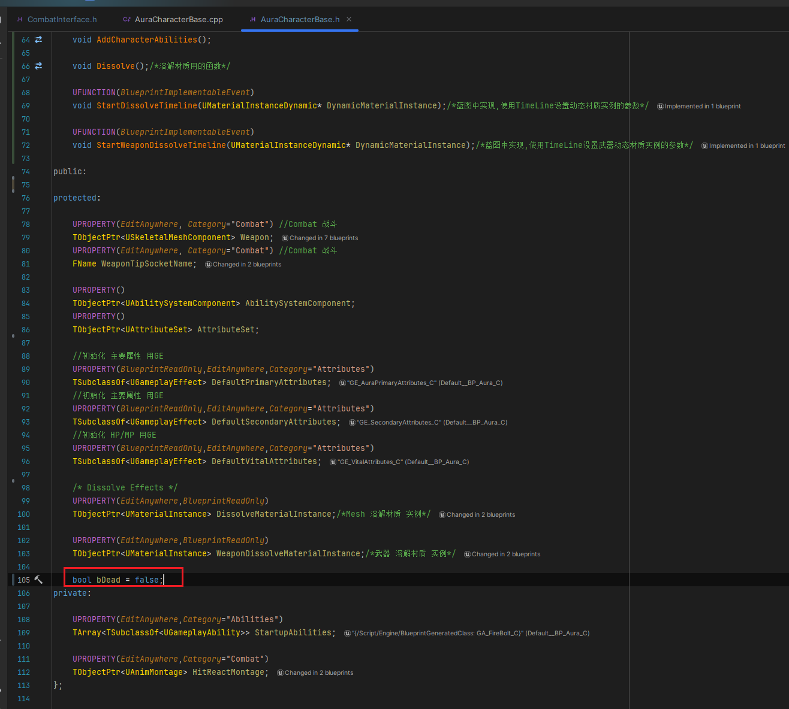
>
> ```cpp
> protected:
>     
>     bool bDead = false;
> ```

------

### 角色基类中重写 ，接口函数打好备注

> 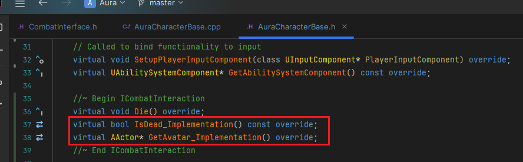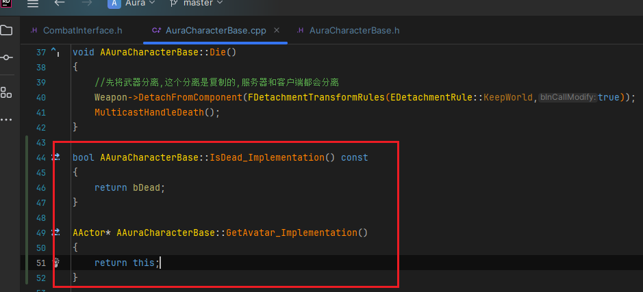
>
> ```cpp
> public:
>     
>     //~ Begin ICombatInteraction
>     virtual bool IsDead_Implementation() const override;
>     virtual AActor* GetAvatar_Implementation() override;
>     //~ End ICombatInteraction
> ```
>
> ```cpp
> bool AAuraCharacterBase::IsDead_Implementation() const
> {
>     return bDead;
> }
> 
> AActor* AAuraCharacterBase::GetAvatar_Implementation()
> {
>     return this;
> }
> ```

------

### 死亡变量无需复制

> #### 死亡时调用 `RPC_Client`
>
> #### `RPC_Client` 调用时设置 `bDead = true;`
>
> 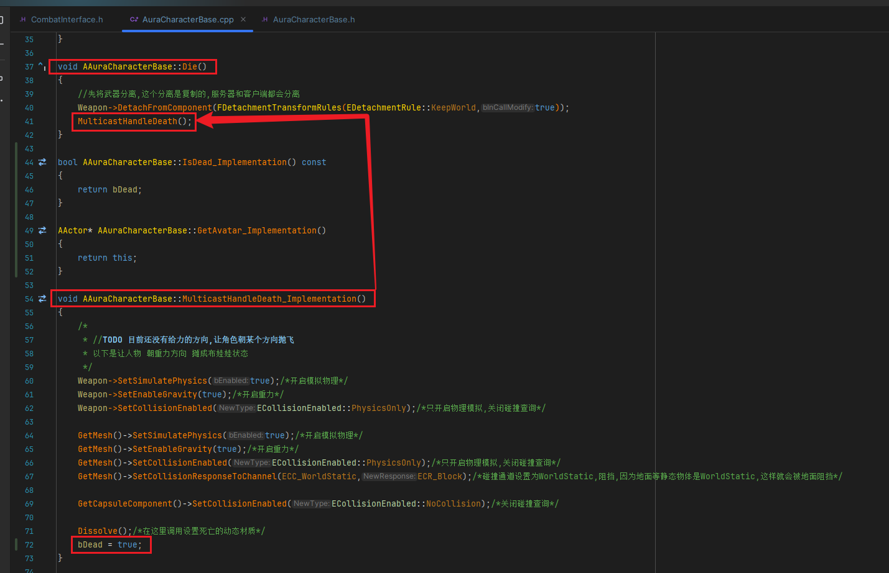

------

### 蓝图函数库中创建要用的函数

> #### 示意图
>
> 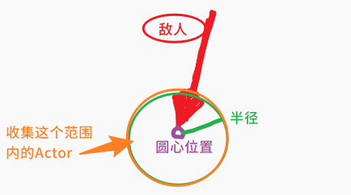
>
> ### 需要这样几个参数：
>
> - #### 一个世界上下文
>
> - #### 一个外部传入在函数内部修改之后返回的数组
>
> - #### 一个外部传参的数组
>
> - #### 一个半径
>
> - #### 一个中心
>
> #### 命名为 `GetLivePlayersWithinRadius`
>
> ```cpp
> UFUNCTION(BlueprintCallable, Category = "AuraAbilitySystemLibrary|GameplayMechanics")
> static void GetLivePlayersWithinRadius(const UObject* WorldContextObject,TArray<AActor*> & OverlapActors, const TArray<AActor*> & IgnoreActors,float Radius,FVector PointCenter);
> ```

------

<details>
<summary>实现需要参考引擎的函数 ApplyRadialDamageWithFalloff </summary>


>#### 需要参考的函数： `ApplyRadialDamageWithFalloff`
>
>函数源码：
>
>```cpp
>bool UGameplayStatics::ApplyRadialDamageWithFalloff(const UObject* WorldContextObject, float BaseDamage, float MinimumDamage, const FVector& Origin, float DamageInnerRadius, float DamageOuterRadius, float DamageFalloff, TSubclassOf<class UDamageType> DamageTypeClass, const TArray<AActor*>& IgnoreActors, AActor* DamageCauser, AController* InstigatedByController, ECollisionChannel DamagePreventionChannel)
>{
>    FCollisionQueryParams SphereParams(SCENE_QUERY_STAT(ApplyRadialDamage),  false, DamageCauser);
>
>    SphereParams.AddIgnoredActors(IgnoreActors);
>
>    // query scene to see what we hit
>    TArray<FOverlapResult> Overlaps;
>    if (UWorld* World = GEngine->GetWorldFromContextObject(WorldContextObject, EGetWorldErrorMode::LogAndReturnNull))
>    {
>       World->OverlapMultiByObjectType(Overlaps, Origin, FQuat::Identity, FCollisionObjectQueryParams(FCollisionObjectQueryParams::InitType::AllDynamicObjects), FCollisionShape::MakeSphere(DamageOuterRadius), SphereParams);
>    }
>
>    // collate into per-actor list of hit components
>    TMap<AActor*, TArray<FHitResult> > OverlapComponentMap;
>    for (const FOverlapResult& Overlap : Overlaps)
>    {
>       AActor* const OverlapActor = Overlap.OverlapObjectHandle.FetchActor();
>
>       if (OverlapActor &&
>          OverlapActor->CanBeDamaged() &&
>          OverlapActor != DamageCauser &&
>          Overlap.Component.IsValid())
>       {
>          FHitResult Hit;
>          if (ComponentIsDamageableFrom(Overlap.Component.Get(), Origin, DamageCauser, IgnoreActors, DamagePreventionChannel, Hit))
>          {
>             TArray<FHitResult>& HitList = OverlapComponentMap.FindOrAdd(OverlapActor);
>             HitList.Add(Hit);
>          }
>       }
>    }
>
>    bool bAppliedDamage = false;
>
>    if (OverlapComponentMap.Num() > 0)
>    {
>       // make sure we have a good damage type
>       TSubclassOf<UDamageType> const ValidDamageTypeClass = DamageTypeClass ? DamageTypeClass : TSubclassOf<UDamageType>(UDamageType::StaticClass());
>
>       FRadialDamageEvent DmgEvent;
>       DmgEvent.DamageTypeClass = ValidDamageTypeClass;
>       DmgEvent.Origin = Origin;
>       DmgEvent.Params = FRadialDamageParams(BaseDamage, MinimumDamage, DamageInnerRadius, DamageOuterRadius, DamageFalloff);
>
>       // call damage function on each affected actors
>       for (TMap<AActor*, TArray<FHitResult> >::TIterator It(OverlapComponentMap); It; ++It)
>       {
>          AActor* const Victim = It.Key();
>          TArray<FHitResult> const& ComponentHits = It.Value();
>          DmgEvent.ComponentHits = ComponentHits;
>
>          Victim->TakeDamage(BaseDamage, DmgEvent, InstigatedByController, DamageCauser);
>
>          bAppliedDamage = true;
>       }
>    }
>
>    return bAppliedDamage;
>}
>```
>
>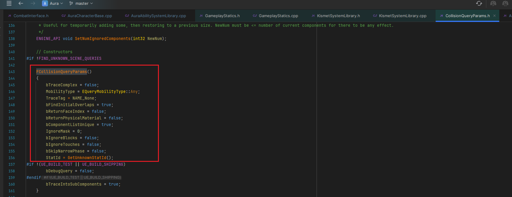
>
>参数解释
>
>- 结构体：FCollisionQueryParams
>
> - 结构体添加忽略的Actors数组
>
>- 创建了一个TArray<FOverlapResult> Overlaps 保存重叠结果
>
>- 获取世界上下文，如果没有会报错
>
>  ```cpp
>  if (UWorld* World = GEngine->GetWorldFromContextObject(WorldContextObject, EGetWorldErrorMode::LogAndReturnNull))
>  ```
>
>- 然后使用 `UWorld` 调用了 `World->OverlapMultiByObjectType`
>
>  ```cpp
>  World->OverlapMultiByObjectType(Overlaps, Origin, FQuat::Identity, FCollisionObjectQueryParams(FCollisionObjectQueryParams::InitType::AllDynamicObjects), FCollisionShape::MakeSphere(DamageOuterRadius), SphereParams);
>  ```
>
>- `Origin` 球形的原点
>
>- 球体旋转
>
>- 碰撞对象查询：动态
>
>  ```CPP
>  FCollisionObjectQueryParams(FCollisionObjectQueryParams::InitType::AllDynamicObjects)
>  ```
>
>- 创建球体碰撞，需要传入半径
>
>  ```CPP
>  FCollisionShape::MakeSphere(DamageOuterRadius)
>  ```
>
>- 最后 遍历 重叠的结果数组，通过 `Overlap.GetActor()` 拿到碰撞检测到的 `Actor`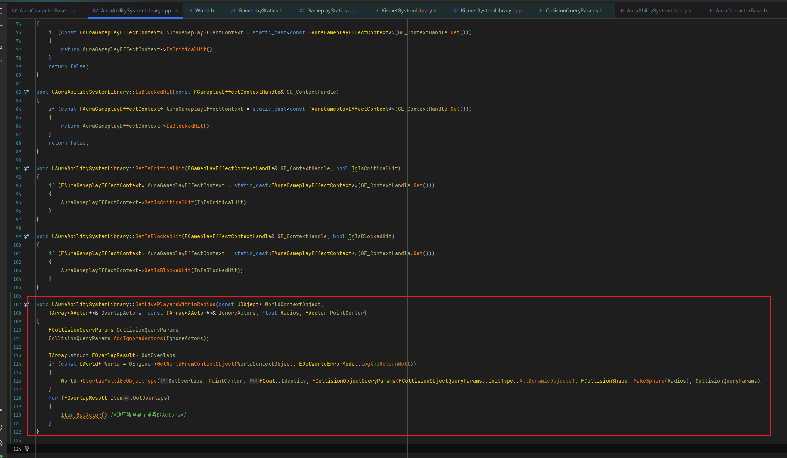
>
>  ```cpp
>  void UAuraAbilitySystemLibrary::GetLivePlayersWithinRadius(const UObject* WorldContextObject,
>      TArray<AActor*>& OverlapActors, const TArray<AActor*>& IgnoreActors, float Radius, FVector PointCenter)
>  {
>      FCollisionQueryParams CollisionQueryParams;
>      CollisionQueryParams.AddIgnoredActors(IgnoreActors);
>  
>      TArray<struct FOverlapResult> OutOverlaps;
>      if (const UWorld* World = GEngine->GetWorldFromContextObject(WorldContextObject, EGetWorldErrorMode::LogAndReturnNull))
>      {
>         World->OverlapMultiByObjectType(OutOverlaps, PointCenter, FQuat::Identity, FCollisionObjectQueryParams(FCollisionObjectQueryParams::InitType::AllDynamicObjects), FCollisionShape::MakeSphere(Radius), CollisionQueryParams);
>      }
>      for (FOverlapResult Item:OutOverlaps)
>      {
>         Item.GetActor();/*这里就拿到了重叠的Actors*/
>      }
>  }
>  ```
>
>- 使用函数，检查目标对象是否实现了接口

------

</details>

------

### 重叠检测步骤

> 1.创建 添加忽略 Actors 用 结构体：FCollisionQueryParams，
>
> 2.创建保存检测重叠结果 TArray<FOverlapResult> Overlaps 
>
> 3.获取 UWorld 调用了 World->OverlapMultiByObjectType
>
> 4.遍历重叠检测结果，如果符合要求就存入数组
>
> 函数实现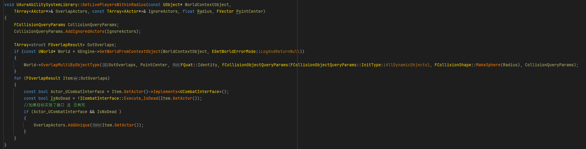
>
> ```cpp
> void UAuraAbilitySystemLibrary::GetLivePlayersWithinRadius(const UObject* WorldContextObject,
>     TArray<AActor*>& OverlapActors, const TArray<AActor*>& IgnoreActors, float Radius, FVector PointCenter)
> {
>     FCollisionQueryParams CollisionQueryParams;
>     CollisionQueryParams.AddIgnoredActors(IgnoreActors);
> 
>     TArray<struct FOverlapResult> OutOverlaps;
>     if (const UWorld* World = GEngine->GetWorldFromContextObject(WorldContextObject, EGetWorldErrorMode::LogAndReturnNull))
>     {
>        World->OverlapMultiByObjectType(OutOverlaps, PointCenter, FQuat::Identity, FCollisionObjectQueryParams(FCollisionObjectQueryParams::InitType::AllDynamicObjects), FCollisionShape::MakeSphere(Radius), CollisionQueryParams);
>     }
>     for (FOverlapResult Item:OutOverlaps)
>     {
>        const bool Actor_UCombatInterface = Item.GetActor()->Implements<UCombatInterface>();
>        const bool IsNoDead = !ICombatInterface::Execute_IsDead(Item.GetActor());
>        //如果目标实现了接口 且 没有死
>        if (Actor_UCombatInterface && IsNoDead )
>        {
>           OverlapActors.AddUnique(Item.GetActor());
>        }
>     }
> }
> ```

------

### 蓝图中调用

> 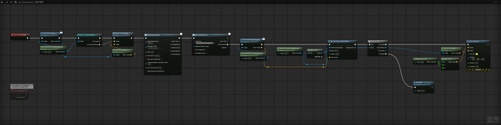

------

### 此时站在火堆旁边，被敌人攻击，崩溃了

> ### 所以静态函数不允许我们检查任何未实现该接口的调用，就是下面的函数(需要问chatgpt)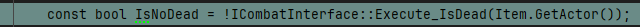
>
> ### 此时有两种处理方案：
>
> - #### 一种是使用 `cast` 或者 `if` 
>
> - #### 因为 if 判断(如果有两个条件)是先判断前面的条件后判断后面的条件，如果前面的条件为 false ，则不执行后面的条件
>
>   所以可以先使用 `Implements` 判断，因为这个如果是空的会返回 `false` ，就 `不会执行到第二个条件` 的检查 `调用`
>
>   - 比如这样处理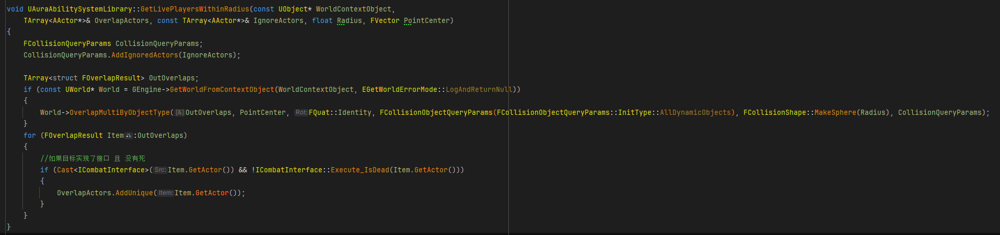
>   
>     ```cpp
>     void UAuraAbilitySystemLibrary::GetLivePlayersWithinRadius(const UObject* WorldContextObject,
>         TArray<AActor*>& OverlapActors, const TArray<AActor*>& IgnoreActors, float Radius, FVector PointCenter)
>     {
>         FCollisionQueryParams CollisionQueryParams;
>         CollisionQueryParams.AddIgnoredActors(IgnoreActors);
>             
>         TArray<struct FOverlapResult> OutOverlaps;
>         if (const UWorld* World = GEngine->GetWorldFromContextObject(WorldContextObject, EGetWorldErrorMode::LogAndReturnNull))
>         {
>            World->OverlapMultiByObjectType(OutOverlaps, PointCenter, FQuat::Identity, FCollisionObjectQueryParams(FCollisionObjectQueryParams::InitType::AllDynamicObjects), FCollisionShape::MakeSphere(Radius), CollisionQueryParams);
>         }
>         for (FOverlapResult Item:OutOverlaps)
>         {
>            //如果目标实现了接口 且 没有死
>            if (Cast<ICombatInterface>(Item.GetActor()) && !ICombatInterface::Execute_IsDead(Item.GetActor()))
>            {
>               OverlapActors.AddUnique(Item.GetActor());
>            }
>         }
>     }
>     ```

------

### 此时可以站在敌人旁边进行测试gif

> - 不崩溃了OK
>
>   


___________________________________________________________________________________________

[返回最上面](#Go主菜单)

___________________________________________________________________________________________