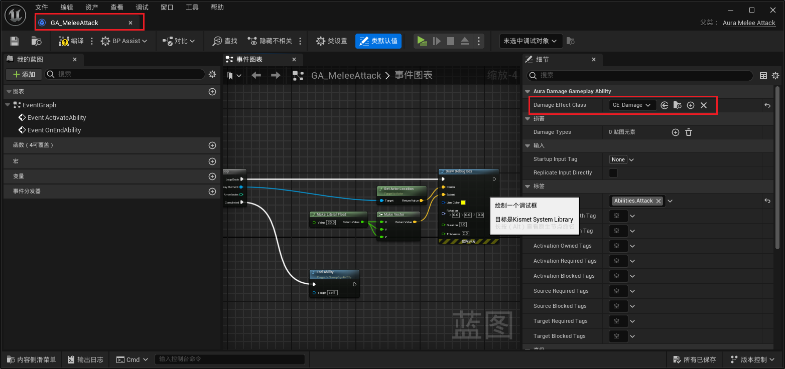
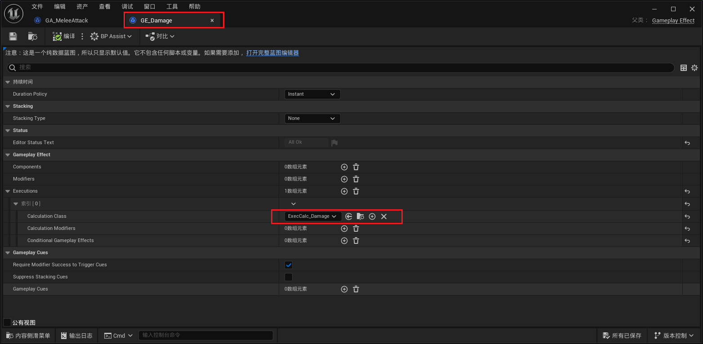

___________________________________________________________________________________________
###### [Go主菜单](../MainMenu.md)
___________________________________________________________________________________________

# GAS 088 配置敌人伤害的 GE 和 伤害逻辑；修复敌人攻击 Player 不显示伤害UI的bug

___________________________________________________________________________________________

## 处理关键点

1. 应用GE流程
   - **创建 `GameplayEffectSpecHandle`**
   - 设置 `TagSetByCaller` 的 Magnitude
   - 应用 `GameplayEffectSpec` 给目标

___________________________________________________________________________________________

# 目录


- [GAS 088 配置敌人伤害的 GE 和 伤害逻辑；修复敌人攻击 Player 不显示伤害UI的bug](#gas-088-配置敌人伤害的-ge-和-伤害逻辑修复敌人攻击-player-不显示伤害ui的bug)
  - [处理关键点](#处理关键点)
- [目录](#目录)
    - [Mermaid整体思路梳理](#mermaid整体思路梳理)
    - [这节我们想给敌人的攻击应用伤害](#这节我们想给敌人的攻击应用伤害)
    - [敌人攻击的GA中有一个GE的配置](#敌人攻击的ga中有一个ge的配置)
    - [还需要在蓝图中添加一组，伤害和曲线表格的映射](#还需要在蓝图中添加一组伤害和曲线表格的映射)
    - [创建敌人物理伤害曲线，并配置](#创建敌人物理伤害曲线并配置)
    - [需要在伤害基类 `UAuraDamageGameplayAbility` 中，创建根据表格映射 `SetByCaller的键值对`](#需要在伤害基类-uauradamagegameplayability-中创建根据表格映射-setbycaller的键值对)
    - [此时效果gif](#此时效果gif)
    - [将敌人等级改成40](#将敌人等级改成40)
    - [此时再进行测试gif](#此时再进行测试gif)
    - [此时有一个bug就是敌人攻击我们并不显示伤害文本](#此时有一个bug就是敌人攻击我们并不显示伤害文本)
    - [bug修复](#bug修复)
    - [此时效果GIF](#此时效果gif-1)


___________________________________________________________________________________________

<details>
<summary>视频链接</summary>


[6. Causing Melee Damage_哔哩哔哩_bilibili](https://www.bilibili.com/video/BV1JD421E7yC?p=180&vd_source=9e1e64122d802b4f7ab37bd325a89e6c)

------

</details>

___________________________________________________________________________________________

### Mermaid整体思路梳理

Mermaid


___________________________________________________________________________________________

### 这节我们想给敌人的攻击应用伤害

------

### 敌人攻击的GA中有一个GE的配置

> 


<details>
<summary>GE_Damage使用了ExecCalc_Damage自定义伤害计算</summary>


>
>
>关键是这里的操作，需要映射一组，键值对
>
>

------

</details>


<details>
<summary>蓝图中对应的操作，了解用就行，因为需要在C++中做，不能在蓝图里</summary>

>

------

</details>

------

### 还需要在蓝图中添加一组，伤害和曲线表格的映射

> - ### 我们使用物理伤害，和CT_Damage表格，但是没有伤害的曲线，所以需要创建曲线
>
>   

------

### 创建敌人物理伤害曲线，并配置

> - #### 这里使用的数据
>
>   | 等级 | 伤害 |
>   | ---- | ---- |
>   | 1    | 5    |
>   | 40   | 50   |
>
> - #### 曲线自由调整
>
> - 最后别忘配置
>
>   

------

### 需要在伤害基类 `UAuraDamageGameplayAbility` 中，创建根据表格映射 `SetByCaller的键值对`

> 步骤：
>
> - 1.创建 `FGameplayEffectSpecHandle`
>
> - 2.遍历伤害列表 `DamageTypes`
>   - 3.遍历中 `绑定SetByCaller` 的 `键值对` ，也就是 `Tag` 和 `float` (取决于 `表格` 和 `等级` )
>
> - 4.最后在蓝图中调用
>
>
> ```cpp
> public:
>     
>     UFUNCTION(BlueprintCallable)
>     void CauseDamage(AActor* TargetActor);
> ```
>
> 
>
> ```cpp
> void UAuraDamageGameplayAbility::CauseDamage(AActor* TargetActor)
> {
> 	const FGameplayEffectSpecHandle GE_SpecHandle = MakeOutgoingGameplayEffectSpec(DamageEffectClass);
> 	const TScriptInterface<ICombatInterface> Actor_CombatInterface = TargetActor;
> 	if (!Actor_CombatInterface)return;
> 	for (TTuple<FGameplayTag, FScalableFloat> Pair:DamageTypes)
> 	{
> 		UAbilitySystemBlueprintLibrary::AssignTagSetByCallerMagnitude(GE_SpecHandle,Pair.Key,Pair.Value.GetValueAtLevel(GetAbilityLevel()));
> 	}
> 	GetAbilitySystemComponentFromActorInfo()->ApplyGameplayEffectSpecToTarget(*GE_SpecHandle.Data.Get(),UAbilitySystemBlueprintLibrary::GetAbilitySystemComponent(TargetActor));
> }
> ```
>
> 

------

### 此时效果gif

> #### 应该可以看到掉血的效果了

------

### 将敌人等级改成40

> 

------

### 此时再进行测试gif

> 

------

>## 记得把敌人的等级调回1

------

### 此时有一个bug就是敌人攻击我们并不显示伤害文本

>  #### 原因是这里，如果 `SourceCharacter` 是 `AI` 那他的 `PC` 肯定不是 `AuraPlayerController` 所以这里会失败
> ## 解决方法：需要增加一种情况

------

### bug修复

> ### 如果 `SourceCharacter` 没有 `PC` 那么检查 `TargetCharacter` 有没有 `PC` ，`有的话就调用` ，当然需要 `先检查SourceCharacter` ，**如果SourceCharacter有PC那么不用执行下面的逻辑了**
>
> ```cpp
> void UAuraAttributeSet::ShowFloatingText(const FEffectProperties& Props, const float Damage, const bool InIsBlockedHit, const bool InIsCriticalHit) const
> {
>     //这里 Props.SourceCharacter 这里是玩家控制的角色BP_Aura 可能是服务器或者客户端
>     if (AAuraPlayerController* PC = Cast<AAuraPlayerController>(Props.SourceCharacter->GetController()/*这里需要获取的是释放技能角色的PC*/))
>     {
>        PC->ShowDamageNumber(Damage,Props.TargetCharacter,InIsBlockedHit,InIsCriticalHit);
>        return;
>     }
>     if (AAuraPlayerController* PC = Cast<AAuraPlayerController>(Props.TargetCharacter->GetController()/*这里需要获取的是被打角色的PC*/))
>     {
>        PC->ShowDamageNumber(Damage,Props.TargetCharacter,InIsBlockedHit,InIsCriticalHit);
>     }
> }
> ```

------

### 此时效果GIF
>


___________________________________________________________________________________________

[返回最上面](#Go主菜单)

___________________________________________________________________________________________