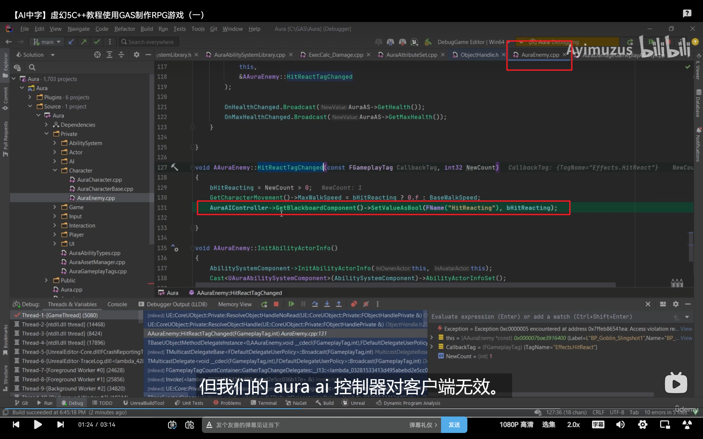
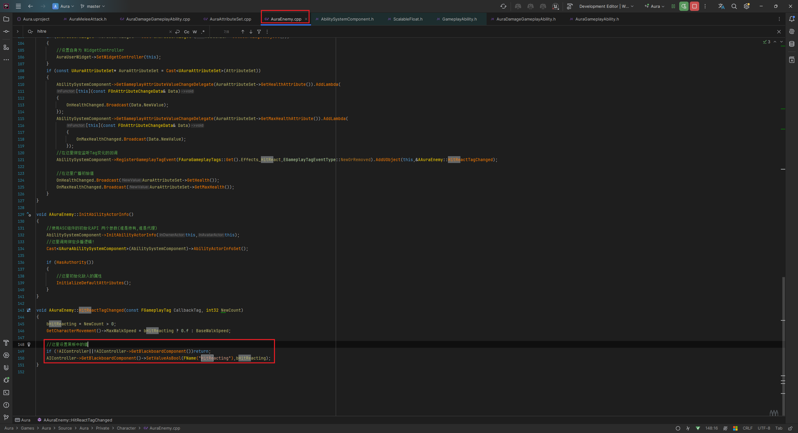

___________________________________________________________________________________________
###### [Go主菜单](../MainMenu.md)
___________________________________________________________________________________________

# GAS 089 多人游戏模式下的bug检查，AIController只在服务器存在！！！

___________________________________________________________________________________________

## 处理关键点

1. AIController只在服务器存在！！！

___________________________________________________________________________________________

# 目录

- [GAS 089 多人游戏模式下的bug检查，AIController只在服务器存在！！！](#gas-089-多人游戏模式下的bug检查aicontroller只在服务器存在)
  - [处理关键点](#处理关键点)
- [目录](#目录)
    - [Mermaid整体思路梳理](#mermaid整体思路梳理)
    - [当我们攻击哥布林时触发bug](#当我们攻击哥布林时触发bug)
    - [bug解决方法](#bug解决方法)

___________________________________________________________________________________________

视频链接

[7. Multiplayer Melee Test_哔哩哔哩_bilibili](https://www.bilibili.com/video/BV1JD421E7yC?p=181&vd_source=9e1e64122d802b4f7ab37bd325a89e6c)

------

___________________________________________________________________________________________

### Mermaid整体思路梳理

Mermaid

___________________________________________________________________________________________

### 当我们攻击哥布林时触发bug

> 
> ## 原因是：当被击中时，服务器和客户端都会调用，而客户端没有这个AIController，所以会失败

------

### bug解决方法

> #### 简单,加个判断，判断 `AIController` 和 `AIController的黑板组件` 不为空时 才能执行逻辑
>
> 

___________________________________________________________________________________________

[返回最上面](#Go主菜单)

___________________________________________________________________________________________