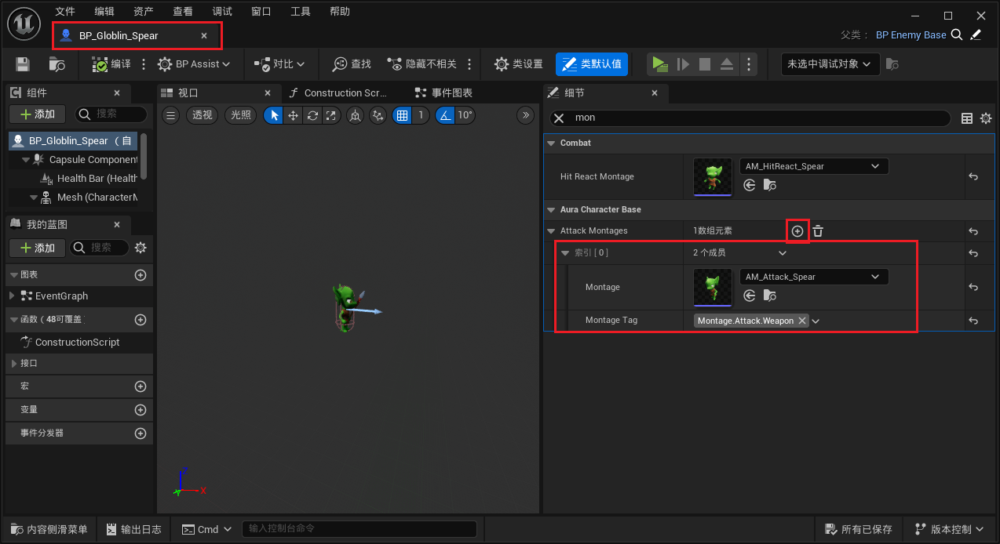

___________________________________________________________________________________________
###### [Go主菜单](../MainMenu.md)
___________________________________________________________________________________________

# GAS 090修改之前的获取插槽位置的逻辑，因为有的怪物没有武器比如用左右手攻击

___________________________________________________________________________________________

# 目录


- [GAS 090修改之前的获取插槽位置的逻辑，因为有的怪物没有武器比如用左右手攻击](#gas-090修改之前的获取插槽位置的逻辑因为有的怪物没有武器比如用左右手攻击)
- [目录](#目录)
    - [Mermaid整体思路梳理](#mermaid整体思路梳理)
    - [先创建3个`Tag`](#先创建3个tag)
    - [`ICombatInterface` 接口中创建结构体](#icombatinterface-接口中创建结构体)
    - [角色基类 `AuraCharacterBase` 中创建数组存放结构体映射](#角色基类-auracharacterbase-中创建数组存放结构体映射)
    - [接口中创建获取上面结构体数组的方法，并在角色基类中重写](#接口中创建获取上面结构体数组的方法并在角色基类中重写)
    - [给哥布林配置Event的Tag](#给哥布林配置event的tag)
    - [蓝图敌人攻击时，使用接口的函数获取结构体，并使用](#蓝图敌人攻击时使用接口的函数获取结构体并使用)
    - [敌人的蒙太奇中，发送的事件也不能用原来的了，需要修改成新的刚加的Tag](#敌人的蒙太奇中发送的事件也不能用原来的了需要修改成新的刚加的tag)
  - [下面是下一节](#下面是下一节)
    - [修改接口函数 `GetCombatSocketLocation`，需要传入 `Tag`](#修改接口函数-getcombatsocketlocation需要传入-tag)
      - [角色基类中不用检查武器组件了，因为有的没有，而且因为需要分情况，所以先加个TODO](#角色基类中不用检查武器组件了因为有的没有而且因为需要分情况所以先加个todo)
      - [这里增加了一个参数，所以静态函数也有变化](#这里增加了一个参数所以静态函数也有变化)
    - [角色及类中添加左右手的FName，并修改 GetCombatSocketLocation 函数](#角色及类中添加左右手的fname并修改-getcombatsocketlocation-函数)
    - [编译引擎](#编译引擎)
    - [蓝图中传入Tag](#蓝图中传入tag)
    - [测试一下](#测试一下)
    - [修改为敌人SkeletalMesh骨骼添加左右手攻击的插槽](#修改为敌人skeletalmesh骨骼添加左右手攻击的插槽)


___________________________________________________________________________________________

<details>
<summary>视频链接</summary>

[8. Montage Gameplay Tags_哔哩哔哩_bilibili](https://www.bilibili.com/video/BV1JD421E7yC?p=182&vd_source=9e1e64122d802b4f7ab37bd325a89e6c)

[9. Tagged Montage_哔哩哔哩_bilibili](https://www.bilibili.com/video/BV1JD421E7yC?p=183&vd_source=9e1e64122d802b4f7ab37bd325a89e6c)

[10. Multiple Attack Sockets_哔哩哔哩_bilibili](https://www.bilibili.com/video/BV1JD421E7yC?p=184&vd_source=9e1e64122d802b4f7ab37bd325a89e6c)

------

</details>

___________________________________________________________________________________________

### Mermaid整体思路梳理

Mermaid


___________________________________________________________________________________________

> ### 现在已经实现了使用 `Get Combat Socket Location` 获取插槽的位置，但是有些敌人是没有武器的，比如接下来我们要做的这个，食尸鬼，如果没有武器，那么我们的逻辑就需要改一下。而且这个角色攻击用到了左右手，也需要做出一些随机
>
> ### 
>
> ### 此时的逻辑，如果要为拥有武器的敌人播放蒙太奇，我们需要武器插槽，左手攻击的蒙太奇需要左手插槽，右手攻击的蒙太奇需要右手插槽。而蒙太奇中会发送Event的Tag
> ## 所以需要把Event的Tag和蒙太奇进行绑定

------

### 先创建3个`Tag` 
>- #### `Montage_Attack_Weapon`
>
>- #### `Montage_Attack_RightHand`
>
>- #### `Montage_Attack_LeftHand`
>
>```cpp
>/*
> * 敌人攻击蒙太奇
> */
>FGameplayTag Montage_Attack_Weapon;
>FGameplayTag Montage_Attack_RightHand;
>FGameplayTag Montage_Attack_LeftHand;
>```
>
>```cpp
>/*
> * 敌人攻击蒙太奇
> */
>GameplayTags.Montage_Attack_Weapon = UGameplayTagsManager::Get().AddNativeGameplayTag(
>    FName("Montage.Attack.Weapon"),
>    FString("Montage.Attack.Weapon"));
>
>GameplayTags.Montage_Attack_RightHand = UGameplayTagsManager::Get().AddNativeGameplayTag(
>    FName("Montage.Attack.RightHand"),
>    FString("Montage.Attack.RightHand"));
>
>GameplayTags.Montage_Attack_LeftHand = UGameplayTagsManager::Get().AddNativeGameplayTag(
>    FName("Montage.Attack.LeftHand"),
>    FString("Montage.Attack.LeftHand"));
>```
>
>

------

> ### 我们需要创建一个包含蒙太奇和游戏标签的结构体。然后我们将添加一个函数来在战斗界面中检索它们，以便我们可以在蓝图里获取蒙太奇来使用。

------

### `ICombatInterface` 接口中创建结构体
>- 将蒙太奇和Tag进行绑定
>
>```cpp
>USTRUCT(BlueprintType)
>struct FTaggedMontage
>{
>GENERATED_BODY()
>
>    UPROPERTY(EditDefaultsOnly, BlueprintReadOnly)
>UAnimMontage* Montage = nullptr;
>    
>    UPROPERTY(EditDefaultsOnly, BlueprintReadOnly)
>FGameplayTag MontageTag = FGameplayTag();
>    
>    };
> ```

___________________________________________________________________________________________

### 角色基类 `AuraCharacterBase` 中创建数组存放结构体映射
>```CPP
>public:
>    
>    //保存 蒙太奇 和 Tag 的映射
>    UPROPERTY(EditDefaultsOnly, BlueprintReadOnly)
>    TArray<FTaggedMontage> AttackMontages;
>
>```
>
>
### 接口中创建获取上面结构体数组的方法，并在角色基类中重写
>
>- 接口中
>
>```cpp
>public:
>    
>    UFUNCTION(BlueprintNativeEvent, BlueprintCallable)
>    TArray<FTaggedMontage>& GetAttackMontages();
>```
>
>- 角色基类中重写
>
>```cpp
>public:
>    
>    //~ Begin ICombatInteraction
>    virtual TArray<FTaggedMontage>& GetAttackMontages_Implementation() override;
>    //~ End ICombatInteraction
>```
>
>```cpp
>TArray<FTaggedMontage>& AAuraCharacterBase::GetAttackMontages_Implementation()
>{
>    return AttackMontages;
>}
>```

___________________________________________________________________________________________

### 给哥布林配置Event的Tag
>

___________________________________________________________________________________________

### 蓝图敌人攻击时，使用接口的函数获取结构体，并使用

> 

------

### 敌人的蒙太奇中，发送的事件也不能用原来的了，需要修改成新的刚加的Tag

> - 要删除旧的不用的Tag
>
> 
>
> 

------

## 下面是下一节

------

### 修改接口函数 `GetCombatSocketLocation`，需要传入 `Tag`

> ## 需要修改所有引用
#### 角色基类中不用检查武器组件了，因为有的没有，而且因为需要分情况，所以先加个TODO
>```CPP
>FVector AAuraCharacterBase::GetCombatSocketLocation_Implementation(const FGameplayTag MontageTag)
>{
>	if (MontageTag.MatchesTag(FAuraGameplayTags::Get().Montage_Attack_Weapon))
>	{
>		return Weapon->GetSocketLocation(WeaponTipSocketName);
>	}
>	// TODO 
>	if (MontageTag.MatchesTag(FAuraGameplayTags::Get().Montage_Attack_LeftHand))
>	{
>		return GetMesh()->GetSocketLocation(WeaponTipSocketName);
>	}
>	// TODO 
>	if (MontageTag.MatchesTag(FAuraGameplayTags::Get().Montage_Attack_RightHand))
>	{
>		return GetMesh()->GetSocketLocation(WeaponTipSocketName);
>	}
>	return FVector();
>}
>```
#### 这里增加了一个参数，所以静态函数也有变化
>

------

### 角色及类中添加左右手的FName，并修改 GetCombatSocketLocation 函数

> ```cpp
> protected:
>     
>     UPROPERTY(EditAnywhere, Category="Combat") //Combat 战斗
>     FName LeftHandSocketName;
>     UPROPERTY(EditAnywhere, Category="Combat") //Combat 战斗
>     FName RightHandSocketName;
> ```
>
> 
>
> ```cpp
> FVector AAuraCharacterBase::GetCombatSocketLocation_Implementation(const FGameplayTag MontageTag)
> {
>     if (MontageTag.MatchesTag(FAuraGameplayTags::Get().Montage_Attack_Weapon))
>     {
>        return Weapon->GetSocketLocation(WeaponTipSocketName);
>     }
>     // TODO 
>     if (MontageTag.MatchesTag(FAuraGameplayTags::Get().Montage_Attack_LeftHand))
>     {
>        return GetMesh()->GetSocketLocation(LeftHandSocketName);
>     }
>     // TODO 
>     if (MontageTag.MatchesTag(FAuraGameplayTags::Get().Montage_Attack_RightHand))
>     {
>        return GetMesh()->GetSocketLocation(RightHandSocketName);
>     }
>     return FVector();
> }
> ```

------

### 编译引擎

------

### 蓝图中传入Tag

> 

------

### 测试一下

> #### 如果依然播放蒙太奇说明有效

------

### 修改为敌人SkeletalMesh骨骼添加左右手攻击的插槽

> 


___________________________________________________________________________________________

[返回最上面](#Go主菜单)

___________________________________________________________________________________________