___________________________________________________________________________________________
###### [Go主菜单](../MainMenu.md)
___________________________________________________________________________________________

# GAS 091 添加新敌人食尸鬼需要的基础步骤

___________________________________________________________________________________________

# 目录

___________________________________________________________________________________________

视频链接

[11. Ghoul Enemy_哔哩哔哩_bilibili](https://www.bilibili.com/video/BV1JD421E7yC?p=185&vd_source=9e1e64122d802b4f7ab37bd325a89e6c)

------

___________________________________________________________________________________________

### Mermaid整体思路梳理

Mermaid

___________________________________________________________________________________________

我们准备好制造一个食尸鬼敌人，这将涉及几个步骤

1. 创建文件夹 `Ghoul`

2. 创建BP

3. 创建子类继承自敌人基类，命名为 ***BP_EnemyBase***

4. 创建ABP

   - ABP中需要创建一个混合空间，还是叫 ***BS_ldlewalk***

   - 别忘了蓝图中配置ABP

5. 配置左右手攻击插槽

6. 创建受击蒙太奇，并在蓝图中配置

7. 检查一下，移动有行为树

过程截图

>  创建文件夹 `Ghoul`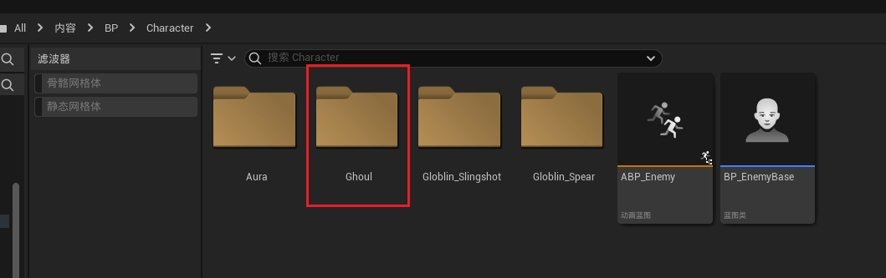
>
>  ### 创建BP
>
>  - #### 创建子类继承自 `敌人基类` ，命名为 ***BP_EnemyBase***
>
>  ### 创建ABP
>
>  - #### ABP中需要创建一个 `混合空间` ，还是叫 ***BS_ldlewalk***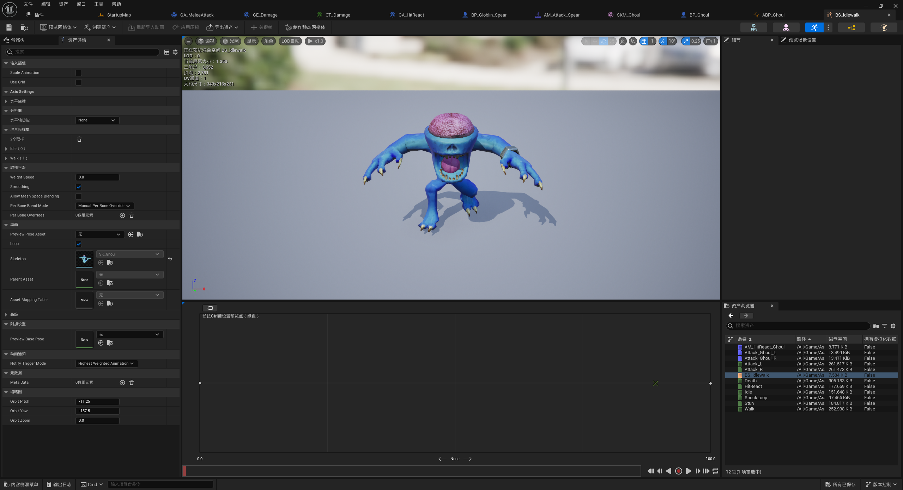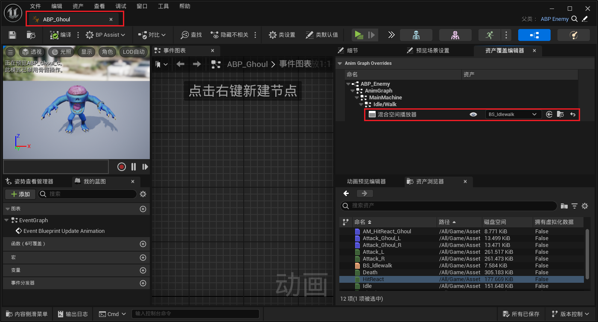
>
>
>  ### 别忘了蓝图中配置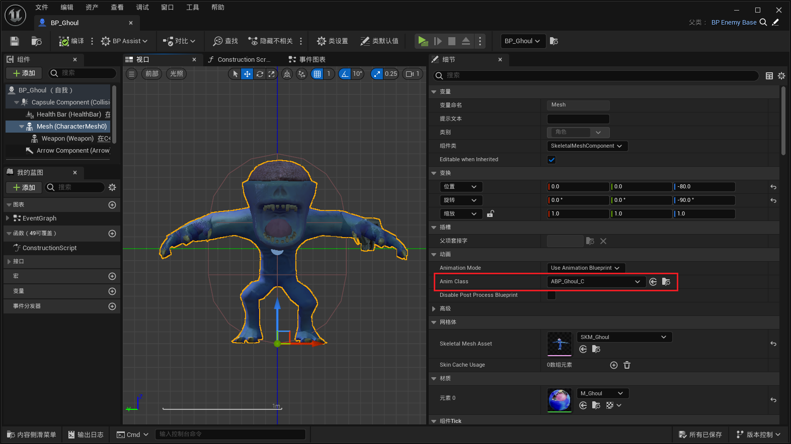
>
>  ### 配置左右手攻击插槽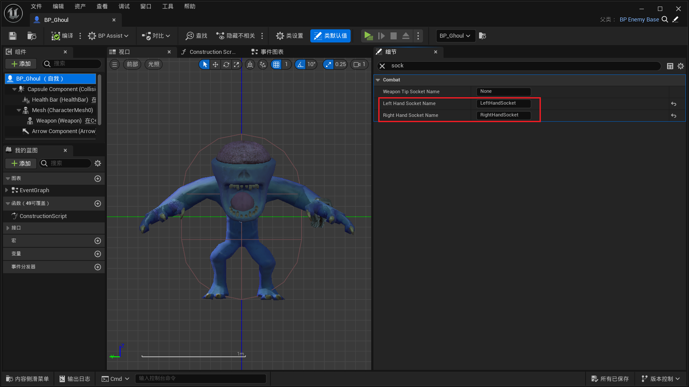
>
>  ### 创建受击蒙太奇，并在蓝图中配置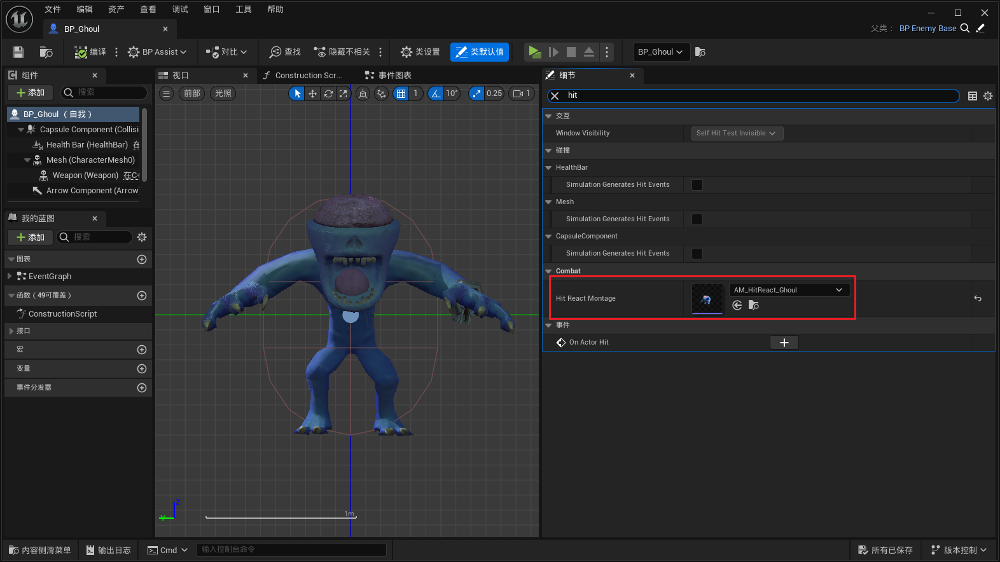
>
>  ### 检查一下，移动有行为树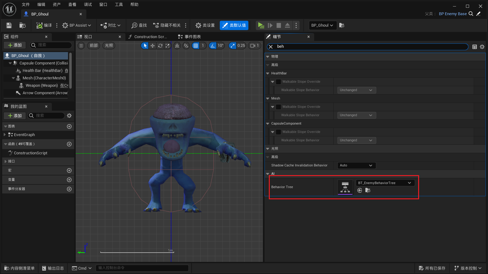

------

------

### 此时运行，它正在向我走来

> 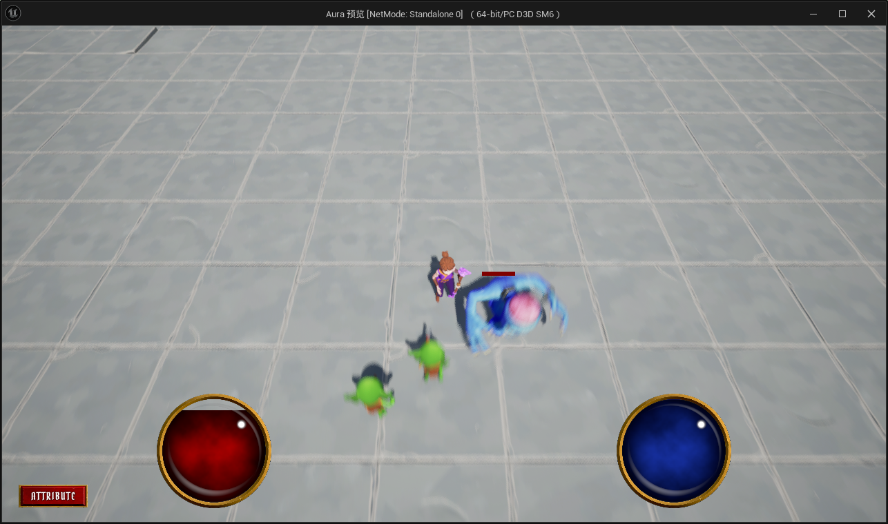

------

### 设置动画混合时间

> 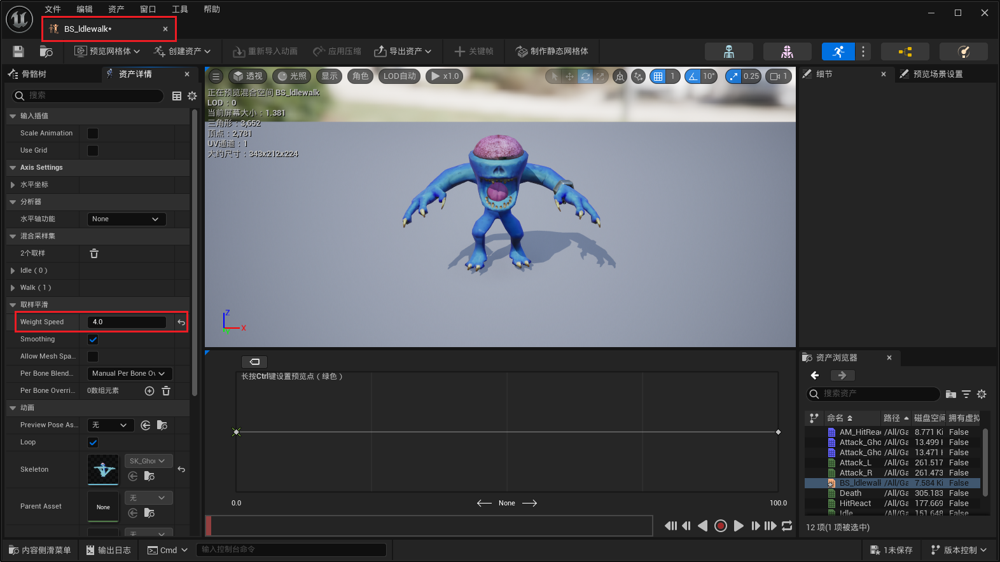

------

### 获取随机数组元素时需要判断num是否为0，若==0则 EndAbility

>- 这里我用的随机数组中的元素，没用这个方法

------

### 设置敌人转身速率为200

>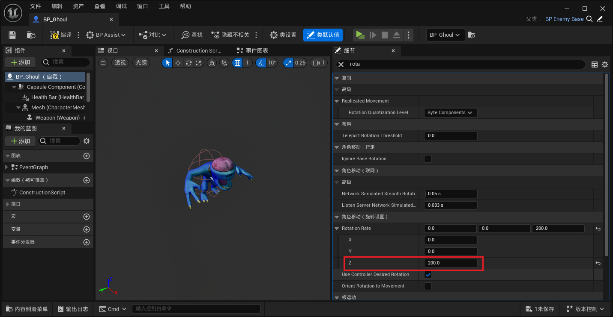

------

### 之前我们并没有可以单独配置敌人的移动速度，所以需要蓝图可配置
>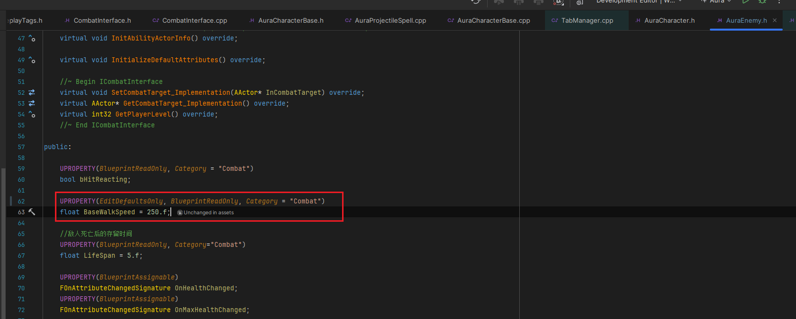
------

### 为了敌人很笨重的感觉，需要移速慢一点，设置为125
>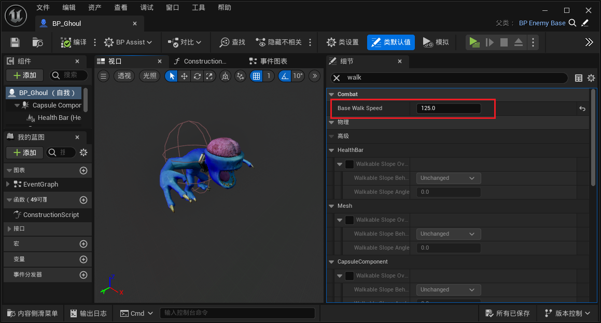

___________________________________________________________________________________________

[返回最上面](#Go主菜单)

___________________________________________________________________________________________