___________________________________________________________________________________________
###### [Go主菜单](../MainMenu.md)
___________________________________________________________________________________________

# GAS 092 为食尸鬼配置攻击；受击时打断自身别的Tag比如攻击；解决敌人之间会互相攻击的bug；为食尸鬼添加溶解材质；AI避障的相关配置

___________________________________________________________________________________________

## 处理关键点

1. **AI避障设置**：在敌人基类中打开`Use RVO Avoidance`和`Orient Rotation to Movement`来实现AI的避障功能，虽然项目中没有实际使用。


___________________________________________________________________________________________

# 目录


- [GAS 092 为食尸鬼配置攻击；受击时打断自身别的Tag比如攻击；解决敌人之间会互相攻击的bug；为食尸鬼添加溶解材质；AI避障的相关配置](#gas-092-为食尸鬼配置攻击受击时打断自身别的tag比如攻击解决敌人之间会互相攻击的bug为食尸鬼添加溶解材质ai避障的相关配置)
  - [处理关键点](#处理关键点)
- [目录](#目录)
    - [Mermaid整体思路梳理](#mermaid整体思路梳理)
    - [为食尸鬼创建攻击的蒙太奇，并在蓝图中配置与蒙太奇绑定的 `GameplayTag`](#为食尸鬼创建攻击的蒙太奇并在蓝图中配置与蒙太奇绑定的-gameplaytag)
    - [此时有个bug，食尸鬼的Motion Warping失效了好像，攻击时没有旋转，而且随机是，不能每次都调用随机，而是调用随机生成变量，然后后续使用这个变量；而且攻击一次之后就不攻击了](#此时有个bug食尸鬼的motion-warping失效了好像攻击时没有旋转而且随机是不能每次都调用随机而是调用随机生成变量然后后续使用这个变量而且攻击一次之后就不攻击了)
    - [解决bug：](#解决bug)
    - [当敌人受到攻击时也需要打断自身的，比如攻击的Tag](#当敌人受到攻击时也需要打断自身的比如攻击的tag)
    - [现在有一个bug是，敌人会互相攻击到彼此，还有就是需要调整一下大怪物的碰撞Capsule，让他大一些](#现在有一个bug是敌人会互相攻击到彼此还有就是需要调整一下大怪物的碰撞capsule让他大一些)
  - [下面是下一节](#下面是下一节)
    - [先解决敌人之间会互相攻击的bug](#先解决敌人之间会互相攻击的bug)
    - [为了使用方便，就在蓝图函数库中创建判断是否为同一阵营的函数](#为了使用方便就在蓝图函数库中创建判断是否为同一阵营的函数)
    - [蓝图中调用](#蓝图中调用)
    - [此时测试gif敌人之间不会互相攻击了](#此时测试gif敌人之间不会互相攻击了)
    - [这个时候希望测试敌人的死亡，希望把敌人的血量调的少一些](#这个时候希望测试敌人的死亡希望把敌人的血量调的少一些)
    - [此时测试gif，敌人更容易Die了](#此时测试gif敌人更容易die了)
    - [此时效果gif，食尸鬼溶解材质正常生效](#此时效果gif食尸鬼溶解材质正常生效)
    - [AI用的避障(了解用)](#ai用的避障了解用)


___________________________________________________________________________________________

<details>
<summary>视频链接</summary>

[12. Ghoul Attack Montages_哔哩哔哩_bilibili](https://www.bilibili.com/video/BV1JD421E7yC?p=186&vd_source=9e1e64122d802b4f7ab37bd325a89e6c)

[13. Melee Polish_哔哩哔哩_bilibili](https://www.bilibili.com/video/BV1JD421E7yC/?p=187&spm_id_from=pageDriver&vd_source=9e1e64122d802b4f7ab37bd325a89e6c)

------

</details>

___________________________________________________________________________________________

### Mermaid整体思路梳理

Mermaid

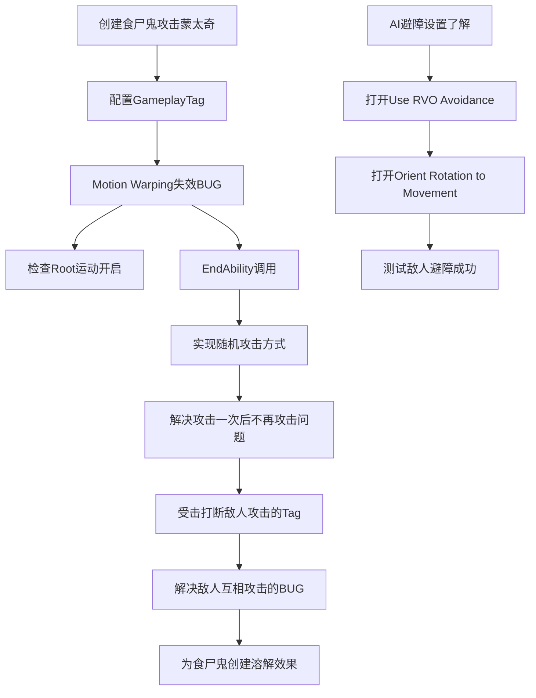
```mermaid
graph TD
    A[创建食尸鬼攻击蒙太奇] --> B[配置GameplayTag]
    B --> C[Motion Warping失效BUG]
    C --> D[检查Root运动开启]
    C --> E[EndAbility调用]
    E --> F[实现随机攻击方式]
    F --> G[解决攻击一次后不再攻击问题]
    G --> H[受击打断敌人攻击的Tag]

    H --> I[解决敌人互相攻击的BUG]

    I --> Q[为食尸鬼创建溶解效果]

    
    S[AI避障设置了解] --> T[打开Use RVO Avoidance]
    T --> U[打开Orient Rotation to Movement]
    U --> V[测试敌人避障成功]

```

**攻击蒙太奇和GameplayTag配置**：

- 为食尸鬼创建攻击蒙太奇并配置GameplayTag。
- 遇到Motion Warping失效的问题，Root运动未开启导致攻击问题。

**BUG修复**：

- 解决攻击后不再攻击的问题，通过保存随机生成的变量并在后续使用。
- 确保在适当情况下调用 `EndAbility`。

**敌人互相攻击BUG修复**：

- 通过蓝图函数库中创建判断是否为同一阵营的函数来解决敌人互相攻击的问题。

**敌人死亡与HP调整**：

- 为了测试敌人死亡效果，将敌人HP系数调整为0.25，使其更容易死亡。

**食尸鬼溶解效果**：

- 为食尸鬼配置动态材质，实现其死亡后的溶解效果。

**AI避障设置**：

- 在敌人基类中打开`Use RVO Avoidance`和`Orient Rotation to Movement`来实现AI的避障功能，虽然项目中没有实际使用。

___________________________________________________________________________________________

### 为食尸鬼创建攻击的蒙太奇，并在蓝图中配置与蒙太奇绑定的 `GameplayTag`

> 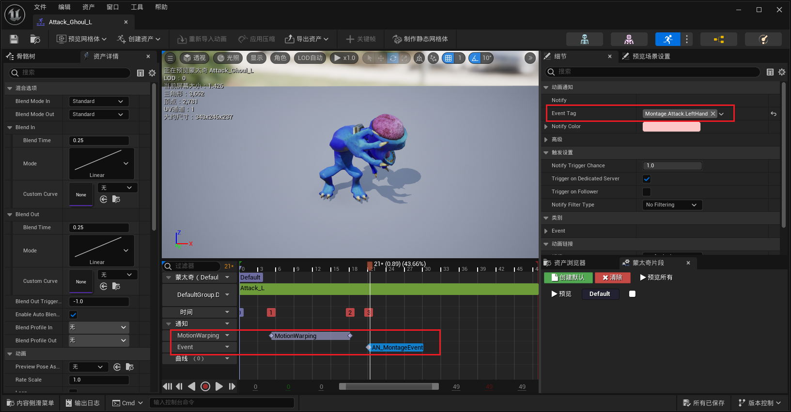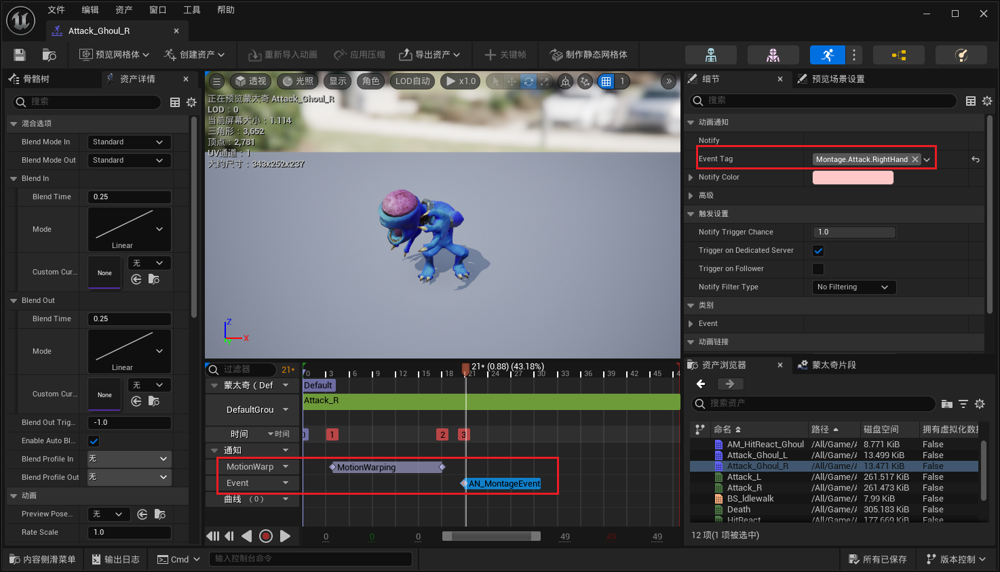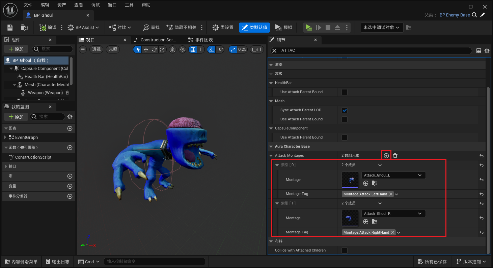

------

### 此时有个bug，食尸鬼的Motion Warping失效了好像，攻击时没有旋转，而且随机是，不能每次都调用随机，而是调用随机生成变量，然后后续使用这个变量；而且攻击一次之后就不攻击了

> - 检查发现是root运动没有打开
>
> - 需要在别的情况下也 `EndAbility`

------

### 解决bug：

> - 随机后保存变量
>
> 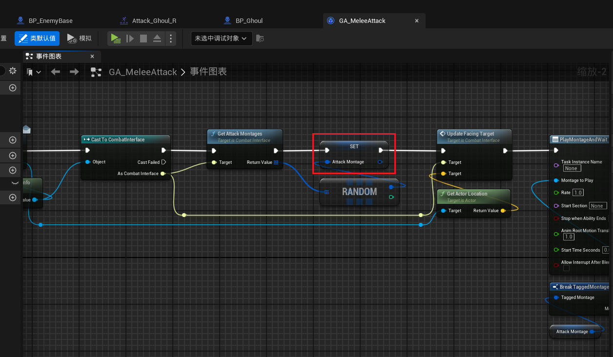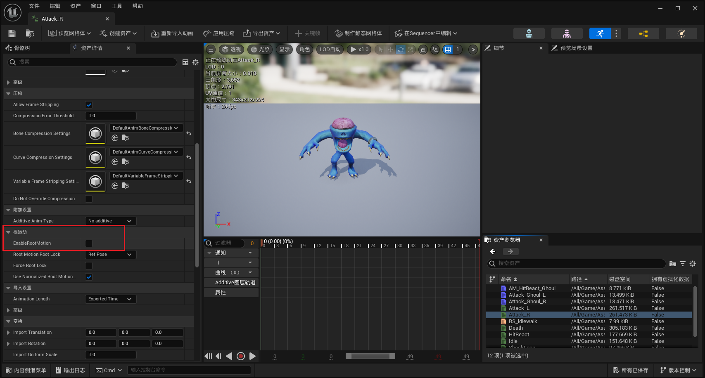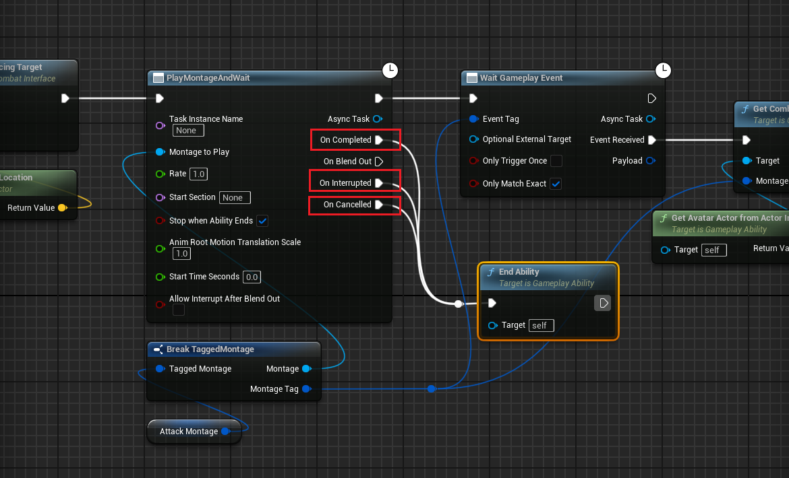

------

### 当敌人受到攻击时也需要打断自身的，比如攻击的Tag

> 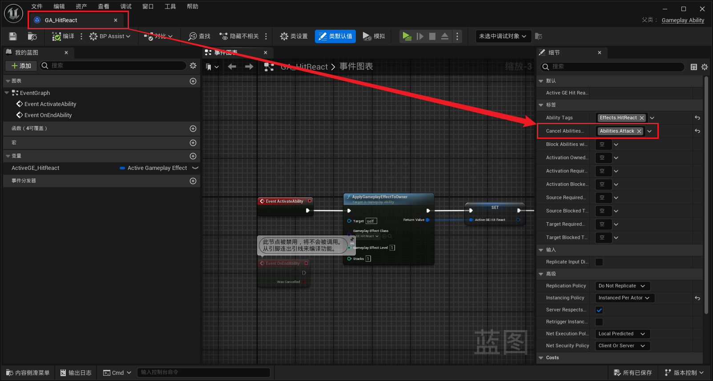

------

### 现在有一个bug是，敌人会互相攻击到彼此，还有就是需要调整一下大怪物的碰撞Capsule，让他大一些

> 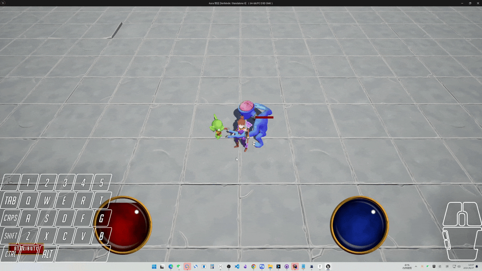

------

## 下面是下一节

------

### 先解决敌人之间会互相攻击的bug

> - #### 原因是敌人攻击时获得范围内的Actors没有检查是否为敌对阵营，直接就造成了伤害，应用了GE，所以需要判断类型。检查是否为敌对阵营，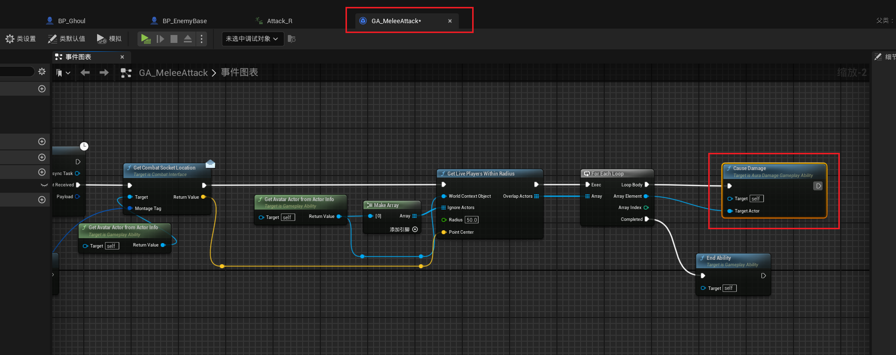
>
> - #### 需要进行类似这种的检查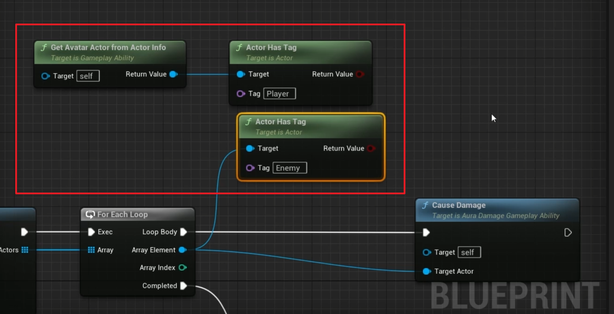

------

### 为了使用方便，就在蓝图函数库中创建判断是否为同一阵营的函数

> ```cpp
> UFUNCTION(BlueprintPure, Category = "AuraAbilitySystemLibrary|GameplayMechanics")
> static bool IsNotFriend(const AActor* FirstActor,const AActor* SecondActor);
> ```
>
> ```cpp
> bool UAuraAbilitySystemLibrary::IsNotFriend(const AActor* FirstActor, const AActor* SecondActor)
> {
> 	const bool bBothPlayer = FirstActor->ActorHasTag(FName("Player")) && SecondActor->ActorHasTag(FName("Player"));
> 	const bool bBothEnemy = FirstActor->ActorHasTag(FName("Enemy")) && SecondActor->ActorHasTag(FName("Enemy"));
> 	if (bBothPlayer || bBothEnemy)
> 	{
> 		return false;
> 	}
> 	return true;
> }
> ```
>
> 
>
> #### 刚开始这么写，我觉得还是有点怪，觉得可能是因为目前只有Player和Enemy但是，希望多一些情况所以才在这里写了这样的逻辑。
>
> 后来发现是因为没有办法获取Actor的Tag标签，hhh

------

### 蓝图中调用

> 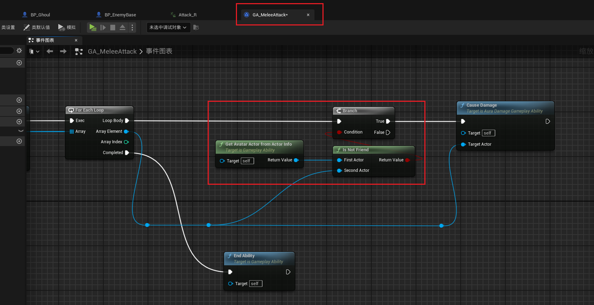

------

### 此时测试gif敌人之间不会互相攻击了

> 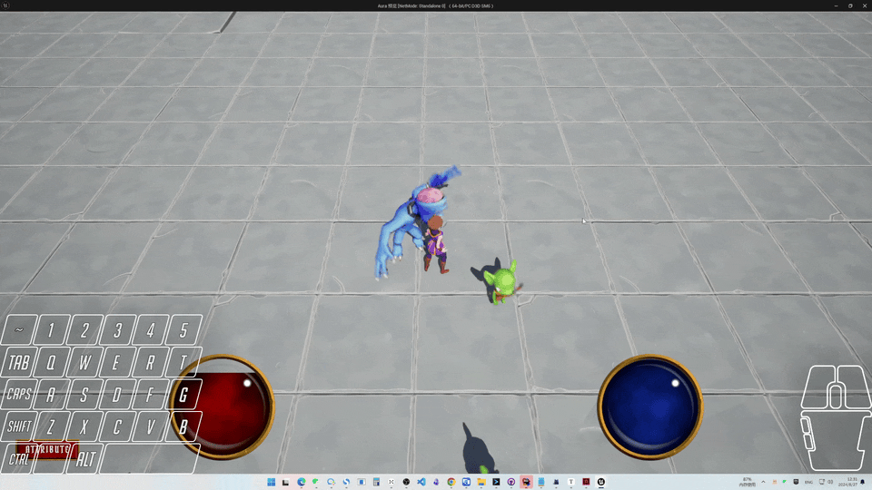

------

### 这个时候希望测试敌人的死亡，希望把敌人的血量调的少一些

> - #### 看下目前影响敌人HP的地方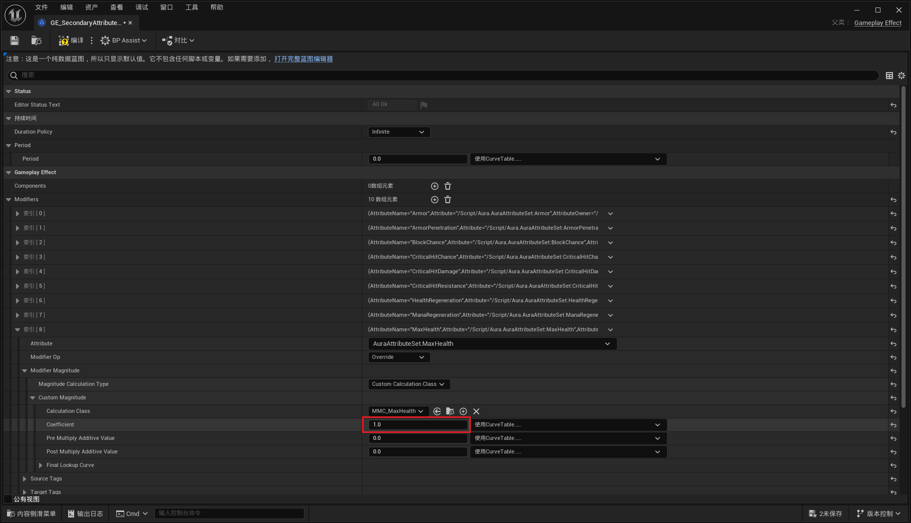
>
> - #### 把这里的 Coefficient设置为0.25就可以影响敌人了
>
>   - #### 前提是和玩家用的不是一个次要属性GE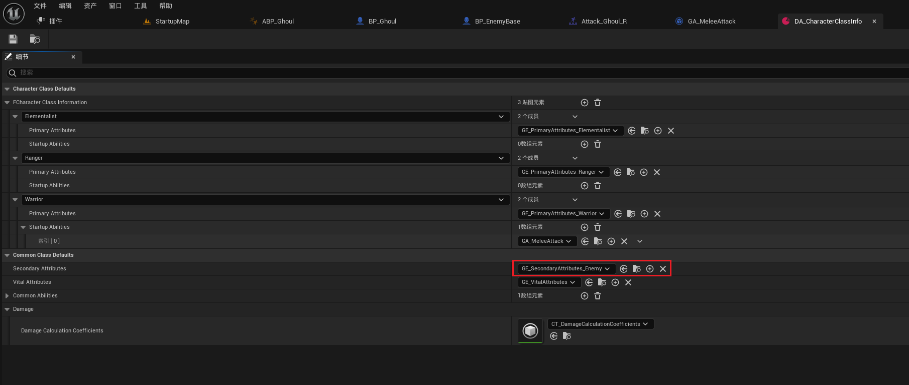

------

### 此时测试gif，敌人更容易Die了

> 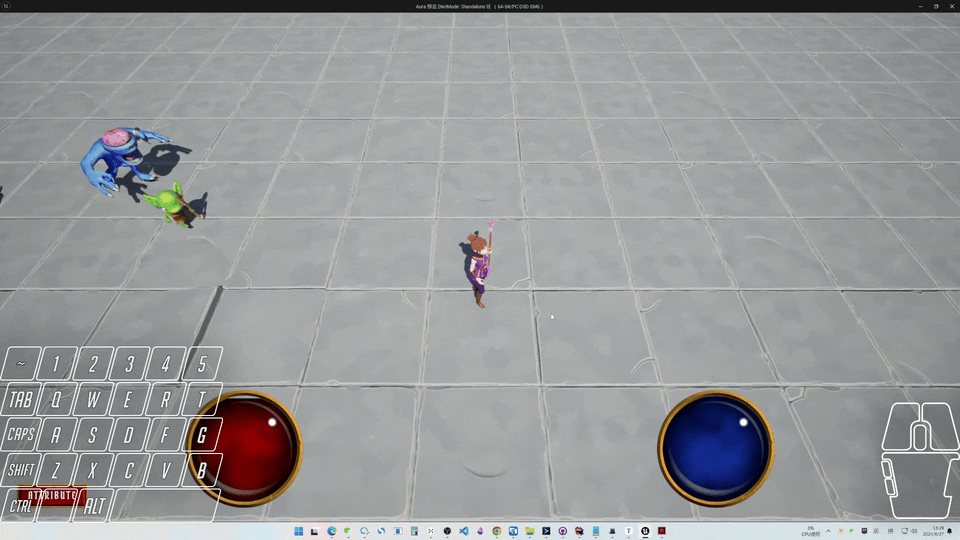
>
> ## 但是食尸鬼死亡后，没有溶解材质效果

------


<details>
<summary>为食尸鬼死亡时创建溶解效果</summary>

>- ### 食尸鬼身上配置动态材质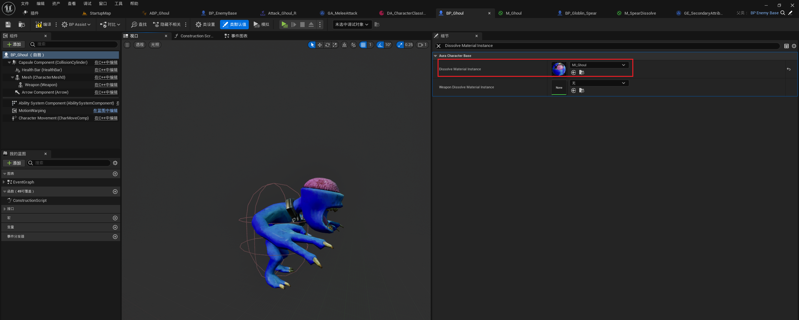

------

</details>

### 此时效果gif，食尸鬼溶解材质正常生效

> 

------

### AI用的避障(了解用)

> 下面 AI用的避障 只是了解用，项目中没有使用：
>
> - ### 此时如果在敌人基类中设置打开 `Use RVO Avoidance`
>
>   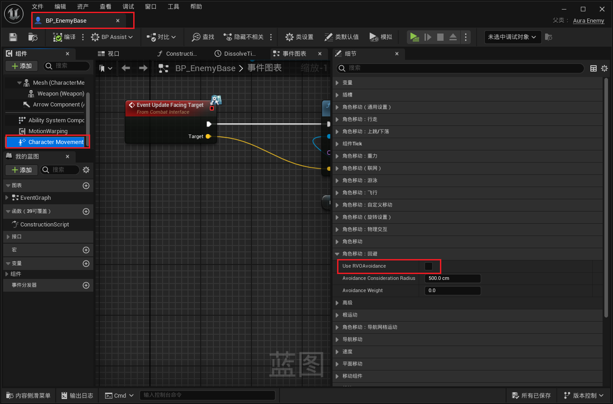
>
> - ### 如果开了这个还需要打开 `运动时转向目标方向`  `Orient Rotation to Movement`
>
>   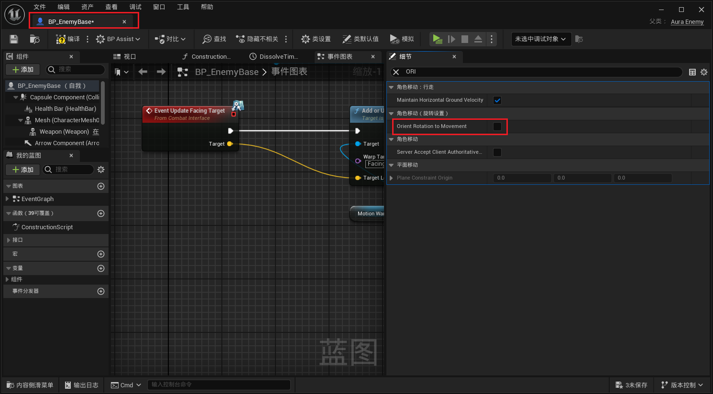
>   
>   - 这个选项是AI用的避障功能，可以用
>
>
>  - 比如把敌人数量调多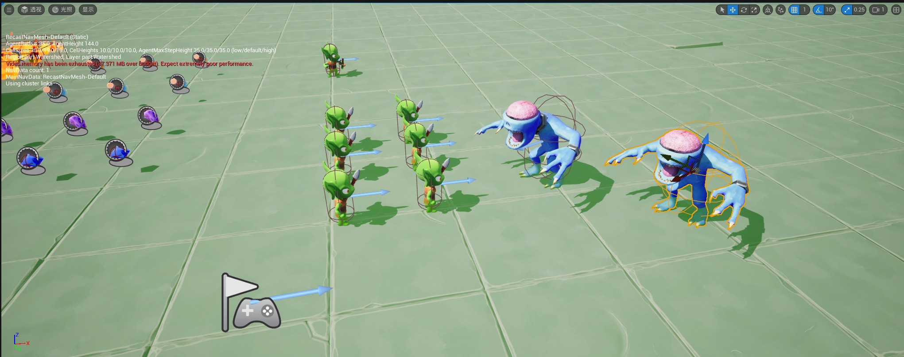
>
>
> - ### 测试gif，敌人之间会彼此绕开

------

> ### 接下来要处理远程武器攻击的武器变形，比如，敌人使用弹弓和弓箭攻击，涉及到需要变形，后面会处理这个


___________________________________________________________________________________________

[返回最上面](#Go主菜单)

___________________________________________________________________________________________